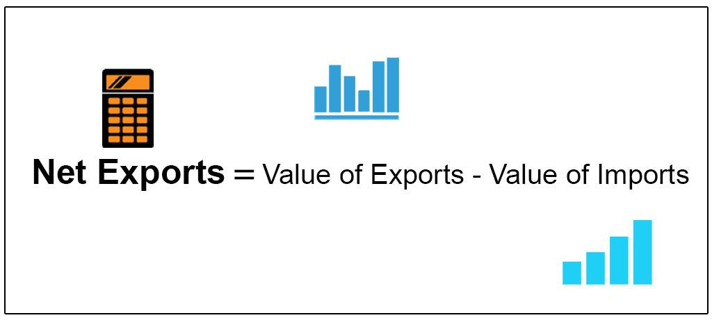

The global economy is intricately connected through the exchange of goods and services. Understanding the trade balance is crucial in this complex system. Trade balance is defined as the difference between a country's exports and imports. This figure is a significant indicator of a country's economic health, impacting its Gross Domestic Product (GDP) and providing insight into the nation's competitiveness in the global market.

Net exports, calculated as the total value of exports minus the total value of imports, is a key component of the trade balance. A positive net export value indicates a surplus, while a negative value indicates a deficit. This metric not only reflects the country's economic strength but also its standing in international trade.



Technological advancements have brought about changes in how trade and financial activities are conducted. Algorithmic trading, for example, has become an essential tool for managing economic indicators and improving trade efficiency. By using complex algorithms, traders and economists can automate trading decisions. This technology allows for faster and more accurate trade executions, thereby optimizing the management of trade balances and economic health metrics.

This article explores the importance of understanding trade balance and net exports, as well as the role of algorithmic trading in influencing these economic indicators.

## Table of Contents

## Understanding Trade Balance

Trade balance is defined as the difference between the monetary value of a nation's exports and imports over a designated period. It serves as a fundamental economic indicator, reflecting the trading relationship between a country and the rest of the world. The trade balance can either be positive or negative, shaping the economic landscape and influencing policy decisions.

A positive trade balance, often termed a trade surplus, occurs when a nation's exports exceed its imports. This situation usually indicates that a country is a net exporter, having a favorable position that can boost national income and enhance economic growth. On the other hand, a negative trade balance, known as a trade deficit, happens when imports surpass exports, sometimes leading to increased foreign debt and potential economic vulnerabilities.

Several factors can influence a nation's trade balance. Among these, currency exchange rates play a pivotal role. For instance, a country's currency depreciation may make its exports cheaper and imports more expensive, potentially improving the trade balance. Conversely, currency appreciation could lead to a trade deficit as exports become pricier on the global market.

Government trade policies also significantly affect the trade balance. Tariffs, subsidies, and quotas are tools that governments use to control the flow of imports and exports, thereby altering the trade balance. Policies promoting exports or restricting imports can lead to a trade surplus, while liberal trade policies may lead to deficits by encouraging imports.

Economic conditions in partner countries are another critical [factor](/wiki/factor-investing). Changes in demand for specific goods or shifts in production capabilities abroad can affect the trade balance. For instance, an economic boom in a trading partner might increase demand for imports, benefiting the exporting country by improving its trade balance.

The trade balance's importance extends beyond simple trade dynamics. It impacts a country's Gross Domestic Product (GDP), as net exports (exports minus imports) are a component of GDP calculation. A persistently positive trade balance contributes positively to GDP, enhancing economic performance. Additionally, the balance of trade influences currency value, with consistent surpluses often leading to currency appreciation, affecting international competitiveness.

Trade balances also impact economic policies. For example, a country with a large trade deficit might consider structural reforms to enhance competitiveness or negotiate trade deals to rectify imbalances. Understanding the trade balance's dynamics allows policymakers to craft strategies that bolster economic stability and growth.

In conclusion, the trade balance, reflecting the difference between exports and imports, is pivotal in understanding a nation’s economic standing. Its impact on GDP, currency value, and policy formulation makes it a crucial measure for evaluating economic health and formulating responsive strategies.

## The Role of Net Exports in Trade Balance

Net exports represent a fundamental aspect of a nation's trade balance, defined as the value of a country's total exports minus its total imports. These figures are instrumental in determining whether a country experiences a trade surplus or deficit. A positive net export figure, or trade surplus, indicates that a country's export value exceeds its import value, contributing positively to the nation's Gross Domestic Product (GDP). Thus, the equation for net exports can be expressed as:

$$
\text{Net Exports} = \text{Total Exports} - \text{Total Imports}
$$

Several factors exert influence over a country's net exports. The availability of natural resources plays a crucial role; countries rich in resources often have a competitive advantage in exporting raw materials or resource-based products. Manufacturing capacities significantly affect the trade balance, as nations with advanced industrial bases can produce and export a diverse range of goods. Technological advancements further enhance export capabilities by improving production efficiency, reducing costs, and enabling the creation of innovative products that meet global demand.

Assessing net exports provides valuable insights into a country's economic vitality and its standing in the international marketplace. A consistent trade surplus suggests robust export activities and competitiveness, supporting GDP growth and national income. Conversely, persistent trade deficits might signal an overreliance on imports, potentially impacting economic stability. Understanding these dynamics is crucial for evaluating a country's economic policy and its implications on international competitiveness.

## Economic Indicators Tied to Trade Balance

Trade balance is closely linked to several key economic indicators, providing insights into a nation’s financial health and stability. Among these indicators, Gross Domestic Product (GDP), inflation rates, and employment levels hold particular significance.

A trade surplus, characterized by a country exporting more goods and services than it imports, can lead to an increase in GDP. The formula for calculating GDP is:

$$
\text{GDP} = C + I + G + (X - M)
$$

where $C$ represents consumer spending, $I$ is investment in the economy, $G$ is government spending, and $(X - M)$ is net exports (exports minus imports). A positive trade balance increases $(X - M)$, thus contributing positively to GDP. This increase in GDP typically translates to higher national income and improved economic performance. As national wealth grows, there is often a subsequent boost in domestic investment and spending, further stimulating economic activity.

Conversely, a prolonged trade deficit can have adverse effects. When a nation imports more than it exports, the negative net export figure decreases GDP. Over time, this can lead to debt accumulation as countries may need to borrow funds to finance their deficits. Increased borrowing can strain public finances and potentially lead to economic instability. Moreover, continuous trade deficits may weaken a nation’s currency value, impacting its international purchasing power.

Inflation rates are another crucial economic indicator tied to trade balance. A trade surplus might lead to appreciation of the national currency, making imports cheaper and potentially controlling inflation. In contrast, a trade deficit might contribute to currency depreciation, making imports more expensive and adding inflationary pressures. 

Employment levels are also affected by trade balance dynamics. A healthy trade surplus generally indicates robust production and manufacturing sectors, which can create jobs and reduce unemployment rates. Conversely, industries facing significant competition from imported goods in a trade deficit scenario might experience job losses as domestic production declines.

Monitoring the trade balance together with consumer spending and investment trends is essential for obtaining a comprehensive picture of a country's economic health. Consumer spending, reflecting the demand for goods and services, is deeply influenced by the trade balance and can be seen as an indicator of economic confidence and disposable income levels. Meanwhile, investment trends can signal future economic potential, as increasing investment in infrastructure and industries often indicates economic optimism and growth prospects.

In conclusion, trade balance is integral to understanding the dynamics of GDP, inflation, and employment levels. A balanced and well-managed trade strategy can help ensure sustainable economic growth and stability, while a poorly managed trade balance can pose significant risks to a nation’s economic well-being.

## Algorithmic Trading in International Trade

Algorithmic trading, also known as algo trading, utilizes computer algorithms to automate trading strategies and execution, based on predefined criteria such as timing, price, and [volume](/wiki/volume-trading-strategy). This technology-driven approach offers several advantages in the context of international trade. By automating trade execution, [algorithmic trading](/wiki/algorithmic-trading) enhances efficiency and accuracy, minimizing human error and allowing for rapid responses to market changes. The ability to process large volumes of data in real-time enables traders and economists to analyze trade flows, monitor currency fluctuations, and identify emerging market trends.

In international trade, algorithmic trading plays a pivotal role by optimizing trade execution processes. Algorithms can efficiently match buy and sell orders across multiple markets, reducing transaction costs and improving trade execution quality. This efficiency is crucial in managing trade balances, as it allows for better alignment between a nation's imports and exports.

Risk management is another significant benefit of algorithmic trading. Utilizing sophisticated algorithms, traders can identify and mitigate potential risks associated with international transactions. These risks include currency rate [volatility](/wiki/volatility-trading-strategies), geopolitical events, and trade policy changes. Algorithms can be programmed to react to specific market conditions, thus providing traders with a proactive mechanism to manage risks effectively.

The integration of algorithmic trading has led to a transformation in how countries manage their trade balances. By leveraging predictive analytics and [machine learning](/wiki/machine-learning) techniques, algo trading provides enhanced insights into economic indicators such as GDP growth, inflation rates, and employment levels. This analytical capability supports more informed decision-making, allowing for better anticipation of market trends and strategic alignment of trade policies.

Overall, algorithmic trading has revolutionized international trade operations by providing tools for efficiency, enhanced risk management, and improved strategic decision-making. Its impact is reflected in the ability of countries to adapt to rapid market changes and maintain more favorable trade balances, thereby strengthening their positions in the global market.

## Impact of Algorithmic Trading on Trade Balance

Algorithmic trading significantly influences trade balance management through precision and efficiency in executing trade transactions. By employing advanced algorithms, traders can swiftly predict and react to fluctuations in the market. This anticipatory approach allows traders to modify strategies as needed, effectively aiding in the maintenance of favorable trade balances.

The rapid processing capabilities of algorithmic trading enable the handling of substantial datasets, enhancing the decision-making process. This facilitates a comprehensive understanding of market dynamics, allowing countries to optimize their trade positions. By analyzing trends and patterns, algorithms can forecast potential shifts in the market, providing a strategic advantage in trade performance.

Predictive analytics is another fundamental component of algorithmic trading that supports economic forecasting and policy development. By leveraging statistical models, these trading systems can predict future market conditions with a relatively high degree of accuracy. This foresight is crucial for aligning national trade policies with global market trends, ensuring that economic strategies remain effective and relevant.

For example, consider a Python algorithm utilizing machine learning to forecast currency exchange rates — a critical factor in trading:

```python
import numpy as np
from sklearn.model_selection import train_test_split
from sklearn.ensemble import RandomForestRegressor

# Sample data: predictors and target currency exchange rate changes
X = np.array([[...], [...]])  # Predictor variables (e.g., economic indicators)
y = np.array([...])  # Target variable (e.g., future exchange rate)

# Split data into training and testing sets
X_train, X_test, y_train, y_test = train_test_split(X, y, test_size=0.2, random_state=42)

# Initialize and train the Random Forest model
model = RandomForestRegressor(n_estimators=100, random_state=42)
model.fit(X_train, y_train)

# Predict future exchange rates
predictions = model.predict(X_test)

# Evaluate model performance
accuracy = model.score(X_test, y_test)
print(f"Model Accuracy: {accuracy:.2f}")
```

In this example, the algorithm assesses various economic indicators to predict changes in exchange rates, enabling more informed trading decisions. These predictive capabilities are vital for maintaining trade balances in line with economic objectives. By adopting such technological advancements, countries can enhance the accuracy of economic forecasts and improve trade-related policymaking, thereby supporting a healthier trade balance.

## Case Studies and Global Trends

Examining the application of algorithmic trading in countries like China, the United States, and Germany provides insight into its role in managing trade balances. These countries exemplify how technology can aid in navigating global trade complexities.

China, with its vast export-oriented economy, has increasingly leveraged algorithmic trading to refine its trade balance approaches. The integration of algorithms into China's trading systems permits real-time data analysis of global markets, enhancing decision-making accuracy and trading efficiency. This technological edge enables China to better manage its trade surplus by identifying optimal trading opportunities and mitigating potential trade barriers.

In the United States, algorithmic trading plays a pivotal role amidst a competitive international trade landscape. The U.S. uses advanced trading algorithms to assess currency exchanges and global market shifts, which optimizes trade executions and minimizes risks. This strategic use of technology has helped address trade deficits by informing policy adjustments and bolstering international competitiveness.

Germany, one of the largest exporters in the European Union, exemplifies how algorithmic insights can streamline trade processes. By employing sophisticated algorithms to evaluate trade patterns and economic indicators, Germany enhances its export strategy. This approach not only helps maintain their trade surplus but also informs the adaptation to changes in global demand.

The trends indicate a growing adoption of algorithmic trading across nations, driven by the need to address complex trade issues efficiently. The ability to analyze extensive data quickly and accurately allows for responsive trade strategies that help countries better manage trade balances. Algorithmic insights guide policy shifts, such as tariff adjustments or trade agreement negotiations, enabling countries to maintain favorable economic positions.

These case studies highlight resilience and adaptability in global trade. The strategic implementation of algorithmic trading offers countries the tools to effectively manage trade balances amidst an ever-evolving international market. This underscores the importance of technological integration for sustaining economic health and competitive advantage in the global economy.

## Conclusion

Balancing trade effectively is critical for maintaining robust economic health, as it necessitates a comprehensive understanding of complex factors such as net exports and economic indicators. In this dynamic environment, algorithmic trading emerges as a powerful tool that transcends traditional methods, facilitating more refined trade strategies and enhancing economic decision-making processes. Through the adept use of algorithms, traders, economists, and policymakers can analyze vast datasets with precision, anticipating shifts in market trends and adjusting strategies accordingly. This technological innovation not only optimizes trade execution but also supports risk management and economic forecasting, crucial in maintaining favorable trade balances.

As global markets continue to interconnect at an unprecedented rate, leveraging technology such as algorithmic trading becomes an essential strategy for managing the complexities of international trade. The ability to process and interpret extensive data streams allows for more informed decisions, aiding countries in strategically navigating the global marketplace. Predictive analytics, a fundamental component of algorithmic trading, offers valuable insights into future trade flows, currency movements, and economic indicators, enabling countries to proactively shape policies that support economic growth.

It is indispensable for policymakers, traders, and economists to remain well-informed about trade balance dynamics and advancing technologies. Staying abreast of these developments ensures the capability to adapt to shifting economic landscapes and harness the full potential of algorithmic trading. This vigilance will fortify economic resilience, ensuring a competitive edge in the global market.

## References & Further Reading

[1]: Krugman, P. R., & Obstfeld, M. (2009). ["International Economics: Theory and Policy."](https://archive.org/details/internationaleco0008krug) Pearson Education.

[2]: Bagus, P. (2011). ["The Tragedy of the Euro."](https://mises.org/library/book/tragedy-euro) Mises Institute.

[3]: Aldridge, I. (2010). ["High-Frequency Trading: A Practical Guide to Algorithmic Strategies and Trading Systems."](https://onlinelibrary.wiley.com/doi/pdf/10.1002/9781119203803.fmatter) Wiley Trading.

[4]: Hull, J. C. (2017). ["Options, Futures, and Other Derivatives."](https://www.semanticscholar.org/paper/Options%2C-Futures%2C-and-Other-Derivatives-Hull/89bdee500c8623864fc9eb7a471546aa713acc44) Pearson Education.

[5]: Stoll, H. R. (2006). ["Electronic Trading in Stock Markets."](https://www.jstor.org/stable/pdf/30033638.pdf) Journal of Economic Perspectives, 20(1), 153–174.