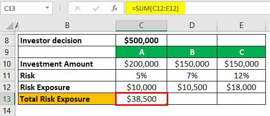

In today's dynamic financial markets, understanding various investment concepts is crucial for effective decision-making. This article explores key topics related to investment examples, financial risk, net exposure, and algorithmic trading. These concepts are increasingly important, as they play a critical role in shaping investment strategies and mitigating risks.

Investment examples such as traditional stocks, bonds, and modern options like cryptocurrencies offer diverse opportunities and risks. Financial risk, a fundamental aspect of investing, affects potential returns and involves types such as market risk, credit risk, and liquidity risk. Understanding these risks aids in developing effective investment strategies.



Net exposure, a critical metric, evaluates market exposure in investment portfolios, influencing performance and risk management. Algorithmic trading, leveraging computer algorithms for high-speed and high-frequency trading, is transforming traditional trading practices. It presents both advantages and challenges, particularly regarding market liquidity and volatility.

By examining real-world scenarios and expert insights, readers can gain a comprehensive understanding of how these elements interplay in modern investment landscapes. A thorough grasp of these topics equips investors to navigate the complexities of financial markets, optimize their portfolios, and achieve their financial goals.

## Table of Contents

## Understanding Investment Examples

Investments encompass a diverse array of assets, each presenting distinct risks and opportunities. Traditional investment vehicles include stocks and bonds, while contemporary innovations such as cryptocurrencies have gained prominence. Each investment type contributes uniquely to a financial portfolio and carries implications for risk and return.

**Stocks** are equity investments representing ownership in a company. Investors in stocks potentially benefit from dividends and capital gains driven by market appreciation. However, stocks are susceptible to market volatility, making them riskier compared to other asset classes. Portfolio diversification—a strategy involving the inclusion of stocks across different sectors and geographies—can mitigate specific risks associated with individual equities.

**Bonds**, on the other hand, are debt securities typically issued by corporations or governments. Investors in bonds receive periodic interest payments and the return of principal upon maturity. Bonds are generally considered less risky than stocks, but they are not devoid of risks. Interest rate fluctuations, credit risk, and inflation can affect bond prices. A well-balanced portfolio often includes both stocks and bonds, offering potential growth and income stability.

**Real estate** investments involve purchasing property with the expectation of generating rental income and potential appreciation. Real estate can provide portfolio diversification, given its low correlation with stock and bond markets. Nevertheless, it carries unique risks, such as property devaluation and low liquidity.

**Cryptocurrencies** represent a burgeoning class of digital assets characterized by their high volatility and speculative nature. Unlike traditional currencies, cryptocurrencies like Bitcoin and Ethereum rely on decentralized blockchain technology. While they offer significant return potential, regulatory uncertainties and market manipulation are notable risks. Given their uncorrelated behavior with traditional markets, cryptocurrencies can add diversity, albeit with higher risk, to an investment portfolio.

**Commodities**, including precious metals like gold and silver, as well as oil and agricultural products, offer another investment avenue. These tangible assets are often utilized as hedges against inflation or currency devaluation. Commodity prices can be volatile, influenced by geopolitical events, supply-demand dynamics, and economic indicators.

**Mutual funds** and **exchange-traded funds (ETFs)** provide investors with a mechanism for pooling resources to invest in diversified portfolios of stocks, bonds, or other assets. These funds aid in diversification without requiring individuals to purchase each asset independently. Mutual funds are actively managed, while ETFs typically track specific indices, offering varying expense ratios and managerial expertise.

**Alternative investments** such as hedge funds, private equity, and venture capital are typically accessed by sophisticated investors. These investments often require higher minimum investments and offer less liquidity than traditional assets but can provide substantial returns.

To integrate various investment types efficiently, consideration of their respective risk-return profiles is critical. Diversification is a powerful tool in spreading risk and optimizing returns across different asset classes. Evaluating investment options based on factors like [liquidity](/wiki/liquidity-risk-premium), [volatility](/wiki/volatility-trading-strategies), and correlation to other assets helps in assembling a resilient portfolio tailored to an investor's goals and risk tolerance.

## Financial Risk: An Essential Consideration

Financial risk is an intrinsic aspect of investment that significantly influences potential returns. Understanding and managing these risks is crucial for developing effective investment strategies. There are several key types of financial risk that investors need to be aware of to safeguard their investments and optimize returns.

**Market Risk**

Market risk, also known as systematic risk, arises from fluctuations in the overall market that can affect the performance of investments. These fluctuations can be due to macroeconomic factors such as [interest rate](/wiki/interest-rate-trading-strategies) changes, currency exchange rate variations, and economic recessions. To mitigate market risk, diversification is often employed, spreading investments across various asset classes and geographical regions. For mathematical modeling, Value at Risk (VaR) is a popular tool used to quantify potential losses in an investment portfolio over a specified time period under normal market conditions. The formula for VaR at a confidence level of $\alpha$ is given by:

$$
\text{VaR}_\alpha = - \Phi^{-1}(\alpha) \times \sigma \times P
$$

where $\Phi^{-1}$ is the inverse of the cumulative distribution function of the standard normal distribution, $\sigma$ is the portfolio's standard deviation, and $P$ is the portfolio's current value.

**Credit Risk**

Credit risk refers to the possibility that a borrower or counterparty will fail to meet their financial obligations. This type of risk is particularly relevant for investments in bonds and loans. Assessing credit risk involves evaluating the creditworthiness of the counterparty, typically through credit ratings and financial analysis. Tools like the Credit Default Swap (CDS) market provide insights into the perceived credit risk associated with a particular entity. Credit risk can be managed by employing credit derivatives and diversifying credit exposures.

**Liquidity Risk**

Liquidity risk is the risk that an entity will not be able to quickly buy or sell an asset without causing a significant impact on its price due to insufficient market depth. This is especially pertinent during periods of financial stress when markets may become illiquid. Managing liquidity risk involves maintaining a portion of the portfolio in highly liquid assets and monitoring the liquidity profile of investments. Stress testing and liquidity gap analysis are common methods used to evaluate and manage this risk.

**Risk Management Techniques**

Effectively managing financial risk involves a combination of qualitative and quantitative techniques. Portfolio managers use financial derivatives, such as options and futures, to hedge against potential adverse price movements. Stress testing and scenario analysis are vital tools used to assess how investment portfolios would perform under extreme market conditions. Modern Portfolio Theory (MPT) provides a framework for constructing portfolios that optimize the trade-off between risk and return.

Additionally, the advent of [algorithmic trading](/wiki/algorithmic-trading) has introduced advanced data analytics and [machine learning](/wiki/machine-learning) techniques to enhance risk management practices. These technologies enable the rapid assessment of market conditions and automate risk mitigation strategies.

Balancing risk and reward is fundamental to achieving financial objectives. By comprehensively understanding different types of financial risk and employing effective management strategies, investors can better navigate the complexities of financial markets and work towards achieving their investment goals.

## Decoding Net Exposure

Net exposure is a fundamental metric used to measure the market exposure of investment portfolios. It is defined as the difference between a portfolio’s long positions and its short positions. This measure provides insight into the level of risk an investor or fund is taking, reflecting a portfolio's sensitivity to market movements.

### Definition

In financial terminology, net exposure can be mathematically represented as:

$$
\text{Net Exposure} = \text{Value of Long Positions} - \text{Value of Short Positions}
$$

This figure can be expressed either in monetary terms or as a percentage of the total portfolio value. A positive net exposure indicates a bullish stance, suggesting that the investor expects the market to rise, while a negative net exposure indicates a bearish outlook.

In contrast, gross exposure considers the total size of all positions, long and short combined:

$$
\text{Gross Exposure} = \text{Value of Long Positions} + \text{Value of Short Positions}
$$

### Role in Risk Management

Net exposure plays a pivotal role in risk management by providing insights into a portfolio's market orientation. While high net exposure may signal higher potential returns, it also implies increased risk if the market moves contrary to the portfolio's position. By monitoring and adjusting net exposure, investors can align their risk levels with their investment goals and market outlook.

Hedge funds often use net exposure as a part of their strategy to balance risk and return. By strategically adjusting net exposure, they aim to capitalize on market opportunities while hedging against potential downside risks. For instance, a [hedge fund](/wiki/hedge-fund-trading-strategies) might increase short positions during volatile times to reduce net exposure and protect against market downturns.

### Examples and Strategic Adjustments

Consider a hedge fund with $1 million in long positions and $400,000 in short positions. The net exposure in this case is:

$$
\text{Net Exposure} = \$1,000,000 - \$400,000 = \$600,000
$$

This means the fund has a net long exposure of $600,000. If market conditions become uncertain, the fund might choose to increase its short positions to reduce net exposure, thereby mitigating potential losses.

Individual investors can also benefit from understanding and managing net exposure. For example, an investor bullish on the technology sector but wary of overexposure might hold a diversified portfolio of tech stocks while shorting an index [ETF](/wiki/etf-trading-strategies) to hedge against sector-specific risks.

### Importance in Investment Strategies

The concept of net exposure is a cornerstone of both hedge fund strategies and individual investment decisions. For hedge funds, managing net exposure helps in achieving desired risk-reward profiles and enhances agility in responding to market changes. For individual investors, awareness of net exposure provides a clearer picture of their market risk and assists in maintaining a diversified portfolio aligned with their risk tolerance and investment objectives.

Net exposure offers a lens through which investors can view their potential vulnerabilities and opportunities in the market. By understanding and applying this concept, they can make informed decisions that optimize their portfolio's risk-return balance.

## Algorithmic Trading: The Future of Investing

Algorithmic trading employs computer algorithms to automate and execute trades with remarkable speed and accuracy. By using predefined criteria, such as timing, price, or quantity, algorithms [carry](/wiki/carry-trading) out transactions that might be impossible for human traders to process manually within the same timeframe. This swift execution advantage allows traders to capitalize on minimal price fluctuations, potentially boosting profit margins.

**Revolutionizing Traditional Trading**

Traditional trading approaches rely heavily on the expertise and intuition of individual traders. In contrast, algorithmic trading utilizes data-driven strategies to identify market patterns and execute trades with precision. This methodology minimizes human errors and allows for the consistent application of complex strategies across different market conditions. For instance, algorithms can process vast amounts of historical and real-time data to predict future price movements, making them instrumental in executing strategies like [trend following](/wiki/trend-following) or mean reversion.

**Advantages and Challenges**

The primary advantage of algorithmic trading lies in its ability to process large volumes of data and execute orders swiftly. This technological edge contributes to increased efficiency in markets, as algorithms can simultaneously manage multiple variables and execute numerous trades precisely. Furthermore, algorithmic trading can improve market liquidity by narrowing bid-ask spreads, thus making it easier for market participants to buy and sell assets.

However, the reliance on sophisticated algorithms introduces certain challenges. The complexity of writing and maintaining these algorithms requires significant expertise, as any programming error could lead to substantial financial losses. Additionally, the high-frequency nature of algorithmic trading can increase market volatility, creating an environment where prices change rapidly, and the likelihood of "flash crashes"—sudden, severe market drops—heightens.

**Optimizing Portfolios and Managing Net Exposure**

Algorithms can play a pivotal role in optimizing investment portfolios by adjusting asset allocations based on quantitative patterns and signals. For example, quantitative algorithms evaluate the risk-reward profiles of various assets and continuously re-balance portfolios to align with an investor’s risk tolerance and investment goals.

Managing net exposure is another critical function of algorithmic trading. Net exposure refers to the difference between long and short positions within a portfolio. By continuously monitoring market trends and volatility, algorithms adjust positions to maintain desired exposure levels, mitigating risk effectively. This dynamic adjustment of net exposure helps protect portfolios against adverse market movements and optimizes returns across various market cycles.

Overall, the integration of algorithms in trading systems represents a significant shift in investment strategy execution, showcasing a blend of technology and finance aimed at enhancing the efficacy of financial markets. As algorithmic trading continues to evolve, it promises to redefine the capabilities and limitations of modern investing.

## Integrating Concepts: Practical Applications

Combining diverse investment strategies, effective financial risk assessment, net exposure analysis, and algorithmic trading can transform portfolio management, offering a comprehensive approach to navigating financial markets. An illustrative case is the application of these concepts in hedge fund management. Hedge funds often utilize a tapestry of investment vehicles, including equities, derivatives, and commodities, to optimize returns while managing risk.

A pertinent example involves a hedge fund employing a long/short equity strategy. In this approach, fund managers capitalize on algorithmic trading algorithms to dynamically adjust their portfolio positions. By going long on undervalued stocks and short on overvalued ones, they aim to capture value across different market conditions. The net exposure, calculated as the difference between long and short positions, becomes a fundamental metric for assessing market risk. By maintaining a balanced net exposure, the fund mitigates the risk associated with broader market movements, focusing instead on stock-specific factors.

Incorporating financial risk assessment tools, such as Value at Risk (VaR) and stress testing, helps in quantifying potential losses under adverse conditions. For instance, a portfolio might be subjected to historical stress scenarios, like the 2008 financial crisis, to evaluate its resilience. This proactive analysis guides adjustments in net exposure and hedging strategies, ensuring that the investment approach aligns with the fund's risk tolerance.

Algorithmic trading plays a pivotal role, not only in executing trades with precision and speed but also in managing complex data inputs and real-time market information. Advanced algorithms might analyze price [momentum](/wiki/momentum), volatility, and order flow to predict short-term market trends, enabling timely execution of trades. Python, a popular programming language among quantitative analysts, facilitates the creation of such algorithms. Here is a sample Python code snippet for a simple moving average crossover strategy:

```python
import pandas as pd

# Load historical data
data = pd.read_csv('historical_data.csv')

# Calculate moving averages
data['SMA_50'] = data['Close'].rolling(window=50).mean()
data['SMA_200'] = data['Close'].rolling(window=200).mean()

# Generate signals
data['Signal'] = 0
data['Signal'][50:] = np.where(data['SMA_50'][50:] > data['SMA_200'][50:], 1, -1)

# Display signals
print(data[['Date', 'Close', 'Signal']].tail())
```

The integration of these concepts extends to individual investors and portfolio managers who adjust their strategies to dynamic financial environments. Emphasizing diversification, they are better equipped to withstand market volatility. By leveraging the synergy of varied investments, thorough risk assessments, calculated net exposure, and technology-driven trading, investors position themselves advantageously to improve financial outcomes. Practical implementation of these strategies requires a balance between automated processes and human oversight, allowing for adaptive decision-making in complex markets.

## Conclusion

In today's rapidly evolving financial landscape, having a comprehensive grasp of investment strategies and risk management is crucial. This article has examined several critical aspects of investing, including diverse investment examples, the intricacies of financial risk, the significance of net exposure, and the evolving domain of algorithmic trading. By understanding these components, investors can strategically enhance their portfolio management, positioning themselves to achieve their financial goals effectively.

Investment examples across stocks, bonds, cryptocurrencies, and other asset classes illustrate the importance of diversification. Each investment type carries inherent risks and opportunities that, when understood and managed correctly, can lead to improved financial performance. Recognizing and assessing financial risks such as market, credit, and liquidity risks further empower investors to construct robust investment strategies that balance risk with reward.

Net exposure is another pivotal [factor](/wiki/factor-investing), offering insight into the real market exposure of investment portfolios. By adjusting net exposure strategically, investors can better manage potential risks and optimize returns. This understanding is particularly beneficial in both hedge fund management and individual investment scenarios.

Algorithmic trading represents a technological advancement in investing, providing enhanced speed and efficiency. It revolutionizes traditional trading by leveraging computer algorithms, thereby optimizing portfolios and managing net exposure in real time. However, the integration of advanced trading technologies must be approached with an awareness of the potential challenges they pose, including their impact on market liquidity and volatility.

The integration of these elements—investment variety, risk assessment, net exposure analysis, and algorithmic trading—provides a holistic approach to investing. As financial landscapes continue to evolve, continuous learning and adaptation to market changes are vital for successful investing. By applying the insights shared in this article, investors can navigate complex markets more effectively, ultimately achieving their long-term financial objectives.

## References & Further Reading

[1]: Natenberg, S. (1994). ["Option Volatility and Pricing: Advanced Trading Strategies and Techniques"](https://www.amazon.com/Option-Volatility-Pricing-Strategies-Techniques/dp/0071818774). McGraw-Hill.

[2]: Hull, J. C. (2018). ["Options, Futures, and Other Derivatives"](https://www.semanticscholar.org/paper/Options%2C-Futures%2C-and-Other-Derivatives-Hull/89bdee500c8623864fc9eb7a471546aa713acc44). Pearson.

[3]: Aldridge, I. (2013). ["High-Frequency Trading: A Practical Guide to Algorithmic Strategies and Trading Systems"](https://onlinelibrary.wiley.com/doi/pdf/10.1002/9781119203803.fmatter). Wiley.

[4]: Black, F., & Scholes, M. (1973). ["The Pricing of Options and Corporate Liabilities"](https://www.cs.princeton.edu/courses/archive/fall09/cos323/papers/black_scholes73.pdf). Journal of Political Economy, 81(3), 637–654.

[5]: Taleb, N. N. (2007). ["The Black Swan: The Impact of the Highly Improbable"](https://en.wikipedia.org/wiki/The_Black_Swan:_The_Impact_of_the_Highly_Improbable). Random House.

[6]: Sharpe, W. F. (1964). ["Capital Asset Prices: A Theory of Market Equilibrium under Conditions of Risk"](https://onlinelibrary.wiley.com/doi/full/10.1111/j.1540-6261.1964.tb02865.x). Journal of Finance, 19(3), 425–442.

[7]: Chan, E. (2008). ["Quantitative Trading: How to Build Your Own Algorithmic Trading Business"](https://github.com/ftvision/quant_trading_echan_book). Wiley.

[8]: Lopez de Prado, M. (2018). ["Advances in Financial Machine Learning"](https://www.amazon.com/Advances-Financial-Machine-Learning-Marcos/dp/1119482089). Wiley.