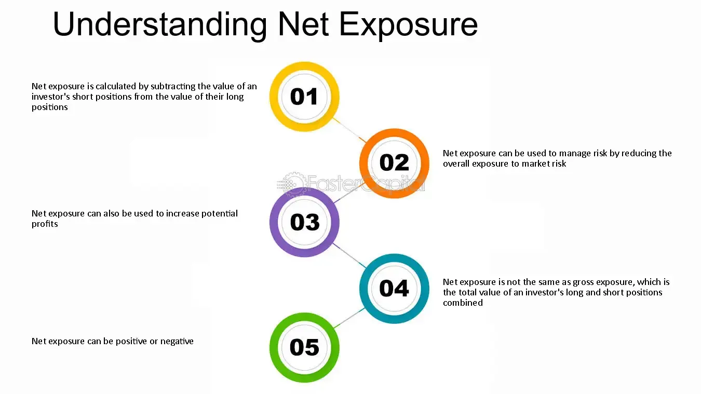

## Table of Contents

## What is net exposure in financial terms?

Net exposure in financial terms is a way to measure how much risk an investor or a fund is taking in the market. It is calculated by subtracting the value of the short positions (bets that the market will go down) from the value of the long positions (bets that the market will go down). If the result is positive, it means the investor has more long positions and is betting on the market to go up. If the result is negative, it means the investor has more short positions and is betting on the market to go down.

Understanding net exposure is important because it helps investors and fund managers see how much they are exposed to market movements. A high net exposure means the investor could make big gains if the market moves in their favor, but they could also lose a lot if the market moves against them. A low net exposure means the investor is taking less risk, but they also might not make as much money if the market moves in their favor. By managing net exposure, investors can try to balance potential gains with the risks they are willing to take.

## How is net exposure calculated?

Net exposure is figured out by taking the total value of what you own (your long positions) and then subtracting the total value of what you've bet against (your short positions). If you own more than you've bet against, your net exposure will be a positive number. This means you're betting that the market will go up. If you've bet against more than you own, your net exposure will be a negative number. This means you're betting that the market will go down.

For example, imagine you have $100,000 in stocks (long positions) and $40,000 in bets against the market (short positions). Your net exposure would be $100,000 minus $40,000, which equals $60,000. This positive number shows you're more optimistic about the market going up. If instead, you had $30,000 in stocks and $50,000 in bets against the market, your net exposure would be $30,000 minus $50,000, which equals -$20,000. This negative number shows you're more pessimistic about the market going up.

## Why is net exposure important for investors?

Net exposure is important for investors because it tells them how much risk they are taking in the market. It helps them see if they are betting more on the market going up or down. By knowing their net exposure, investors can decide if they are comfortable with the level of risk they are taking. If their net exposure is high, it means they could make a lot of money if the market moves their way, but they could also lose a lot if it doesn't. If their net exposure is low, they are taking less risk, but they might not make as much money if the market goes up.

Managing net exposure is also key for investors to balance their potential gains with the risks they are willing to take. For example, if an investor sees that their net exposure is too high and they feel uncomfortable with that level of risk, they can reduce it by selling some of their long positions or increasing their short positions. On the other hand, if they think the market is going to do well and they want to take more risk, they can increase their net exposure by buying more stocks or reducing their short positions. This way, investors can adjust their strategies to match their goals and comfort with risk.

## Can you provide a simple example of net exposure in a portfolio?

Imagine you have a small investment portfolio. You own $50,000 worth of stocks, which means you have long positions. You also have $20,000 worth of bets against the market, which are your short positions. To find your net exposure, you subtract the value of your short positions from the value of your long positions. So, $50,000 minus $20,000 equals $30,000. This positive number means your net exposure is $30,000, showing that you are betting more on the market going up.

Understanding your net exposure helps you see how much risk you are taking. In this example, a net exposure of $30,000 means you could make good money if the market goes up, but you could also lose money if it goes down. If you feel like this is too much risk, you might decide to sell some of your stocks or increase your bets against the market to lower your net exposure. This way, you can adjust your investments to feel more comfortable with the risk you are taking.

## What are the differences between gross exposure and net exposure?

Gross exposure and net exposure are two ways to look at how much risk an investor is taking in the market, but they measure it differently. Gross exposure is the total value of all the investments an investor has, no matter if they are betting on the market going up or down. This means you add up all your long positions (bets that the market will go up) and all your short positions (bets that the market will go down). So, if you have $100,000 in stocks and $50,000 in bets against the market, your gross exposure would be $150,000. Gross exposure gives you a sense of how big your total investment is, but it doesn't tell you if you're betting more on the market going up or down.

Net exposure, on the other hand, shows the difference between your long and short positions. It's calculated by subtracting the value of your short positions from the value of your long positions. Using the same example, if you have $100,000 in stocks and $50,000 in bets against the market, your net exposure would be $100,000 minus $50,000, which equals $50,000. This positive number means you're betting more on the market going up. Net exposure helps you see how much risk you're taking in one direction, and it's useful for understanding if you're more optimistic or pessimistic about the market's future. By knowing both your gross and net exposure, you can better manage your investments and the risks you're willing to take.

## How does net exposure affect risk management in trading?

Net exposure is important for risk management in trading because it shows how much risk you are taking in the market. When you know your net exposure, you can see if you are betting more on the market going up or down. This helps you decide if you are comfortable with the level of risk you are taking. If your net exposure is high, it means you could make a lot of money if the market moves your way, but you could also lose a lot if it doesn't. If your net exposure is low, you are taking less risk, but you might not make as much money if the market goes up.

By understanding your net exposure, you can adjust your trading strategy to match your goals and comfort with risk. For example, if you see that your net exposure is too high and you feel uncomfortable with that level of risk, you can reduce it by selling some of your long positions or increasing your short positions. On the other hand, if you think the market is going to do well and you want to take more risk, you can increase your net exposure by buying more stocks or reducing your short positions. This way, you can manage your risk better and make decisions that help you reach your investment goals.

## What are common strategies to manage net exposure?

Managing net exposure involves using different strategies to control the amount of risk you are taking in the market. One common strategy is to balance your long and short positions. If you think your net exposure is too high, you can sell some of your stocks or buy more bets against the market to reduce it. This way, you are not betting too much on the market going one way, which can help lower your risk. Another strategy is to use stop-loss orders. These are orders that automatically sell your stocks if they drop to a certain price, helping you limit how much money you could lose.

Another approach to managing net exposure is to diversify your investments. By spreading your money across different types of investments, like stocks, bonds, and commodities, you can reduce your net exposure to any single market or asset. This can help protect you if one part of the market does badly. You can also adjust your net exposure based on what you think will happen in the market. If you believe the market will go up, you might increase your net exposure by buying more stocks or reducing your bets against the market. If you think the market will go down, you can decrease your net exposure by selling some stocks or increasing your bets against the market. By using these strategies, you can manage your net exposure and balance the risks and rewards of your investments.

## How does net exposure relate to market volatility?

Net exposure can affect how much a trader is impacted by market [volatility](/wiki/volatility-trading-strategies). Market volatility means how much prices go up and down in the market. If you have a high net exposure, you are betting a lot on the market moving one way. So, if the market is very volatile and moves a lot, you could make a lot of money if it goes your way. But, if it moves against you, you could lose a lot of money too. This is because a high net exposure means you are taking more risk, and with more risk comes the chance for bigger wins and bigger losses.

To manage this risk, traders might change their net exposure based on how volatile they think the market will be. If they think the market will be very volatile, they might lower their net exposure to protect themselves from big losses. They can do this by balancing their long and short positions or by using other strategies like stop-loss orders. By adjusting their net exposure, traders can try to take advantage of market volatility while also protecting themselves from the risks that come with it.

## What are the potential risks associated with high net exposure?

High net exposure means you are betting a lot on the market going one way. If the market moves in the direction you bet on, you could make a lot of money. But if the market moves against you, you could lose a lot of money too. This is because high net exposure means you are taking more risk. More risk can lead to bigger wins, but it also means bigger losses if things don't go your way. So, high net exposure can make your investments more sensitive to changes in the market, which can be scary if the market is going up and down a lot.

Another risk of high net exposure is that it can make it hard to handle big market swings. If the market suddenly drops, a high net exposure could lead to big losses very quickly. This might force you to sell your investments at a bad time just to cut your losses. Also, if you have a high net exposure and the market goes against you, it might take a long time for your investments to recover. This can be stressful and might make you want to change your investment strategy, which could lead to more mistakes. So, managing your net exposure is important to help you handle the ups and downs of the market without too much risk.

## How can net exposure be used in hedging strategies?

Net exposure can help you use hedging strategies to protect your investments. Hedging is like buying insurance for your investments. If you have a lot of stocks and you're worried the market might go down, you can use net exposure to figure out how much to bet against the market. If your net exposure is high because you own a lot of stocks, you might decide to increase your short positions to balance it out. This way, if the market goes down, the money you lose on your stocks might be made up by the money you make on your short positions.

By adjusting your net exposure, you can make your investments safer. For example, if you have $100,000 in stocks and your net exposure is $100,000, you're betting a lot on the market going up. To hedge, you might sell some stocks or buy more short positions to lower your net exposure. If you bring your net exposure down to $50,000, you're taking less risk. This means if the market drops, you won't lose as much money. Hedging with net exposure helps you balance the risks and rewards of your investments, so you can feel more secure no matter what the market does.

## What advanced metrics can be used alongside net exposure to assess portfolio risk?

Alongside net exposure, another important metric to assess portfolio risk is the Value at Risk (VaR). VaR tells you the most money you could lose in your portfolio over a certain time period, with a certain level of confidence. For example, if your VaR is $10,000 at a 95% confidence level over one day, it means there's a 5% chance you could lose more than $10,000 in a single day. By looking at VaR together with net exposure, you can get a better idea of how much risk you're taking and how big your potential losses could be.

Another useful metric is the Sharpe Ratio. This measures how much return you're getting for the risk you're taking. A higher Sharpe Ratio means you're getting more return for each unit of risk, which is good. If you compare the Sharpe Ratio of your portfolio to its net exposure, you can see if the risk you're taking is worth it. For example, if your net exposure is high but your Sharpe Ratio is low, it might mean you're taking too much risk for the returns you're getting. By using these metrics together, you can make smarter decisions about your investments and manage your risk better.

## How do institutional investors use net exposure to optimize their investment strategies?

Institutional investors use net exposure to understand and control the risk in their portfolios. They look at net exposure to see if they are betting more on the market going up or down. If their net exposure is too high, it means they are taking a lot of risk. They might decide to sell some of their stocks or increase their bets against the market to lower their net exposure. This helps them feel safer because they won't lose as much money if the market goes down. On the other hand, if they think the market will do well, they might increase their net exposure by buying more stocks or reducing their bets against the market. This way, they can take advantage of good market conditions and make more money.

Institutional investors also use net exposure to help them make smart decisions about their investments. They might use it along with other metrics like Value at Risk (VaR) and the Sharpe Ratio to get a better picture of their risk and returns. For example, if their net exposure is high but their VaR shows they could lose a lot of money, they might decide to adjust their strategy. They can also look at their Sharpe Ratio to see if the risk they're taking is worth the return they're getting. By using net exposure and other metrics together, institutional investors can find the right balance between risk and reward, helping them to optimize their investment strategies and reach their goals.

## Is Financial Risk an Essential Consideration?

Financial risk is an intrinsic aspect of investment that significantly influences potential returns. Understanding and managing these risks is crucial for developing effective investment strategies. There are several key types of financial risk that investors need to be aware of to safeguard their investments and optimize returns.

**Market Risk**

Market risk, also known as systematic risk, arises from fluctuations in the overall market that can affect the performance of investments. These fluctuations can be due to macroeconomic factors such as [interest rate](/wiki/interest-rate-trading-strategies) changes, currency exchange rate variations, and economic recessions. To mitigate market risk, diversification is often employed, spreading investments across various asset classes and geographical regions. For mathematical modeling, Value at Risk (VaR) is a popular tool used to quantify potential losses in an investment portfolio over a specified time period under normal market conditions. The formula for VaR at a confidence level of $\alpha$ is given by:

$$
\text{VaR}_\alpha = - \Phi^{-1}(\alpha) \times \sigma \times P
$$

where $\Phi^{-1}$ is the inverse of the cumulative distribution function of the standard normal distribution, $\sigma$ is the portfolio's standard deviation, and $P$ is the portfolio's current value.

**Credit Risk**

Credit risk refers to the possibility that a borrower or counterparty will fail to meet their financial obligations. This type of risk is particularly relevant for investments in bonds and loans. Assessing credit risk involves evaluating the creditworthiness of the counterparty, typically through credit ratings and financial analysis. Tools like the Credit Default Swap (CDS) market provide insights into the perceived credit risk associated with a particular entity. Credit risk can be managed by employing credit derivatives and diversifying credit exposures.

**Liquidity Risk**

Liquidity risk is the risk that an entity will not be able to quickly buy or sell an asset without causing a significant impact on its price due to insufficient market depth. This is especially pertinent during periods of financial stress when markets may become illiquid. Managing [liquidity](/wiki/liquidity-risk-premium) risk involves maintaining a portion of the portfolio in highly liquid assets and monitoring the liquidity profile of investments. Stress testing and liquidity gap analysis are common methods used to evaluate and manage this risk.

**Risk Management Techniques**

Effectively managing financial risk involves a combination of qualitative and quantitative techniques. Portfolio managers use financial derivatives, such as options and futures, to hedge against potential adverse price movements. Stress testing and scenario analysis are vital tools used to assess how investment portfolios would perform under extreme market conditions. Modern Portfolio Theory (MPT) provides a framework for constructing portfolios that optimize the trade-off between risk and return.

Additionally, the advent of [algorithmic trading](/wiki/algorithmic-trading) has introduced advanced data analytics and [machine learning](/wiki/machine-learning) techniques to enhance risk management practices. These technologies enable the rapid assessment of market conditions and automate risk mitigation strategies.

Balancing risk and reward is fundamental to achieving financial objectives. By comprehensively understanding different types of financial risk and employing effective management strategies, investors can better navigate the complexities of financial markets and work towards achieving their investment goals.

## What is the meaning of net exposure and how can it be decoded?

Net exposure is a fundamental metric used to measure the market exposure of investment portfolios. It is defined as the difference between a portfolio’s long positions and its short positions. This measure provides insight into the level of risk an investor or fund is taking, reflecting a portfolio's sensitivity to market movements.

### Definition

In financial terminology, net exposure can be mathematically represented as:

$$
\text{Net Exposure} = \text{Value of Long Positions} - \text{Value of Short Positions}
$$

This figure can be expressed either in monetary terms or as a percentage of the total portfolio value. A positive net exposure indicates a bullish stance, suggesting that the investor expects the market to rise, while a negative net exposure indicates a bearish outlook.

In contrast, gross exposure considers the total size of all positions, long and short combined:

$$
\text{Gross Exposure} = \text{Value of Long Positions} + \text{Value of Short Positions}
$$

### Role in Risk Management

Net exposure plays a pivotal role in risk management by providing insights into a portfolio's market orientation. While high net exposure may signal higher potential returns, it also implies increased risk if the market moves contrary to the portfolio's position. By monitoring and adjusting net exposure, investors can align their risk levels with their investment goals and market outlook.

Hedge funds often use net exposure as a part of their strategy to balance risk and return. By strategically adjusting net exposure, they aim to capitalize on market opportunities while hedging against potential downside risks. For instance, a [hedge fund](/wiki/hedge-fund-trading-strategies) might increase short positions during volatile times to reduce net exposure and protect against market downturns.

### Examples and Strategic Adjustments

Consider a hedge fund with $1 million in long positions and $400,000 in short positions. The net exposure in this case is:

$$
\text{Net Exposure} = \$1,000,000 - \$400,000 = \$600,000
$$

This means the fund has a net long exposure of $600,000. If market conditions become uncertain, the fund might choose to increase its short positions to reduce net exposure, thereby mitigating potential losses.

Individual investors can also benefit from understanding and managing net exposure. For example, an investor bullish on the technology sector but wary of overexposure might hold a diversified portfolio of tech stocks while shorting an index [ETF](/wiki/etf-trading-strategies) to hedge against sector-specific risks.

### Importance in Investment Strategies

The concept of net exposure is a cornerstone of both hedge fund strategies and individual investment decisions. For hedge funds, managing net exposure helps in achieving desired risk-reward profiles and enhances agility in responding to market changes. For individual investors, awareness of net exposure provides a clearer picture of their market risk and assists in maintaining a diversified portfolio aligned with their risk tolerance and investment objectives.

Net exposure offers a lens through which investors can view their potential vulnerabilities and opportunities in the market. By understanding and applying this concept, they can make informed decisions that optimize their portfolio's risk-return balance.

## References & Further Reading

[1]: Natenberg, S. (1994). ["Option Volatility and Pricing: Advanced Trading Strategies and Techniques"](https://www.amazon.com/Option-Volatility-Pricing-Strategies-Techniques/dp/0071818774). McGraw-Hill.

[2]: Hull, J. C. (2018). ["Options, Futures, and Other Derivatives"](https://www.semanticscholar.org/paper/Options%2C-Futures%2C-and-Other-Derivatives-Hull/89bdee500c8623864fc9eb7a471546aa713acc44). Pearson.

[3]: Aldridge, I. (2013). ["High-Frequency Trading: A Practical Guide to Algorithmic Strategies and Trading Systems"](https://onlinelibrary.wiley.com/doi/pdf/10.1002/9781119203803.fmatter). Wiley.

[4]: Black, F., & Scholes, M. (1973). ["The Pricing of Options and Corporate Liabilities"](https://www.cs.princeton.edu/courses/archive/fall09/cos323/papers/black_scholes73.pdf). Journal of Political Economy, 81(3), 637–654.

[5]: Taleb, N. N. (2007). ["The Black Swan: The Impact of the Highly Improbable"](https://en.wikipedia.org/wiki/The_Black_Swan:_The_Impact_of_the_Highly_Improbable). Random House.

[6]: Sharpe, W. F. (1964). ["Capital Asset Prices: A Theory of Market Equilibrium under Conditions of Risk"](https://onlinelibrary.wiley.com/doi/full/10.1111/j.1540-6261.1964.tb02865.x). Journal of Finance, 19(3), 425–442.

[7]: Chan, E. (2008). ["Quantitative Trading: How to Build Your Own Algorithmic Trading Business"](https://github.com/ftvision/quant_trading_echan_book). Wiley.

[8]: Lopez de Prado, M. (2018). ["Advances in Financial Machine Learning"](https://www.amazon.com/Advances-Financial-Machine-Learning-Marcos/dp/1119482089). Wiley.