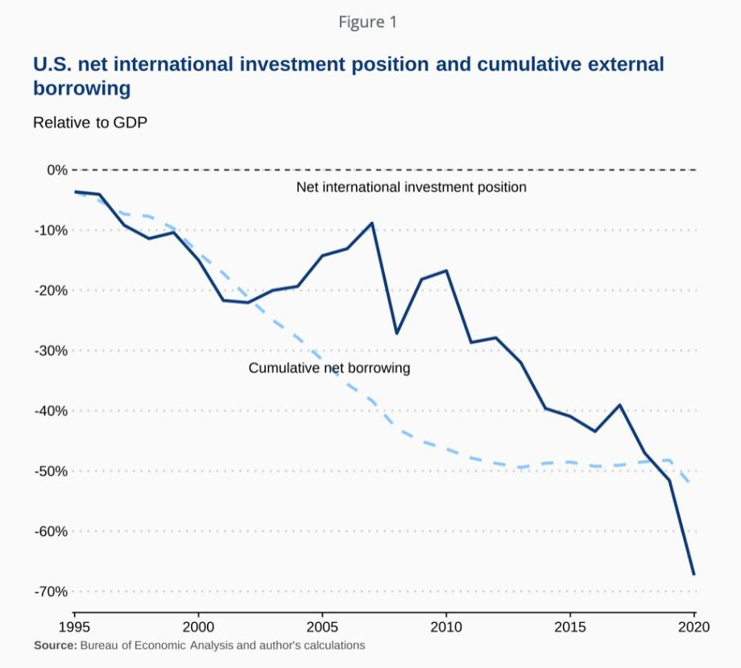

In today's global economy, the intricate relationship between creditor status, debtor status, and net foreign assets is critical to understanding a country's financial stability. At its core, these metrics act as indicators of economic health, affecting a nation's ability to engage favorably in international markets. A country's status as a creditor or debtor hinges on its net foreign assets (NFA), defined as the difference between foreign assets owned and liabilities owed. This financial measure influences not only the country's economic policies and strategies but also plays a significant role in determining currency dynamics on a global scale.

Creditor nations, often characterized by a positive NFA, tend to exhibit financial prosperity driven by trade surpluses and prudent economic policies. This status affords them stronger currencies and lower borrowing costs, making these countries attractive destinations for foreign investments. Conversely, debtor nations face challenges such as higher borrowing costs and currency depreciation. These factors can lead to economic vulnerabilities that impact investor confidence and fiscal stability.



Understanding these dynamics is essential for market participants, especially in the context of forex trading, where exchange rate movements are crucial. Algorithmic (algo) trading has emerged as a powerful tool to navigate these complexities. By incorporating economic indicators such as NFA and exchange rates, algo trading systems can enhance predictive analytics and identify profitable trading opportunities. This article explores how these core economic indicators influence financial markets and examines the strategic role of algo trading in optimizing decisions for investors and traders.

## Table of Contents

## Understanding Net Foreign Assets and Status

Net Foreign Assets (NFA) play a pivotal role in assessing a country's financial position on the global stage. NFA is defined as the difference between a country’s foreign assets and foreign liabilities. Mathematically, it can be expressed as:

$$
\text{NFA} = \text{Foreign Assets} - \text{Foreign Liabilities}
$$

A nation with positive NFA is referred to as a net creditor, indicating it has more foreign assets than liabilities. Conversely, a negative NFA classifies a country as a net debtor, signifying greater foreign liabilities than assets. This categorization provides key insights into the economic strategies and currency stability of a country.

The status of NFA not only influences a country’s economic credibility but also serves as an indicator of its ability to participate in global financial markets. Nations with substantial positive NFA tend to have stronger currencies due to the perceived financial stability and investor confidence. In contrast, countries with negative NFA may face currency depreciation and higher borrowing costs, as they are perceived to be riskier by foreign investors.

Exchange rate fluctuations and asset valuation changes are significant factors impacting NFA. For instance, a devaluation of the domestic currency can alter the valuation of foreign debt and assets, thereby affecting the overall NFA. This relationship underscores the importance of monitoring NFA for predicting potential shifts in currency markets.

Understanding a country's NFA provides valuable predictive insights into potential currency movements. For example, an increasing trend in NFA may signal future currency appreciation, whereas a declining NFA could foreshadow depreciation pressures. These insights are crucial for policymakers, investors, and traders who are keen to anticipate and respond to changes in economic environments.

In summary, Net Foreign Assets serve as a vital metric for determining whether a country holds a net creditor or debtor status. Given the influence of valuation changes and exchange rate dynamics on NFA, it is essential for stakeholders to continuously assess these elements to formulate effective economic and trading strategies.

## Creditor Countries and Economic Impact

Creditor countries, characterized by a surplus in their net foreign assets, play a significant role in the global financial landscape by lending more to foreign nations than they borrow. This creditor status is predominantly the result of a positive balance where a nation's foreign assets exceed its foreign liabilities. The economic impact of such a status is substantial, influencing currency strength, borrowing costs, and overall attractiveness to foreign investors.

One primary advantage enjoyed by creditor countries is the tendency for stronger domestic currencies. A favorable net foreign asset position often results in currency appreciation due to the increased demand for the creditor country's currency from international borrowers seeking to repay debts or invest in a nation with robust economic fundamentals. A stronger currency, in turn, lowers the cost of imports, contributing to lower inflation rates and increasing purchasing power for domestic consumers.

Moreover, creditor nations benefit from lower borrowing costs. The perceived economic stability and fiscal prudence of these countries reduce the risk premium demanded by lenders, leading to lower interest rates on sovereign and corporate debt. This economic environment encourages investment and fosters capital inflows, further strengthening the economic position of the creditor country.

Several factors contribute to a nation achieving and maintaining creditor status. Robust trade surpluses play a crucial role; countries that export more than they import accumulate foreign currency reserves, strengthening their net foreign assets. Prudent fiscal policies, such as maintaining balanced budgets and sustainable government debt levels, signal economic stability and build investor confidence. Sound economic fundamentals, including efficient financial markets, a skilled workforce, and technological innovation, enhance productive capacity and competitiveness, further supporting a surplus in net foreign assets.

Germany and Japan exemplify the benefits of being creditor countries. Germany's strong manufacturing sector and substantial trade surplus, particularly within the European Union, have positioned it as one of the world's leading creditor nations. Similarly, Japan's significant trade surplus, primarily driven by its high-tech and automotive industries, has contributed to its creditor status. These countries' ability to maintain a positive net foreign asset balance highlights the economic advantages of being a creditor country in the global financial system.

Overall, the status of creditor countries underpins their economic stability and global influence, enabling them to navigate international markets with strategic advantages that enhance their long-term growth prospects.

## Debtor Countries: Challenges and Risks

Debtor countries, characterized by a negative net foreign asset position, often rely more on foreign borrowing than lending. This economic status can lead to several disadvantages, inherently linked to increased financial risks and potential economic instability. A primary consequence of this position is the elevation in borrowing costs. When a country is perceived as a high-risk debtor, international investors demand higher interest rates to compensate for the increased probability of default, thus exacerbating the nation's debt burden.

Economic vulnerability becomes a tangible risk as debtor countries might struggle to service their foreign debt, particularly if their income streams are disrupted. This risk is amplified if their revenues are denominated in a weakening domestic currency, which raises the local-cost burden of foreign-denominated liabilities. Investor confidence, sensitive to these dynamics, might wane, adversely impacting the country's ability to attract further investment and complicating efforts to achieve fiscal stability.

Trade deficits significantly contribute to a debtor status. When a country's imports consistently surpass its exports, the economic imbalance necessitates financing through foreign borrowing. Additionally, fiscal imbalances, characterized by sustained government budget deficits, force countries to finance their spending through external debt. This reliance on external financing can create a perilous cycle of borrowing, further deepening the debtor status.

The United States and Italy exemplify the challenges faced by debtor nations. Despite having advanced economies, they illustrate the pressures of maintaining substantial external debts. The United States, for instance, has traditionally run a significant balance of payments deficit, largely financed through the issuance of government bonds held by foreign investors. This reliance on external credit leaves the economy vulnerable to shifts in investor confidence and global interest rates.

Italy, as another example, contends with its high public debt-to-GDP ratio, making it susceptible to market perceptions and shifts in interest rates. These financial pressures can lead to currency depreciation, as confidence in the economic outlook diminishes. Currency depreciation can trigger inflationary trends as the cost of imports rise, further stressing the economic environment of debtor nations.

Understanding these challenges is crucial for stakeholders looking to engage with or invest in debtor countries. Awareness and management of such risks can help mitigate adverse effects and foster more stable economic conditions.

## Exchange Rates and Net Foreign Assets

Net foreign assets (NFA) play a crucial role in shaping a nation's exchange rate dynamics, directly influencing its trade balance and economic competitiveness on the global stage. A nation's status as a creditor or debtor significantly impacts the behavior of its currency in international markets.

**Creditor Nations and Currency Appreciation**

Countries with a positive NFA, known as creditor nations, tend to experience currency appreciation. This appreciation is driven by several factors, linked to their robust economic standing. Firstly, the surplus in net foreign assets indicates that these countries have more foreign investments than debts, leading to a higher demand for their currency. This demand strengthens the currency, making it more valuable relative to others. Furthermore, a strong currency enhances the country's competitiveness in exports by reducing the effective cost of imported raw materials and intermediate goods, which are inputs for the export products. Stronger currencies also translate into lower inflation rates, fostering economic stability. Germany and Japan epitomize creditor nations enjoying these benefits. Both countries maintain large trade surpluses, which contribute to their strong currency positions in the global market.

**Debtor Nations and Currency Depreciation**

Conversely, nations with a negative NFA, referred to as debtor countries, are prone to currency depreciation. The increased borrowing from foreign entities often leads to heightened demand for foreign currencies, depreciating the debtor nation's currency. Currency depreciation can lead to increased import costs and consequently, inflation, exerting additional economic pressure. For example, the United States and Italy, with significant foreign debt, often face such depreciation challenges, complicating monetary policy and impacting economic growth. Currency depreciation erodes purchasing power and can accelerate inflationary pressures, thus requiring tailored economic strategies to maintain competitiveness.

**Impact on Forex Trading and Global Trade Relations**

The relationship between NFAs and exchange rates underpins [forex](/wiki/forex-system) trading strategies. Traders closely monitor NFA data as it offers predictive insights into potential currency movements. Understanding the direction in which a nation's currency is likely to move allows traders to develop informed strategies, whether hedging against anticipated depreciation or capitalizing on expected appreciation.

Moreover, these currency movements have profound implications for global trade relations. A creditor nation's appreciating currency may encourage trading partners to seek alternative, cost-effective trade routes, affecting international supply chains. Debtor nations, facing depreciating currencies, may stimulate export demand due to relatively cheaper goods but at the risk of inflating import costs, affecting consumer prices and economic stability.

In forex trading, algorithms can be constructed to account for a nation's NFA position, enhancing decision-making and optimizing trading operations. By integrating these macroeconomic indicators, investors can exploit market inefficiencies, turning potential challenges into opportunities. The interplay between exchange rates and net foreign assets thus remains a focal point for understanding and navigating the complex ecosystem of global financial markets.

## Algo Trading: Strategies and Opportunities

Algorithmic trading provides strategic advantages in managing the complex interplay of creditor and debtor dynamics in global financial markets. By employing sophisticated computer algorithms, traders can process vast amounts of data to make informed decisions about buying and selling currencies, capitalizing on market fluctuations and inefficiencies.

One of the primary benefits of algorithmic (algo) trading is its ability to leverage data analytics to predict currency movements effectively. Traders can analyze macroeconomic indicators, such as net foreign assets (NFA) and exchange rates, to develop predictive models that inform trading strategies. For instance, a positive NFA often correlates with currency appreciation, while a negative NFA might indicate depreciation pressures. Algo trading models can integrate these economic metrics to forecast currency trends, thereby optimizing entry and [exit](/wiki/exit-strategy) points for trades.

To exploit market inefficiencies, algo trading systems incorporate a variety of factors, including historical price data, pattern recognition, and economic indicators. An example of a simplified algorithm that could be used for this purpose in Python is as follows:

```python
# Python pseudo-code for a simple currency trading algorithm

import numpy as np

def predict_currency_movement(nfa_data, exchange_rate_data):
    # Sample function to predict currency trend
    correlation = np.corrcoef(nfa_data, exchange_rate_data)[0, 1]
    if correlation > 0.5:
        return "appreciation"
    elif correlation < -0.5:
        return "depreciation"
    else:
        return "neutral"

# Hypothetical data
nfa_data = np.array([2.5, 3.0, 3.5, 4.0, 4.5])  # net foreign asset values
exchange_rate_data = np.array([110, 112, 115, 117, 120])  # exchange rate values

# Predict currency movement
prediction = predict_currency_movement(nfa_data, exchange_rate_data)
print("Predicted currency movement:", prediction)
```

This example demonstrates how algorithms can predict currency movements by evaluating the correlation between net foreign assets and exchange rates. Successful strategies can identify patterns in this data, triggering actions when certain thresholds are crossed.

Several case studies illustrate the efficacy of algo trading in currency markets. One such example is the deployment of high-frequency trading ([HFT](/wiki/high-frequency-trading-strategies)) systems that execute trades in fractions of a second, capitalizing on ephemeral price disparities. HFT firms use advanced algorithms that assess real-time data from financial markets, adjusting their positions instantaneously based on fluctuations in net foreign assets and exchange rates. These systems have demonstrated profitability by maintaining a competitive edge in market prediction and execution speed.

Algorithmic trading empowers traders to navigate economic landscapes shaped by creditor and debtor dynamics, using data-driven strategies to achieve optimal investment outcomes. By continuously refining their algorithms and integrating economic insights, traders can better anticipate currency movements and exploit opportunities that arise in the global marketplace.

## Conclusion

Understanding the intersection of creditor status, debtor status, and net foreign assets is crucial for navigating global financial markets. The identification of a country's net creditor or debtor position provides essential insights into its economic health and future financial trajectory. For investors and traders, recognizing these dynamics can unlock opportunities by predicting currency value fluctuations and assessing economic stability, which are vital for informed decision-making.

Algo trading stands out as a powerful tool in this context. By leveraging sophisticated data-driven strategies, algorithmic systems can process vast arrays of economic data, including net foreign assets and exchange rates. These systems employ advanced analytics to identify trends, capture market inefficiencies, and execute trades with precision. Consequently, algo trading can significantly enhance trading performance by optimizing strategy execution based on NFA positions and predicted exchange rate movements.

For instance, algorithmic models might incorporate changes in net foreign assets to anticipate shifts in a country's currency value, enabling traders to position themselves advantageously. These insights aid in crafting strategies that not only exploit favorable market conditions but also mitigate risks associated with currency [volatility](/wiki/volatility-trading-strategies). 

By utilizing the insights provided by understanding creditor and debtor statuses, combined with [algorithmic trading](/wiki/algorithmic-trading)'s capabilities, traders can enhance their decision-making processes and optimize their investment outcomes. The strategic integration of these economic indicators into trading algorithms offers a pathway to achieving superior returns in the competitive landscape of global financial markets.

## References & Further Reading

[1]: Gopinath, G., Gourinchas, P.-O., Hsieh, C.-T., & Li, N. (2020). ["Net Foreign Asset Positions and Exchange Rates."](https://www.aeaweb.org/articles?id=10.1257/aer.20171201) National Bureau of Economic Research Working Paper No. 26614.

[2]: Lane, P. R., & Milesi-Ferretti, G. M. (2007). ["The External Wealth of Nations Mark II: Revised and Extended Estimates of Foreign Assets and Liabilities, 1970–2004."](https://www.sciencedirect.com/science/article/pii/S0022199607000591) IMF Working Papers, WP/06/69.

[3]: Obstfeld, M. (2012). ["Does the Current Account Still Matter?"](https://www.aeaweb.org/articles?id=10.1257/aer.102.3.1) National Bureau of Economic Research Working Paper No. 17877.

[4]: Lopez de Prado, M. (2018). ["Advances in Financial Machine Learning."](https://www.amazon.com/Advances-Financial-Machine-Learning-Marcos/dp/1119482089) Wiley.

[5]: Jansen, S. (2020). ["Machine Learning for Algorithmic Trading: Predictive Models to Extract Signals from Market and Alternative Data for Systematic Trading Strategies with Python."](https://www.amazon.com/Machine-Learning-Algorithmic-Trading-alternative/dp/1839217715) Packt Publishing.

[6]: Shleifer, A., & Vishny, R. (1997). ["The Limits of Arbitrage."](https://onlinelibrary.wiley.com/doi/full/10.1111/j.1540-6261.1997.tb03807.x) The Journal of Finance, 52(1), 35-55.