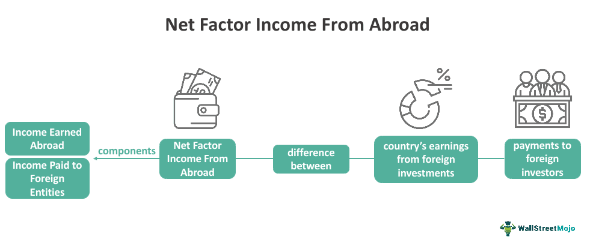

## Table of Contents

## What is Net Foreign Factor Income (NFFI)?

Net Foreign Factor Income (NFFI) is the difference between the income a country earns from foreign investments and the income foreigners earn from investments in that country. It includes things like wages from workers abroad, interest from loans to other countries, and profits from businesses owned overseas. If a country earns more from its investments abroad than it pays out to foreign investors, its NFFI is positive. If it pays out more than it earns, its NFFI is negative.

NFFI is an important part of a country's Gross National Product (GNP). GNP is a measure of a country's total economic output, and it includes NFFI to show the income earned by its citizens no matter where they are in the world. For example, if a citizen of Country A works in Country B and sends money back home, that money is part of Country A's NFFI. This helps give a clearer picture of a country's economic health by including income from global activities.

## How is Net Foreign Factor Income calculated?

Net Foreign Factor Income (NFFI) is calculated by taking the total income a country earns from its investments abroad and subtracting the total income that foreigners earn from their investments in that country. This includes money from things like wages, interest, and profits. For example, if a company from Country A owns a factory in Country B and makes a profit, that profit is part of Country A's income from abroad.

To find the NFFI, you add up all the income earned by a country's citizens and businesses from foreign sources. Then, you subtract all the income paid to foreigners who have investments in that country. If the result is positive, it means the country earns more from its investments abroad than it pays out to foreign investors. If it's negative, the country pays out more than it earns. This simple calculation helps show how a country's economy interacts with the rest of the world.

## What are the components of Net Foreign Factor Income?

Net Foreign Factor Income (NFFI) is made up of different kinds of money that come into and go out of a country from foreign sources. The main parts are wages, interest, and profits. Wages are the money that workers from the country earn while working in other countries. Interest comes from loans that the country's banks or people give to people or businesses in other countries. Profits are the money that businesses from the country make from their operations in other countries.

On the other side, NFFI also includes money that goes out of the country. This is the money that foreigners earn from their investments in the country. For example, if a company from another country owns a factory in the country, the profits from that factory go back to the foreign company. Also, if foreigners have money in the country's banks, the interest they earn is part of the money going out. By looking at both the money coming in and going out, NFFI shows how much a country earns from its global activities.

## Why is Net Foreign Factor Income important for a country's economy?

Net Foreign Factor Income (NFFI) is important because it helps show how well a country is doing with its money and businesses around the world. When a country earns more money from its investments in other countries than it pays out to foreigners, its NFFI is positive. This can mean that the country is doing well in global markets and its citizens are earning good money abroad. A positive NFFI can make a country's economy look stronger and healthier.

On the other hand, if a country's NFFI is negative, it means it is paying more money to foreigners than it is earning from its own investments abroad. This could be a sign that the country is not doing as well in global markets, or that foreigners are making a lot of money from their investments in the country. Understanding NFFI helps leaders and people see the full picture of their country's economic health, including how it interacts with the rest of the world.

## How does NFFI affect Gross National Product (GNP)?

Net Foreign Factor Income (NFFI) is an important part of Gross National Product (GNP). GNP is a way to measure how much money a country makes, including money earned by its people and businesses all around the world. NFFI is added to the country's total income to make GNP. If a country's people and businesses earn a lot of money from other countries, this makes the GNP bigger. For example, if workers from the country send money back home from jobs in other countries, or if companies make profits from factories in other countries, these amounts are added to the GNP.

On the other hand, if foreigners earn a lot of money from their investments in the country, this money is taken away from the GNP. So, if NFFI is negative, it means the country is paying more money to foreigners than it is earning from its own investments abroad. This can make the GNP smaller. By including NFFI, GNP gives a better picture of a country's total economic activity, showing not just what happens inside the country, but also how its people and businesses are doing around the world.

## Can you provide an example of how NFFI is used in national accounts?

Let's say there's a country called Sunnyland. Sunnyland has many people working in other countries, like Moonyland and Starryland. These workers send money back to their families in Sunnyland. Also, Sunnyland has a big company that owns factories in other countries and makes a lot of profit from them. On the other hand, foreigners own some businesses in Sunnyland and earn money from them. To find out Sunnyland's Net Foreign Factor Income (NFFI), you add up all the money coming in from the workers and the company's profits, and then subtract the money going out to the foreigners.

In Sunnyland's national accounts, this NFFI is added to the country's total income to get the Gross National Product (GNP). If the money coming in from abroad is more than the money going out, Sunnyland's NFFI is positive, which makes its GNP bigger. This shows that Sunnyland's people and businesses are doing well around the world. But if the money going out is more than the money coming in, the NFFI is negative, and it makes the GNP smaller. This gives a clear picture of how Sunnyland's economy is doing, including its global activities.

## What are the differences between NFFI and Net Exports?

Net Foreign Factor Income (NFFI) and Net Exports are two different things that help us understand a country's economy. NFFI is about the money a country earns from its people and businesses working and investing in other countries, minus the money foreigners earn from their investments in that country. This includes things like wages workers send home, interest from loans, and profits from businesses abroad. If a country earns more from its global activities than it pays out, its NFFI is positive.

Net Exports, on the other hand, are about the goods and services a country sells to other countries, minus the goods and services it buys from them. If a country sells more than it buys, it has a trade surplus, and its Net Exports are positive. If it buys more than it sells, it has a trade deficit, and its Net Exports are negative. While NFFI focuses on income from global investments and work, Net Exports focus on the trade of physical goods and services. Both are important for understanding different parts of a country's economic health.

## How do changes in exchange rates impact Net Foreign Factor Income?

Changes in exchange rates can have a big effect on a country's Net Foreign Factor Income (NFFI). When a country's currency gets stronger compared to other currencies, it means that the money its people and businesses earn from other countries is worth less when they bring it back home. For example, if a worker in another country sends money back home and the home country's currency has gotten stronger, that money will buy less at home than before. The same goes for profits from businesses abroad; they will be worth less when converted back to the home currency. This can make the NFFI smaller because the income from abroad doesn't go as far.

On the other hand, if a country's currency gets weaker, the money coming in from other countries will be worth more at home. This means that wages sent back by workers and profits from businesses abroad will buy more when converted to the home currency. This can make the NFFI bigger because the income from abroad is now worth more. So, changes in exchange rates can make a country's NFFI go up or down, depending on whether the home currency is getting stronger or weaker.

## What role does NFFI play in international economic analysis?

Net Foreign Factor Income (NFFI) is a key part of understanding how a country's economy works with the rest of the world. It shows the difference between the money a country earns from its people and businesses working and investing in other countries, and the money foreigners earn from their investments in that country. When a country's NFFI is positive, it means it's earning more from its global activities than it's paying out. This can be a sign that the country is doing well in the global market. Economists and policymakers use NFFI to see how well a country is doing with its money and businesses around the world.

NFFI also helps in comparing the economic health of different countries. By looking at NFFI, analysts can see which countries are getting a lot of money from their global activities and which ones are paying out more to foreigners. This information is important for making decisions about trade, investment, and economic policies. For example, if a country has a high positive NFFI, it might mean that its businesses are successful abroad, which could lead to more investment in those businesses. On the other hand, a negative NFFI might suggest that a country needs to look at its foreign investment strategies to improve its economic position.

## How can fluctuations in NFFI influence a country's economic policy?

Fluctuations in Net Foreign Factor Income (NFFI) can have a big impact on a country's economic policy. When NFFI goes up, it means the country is earning more money from its people and businesses working and investing in other countries. This can make the country's leaders feel good about their economy. They might decide to spend more money on things like schools and hospitals, or they might lower taxes to help people and businesses. On the other hand, if NFFI goes down, it means the country is not earning as much from its global activities. This could make leaders worried and they might need to cut spending or raise taxes to keep the economy stable.

NFFI can also affect how a country deals with other countries. If NFFI is high, leaders might want to make more deals with other countries to keep the money coming in. They might sign agreements to help their businesses do well abroad. But if NFFI is low, they might need to focus on bringing more foreign investment into their country. This could mean changing laws to make it easier for foreigners to invest, or offering special deals to attract foreign businesses. By watching NFFI, leaders can make smart choices to help their country's economy grow and stay strong.

## What are the challenges in accurately measuring Net Foreign Factor Income?

Measuring Net Foreign Factor Income (NFFI) can be tricky because it involves tracking money from all around the world. One big challenge is that not all countries have the same rules for reporting money earned abroad. This means that some countries might not keep good records of what their people and businesses earn in other places. Also, people might not always tell the truth about how much money they earn from other countries, especially if they want to pay less in taxes. So, it can be hard to get a full and correct picture of all the money coming in and going out.

Another challenge is that the value of money can change because of exchange rates. If a country's currency gets stronger or weaker compared to other currencies, it can make the money earned abroad worth more or less when it comes back home. This can make NFFI numbers go up and down a lot, even if the actual amount of money earned hasn't changed. Keeping track of all these changes and making sure the numbers are right is a big job that needs a lot of careful work and good information.

## How does NFFI relate to the concept of economic globalization?

Net Foreign Factor Income (NFFI) is closely tied to economic globalization because it shows how much money a country makes from its people and businesses working and investing in other countries. As countries become more connected through trade and investment, NFFI becomes more important. When a country's people work in other countries and send money back home, or when its businesses make profits from factories abroad, this is all part of globalization. A positive NFFI means a country is doing well in the global market, which is a big part of being connected to the world economy.

Economic globalization means countries are more linked than ever before. NFFI helps us see how well a country is using these global connections to make money. If a country's NFFI is high, it shows that its people and businesses are successful in other parts of the world. This can lead to more investment and trade with other countries, making the country even more part of the global economy. On the other hand, a low or negative NFFI might mean a country needs to work on its global strategies to do better in the world market.

## What is Net Foreign Factor Income (NFFI) and how can it be understood?

Net Foreign Factor Income (NFFI) is a crucial financial metric that measures the difference between income earned by a nation from its investments abroad and income earned by foreign entities within the nation’s borders. This balance provides a nuanced understanding of a country's economic interactions beyond the production and services occurring domestically.

NFFI holds significant value in offering insights into a nation’s economic health. While Gross Domestic Product (GDP) captures the total value of goods and services produced within a country, it does not account for the income a nation earns overseas or the income foreign entities earn domestically. Herein lies the role of NFFI: it adjusts for these international financial flows, offering a more comprehensive economic assessment. 

To illustrate, consider a scenario where a country's corporations have substantial investments in foreign markets. The income derived from these overseas ventures would contribute positively to the country's GNP, thanks to NFFI, even if the GDP does not reflect these earnings. Conversely, if foreign entities earn significant income within the nation, NFFI would adjust GNP downwards relative to GDP.

Mathematically, the relationship between GDP, NFFI, and GNP can be expressed as:

$$
\text{GNP} = \text{GDP} + \text{NFFI}
$$

Where:
- GDP is the Gross Domestic Product.
- NFFI is the Net Foreign Factor Income.
- GNP is the Gross National Product, reflective of a nation's comprehensive economic performance, including foreign income flows.

NFFI's role extends beyond mere numbers; it reflects the economic strength and geopolitical ties of a country. For instance, a positive NFFI indicates that a country earns more from its investments abroad than foreign entities do within its borders, often signifying strong international economic ties and competitive advantages in foreign markets. Conversely, a negative NFFI could highlight a dependency on foreign capital or weaker international market presence.

The shifting dynamics of NFFI provide essential signals for policymakers and economists. Understanding these flows can inform decisions on foreign investments, manage economic policies, and assess a nation's position in the global economic landscape. As economies integrate more closely, analyzing NFFI becomes indispensable for crafting robust economic strategies.

## References & Further Reading

[1]: "International Economics" by Paul Krugman and Maurice Obstfeld. Provides insights into global economic interactions, including concepts relevant to Net Foreign Factor Income.

[2]: ["International Finance: Theory and Policy"](https://open.umn.edu/opentextbooks/textbooks/18) by Paul Krugman and Maurice Obstfeld. Covers the theoretical framework of international finance and its indicators.

[3]: Lane, P. R., & Milesi-Ferretti, G. M. (2007). ["The external wealth of nations mark II: Revised and extended estimates of foreign assets and liabilities, 1970–2004"](https://www.sciencedirect.com/science/article/pii/S0022199607000591). Journal of International Economics, 73(2), 223-250. Discusses methodologies for assessing international investments and wealth, related to NFFI.

[4]: Andrew Lo. (2016). ["Adaptive Markets: Financial Evolution at the Speed of Thought"](https://www.amazon.com/Adaptive-Markets-Financial-Evolution-Thought/dp/0691135142). Explores the evolution of financial markets and the role of technologies like algorithmic trading.

[5]: Hasbrouck, J. (2007). ["Empirical Market Microstructure"](https://archive.org/details/empiricalmarketm0000hasb). Examines trading mechanisms and strategies, relevant to understanding algorithmic trading mechanisms.

[6]: "Python for Finance: Analyze Big Financial Data" by Yves Hilpisch. This book provides insights into using Python for financial applications, including algorithmic trading and data analysis.

[7]: Fama, E. F., & French, K. R. (1999). ["The corporate cost of capital and the return on corporate investment"](https://www.jstor.org/stable/797984). Journal of Finance, 54(6), 1936-1967. Discusses capital flows and returns, relevant to understanding NFFI's impact on economic indicators.