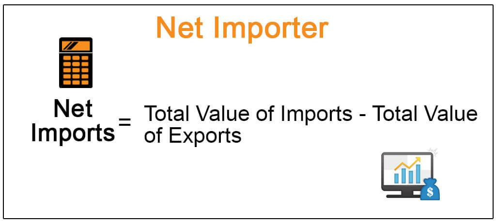

## Table of Contents

## What is a net importer?

A net importer is a country or region that buys more goods and services from other countries than it sells to them. This means that the value of its imports is greater than the value of its exports. For example, if a country imports $100 billion worth of goods and exports $80 billion, it is a net importer because it imports $20 billion more than it exports.

Being a net importer can have different effects on a country's economy. It can lead to a trade deficit, which means the country is spending more foreign currency than it is earning. This can affect the value of its own currency and may lead to borrowing from other countries. However, being a net importer also means that the country has access to a wide variety of goods and services from around the world, which can benefit its citizens and businesses.

## How is a net importer different from a net exporter?

A net importer and a net exporter are opposite in terms of trade. A net importer is a country that buys more stuff from other countries than it sells to them. This means they spend more on imports than they earn from exports. For example, if a country buys $150 billion in goods from other countries and only sells $100 billion, it's a net importer because it's buying $50 billion more than it's selling.

On the other hand, a net exporter is a country that sells more stuff to other countries than it buys from them. This means they earn more from exports than they spend on imports. For instance, if a country sells $200 billion in goods to other countries and only buys $150 billion, it's a net exporter because it's selling $50 billion more than it's buying.

These differences can affect a country's economy in different ways. A net importer might have a trade deficit, which could weaken its currency and lead to borrowing. But it also means the country has access to many products from around the world. A net exporter, however, might have a trade surplus, which can strengthen its currency and economy. But it might also depend more on selling to other countries and less on what it can buy from them.

## Can you provide examples of countries that are net importers?

The United States is a big example of a net importer. This means they buy a lot more stuff from other countries than they sell to them. In 2022, the U.S. spent over $3 trillion on imports but only made about $2.5 trillion from exports. This difference is called a trade deficit. Because of this, the U.S. needs to use more of its money to buy things from other places.

Another example is the United Kingdom. They also buy more from other countries than they sell. In recent years, the UK's imports were around £600 billion, while their exports were about £500 billion. This makes the UK a net importer too. Like the U.S., the UK has a trade deficit, which means they are spending more on foreign goods than they are [earning](/wiki/earning-announcement) from their own exports.

Countries like these have access to many different products from around the world, which can be good for their people and businesses. But it also means they need to be careful about how they manage their money and trade with other countries.

## What types of goods are commonly imported by net importers?

Net importers often buy a lot of different things from other countries. Common imports include things like cars, electronics, and clothes. These are things that people use every day and might be cheaper or better quality when bought from other places. For example, the United States imports a lot of cars from Japan and Germany because these countries are known for making good cars.

Another big group of imports are things like oil and natural gas. Many countries do not have enough of these resources at home, so they need to buy them from other places. For instance, the United States imports a lot of oil from countries in the Middle East and Canada. These energy resources are very important for running cars, heating homes, and powering factories.

Food and drinks are also commonly imported by net importers. This can include things like coffee, tea, and fruits that might not grow well in the country's climate. For example, the United Kingdom imports a lot of fresh produce from Spain and other countries in Europe. These imports help to give people more choices and keep grocery stores full of different kinds of food.

## What are the economic advantages of being a net importer?

Being a net importer can help a country's people and businesses in many ways. When a country imports more than it exports, it means they can buy things from all over the world. This gives people more choices in what they can buy, like different kinds of food, clothes, and electronics. For businesses, importing can mean they can get the parts and materials they need to make their products without having to make everything themselves. This can save them money and help them grow.

Also, being a net importer can help keep prices lower for everyone. When a country can buy things from other places, it can often find cheaper options. This means that things like cars, phones, and groceries might cost less than if everything had to be made at home. Lower prices can help people save money and spend it on other things they need or want. So, even though a country might spend more on imports than it earns from exports, being a net importer can still bring a lot of benefits to its economy.

## What are the potential disadvantages of being a net importer?

Being a net importer means a country buys more stuff from other countries than it sells. This can lead to a trade deficit, which means the country is spending more money than it is earning. When this happens, the country might need to borrow money from other countries or use its savings. Over time, this can make the country's money, or currency, weaker. A weaker currency can make things more expensive to buy from other places, which might make life harder for people and businesses.

Also, when a country relies a lot on imports, it can be risky. If something bad happens in the countries they buy from, like a war or a natural disaster, it can be hard to get the things they need. This can cause prices to go up and make it tough for businesses to keep making their products. Being a net importer can also mean that the country's own factories and farms might not grow as much, because they can't compete with cheaper imports. This can lead to fewer jobs at home and make the country's economy less strong.

## How does being a net importer affect a country's balance of trade?

When a country is a net importer, it means they are buying more stuff from other countries than they are selling. This makes their balance of trade negative, which is called a trade deficit. A trade deficit happens when the value of what a country imports is more than the value of what it exports. For example, if a country spends $100 billion on imports but only earns $80 billion from exports, it has a $20 billion trade deficit.

Having a trade deficit can affect a country's economy in different ways. It might make the country's money, or currency, weaker because they are spending more of it to buy things from other places. A weaker currency can make imports more expensive, which can be tough for people and businesses. But, a trade deficit also means the country has access to many different products from around the world, which can be good for its people and businesses. So, being a net importer and having a trade deficit can have both good and bad effects on a country's economy.

## What role do tariffs and trade agreements play for net importers?

Tariffs and trade agreements are important for net importers. Tariffs are taxes that a country puts on things they buy from other places. When a net importer puts tariffs on imports, it can make those things more expensive. This might help the country's own businesses because people might buy more stuff made at home instead of buying imports. But, tariffs can also make things more expensive for people and businesses in the country, which might not be good.

Trade agreements are deals between countries about buying and selling things. For net importers, trade agreements can help them get things from other countries more easily and sometimes cheaper. These agreements can help make sure that the country has access to the things it needs, like food or parts for making products. But, trade agreements can also make it harder for the country's own businesses to compete with imports if they don't have the same rules and protections. So, tariffs and trade agreements can have a big effect on how a net importer buys and sells things with other countries.

## How can a country transition from being a net importer to a net exporter?

To move from being a net importer to a net exporter, a country needs to focus on making more stuff to sell to other countries. This means they need to help their own businesses grow and make things that people in other countries want to buy. They can do this by investing in factories, farms, and technology. The government can also help by giving money or tax breaks to businesses that make things for export. Another way is to make sure workers have the skills they need to make good products. This can be done by improving schools and training programs.

It's also important for the country to look at what they are buying from other places and try to make those things at home instead. For example, if they are importing a lot of cars, they could start making their own cars. This might mean setting up new factories or helping existing ones grow. The country can also use tariffs to make imports more expensive, which might make people buy more stuff made at home. Trade agreements can help too, by making it easier to sell things to other countries. Over time, if the country can sell more than it buys, it can become a net exporter.

## What are the long-term economic implications of being a net importer?

Being a net importer for a long time can make a country's money weaker. When a country buys more from other places than it sells, it has to spend more of its own money. This can lead to a trade deficit, which means the country is spending more than it earns. Over time, this can make the country's currency less valuable. A weaker currency can make things from other countries more expensive, which might make life harder for people and businesses. It can also mean the country needs to borrow money from other places, which can add to its debts and make the economy less stable.

On the other hand, being a net importer can also have some good effects over the long term. It means the country has access to a lot of different products from around the world. This can give people more choices and help businesses get the things they need to make their own products. It can also keep prices lower because the country can buy things from places where they are cheaper. So, while being a net importer can make the country's money weaker and lead to borrowing, it can also help people and businesses by giving them more options and keeping costs down.

## How do global economic conditions influence a country's status as a net importer?

Global economic conditions can have a big effect on whether a country is a net importer or not. When the world economy is doing well, other countries might buy more stuff, which can help a country sell more of its own products. But if the world economy is not doing well, other countries might not buy as much, and the country might need to buy more from other places. Also, if the price of things like oil or food goes up around the world, a country might have to spend more money on imports, which can make it a bigger net importer.

Changes in the value of money, or currency, around the world can also change things. If a country's money gets weaker compared to other countries, it might be harder for them to sell their products to other places. This can make them buy more from other countries and become a bigger net importer. On the other hand, if their money gets stronger, it might be easier to sell their products and they might not need to buy as much from other places. So, global economic conditions can make a big difference in whether a country is a net importer or not.

## What strategies can net importers use to mitigate risks associated with import dependency?

Net importers can take steps to lower the risks of relying too much on other countries for things they need. One way is to make sure they don't depend too much on just one country for imports. If they buy things from many different places, it's less risky if something bad happens in one of those countries. Another way is to help their own businesses grow so they can make more things at home. The government can give money or tax breaks to these businesses to help them make the things people need, so the country doesn't have to buy as much from other places.

Another strategy is to keep some of the things they need in storage, so they have them if there's a problem with getting imports. This can help make sure people and businesses still have what they need, even if imports are delayed. Also, net importers can use trade agreements to make it easier and cheaper to get things from other countries. These agreements can help make sure the country has access to the things it needs, even if global economic conditions change. By using these strategies, net importers can lower the risks that come with relying on other countries for what they need.

## What is the concept of Understanding Net Importers?

A net importer is characterized as a nation that consistently imports more goods from foreign markets than it exports. This situation is quantitatively defined by a trade deficit, where the value of a country’s total imports exceeds the value of its total exports. The trade balance can be expressed with the formula:

$$
\text{Trade Balance} = \text{Total Exports} - \text{Total Imports}
$$

When this balance is negative, a country is considered a net importer. The United States is a prominent example of a net importer. It showcases strong consumer demand that drives substantial imports, including electronics, machinery, and automobiles. Another notable example is India, which has increasing import levels including significant amounts of [crude oil](/wiki/crude-oil) and gold, thereby contributing to its status as a net importer.

There are both advantages and disadvantages to being a net importer. One of the main advantages is the broad array of consumer choices. Greater access to diverse goods and services from around the world can improve living standards and drive competitive pricing, benefiting consumers. Foreign products often complement domestic production, enhancing the diversity of products available on the market.

However, reliance on foreign goods may lead to potential downsides. A persistent trade deficit can create economic vulnerabilities. Dependence on imports may expose the country to price fluctuations in international markets, affecting economic stability. Moreover, it can lead to a decline in domestic industries if they are unable to compete with imported goods, potentially impacting local employment and industrial capabilities.

Countries often need to find a balance between the benefits of foreign imports and maintaining robust domestic industries to ensure they are not overly vulnerable to international market dynamics. Managing this balance effectively requires strategic economic policies that may involve tariffs, trade agreements, and fostering local industry growth to mitigate dependency.

## References & Further Reading

[1]: ["Advances in Financial Machine Learning"](https://www.amazon.com/Advances-Financial-Machine-Learning-Marcos/dp/1119482089) by Marcos Lopez de Prado

[2]: ["Evidence-Based Technical Analysis: Applying the Scientific Method and Statistical Inference to Trading Signals"](https://www.amazon.com/Evidence-Based-Technical-Analysis-Scientific-Statistical/dp/0470008741) by David Aronson

[3]: ["Machine Learning for Algorithmic Trading"](https://github.com/stefan-jansen/machine-learning-for-trading) by Stefan Jansen

[4]: ["Quantitative Trading: How to Build Your Own Algorithmic Trading Business"](https://www.amazon.com/Quantitative-Trading-Build-Algorithmic-Business/dp/1119800064) by Ernest P. Chan

[5]: Krugman, P. R., & Obstfeld, M. (2008). ["International Economics: Theory and Policy"](https://books.google.com/books/about/International_Economics.html?id=NZnk5C2r8qEC) (9th Edition). Pearson Education.

[6]: Bhagwati, J. N., & Panagariya, A. (2003). ["The Economics of Preferential Trade Agreements"](https://scholarship.law.columbia.edu/books/378/) in Oxford Economic Papers. Oxford University Press.

[7]: ["The Oxford Handbook of International Trade"](https://academic.oup.com/edited-volume/45221) edited by Lisa L. Martin