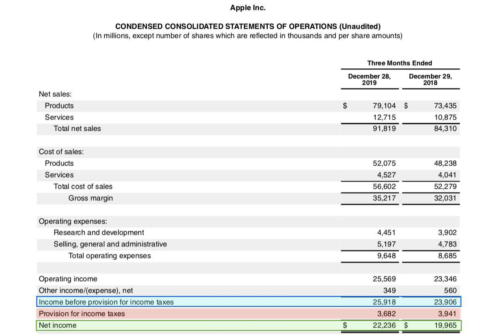

In the evolving landscape of finance, understanding the intersection of taxes, financial calculations, net income, and algorithmic trading is crucial. As financial markets become increasingly complex, the interconnectedness of these elements is evident, influencing decision-making processes at various levels. This article aims to explore these topics, providing insight into how they interconnect and their impact on financial decision-making.

Taxes and financial calculations are fundamental components that affect every individual, business, and fintech entity. Net income, which is essentially the earnings of a company after accounting for all expenses and taxes, serves as a key indicator of financial health and performance. Thus, comprehending its calculation is vital for ensuring profitable business operations and informed investment decisions. Net income is calculated as follows:



$$
\text{Net Income} = \text{Total Revenue} - (\text{Cost of Goods Sold} + \text{Depreciation} + \text{Interest Expenses} + \text{Taxes})
$$

A deep understanding of these elements is essential for optimizing tax liabilities and improving net income outcomes.

Algorithmic trading, on the other hand, exemplifies how financial markets leverage technology to execute trades at high speed and frequency. The strategies involved in algorithmic trading rely heavily on a comprehensive grasp of market dynamics, tax implications, and economic indicators. Financial calculations play a pivotal role here, as they aid in developing algorithms that maximize profitability by mitigating costs, including taxes.

By exploring these concepts, traders, businesses, and fintech entities can better navigate the complexities of modern financial systems. Emphasizing a clear understanding of these aspects in financial planning and algorithmic trading strategies allows for more effective management and optimization. Consequently, entities can capitalize on opportunities to enhance net income while strategically managing tax obligations. Through thoughtful integration of these components, stakeholders in the financial ecosystem can ensure sustained financial well-being and growth.

## Table of Contents

## Understanding Net Income and Tax Calculations

Net income after taxes (NIAT) is a fundamental metric in evaluating a company's financial performance. It represents the earnings a company retains after all expenses, including taxes, have been deducted from its total revenue. Understanding the calculation of net income is imperative for those assessing a company's profitability and financial health.

To compute net income, one must subtract various costs from the company's total revenues. The formula for calculating net income is as follows:

$$
\text{Net Income} = \text{Total Revenues} - \text{Cost of Goods Sold (COGS)} - \text{Depreciation} - \text{Interest Expenses} - \text{Taxes}
$$

1. **Total Revenues**: This is the sum of all earnings generated by the company from its operations.

2. **Cost of Goods Sold (COGS)**: These are the direct costs attributable to the production of goods or services sold by a company. COGS is crucial in determining the gross profit, which is the initial step in calculating net income.

3. **Depreciation**: This reflects the allocation of the cost of tangible assets over their useful lives. Depreciation needs to be accounted for as it affects the net book value of assets and net income.

4. **Interest Expenses**: This involves the cost incurred by a company for borrowed funds. It is deductible from the revenue to compute taxable income, impacting net income.

5. **Taxes**: The last deduction is the taxes paid, which can vary based on the jurisdiction and effective tax rates applicable to the business.

Accurate financial calculations are essential for correct net income assessment, as errors can mislead stakeholders about a company's financial condition. Incorrect assessments can alter investment decisions and strategic business planning.

Strategies to enhance net income often focus on efficient financial management and tax optimization. Companies may engage in cost-control measures, seek tax incentives, or optimize their capital structures to manage interest expenses effectively. By optimizing these factors, businesses can improve their profitability and maintain a competitive edge.

Financial management also includes exploring tax deductions and credits as a means of optimizing tax burdens and improving net income. Taking advantage of available tax allowances can substantially benefit a company's financial outcome. For instance, tax-loss harvesting can offset capital gains, thereby reducing taxable income.

In conclusion, understanding and accurately calculating net income is pivotal for businesses and investors alike. It allows for better decision-making and effective financial planning, ultimately contributing to a company’s long-term success and sustainability.

## The Role of Taxes in Financial Planning

Taxes play a crucial role in financial planning for both individuals and corporations, shaping the landscape of income retention and capital allocation. Understanding different tax policies and rates is essential for effective decision-making. Both domestic and international tax implications must be considered, as they can substantially affect business operations, profitability, and investment strategies.

Different tax systems, such as progressive, regressive, and proportional taxes, impact income retention in various ways. Progressive taxes, where the tax rate increases with income, can reduce disposable income for individuals and affect consumer spending patterns. For corporations, such tax systems may influence decisions on reinvestment and expansion, as higher income levels result in increased tax liabilities.

For businesses, corporate tax rates directly affect the amount of capital available for reinvestment. Lower tax rates can enhance a company's ability to retain earnings, which can be used for business development and expansion efforts. Conversely, higher tax rates might lead to reduced capital availability, hampering growth and innovation.

Effective tax optimization strategies are essential for minimizing liabilities and maximizing profitability. One common strategy is tax deferral, whereby individuals or businesses postpone tax payments to a later date, allowing for the potential of investments to grow pre-tax. Another technique is tax-efficient investing, which involves selecting investments that generate income types subject to favorable tax treatment, such as qualified dividends or long-term capital gains.

Understanding global tax differences is increasingly important in today's interconnected economy. Different countries have varying tax rates and treaties, which can influence international trading and investment strategies. For instance, businesses may choose to operate in countries with lower tax rates to benefit from higher after-tax profits. Additionally, tax treaties between nations can prevent double taxation, thus enhancing cross-border investment opportunities.

In conclusion, a comprehensive understanding of tax policies and rates is indispensable for successful financial planning. By employing effective tax optimization strategies and considering international tax implications, individuals and corporations can improve income retention and ensure better capital availability for growth and development.

## Implications of Tax Rates on Algorithmic Trading

Algorithmic trading, characterized by the use of automated systems and complex algorithms to execute trades at high speeds, is increasingly affected by changes in tax rates. These tax implications are pertinent for traders utilizing algorithmic strategies due to the sensitivity of these systems to cost structures, which include taxes.

Transaction taxes, such as the Financial Transaction Tax (FTT), can significantly impact the profitability of high-frequency trading ([HFT](/wiki/high-frequency-trading-strategies)) strategies. HFT involves executing a large number of trades in mere microseconds, aiming to capitalize on small price discrepancies. With thin profit margins, even slight increases in transaction costs due to taxes can render these strategies less viable. Understanding the effective tax rate is vital for algorithmic traders to accurately compute the net gains from trading activities and align their strategies accordingly.

Algorithmic systems must be designed to adapt to different tax environments to maintain profitability. This adaptability requires integrating tax considerations into the algorithms, which may involve optimizing trade execution to minimize tax burden. For instance, if a new transaction tax is introduced or increased, algorithms need to adjust trading volumes, frequencies, or even select different markets or instruments that are subject to lower tax liabilities. This real-time adaptability ensures that the algorithms continue to generate optimal returns despite fluctuating tax regimes.

Moreover, the choice between different trading strategies, such as [market making](/wiki/market-making), statistical [arbitrage](/wiki/arbitrage), or [momentum](/wiki/momentum) trading, comes with distinct tax implications, affecting the overall tax efficiency of a trading operation. Algorithmic traders must evaluate these implications and might prefer strategies that offer better tax efficiency. For example, long-term trading strategies could incur lower tax rates compared to those involving rapid, short-term trades, depending on the jurisdiction's tax laws related to capital gains.

Fluctuations in tax rates can also alter the outcomes and performance of trading strategies. For instance, an increase in short-term capital gains tax could decrease the profitability of strategies aimed at quick turnovers. An illustrative Python example can be used to simulate how different tax rates affect trading strategy outcomes:

```python
def calculate_after_tax_profit(gross_profit, tax_rate):
    return gross_profit * (1 - tax_rate)

# Example for two different tax scenarios
gross_profit = 100000  # Example gross profit from trading in USD
short_term_tax_rate = 0.35  # 35% short-term capital gains tax
long_term_tax_rate = 0.20   # 20% long-term capital gains tax

profit_short_term = calculate_after_tax_profit(gross_profit, short_term_tax_rate)
profit_long_term = calculate_after_tax_profit(gross_profit, long_term_tax_rate)

print("After-tax profit (short-term): $", profit_short_term)
print("After-tax profit (long-term): $", profit_long_term)
```

This code shows how after-tax profits vary based on the applied tax rates, highlighting the importance of tax-rate consideration in strategy selection. Strategic tax management thus becomes an essential component of [algorithmic trading](/wiki/algorithmic-trading), ensuring that each executed trade is optimized to maximize profits while minimizing the tax liabilities encountered.

## Optimization Strategies in Net Income and Algo Trading

Optimization is key to enhancing net income within financial and tax planning. By strategically aligning financial practices and leveraging technology, individuals and corporations can enhance their net income outcomes through various optimization strategies.

Algorithmic trading plays a pivotal role in enhancing financial returns by utilizing advanced computational algorithms to execute trades. By integrating specific optimization strategies, traders can maximize efficiency and profitability. Techniques such as tax-loss harvesting and using tax-deferred accounts are crucial components of effective financial planning.

### Tax-Loss Harvesting

Tax-loss harvesting involves selling securities at a loss to offset capital gains tax liabilities from profitable investments. This strategy can be particularly beneficial in reducing taxable income and enhancing after-tax returns. The strategy can be modeled using the following Python function:

```python
def tax_loss_harvesting(portfolio):
    total_loss = 0
    for security in portfolio:
        if security['current_price'] < security['purchase_price']:
            loss = security['purchase_price'] - security['current_price']
            total_loss += loss
            # Assume selling the security
            print(f"Sell {security['name']} to realize a loss of {loss}")
    return total_loss

portfolio = [
    {'name': 'Stock A', 'purchase_price': 150, 'current_price': 130},
    {'name': 'Stock B', 'purchase_price': 100, 'current_price': 110},
]

total_losses = tax_loss_harvesting(portfolio)
print(f"Total Losses Harvested: {total_losses}")
```

This function demonstrates how to identify and sell loss-making securities to offset gains, thereby optimizing net income.

### Tax-Deferred Accounts

Using tax-deferred accounts such as a 401(k) or an Individual Retirement Account (IRA) allows investors to postpone tax payments on contributions and investment earnings until withdrawal. This strategy helps optimize net income by reducing current taxable income.

### Tax-Efficient Trading

Adopting tax-efficient trading strategies ensures the maximization of after-tax returns. These strategies involve managing both the timing of trades and the holding period to minimize capital gains taxes. Traders may utilize long-term capital gains rates, which are typically lower than short-term rates, to enhance returns.

Incorporating tax-efficient trading strategies into algorithmic trading involves creating algorithms that not only maximize profit but also minimize tax liabilities. Traders can adjust algorithms to account for different tax rates on short-term and long-term gains, enhancing profitability across various tax regimes.

### Adaptability to Evolving Tax Policies

Adapting to ever-changing tax policies is crucial, particularly in a digital economy characterized by rapid regulatory and technological shifts. Algorithms must be flexible and capable of modifying trading strategies in response to new tax laws or policies. This adaptability allows traders to maintain optimal net income outcomes despite evolving financial landscapes.

In summary, optimizing net income through specific strategies and insights into algorithmic trading is essential in financial and tax planning. By employing techniques like tax-loss harvesting and utilizing tax-deferred accounts, alongside adopting tax-efficient trading strategies, traders and businesses can significantly enhance their after-tax returns. This adaptiveness is particularly relevant as tax policies and financial landscapes continue to evolve, ensuring sustained financial success.

## Conclusion

Navigating taxes, financial calculations, net income, and algorithmic trading requires a multifaceted understanding. Individuals and corporations must integrate tax considerations into their strategic planning to ensure optimal financial health. The intricate relationships among these elements influence both short-term and long-term financial outcomes, underscoring the necessity of thorough comprehension and strategic application.

Firstly, the integration of tax considerations into financial strategies is vital. For individuals, this means leveraging tax deductions, credits, and deferrals to enhance disposable income. For corporations, it involves structuring entities and transactions in ways that minimize tax liabilities while ensuring compliance with tax laws. A proactive tax strategy not only reduces liabilities but also frees up capital for investment and growth.

Comprehending these interrelated concepts also enhances trading strategies. Algorithmic trading, which relies on quantitative analysis and automated execution, must account for transaction costs, including taxes. Effective trading algorithms can adjust for varying tax regulations to optimize trade execution and enhance net returns. Consider, for instance, the impact of different tax rates on capital gains versus ordinary income, which can alter the profitability of trading strategies.

Moreover, strategic tax management and algorithmic trading optimization can significantly contribute to maximizing profitability. Tax-loss harvesting, deferment strategies, and other forms of tax optimization can improve after-tax returns substantially. In algorithmic trading, adaptive strategies that respond to tax rate fluctuations can sustain or enhance profitability by mitigating potential risks associated with tax changes.

As the financial landscape continues to evolve with technological advancements and regulatory changes, staying informed on these critical areas is essential for sustained financial success. Continuous education and adaptation to new fiscal policies, tax laws, and trading technologies will equip individuals and corporations to navigate complexities effectively, thereby achieving stable and enhanced financial outcomes in a dynamic environment.

## References & Further Reading

[1]: ["Taxation in Theory and Practice: Selected Essays"](https://worldscientific.com/worldscibooks/10.1142/11407) by Richard A. Musgrave

[2]: Lopez de Prado, Marcos. ["Advances in Financial Machine Learning"](https://www.amazon.com/Advances-Financial-Machine-Learning-Marcos/dp/1119482089). Wiley, 2018.

[3]: Petraś, Martin. ["Tax Implications of Algorithmic Trading"](https://link.springer.com/article/10.1007/s10551-018-3921-3), ResearchGate, 2017.

[4]: Chan, Ernest P. ["Quantitative Trading: How to Build Your Own Algorithmic Trading Business"](https://github.com/ftvision/quant_trading_echan_book). Wiley, 2009.

[5]: Aronson, David R. ["Evidence-Based Technical Analysis: Applying the Scientific Method and Statistical Inference to Trading Signals"](https://www.amazon.com/Evidence-Based-Technical-Analysis-Scientific-Statistical/dp/0470008741). Wiley, 2006.