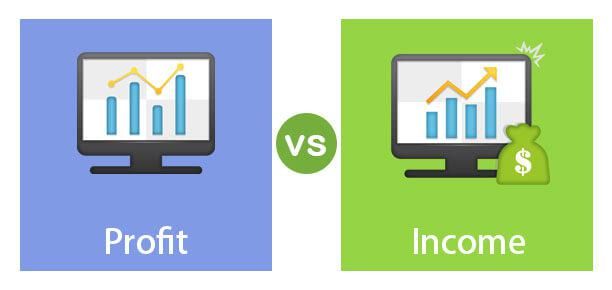

Understanding key financial terms and concepts is essential in finance, especially for making informed trading and investment decisions. Among these terms, 'net income' and 'profit' are pivotal, particularly in algorithmic trading. This article examines these financial metrics and their relevance in algorithmic trading.

Algorithmic trading, often referred to as algo trading, involves using sophisticated algorithms and computing power to automate trading decisions based on predefined criteria. This approach allows traders to capitalize on market opportunities by executing trades with speed and precision, minimizing the impact of human emotions. Financial metrics such as net income and profit play a crucial role in guiding these algorithmic decisions. Accurate assessment of these figures enables algorithms to evaluate company performance and determine optimal trading strategies.



Throughout this article, definitions, differences, and applications of net income and profit will be clarified, focusing on their roles in automated and algorithmic trading. Understanding these concepts not only enhances trading strategies but also supports improved financial outcomes.

## Table of Contents

## Understanding Net Income and Profit

Net income, often referred to as net profit or net earnings, represents the total earnings of a company after all expenses have been deducted from its revenue. This calculation entails subtracting costs that include taxes, interest, operating expenses, and any other expenses incurred during the financial period from the company's total revenue. The formula for calculating net income is as follows:

$$

\text{Net Income} = \text{Total Revenue} - (\text{Total Expenses} + \text{Taxes} + \text{Interest})
$$

Profit, on the other hand, is a broader term that refers to the income that remains after subtracting various levels of expenses from revenue. It encompasses different measures, including gross profit, operating profit, and, ultimately, net income.

- **Gross Profit** is calculated by subtracting the cost of goods sold (COGS) from total revenue. It provides insight into a company's efficiency in producing and selling its goods.

$$
\text{Gross Profit} = \text{Total Revenue} - \text{Cost of Goods Sold (COGS)}
$$

- **Operating Profit** takes into account both the gross profit and operating expenses, which include administrative and selling expenses. It reflects the company’s ability to generate profit from its core business operations.

$$
\text{Operating Profit} = \text{Gross Profit} - \text{Operating Expenses}
$$

Net income, being a specific type of profit, represents the "bottom line" of a company’s financial statements. It is a critical measure for investors as it indicates the company’s profitability and efficiency in managing its expenses relative to its revenue. Furthermore, net income is often utilized to calculate earnings per share (EPS), a key indicator for valuing a company’s profitability on a per-share basis:

$$

\text{Earnings Per Share (EPS)} = \frac{\text{Net Income}}{\text{Number of Outstanding Shares}}
$$

Understanding these terms is crucial for analyzing a company’s financial health and performance, as each profit measure provides insights into different aspects of the business’s operations and financial efficiency.

## Net Income vs. Profit with Examples

While net income and profit are sometimes used interchangeably, they represent different aspects of a company's financial performance. Profit can be broken down into various measures, such as gross profit, operating profit, and net profit (commonly known as net income), each providing unique insights into different stages of financial evaluation.

Gross profit is the income remaining after subtracting the cost of goods sold (COGS) from total revenue. It can be expressed as:

$$
\text{Gross Profit} = \text{Revenue} - \text{COGS}
$$

This figure provides insight into a company's efficiency in producing goods or services before other operating expenses are deducted.

Operating profit, also known as operating income, considers operating expenses such as rent, utilities, and wages. It includes gross profit and subtracts all operating expenses, offering a picture of how well the core business activities are managed:

$$
\text{Operating Profit} = \text{Gross Profit} - \text{Operating Expenses}
$$

Finally, net income is the most comprehensive measure of profit, representing the total earnings available to shareholders after all expenses, including taxes and interest, have been deducted from total revenue. It can be calculated as follows:

$$
\text{Net Income} = \text{Operating Profit} - \text{Taxes} - \text{Interest Expenses}
$$

For example, a company may report a high gross profit due to effective production strategies. However, significant administrative costs and high tax liabilities can result in a substantially lower net income. Suppose a company has a revenue of $1 million, COGS of $400,000, operating expenses of $300,000, taxes of $50,000, and interest expenses of $30,000. Here's a breakdown of its profits:

1. **Gross Profit**: $\$1,000,000 - \$400,000 = \$600,000$
2. **Operating Profit**: $\$600,000 - \$300,000 = \$300,000$
3. **Net Income**: $\$300,000 - \$50,000 - \$30,000 = \$220,000$

This example illustrates how different profit measures serve as indicators at various financial stages, and factors like high expenses and taxes can substantially reduce net income, even when gross profit appears favorable. Understanding these distinctions is crucial for accurately evaluating a company's financial health and making informed investment decisions, particularly within contexts like [algorithmic trading](/wiki/algorithmic-trading) where precise financial metrics are vital.

## Basics of Algorithmic Trading

Algorithmic trading, commonly known as algo trading, is a method of executing trades utilizing automated and pre-programmed trading instructions. These instructions are based on variables such as timing, price, and [volume](/wiki/volume-trading-strategy), and they are designed to achieve the best possible trade execution. By automating trading processes, algorithmic trading minimizes human intervention, thereby reducing the impact of human emotions and biases on trading decisions.

Fundamentally, algorithmic trading relies on sophisticated algorithms that follow a set of rules to detect profitable trading opportunities. These rules can be based on historical data, quantitative analysis, or statistical computations that predict market movements. By leveraging technology, algo trading systems can analyze vast datasets at high speeds, making trading decisions within milliseconds. This speed advantage allows traders to capitalize on market inefficiencies and execute orders at optimal prices, often resulting in improved profit margins.

For example, a common algorithmic trading strategy is the implementation of a mean reversion strategy. This is based on the hypothesis that high and low prices are temporary and will revert to their mean values over time. An algorithm designed for mean reversion might identify stocks that have significantly deviated from their historical average prices and execute trades anticipating a return to the mean. Below is a simple Python code snippet illustrating a basic mean reversion strategy:

```python
import numpy as np

def mean_reversion_strategy(prices, window_size, threshold):
    moving_average = np.convolve(prices, np.ones(window_size)/window_size, mode='valid')
    signal = np.zeros(len(prices))

    for i in range(window_size, len(prices)):
        if prices[i] < moving_average[i-window_size] - threshold:
            signal[i] = 1  # Buy signal
        elif prices[i] > moving_average[i-window_size] + threshold:
            signal[i] = -1  # Sell signal

    return signal
```

Algorithmic trading is not limited to simple strategies but extends to complex high-frequency trading algorithms that operate in microsecond timeframes and involve multiple asset classes and markets. By continuously executing trades without the delay inherent in manual trading, these systems can efficiently exploit pricing discrepancies across different markets.

In conclusion, the automation and precision enabled by algorithmic trading present significant opportunities for enhancing trading efficiency and profitability, ultimately transforming the landscape of modern financial markets.

## Role of Financial Metrics in Algorithmic Trading

In algorithmic trading, financial metrics like net income and profit are integral components for developing and optimizing trading algorithms. These metrics provide quantitative insights into a company’s financial health, enabling algorithms to assess company performance and make informed trading decisions. By incorporating real-time financial data, algorithms are capable of executing trades almost instantaneously after the impact of financial announcements, thus seizing market opportunities that might not be apparent through a manual trading approach.

Accurate financial metrics serve as a foundation for algorithmic models, where net income reflects the company's profitability after all expenses, including taxes and interest, have been accounted for. This measure helps in evaluating the overall efficiency and profitability of a company. Similarly, the broader term "profit" encompasses various levels, such as gross and operating profit, which indicate different stages of income generation relative to specific costs. These discrete measures can inform different trading strategies; for instance, high gross profit with lower net income might indicate significant operational costs or tax burdens, suggesting a deeper financial analysis is necessary.

Algorithmic trading systems leverage these financial metrics to construct trading strategies that optimize profitability. For example, a trading algorithm might be programmed to purchase stocks upon identifying a company with improving profit margins and positive net income trends, anticipating an upward price trajectory post-financial announcement. Moreover, these systems can utilize [machine learning](/wiki/machine-learning) techniques to predict future financial performance based on historical data, further minimizing the latency between analysis and execution.

Python serves as a preferred language for building such algorithmic systems due to its robust libraries for data analysis and financial computations. The use of libraries like NumPy and pandas facilitates the handling of large financial datasets, while machine learning libraries such as scikit-learn enable predictive modeling.

For instance, a simple algorithm may analyze a company's quarterly financials to decide on trading actions:

```python
import pandas as pd

# Assume df is a DataFrame containing financial data with 'Net Income' and 'Gross Profit' columns
def assess_company_performance(df):
    criteria = (df['Net Income'].pct_change() > 0) & (df['Gross Profit'].pct_change() > 0)
    return criteria

# Determine if a stock meets the criteria for buying based on financial metrics
def decide_trade_actions(stock_data):
    if assess_company_performance(stock_data).iloc[-1]:
        return "Buy"
    else:
        return "Hold"

# Example usage with fictional data
data = {'Net Income': [1.2, 1.3, 1.5], 'Gross Profit': [3.1, 3.3, 3.5]}
stock_df = pd.DataFrame(data)
action = decide_trade_actions(stock_df)
print(action)  # Output: "Buy"
```

The ability of algorithmic trading to enhance profitability by leveraging financial metrics efficiently hinges on the quality and timeliness of data, as well as the robustness of trading algorithms. Accurate and real-time interpretation of financial metrics not only improves decision-making but also capitalizes on short-lived market efficiencies following public financial disclosures. This capability underscores the importance of financial metrics in developing algorithmic trading strategies that strive for optimal performance and risk management.

## Advantages and Disadvantages of Algorithmic Trading

Algorithmic trading, commonly known as algo trading, offers significant advantages, making it an integral component of modern financial markets. One of its primary benefits is speed. Algorithms can execute trades orders of magnitude faster than a human trader, effectively taking advantage of minute-by-minute fluctuations in the market. This speed enables traders to enter and [exit](/wiki/exit-strategy) positions more rapidly and efficiently, optimizing the chances of achieving profitable trades. Moreover, algorithms provide precision in executing trades. By following predefined criteria, algorithms eliminate human errors and ensure that trades adhere to specific strategies without deviation, which is critical in volatile markets where manual execution might falter.

Another advantage lies in the ability to process and analyze vast data sets efficiently. Algorithmic trading leverages advanced computational techniques and machine learning algorithms to sift through data streams, identify complex patterns, and make data-driven trading decisions. This capacity to handle large volumes of data allows algorithms to identify trading opportunities that might be invisible to human traders. The ability to backtest trading strategies against historical data is another benefit, enabling the refinement of strategies for better performance.

However, algorithmic trading also presents several disadvantages and challenges. The initial setup and development of algorithms require significant financial investment and technical expertise. Developing a successful trading algorithm involves not only coding skills but also deep knowledge of financial markets, making it a resource-intensive process. This high barrier to entry can be prohibitive for individual traders and smaller firms.

Moreover, algo trading is heavily dependent on technology, making it susceptible to systemic risks, such as software bugs, network failures, and cyber threats. Any technical glitch can lead to substantial financial losses, as seen in past instances where malfunctioning algorithms caused market disruptions. Additionally, algorithmic trading strategies face potential risks in periods of market [volatility](/wiki/volatility-trading-strategies). Rapid price movements can trigger stop-loss orders, leading to losses faster than anticipated.

Another concern is the reliance on financial metrics. Algorithms need accurate and timely data to function optimally. Inaccuracies or delays in financial data can negatively impact trading decisions, potentially leading to incorrect trade execution. Thus, a robust system for real-time data acquisition and processing is essential.

In conclusion, while algorithmic trading offers numerous advantages like enhanced speed, precision, and data-processing capabilities, it is not without its challenges. Traders and investors must weigh these benefits against the inherent risks and technical demands. Understanding and effectively utilizing financial metrics is crucial to maximizing the potential advantages of algorithmic trading while mitigating its disadvantages.

## Conclusion

Net income and profit serve as crucial financial metrics in the landscape of algorithmic trading, influencing strategies and decision-making processes within this domain. These metrics provide insight into a company's financial health, allowing traders to evaluate potential investment opportunities with precision. By understanding and leveraging these terms, algorithmic trading systems can optimize their trading strategies, resulting in improved financial outcomes.

Advanced algorithms utilize net income and profit data to execute trades effectively, adapting to the ever-changing market dynamics. For example, algorithms can be coded to prioritize companies with high net income growth or robust profit margins, optimizing the selection process to focus on financially sound entities. Such strategic decisions have a significant impact on enhancing profit margins through well-timed trades, especially during earnings announcements or notable financial disclosures.

As algorithmic trading continues to evolve, the necessity for deep financial expertise becomes increasingly important. The complexity of developing robust algorithms that can interpret and act on financial metrics demands a strong foundation in finance. Moreover, the ongoing advancements in trading technology continually raise the bar for algorithm sophistication, pressing the need for continual learning and adaptation.

In conclusion, understanding net income and profit is vital to refining trading strategies within algorithmic frameworks. The fusion of financial acumen with advanced computational techniques offers substantial opportunities for optimizing trading performance. As the field progresses, the emphasis on rigorous financial analysis and cutting-edge algorithm development will continue to grow, reinforcing the importance of these financial metrics in the future of trading.

## References & Further Reading

[1]: Bergstra, J., Bardenet, R., Bengio, Y., & Kégl, B. (2011). ["Algorithms for Hyper-Parameter Optimization."](https://papers.nips.cc/paper/4443-algorithms-for-hyper-parameter-optimization) Advances in Neural Information Processing Systems 24.

[2]: ["Advances in Financial Machine Learning"](https://www.amazon.com/Advances-Financial-Machine-Learning-Marcos/dp/1119482089) by Marcos Lopez de Prado

[3]: ["Evidence-Based Technical Analysis: Applying the Scientific Method and Statistical Inference to Trading Signals"](https://www.amazon.com/Evidence-Based-Technical-Analysis-Scientific-Statistical/dp/0470008741) by David Aronson

[4]: ["Machine Learning for Algorithmic Trading"](https://github.com/stefan-jansen/machine-learning-for-trading) by Stefan Jansen

[5]: ["Quantitative Trading: How to Build Your Own Algorithmic Trading Business"](https://books.google.com/books/about/Quantitative_Trading.html?id=j70yEAAAQBAJ) by Ernest P. Chan