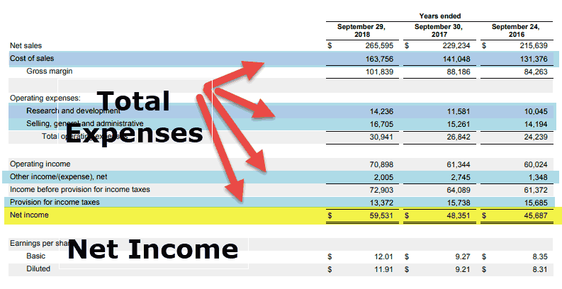

Understanding financial metrics is crucial in the world of finance, as these metrics serve as fundamental indicators of a company's economic health and operational efficiency. Among these, net income and profit are particularly significant, providing insights into a company's overall performance and its ability to generate wealth for shareholders. In algorithmic trading, where precision and speed govern decision-making processes, the accurate calculation and interpretation of net income and profit become indispensable.

Net income, considered the "bottom line," represents the total earnings of a company after deducting expenses, taxes, and other costs from its total revenue. Profit, on the other hand, can vary in definition, encompassing gross profit, operating profit, and net profit, each offering different layers of insight into a company’s financial dynamics. These components are critical as they influence investment analyses and trading strategies, guiding traders on the financial viability and sustainability of companies.



The article aims to demystify these essential financial concepts, offering clarity on their relevance and use in algorithmic trading. By understanding the differences between various forms of profit and net income, traders and investors can cultivate more nuanced strategies, enhancing their market responsiveness and decision-making accuracy. Financial metrics, when integrated into algorithmic trading frameworks, allow for the automation of trading strategies based on specific financial criteria, potentially unlocking a competitive edge in financial markets.

In sum, this discourse seeks to elucidate the importance of net income and profit calculations both within traditional finance and their revolutionary application in algorithmic trading. By gaining a thorough grasp of these concepts, readers can optimize their trading strategies, thereby achieving more favorable outcomes in their financial endeavors.

## Table of Contents

## Understanding Key Financial Metrics: Net Income and Profit

Net income and profit are fundamental financial metrics essential for assessing a company's performance and financial health. These metrics are pivotal in financial reporting as they provide insights into a company's ability to generate earnings relative to its expenses and other costs involved in its operation.

**Net Income Defined**: Net income, often referred to as the "bottom line," is the amount of profit a company retains after subtracting all expenses, taxes, and costs from its total revenue. It is calculated using the formula:

$$
\text{Net Income} = \text{Total Revenue} - (\text{Total Expenses} + \text{Interest} + \text{Taxes})
$$

Net income is a critical indicator of profitability and serves as an essential measure for investors and analysts to determine a company's profitability and operational efficiency over a specific period.

**Different Types of Profit**: Profit can be segmented into various types, each serving a unique purpose in financial analysis:

1. **Gross Profit**: This is the profit a company makes after deducting the costs of producing and selling its products, or the costs involved in providing its services. It is calculated as:

$$
\text{Gross Profit} = \text{Net Sales} - \text{Cost of Goods Sold (COGS)}
$$

Gross profit helps in assessing the efficiency of production processes and pricing strategies.

2. **Operating Profit**: Also known as operating income, this metric takes into account all costs of operations except interest and taxes. It is computed by subtracting operating expenses from gross profit:

$$
\text{Operating Profit} = \text{Gross Profit} - \text{Operating Expenses}
$$

Operating profit provides insight into the core business operations' efficiency before interest and tax considerations.

3. **Net Profit**: Often synonymous with net income, net profit is the remaining profit after all expenses are deducted from total revenues, indicating the ultimate profitability of a company. It reflects the comprehensive income covering all revenue streams and expenses.

**Role in Evaluating Financial Health**: These financial metrics collectively offer valuable information about a company's profitability and operational capacity. Gross profit assesses production efficiency; operating profit evaluates the efficacy of core business functions, while net income provides a holistic view of financial performance. Together, they enable investors, analysts, and stakeholders to make informed decisions about investing, managing, or evaluating the business's future prospects. These metrics are often used in ratio analysis, such as profit margin calculations, which can compare companies within the same industry and help ascertain financial stability and operational performance. 

Understanding these metrics is crucial for a comprehensive financial analysis, aiding in the enhancement of trading strategies and investment decisions.

## Differences Between Net Income and Profit

Net income and profit are terms often used interchangeably, but they encapsulate different financial aspects, each serving distinct purposes in financial analysis. Understanding these differences is crucial for accurate financial interpretation and decision-making.

**Common Misconceptions**

A common misconception is treating net income and profit as identical measures. While both represent financial earnings, their scope and calculation differ, leading to varied implications for financial analysis. Net income is often perceived as a comprehensive measure of profitability, but this can overlook detailed insights provided by the different layers of profit, such as gross profit and operating profit.

**Differentiating Gross Profit, Operating Profit, and Net Income**

To differentiate:

1. **Gross Profit**: This measures a company's efficiency in using its labor and supplies in production. Gross profit is calculated as:
$$
   \text{Gross Profit} = \text{Revenues} - \text{Cost of Goods Sold (COGS)}

$$
   It reflects the basic profitability of core business activities without accounting for other operational costs.

2. **Operating Profit**: Also known as operating income, this metric considers the gross profit and subtracts operating expenses, such as wages and utilities. It is calculated as:
$$
   \text{Operating Profit} = \text{Gross Profit} - \text{Operating Expenses}

$$
   Operating profit indicates how well the company is managing its expenses aside from production and can highlight operational efficiency.

3. **Net Income**: This metric is the bottom line, encompassing all revenues and expenditures, including taxes and interest. It is expressed as:
$$
   \text{Net Income} = \text{Revenues} - (\text{COGS} + \text{Operating Expenses} + \text{Taxes} + \text{Interest})

$$
   Net income provides a comprehensive view of a company's profitability after accounting for all expenses and is often used for assessing overall financial performance.

**Implications for Investors and Analysts**

Understanding these differences is vital for investors and analysts. Gross and operating profits offer insights into specific operational efficiencies and cost management strategies, while net income gives an overarching view of financial health. Analysts use gross profit to assess production efficiency without the noise of other financial activities. Operating profit helps in understanding cost management and operational capabilities. Net income, meanwhile, is critical for evaluating overall profitability and determining earnings per share, which are central to investment decisions.

For investors, net income is a key indicator for evaluating the potential for dividends and reinvestment returns. However, neglecting the underlying gross and operating profit figures might obscure the challenges or strengths within operational processes. Therefore, in financial analysis and investment decisions, recognizing the distinct roles and implications of gross profit, operating profit, and net income ensures a comprehensive understanding of a company's financial dynamics.

## Basics of Algorithmic Trading

Algorithmic trading, commonly referred to as algo-trading, is the execution of financial market transactions using predefined automated strategies. By leveraging mathematical models and algorithms, traders can execute orders at speeds and frequencies that are beyond human capability. This approach allows for systematic trading devoid of emotional bias, optimizing decision-making processes and enhancing market efficiencies.

The growing importance of [algorithmic trading](/wiki/algorithmic-trading) in modern finance is undeniable. It accounts for a significant portion of trading [volume](/wiki/volume-trading-strategy) in major financial markets globally. This proliferation is largely due to the ability of algorithms to handle large volumes of data, identifying trends and executing trades in fractions of a second. Consequently, algorithmic trading contributes to increased market [liquidity](/wiki/liquidity-risk-premium) and reduced transaction costs, benefiting both institutional and retail investors.

Technological advancements have played a crucial role in enabling algorithmic trading. High-frequency trading ([HFT](/wiki/high-frequency-trading-strategies)) systems, which represent an evolution within algorithmic trading, exploit cutting-edge hardware and software to execute ultra-fast transactions. Developments in [machine learning](/wiki/machine-learning), [artificial intelligence](/wiki/ai-artificial-intelligence) (AI), and cloud computing have further enhanced the capabilities and accessibility of algorithmic trading platforms. These technologies allow traders and financial institutions to build sophisticated models capable of processing vast datasets, improving the accuracy and efficacy of trading strategies.

Predefined criteria and automation lie at the core of algorithmic trading's efficiency. Trading algorithms operate based on specified parameters such as price, timing, and volume. By automating these criteria, algorithms can monitor markets and execute trades in real-time, significantly reducing the latency experienced in manual trading. This process is often driven by quantitative models that consider various financial metrics, market indicators, and historical data patterns to generate trading signals. 

For example, a simple moving average crossover strategy, commonly implemented in algorithmic trading, can be automated using a few lines of Python code:

```python
import pandas as pd

# Assume `data` is a DataFrame with 'Close' prices
data['SMA50'] = data['Close'].rolling(window=50).mean()
data['SMA200'] = data['Close'].rolling(window=200).mean()

# Generate buy/sell signals
data['Signal'] = 0
data.loc[data['SMA50'] > data['SMA200'], 'Signal'] = 1  # Buy when SMA50 crosses above SMA200
data.loc[data['SMA50'] < data['SMA200'], 'Signal'] = -1  # Sell when SMA50 crosses below SMA200
```

This code snippet automates the decision-making process based on moving averages, a popular technical indicator, streamlining trade execution without human intervention. Such automation ensures consistent application of trading strategies, mitigating human errors and enhancing overall trading performance.

## Role of Financial Metrics in Algorithmic Trading

Financial metrics play a crucial role in shaping algorithmic trading decisions, as they offer quantifiable insights into a company’s financial health and performance. In algorithmic trading, where decisions are executed at high speeds and with precision, integrating financial metrics such as net income and profit is vital for assessing the potential value and risks associated with trading particular stocks.

### Influence on Algorithmic Trading Decisions

Net income and profit are essential for evaluating a company's operational efficiency, [earning](/wiki/earning-announcement) potential, and overall financial stability. Net income, defined as the total revenue minus expenses, taxes, and costs, provides a clear picture of a company's profitability after all relevant costs have been considered. By contrast, profit can refer to different stages of profitability in a company, such as gross profit (revenue minus cost of goods sold) or operating profit (gross profit minus operating expenses).

Algorithmic trading systems often use these metrics to filter and select stocks that meet specific profitability criteria. For instance, a trading algorithm may prioritize stocks of companies with a rising net income trend, assuming this indicates continued growth potential. Consequently, algorithms can set predefined criteria based on net income growth rates or profit margins to automate trading decisions and reduce emotional biases inherent in human trading.

### Integration of Financial Metrics into Trading Algorithms

Trading algorithms incorporate financial data by employing machine learning models and statistical analyses to process and interpret metrics like net income and profit. Python, due to its extensive libraries and ease of use, is frequently utilized in developing these systems. Python libraries such as Pandas for data manipulation, NumPy for numerical analysis, and Scikit-learn for machine learning, provide the tools needed to effectively integrate financial data into trading strategies.

For instance, a simple Python script to evaluate companies based on their net profit margin might look like this:

```python
import pandas as pd

# Assume 'financial_data' is a DataFrame with company financial data
financial_data['Net_Profit_Margin'] = financial_data['Net_Income'] / financial_data['Revenue']

# Select companies with a net profit margin greater than a specified threshold
profitable_companies = financial_data[financial_data['Net_Profit_Margin'] > 0.15]
```

### Techniques for Utilizing Financial Data

Various techniques are employed to utilize financial data to optimize trading strategies. One such method is the use of quantitative analysis, where algorithms analyze historical financial data to predict future price movements. Another technique is [fundamental analysis](/wiki/fundamental-analysis), where algorithms assess intrinsic company value based on financial statements, considering metrics such as earnings per share (EPS), price-to-earnings (P/E) ratios, and return on equity (ROE).

Furthermore, algorithms can leverage predictive analytics to model and forecast a company’s financial metrics, helping traders determine the potential future profitability of an investment. This forecasting can be integrated with technical analysis indicators to form a comprehensive trading strategy that aligns with financial health assessments.

In summary, net income and profit significantly influence algorithmic trading by guiding the selection and evaluation of stocks through the integration of these financial metrics into sophisticated trading systems. By leveraging advanced data analysis techniques, algorithmic trading can optimize investment decisions and potentially enhance returns.

## Advantages and Disadvantages of Algorithmic Trading

Algorithmic trading, a method of executing orders using automated pre-programmed trading instructions, has become increasingly prevalent due to its numerous advantages and certain inherent disadvantages. One of the most significant advantages is the speed at which transactions are executed. Algorithms can process and execute orders in mere milliseconds, a speed unattainable by human traders. This rapid execution helps capture price fluctuations that occur in fractions of a second, potentially improving profits.

Another advantage lies in precision. Algorithmic trading eliminates human errors such as typographical mistakes or emotional biases. Precise algorithms ensure each trade follows exact specifications, helping maintain consistency and reliability in trading operations.

Automation also allows for simultaneous and efficient management of multiple trading strategies. An algorithm can scan different markets, evaluate multiple trading options, and execute orders based on pre-set conditions, ensuring a level of multitasking that is impossible manually.

However, algorithmic trading presents certain challenges, primarily related to technology and data accuracy. Technological glitches or failures can result in significant financial losses. For instance, the infamous "Flash Crash" of 2010 highlighted how algorithmic trading can exacerbate market [volatility](/wiki/volatility-trading-strategies) during technical malfunctions. Furthermore, algorithms are only as good as the data they analyze. Inaccurate or outdated data can lead to flawed strategies and poor investment decisions.

To mitigate these risks, a comprehensive understanding of financial metrics, such as net income and profit, is crucial. By accurately assessing a company’s financial health, algorithms can be designed to exclude companies with unstable financial metrics, thereby reducing exposure to volatile or risky investments. Financial ratios and metrics can be incorporated into algorithmic models to optimize trading decisions, leading to more informed and potentially less risky trades.

In summary, while algorithmic trading offers significant benefits in terms of speed, precision, and efficiency, it is not without its pitfalls. Understanding financial metrics and ensuring technology and data integrity are key to minimizing risks associated with algorithmic trading.

## Conclusion

The calculation of net income and profit holds essential importance in both finance and algorithmic trading. These metrics provide crucial insights into a company's financial health, informing decisions that range from investment strategies to operational adjustments. They serve as the backbone of financial analysis, allowing traders and investors to make informed judgments based on quantifiable data.

Accurate understanding and interpretation of net income and profit are particularly vital for algorithmic trading, where precision and speed are paramount. Algorithms rely on precise financial data to make real-time trading decisions, and integrating refined financial metrics enhances their efficiency and effectiveness. For instance, a well-designed algorithm might use net income growth rates as a criterion for selecting stocks, ensuring investments are made with a comprehensive understanding of a company's profitability over time.

Moreover, scrutinizing these metrics can aid in identifying long-term trends and potential market opportunities that may not be immediately apparent through other means of analysis. By critically considering financial metrics, traders and investors can refine their strategies, minimizing risks and capitalizing on market inefficiencies. Such analysis is not only beneficial but also necessary for navigating the complexities of today's financial markets, where data-driven decisions increasingly dictate success. Integrating accurate financial metrics into trading algorithms offers the potential for more nuanced and strategic trading endeavors, ultimately leading to enhanced outcomes in both profitability and risk management.

By leveraging the depth and breadth of information that net income and profit calculations provide, traders and investors are empowered to achieve a more comprehensive understanding of market dynamics, supporting robust and adaptive trading strategies.

## References & Further Reading

1. **Net Income and Financial Metrics:**
   - *Forbes - Understanding Net Income*: A comprehensive guide on understanding the nuances of net income and its importance in financial statements. Available at: [Forbes Article on Net Income](https://www.forbes.com/advisor/investing/what-is-net-income/)
   - *Investopedia - Profit Margin Analysis*: Offers insights into different types of profit margins such as gross, operating, and net profit. Available at: [Investopedia Profit Margin](https://www.investopedia.com/terms/p/profitmargin.asp)

2. **Algorithmic Trading:**
   - *The Journal of Finance - Algorithmic Trading and Information*: A peer-reviewed paper discussing the impact of algorithmic trading on financial markets. Access through: [Journal of Finance](https://jof.finance/)
   - *Wiley Online Library - Advances in Algorithmic Trading*: Explores the technological advancements driving algorithmic trading efficiency. Available at: [Wiley Algorithmic Trading](https://onlinelibrary.wiley.com/journal/advanced-algorithmic-trading)

3. **Integration of Financial Metrics in Trading Algorithms:**
   - *Quantitative Finance - Financial Data and Trading Algorithms*: Discusses methodologies for incorporating financial data into trading algorithms. Visit: [Quantitative Finance Journal](https://www.tandfonline.com/toc/rquf20/current)
   - *Springer - High-Frequency Trading and Financial Metrics*: Examines the role of financial metrics in high-frequency trading strategies. Access via: [SpringerLink](https://link.springer.com/book-series/finance)

4. **Risks and Mitigation in Algorithmic Trading:**
   - *MIT Sloan Management Review - Risks in Algorithmic Trading*: Analyzes potential risks and discusses strategies for risk mitigation in algorithmic trading. Available at: [MIT Sloan Review](https://sloanreview.mit.edu/)
   - *ACM Digital Library - The Challenges of Ensuring Data Accuracy in Algorithmic Trading*: Investigates the challenges of maintaining data accuracy for sound algorithmic trading decisions. Visit: [ACM Digital Library](https://dl.acm.org/)

These sources provide foundational and advanced knowledge for readers interested in deepening their understanding of financial metrics and their application in algorithmic trading. They serve as a gateway to both theoretical insights and practical applications in finance.

