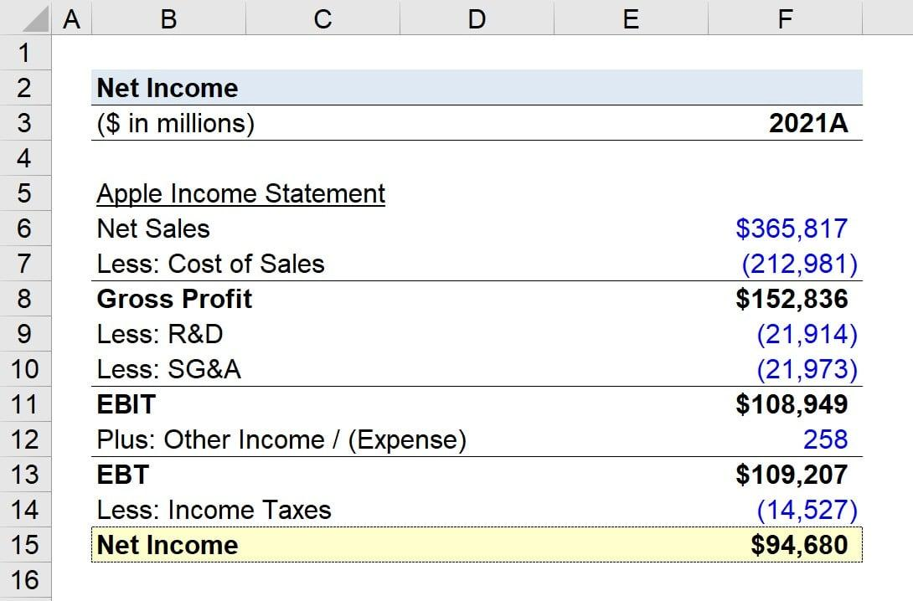

## Table of Contents

## What is net income?

Net income is the money a person or a business has left after paying all their expenses. It's like the money you get to keep after you've paid for everything you need to pay for. For a person, this means taking their salary and subtracting things like taxes, rent, and bills. For a business, it means taking the total revenue and subtracting costs like salaries, rent, and other expenses.

Net income is important because it shows how well someone or a business is doing financially. If the net income is high, it means they are managing their money well and have more to save or spend on other things. If the net income is low or negative, it might mean they need to find ways to earn more money or cut down on expenses. Knowing the net income helps people and businesses make better decisions about their money.

## Why is net income important for businesses?

Net income is really important for businesses because it shows how much money they are making after paying for everything they need. It's like the scorecard that tells a business if it's doing well or not. If a business has a high net income, it means they are making more money than they are spending, which is good. They can use this extra money to grow the business, pay back loans, or save for the future.

On the other hand, if a business has a low or negative net income, it means they are spending more money than they are making. This can be a warning sign that the business needs to change something. Maybe they need to find ways to make more money, or maybe they need to cut down on their costs. Knowing the net income helps business owners make smart decisions to keep their business healthy and successful.

## How do you calculate net income?

To calculate net income, you start with the total revenue, which is all the money a business earns from selling its products or services. Then, you subtract all the expenses, which are the costs of running the business. These expenses include things like salaries for employees, rent for the office or store, utilities, and the cost of goods sold. After subtracting all these expenses from the total revenue, what you have left is the net income.

For example, if a business makes $100,000 in revenue and has $70,000 in expenses, the net income would be $30,000. This number is important because it shows how much profit the business is making. If the net income is positive, the business is [earning](/wiki/earning-announcement) more than it's spending, which is good. If the net income is negative, the business is spending more than it's earning, which means it needs to make some changes to become profitable.

## What are the main components of net income?

The main components of net income are revenue and expenses. Revenue is all the money a business earns from selling its products or services. This is the starting point for calculating net income. When you think about revenue, imagine all the money coming into the business from customers.

Expenses are all the costs a business has to pay to keep running. These include things like salaries for employees, rent for the office or store, utilities, and the cost of goods sold. To find the net income, you subtract all these expenses from the revenue. If the result is positive, the business is making a profit. If it's negative, the business is losing money.

## Can you explain the difference between gross income and net income?

Gross income and net income are two important numbers that help us understand how much money a person or a business is making. Gross income is the total amount of money earned before any expenses are taken out. For a person, this might be their salary before taxes and other deductions. For a business, it's the total revenue from selling products or services before any costs are subtracted.

Net income, on the other hand, is what's left after all the expenses are taken out of the gross income. For a person, this is the money they actually get to keep after paying taxes, rent, and other bills. For a business, net income is the profit after subtracting all the costs like salaries, rent, and the cost of goods sold. So, while gross income shows the total earnings, net income shows the actual profit or what's left to save or spend.

## How does net income affect a company's financial health?

Net income is really important for a company's financial health because it shows how much money the company is making after paying all its bills. If a company has a high net income, it means they are doing well. They can use this extra money to grow the business, pay back loans, or save for the future. It's like having extra money in your pocket that you can use to do more things or to make your life better.

On the other hand, if a company has a low or negative net income, it means they are spending more money than they are making. This can be a warning sign that the company needs to make some changes. Maybe they need to find ways to make more money, or maybe they need to cut down on their costs. Knowing the net income helps the company's leaders make smart decisions to keep the business healthy and successful.

## What are common deductions from gross income to arrive at net income?

When a business wants to find out its net income, it starts with the gross income, which is all the money it makes from selling things. To get to the net income, the business needs to take away different costs. These costs include things like the money paid to employees, which is called salaries. Another big cost is rent for the place where the business works. There are also smaller costs like electricity and water, which are called utilities.

Another important cost that businesses need to take away from the gross income is the cost of goods sold. This is the money spent on making or buying the things the business sells. For example, if a store sells toys, the cost of goods sold would be the price they paid to get those toys. After taking away all these costs from the gross income, what's left is the net income. This number tells the business if it's making a profit or if it needs to make changes to start making money.

## How can net income be used to assess a company's profitability?

Net income is a key number that helps us see if a company is making money or not. It's like the final score after the game is over. If a company's net income is high, it means they are doing well because they are making more money than they are spending. This extra money can be used to grow the business, pay back loans, or save for the future. It's a sign that the company is healthy and successful.

On the other hand, if a company's net income is low or negative, it means they are spending more money than they are making. This can be a warning sign that the company needs to make some changes. Maybe they need to find ways to earn more money, or maybe they need to cut down on their costs. By looking at the net income, people who run the company can make smart decisions to help the business do better and become profitable.

## What are some strategies to increase net income?

One way to increase net income is to increase revenue. This means finding ways to make more money. A business can do this by selling more of its products or services. They can also try to raise the prices of what they sell, but they need to be careful because customers might not like higher prices. Another way to increase revenue is to find new customers or new markets to sell to. This can be done by advertising more or by offering new products or services that people want.

Another strategy is to reduce expenses. This means finding ways to spend less money. A business can do this by looking at all its costs and seeing where they can save money. For example, they might be able to find cheaper suppliers for the things they need to buy. They can also try to cut down on things like rent, utilities, or salaries. Sometimes, a business can save money by being more efficient, like using less energy or finding ways to make their products faster and cheaper.

Both increasing revenue and reducing expenses can help a business increase its net income. By making more money and spending less, the business can have more profit left over at the end of the day. This extra money can be used to grow the business, pay back loans, or save for the future. It's important for the people running the business to keep an eye on both revenue and expenses to make sure they are doing everything they can to increase net income.

## How does tax impact net income calculations?

Taxes can have a big impact on a business's net income. When a business makes money, it has to pay taxes to the government. These taxes are taken out of the business's gross income before they figure out the net income. So, the more taxes a business has to pay, the less money it has left over as net income. This means that taxes can lower the amount of profit a business makes.

To calculate net income, a business starts with its gross income and then subtracts all its expenses, including taxes. If the business has a high tax bill, it will have less money left after paying all its costs. This can make it harder for the business to grow or save money. On the other hand, if a business can find ways to lower its taxes, like using tax deductions or credits, it can keep more of its money and increase its net income. Understanding how taxes affect net income is important for a business to manage its money well.

## What are the limitations of using net income as a performance metric?

Net income is a good way to see if a business is making money, but it has some problems. One big problem is that net income can be changed by things that don't really show how well the business is doing. For example, if a business sells a big piece of equipment, it might look like they made a lot of money that year, but it doesn't mean they are doing better at selling their products or services. Also, net income can be affected by one-time costs or gains, like a lawsuit settlement, which can make the numbers look different from what's really happening in the business.

Another problem with using net income as a performance metric is that it doesn't show the whole picture of a business's health. Net income only tells you about the profit after all expenses are paid, but it doesn't tell you about things like how much money the business owes or how much cash it has on hand. A business might have a high net income but still have trouble paying its bills if it has a lot of debt. So, while net income is important, it's better to look at other numbers too, like cash flow and debt, to really understand how well a business is doing.

## How does net income reporting differ under different accounting standards like GAAP and IFRS?

Net income reporting can be different depending on whether a business follows GAAP (Generally Accepted Accounting Principles) or IFRS (International Financial Reporting Standards). GAAP is used mostly in the United States, while IFRS is used in many other countries around the world. One big difference is how these standards treat things like inventory and depreciation. GAAP uses a method called LIFO (Last In, First Out) for inventory, which can affect the cost of goods sold and, in turn, the net income. IFRS doesn't allow LIFO, so businesses using IFRS might report a different net income for the same set of transactions.

Another difference is how GAAP and IFRS handle extraordinary items and discontinued operations. Under GAAP, these items are shown separately on the income statement, which can make the net income number clearer. IFRS doesn't allow these items to be shown separately, so they are included in the regular income, which can make it harder to see the ongoing performance of the business. These differences can lead to different net income numbers for the same business, depending on which accounting standard is used. It's important for people looking at a business's financials to know which standard is being used to understand the net income correctly.

## What are the key financial metrics to understand, specifically regarding Net Income and Profit?

Net income and profit are fundamental financial metrics essential for assessing a company's performance and financial health. These metrics are pivotal in financial reporting as they provide insights into a company's ability to generate earnings relative to its expenses and other costs involved in its operation.

**Net Income Defined**: Net income, often referred to as the "bottom line," is the amount of profit a company retains after subtracting all expenses, taxes, and costs from its total revenue. It is calculated using the formula:

$$
\text{Net Income} = \text{Total Revenue} - (\text{Total Expenses} + \text{Interest} + \text{Taxes})
$$

Net income is a critical indicator of profitability and serves as an essential measure for investors and analysts to determine a company's profitability and operational efficiency over a specific period.

**Different Types of Profit**: Profit can be segmented into various types, each serving a unique purpose in financial analysis:

1. **Gross Profit**: This is the profit a company makes after deducting the costs of producing and selling its products, or the costs involved in providing its services. It is calculated as:

$$
\text{Gross Profit} = \text{Net Sales} - \text{Cost of Goods Sold (COGS)}
$$

Gross profit helps in assessing the efficiency of production processes and pricing strategies.

2. **Operating Profit**: Also known as operating income, this metric takes into account all costs of operations except interest and taxes. It is computed by subtracting operating expenses from gross profit:

$$
\text{Operating Profit} = \text{Gross Profit} - \text{Operating Expenses}
$$

Operating profit provides insight into the core business operations' efficiency before interest and tax considerations.

3. **Net Profit**: Often synonymous with net income, net profit is the remaining profit after all expenses are deducted from total revenues, indicating the ultimate profitability of a company. It reflects the comprehensive income covering all revenue streams and expenses.

**Role in Evaluating Financial Health**: These financial metrics collectively offer valuable information about a company's profitability and operational capacity. Gross profit assesses production efficiency; operating profit evaluates the efficacy of core business functions, while net income provides a holistic view of financial performance. Together, they enable investors, analysts, and stakeholders to make informed decisions about investing, managing, or evaluating the business's future prospects. These metrics are often used in ratio analysis, such as profit margin calculations, which can compare companies within the same industry and help ascertain financial stability and operational performance. 

Understanding these metrics is crucial for a comprehensive financial analysis, aiding in the enhancement of trading strategies and investment decisions.

## What are the differences between net income and profit?

Net income and profit are terms often used interchangeably, but they encapsulate different financial aspects, each serving distinct purposes in financial analysis. Understanding these differences is crucial for accurate financial interpretation and decision-making.

**Common Misconceptions**

A common misconception is treating net income and profit as identical measures. While both represent financial earnings, their scope and calculation differ, leading to varied implications for financial analysis. Net income is often perceived as a comprehensive measure of profitability, but this can overlook detailed insights provided by the different layers of profit, such as gross profit and operating profit.

**Differentiating Gross Profit, Operating Profit, and Net Income**

To differentiate:

1. **Gross Profit**: This measures a company's efficiency in using its labor and supplies in production. Gross profit is calculated as:
$$
   \text{Gross Profit} = \text{Revenues} - \text{Cost of Goods Sold (COGS)}

$$
   It reflects the basic profitability of core business activities without accounting for other operational costs.

2. **Operating Profit**: Also known as operating income, this metric considers the gross profit and subtracts operating expenses, such as wages and utilities. It is calculated as:
$$
   \text{Operating Profit} = \text{Gross Profit} - \text{Operating Expenses}

$$
   Operating profit indicates how well the company is managing its expenses aside from production and can highlight operational efficiency.

3. **Net Income**: This metric is the bottom line, encompassing all revenues and expenditures, including taxes and interest. It is expressed as:
$$
   \text{Net Income} = \text{Revenues} - (\text{COGS} + \text{Operating Expenses} + \text{Taxes} + \text{Interest})

$$
   Net income provides a comprehensive view of a company's profitability after accounting for all expenses and is often used for assessing overall financial performance.

**Implications for Investors and Analysts**

Understanding these differences is vital for investors and analysts. Gross and operating profits offer insights into specific operational efficiencies and cost management strategies, while net income gives an overarching view of financial health. Analysts use gross profit to assess production efficiency without the noise of other financial activities. Operating profit helps in understanding cost management and operational capabilities. Net income, meanwhile, is critical for evaluating overall profitability and determining earnings per share, which are central to investment decisions.

For investors, net income is a key indicator for evaluating the potential for dividends and reinvestment returns. However, neglecting the underlying gross and operating profit figures might obscure the challenges or strengths within operational processes. Therefore, in financial analysis and investment decisions, recognizing the distinct roles and implications of gross profit, operating profit, and net income ensures a comprehensive understanding of a company's financial dynamics.

## References & Further Reading

1. **Net Income and Financial Metrics:**
   - *Forbes - Understanding Net Income*: A comprehensive guide on understanding the nuances of net income and its importance in financial statements. Available at: [Forbes Article on Net Income](https://www.forbes.com/advisor/investing/what-is-net-income/)
   - *Investopedia - Profit Margin Analysis*: Offers insights into different types of profit margins such as gross, operating, and net profit. Available at: [Investopedia Profit Margin](https://www.investopedia.com/terms/p/profitmargin.asp)

2. **Algorithmic Trading:**
   - *The Journal of Finance - Algorithmic Trading and Information*: A peer-reviewed paper discussing the impact of algorithmic trading on financial markets. Access through: [Journal of Finance](https://jof.finance/)
   - *Wiley Online Library - Advances in Algorithmic Trading*: Explores the technological advancements driving algorithmic trading efficiency. Available at: [Wiley Algorithmic Trading](https://onlinelibrary.wiley.com/journal/advanced-algorithmic-trading)

3. **Integration of Financial Metrics in Trading Algorithms:**
   - *Quantitative Finance - Financial Data and Trading Algorithms*: Discusses methodologies for incorporating financial data into trading algorithms. Visit: [Quantitative Finance Journal](https://www.tandfonline.com/toc/rquf20/current)
   - *Springer - High-Frequency Trading and Financial Metrics*: Examines the role of financial metrics in high-frequency trading strategies. Access via: [SpringerLink](https://link.springer.com/book-series/finance)

4. **Risks and Mitigation in Algorithmic Trading:**
   - *MIT Sloan Management Review - Risks in Algorithmic Trading*: Analyzes potential risks and discusses strategies for risk mitigation in algorithmic trading. Available at: [MIT Sloan Review](https://sloanreview.mit.edu/)
   - *ACM Digital Library - The Challenges of Ensuring Data Accuracy in Algorithmic Trading*: Investigates the challenges of maintaining data accuracy for sound algorithmic trading decisions. Visit: [ACM Digital Library](https://dl.acm.org/)

These sources provide foundational and advanced knowledge for readers interested in deepening their understanding of financial metrics and their application in [algorithmic trading](/wiki/algorithmic-trading). They serve as a gateway to both theoretical insights and practical applications in finance.

