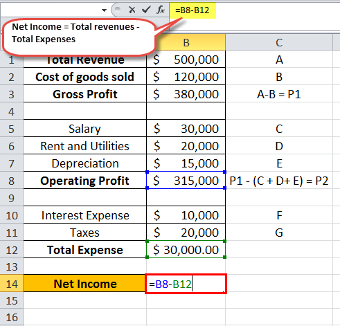

## Table of Contents

## What is net income?

Net income is the money a person or a business has left after paying all their expenses. It's like the money you get to keep in your pocket after you've paid for everything you need to pay for. For a business, this means taking the total money earned from selling goods or services, then subtracting all the costs like rent, salaries, and other bills.

For an individual, net income is what you take home after taxes and other deductions are taken out of your paycheck. If you earn $1,000 a month but have to pay $300 in taxes and other costs, your net income would be $700. This is the money you can use to spend on things you want or to save for the future. It's an important number because it shows how much money you really have to work with.

## How is net income calculated?

Net income is calculated by taking the total money you earn and then subtracting all the money you have to spend. For a business, you start with the total revenue, which is all the money made from selling products or services. Then, you subtract the cost of goods sold, which is what it costs to make or buy the products you sell. After that, you take away all other expenses like rent, utilities, salaries, and taxes. What's left is the net income, which shows if the business made a profit or had a loss.

For an individual, calculating net income is a bit simpler. You start with your gross income, which is the total money you earn from your job or other sources before any deductions. Then, you subtract all the deductions like taxes, social security, health insurance, and any other money taken out of your paycheck. The amount left after these deductions is your net income, also called take-home pay. This is the money you have available to spend on your needs and wants or to save for the future.

## Why is net income important for businesses?

Net income is really important for businesses because it tells them if they are making money or losing money. It's like a report card that shows if the business is doing well or if it needs to make some changes. When a business has a positive net income, it means they have more money coming in than going out, which is good because they can use that extra money to grow the business, pay back loans, or save for the future.

On the other hand, if a business has a negative net income, it means they are spending more money than they are making. This is a warning sign that the business needs to find ways to cut costs or increase sales. Knowing the net income helps business owners make smart decisions about where to spend money and how to keep the business healthy and successful.

## What is the difference between gross income and net income?

Gross income is the total amount of money you earn before anything is taken out. For a person, this is the money you get from your job or other sources before taxes and other deductions. For a business, gross income is the money made from selling products or services before any costs like making the products or running the business are subtracted.

Net income is what's left after all the expenses are taken out of the gross income. For a person, this is the money you take home after taxes and other deductions, also called take-home pay. For a business, net income is what remains after subtracting the cost of goods sold and other expenses like rent, salaries, and taxes from the gross income. It shows if the business made a profit or had a loss.

## How does net income affect a company's tax liability?

Net income is important for figuring out how much a company has to pay in taxes. The more net income a company makes, the more taxes it usually has to pay. This is because most countries have a tax system where businesses pay a percentage of their profit as tax. So, if a company's net income is high, its tax bill will be higher too.

But, there are ways for companies to lower their tax bill by using deductions and credits. These are expenses or investments that the government allows businesses to subtract from their net income before calculating taxes. So, even if a company has a high net income, it can reduce its taxable income and, therefore, its tax liability by taking advantage of these tax benefits.

## Can net income be negative, and what does it indicate?

Yes, net income can be negative, and it's called a net loss. This happens when a business spends more money than it makes. Imagine you have a lemonade stand. If you spend $10 on lemons and sugar but only make $8 from selling lemonade, your net income is -$2. This shows that your stand lost money instead of making a profit.

A negative net income tells a business that it needs to make changes. It could mean the business needs to find ways to cut costs, like buying cheaper lemons, or it might need to increase sales, like selling more lemonade. Knowing about a net loss helps business owners make better decisions to turn things around and start making a profit again.

## How does net income relate to profitability ratios like net profit margin?

Net income is really important when we talk about profitability ratios like the net profit margin. The net profit margin is a way to see how much profit a business makes from every dollar of sales. To find the net profit margin, you take the net income and divide it by the total revenue, then multiply by 100 to get a percentage. This percentage tells you how good a business is at turning sales into profit.

If a business has a high net profit margin, it means they are keeping a big part of their sales as profit. This shows that the business is doing a good job at managing costs and making money. On the other hand, a low net profit margin could mean the business is spending too much or not making enough from sales. By looking at the net profit margin, business owners can see if they need to make changes to improve their profits.

## What are common strategies to increase net income?

One common way to increase net income is by boosting sales. This can be done by finding more customers, selling more to the customers you already have, or raising the prices of what you sell. Businesses can try marketing and advertising to attract more people or offer special deals to get customers to buy more. It's also important to keep customers happy so they come back and tell others about your business.

Another strategy is to cut costs. This means looking at all the money the business spends and finding ways to spend less. For example, a business might switch to cheaper suppliers, use less energy, or find ways to make things more efficiently. By spending less money, more of what the business earns can turn into net income.

Sometimes, businesses use a mix of both strategies. They might work on increasing sales while also trying to lower costs. This can help them grow their net income even more. It's all about finding the right balance that works for the business and helps it make more profit.

## How does net income impact a company's financial statements?

Net income is really important for a company's financial statements. It shows up on the income statement, which is like a report card that tells everyone how much money the company made or lost over a certain time. The income statement starts with the total money the company made from selling things, then takes away all the costs like making the products, paying employees, and other expenses. What's left at the bottom is the net income. If it's a positive number, it means the company made a profit. If it's negative, it means the company had a loss.

Net income also affects the balance sheet and the cash flow statement. On the balance sheet, net income gets added to the company's retained earnings, which is the money the company has saved up over time. This part of the balance sheet shows how much money the company has kept from its profits to use for growing the business or other things. On the cash flow statement, net income is the starting point for figuring out how much cash the company made or used. Even though net income is important, the cash flow statement also looks at other things like money spent on new equipment or money borrowed, to give a full picture of the company's cash situation.

## What role does net income play in investment decisions?

Net income is a key number that investors look at when deciding whether to put their money into a company. It tells investors if the company is making money or losing money. If a company has a high net income, it means the company is doing well and making good profits. This can make investors feel confident that the company is a good place to invest their money because it shows the company is successful and might keep making money in the future. On the other hand, if a company has a low or negative net income, investors might be worried that the company is not doing well and might not be a good investment.

Investors also use net income to figure out other important numbers like the net profit margin, which shows how much profit the company makes from every dollar of sales. A high net profit margin can make a company look more attractive to investors because it shows the company is good at turning sales into profit. By looking at net income and related numbers, investors can make smarter choices about where to put their money, hoping to get a good return on their investment.

## How do different accounting methods affect the calculation of net income?

Different accounting methods can change how a company calculates its net income. One big difference is between cash basis accounting and accrual basis accounting. In cash basis accounting, a company records money when it actually gets paid or when it pays for something. So, if a company sells something in January but gets paid in February, it would count that money as part of February's income. On the other hand, accrual basis accounting records money when a sale is made or an expense is owed, not when the money changes hands. So, if a company sells something in January but gets paid in February, it would count that money as part of January's income.

These different methods can lead to different net income numbers for the same time period. For example, a company using cash basis accounting might show a lower net income in one month if it hasn't received payment for sales yet, while a company using accrual basis accounting would show a higher net income for the same month because it counts the sales when they happen. This can affect how people see the company's financial health and can impact decisions about investing in or managing the company.

## What are the limitations of using net income as a performance metric?

Net income is a good way to see if a business is making money, but it has some problems. One problem is that net income can be changed by things that don't really show how well the business is doing. For example, a company might sell a big piece of equipment and show a high net income for that year, but that doesn't mean the business is doing better at selling its products. Also, different ways of keeping track of money, like cash basis or accrual basis accounting, can make net income look different even if the business is doing the same.

Another limitation is that net income doesn't tell the whole story about a company's health. It doesn't show if the company has a lot of debt or if it's spending money in a smart way. For example, a company might have a high net income but also a lot of debt, which could be risky. Net income also doesn't show if the company is growing or if it's investing in things that will help it make more money in the future. So, while net income is important, it's better to look at other numbers too to get a full picture of how well a business is doing.

## What is Understanding Algorithmic Trading and Its Financial Metrics?

Algorithmic trading is a method where automated algorithms execute trades at high speed, adhering to predefined criteria. By leveraging technological advancements, algorithmic trading streamlines processes to analyze large datasets efficiently, thereby necessitating a comprehensive understanding of financial performance metrics. These metrics are crucial in assessing and refining trading strategies to ensure profitability and informed decision-making.

A pivotal financial metric in this context is net income. Net income represents a firm's earnings after all expenses, including operating costs, taxes, and interest, have been deducted from total revenue. In algorithmic trading, net income provides critical insight into a firm's profitability, essential for traders aiming for sustainable returns. It is represented mathematically as:

$$
\text{Net Income} = \text{Total Revenue} - \text{Total Expenses}
$$

For traders, understanding net income involves evaluating both the efficiency of their algorithms and the impact of trading costs on overall profitability. This measure helps assess whether the trading strategies employed are producing desirable financial outcomes.

Moreover, algorithmic traders must consider various financial performance metrics to evaluate the effectiveness of their strategies, especially in terms of risk-adjusted returns. The Sharpe Ratio, for instance, measures the performance of an investment compared to a risk-free asset, adjusting for its risk:

$$
\text{Sharpe Ratio} = \frac{E[R_p - R_f]}{\sigma_p}
$$

Where:
- $E[R_p - R_f]$ is the expected return of the portfolio minus the risk-free rate.
- $\sigma_p$ is the standard deviation of the portfolio's excess return.

Another essential metric is the Maximum Drawdown, which indicates the maximum observed loss from a peak to a trough before a new peak is achieved, revealing the potential risk associated with the trading strategy. This is especially relevant for high-frequency trading, where the rapid execution of trades demands stringent risk management protocols.

Additionally, the Profit Factor, a ratio of gross profits to gross losses, provides a clear view of profitability relative to losses incurred. This can be a valuable tool in understanding the efficiency of various trades made over a period.

The rigorous evaluation of these metrics is vital to not only optimize [algorithmic trading](/wiki/algorithmic-trading) performance but also ensure a balanced approach between profit and risk. Algorithmic traders often employ [backtesting](/wiki/backtesting) to simulate trading strategies against historical data, adjusting strategies based on performance metrics to better predict future market behavior.

In summary, comprehending and utilizing financial metrics such as net income, Sharpe Ratio, Maximum Drawdown, and Profit Factor enable algorithmic traders to monitor and enhance their trading performance effectively. These metrics form the backbone of a disciplined approach to algorithmic trading, facilitating the development of strategies that aim for maximum profitability while minimizing risks.

## How is Net Income Calculated in Financial Performance for Profit Calculation?

Net income stands as a fundamental aspect of profit calculation, illustrating a company’s earnings after all expenses, including operating costs and taxes, have been deducted from total revenue. In the context of algorithmic trading, net income assumes a pivotal role in evaluating financial performance and guiding strategic decisions.

**Calculation of Net Income**

Net income is calculated using the following formula:

$$
\text{Net Income} = \text{Total Revenue} - \text{Total Expenses}
$$

Where total expenses encompass operating costs, taxes, interest, and other expenses. This final figure is often referred to as the 'bottom line', highlighting its importance in understanding a company’s financial health.

For algorithmic traders, comprehending this metric is essential as it directly affects the evaluation of trading strategies. The challenge lies in accurately calculating all components affecting net income, particularly in volatile markets where rapid changes can occur. A detailed analysis of expenses can uncover opportunities for cost optimization, consequently enhancing net income.

**Role in Algorithmic Trading**

In algorithmic trading, the analysis of net income extends beyond mere computation. It is integral in assessing the efficiency and effectiveness of trading strategies. By linking net income directly to strategy performance, traders can review which strategies yield profitable outcomes and which require adjustment or elimination.

For instance, consider a Python script used for evaluating trading strategies:

```python
def calculate_net_income(revenue, expenses):
    return revenue - expenses

# Example usage
total_revenue = 1000000  # Example total revenue
total_expenses = 800000  # Example total expenses including operational costs
net_income = calculate_net_income(total_revenue, total_expenses)

print(f"Net Income: ${net_income}")
```

This script provides a straightforward calculation of net income and is pivotal for monitoring strategy outcomes in algorithmic trading.

**Strategic Implications**

Interpreting net income and associated financial data allows traders to refine their algorithms for more accurate forecasting and enhances overall profitability. Understanding and analyzing net income effectively can lead to informed decision-making about whether to scale specific trading strategies, cut losses, or reinvest profits into new algorithmic models.

Moreover, ongoing evaluation of net income over time can provide insights into long-term trends in trading performance, enabling traders to adapt strategies proactively in response to market changes.

In conclusion, net income serves not just as a measure of profitability but as a crucial tool in developing robust and successful algorithmic trading strategies. By understanding net income thoroughly, traders can ensure their strategies are not only profitable in theory but viable and sustainable in practice.

## References & Further Reading

[1]: Bergstra, J., Bardenet, R., Bengio, Y., & Kégl, B. (2011). ["Algorithms for Hyper-Parameter Optimization."](https://papers.nips.cc/paper/4443-algorithms-for-hyper-parameter-optimization) Advances in Neural Information Processing Systems 24.

[2]: ["Advances in Financial Machine Learning"](https://www.amazon.com/Advances-Financial-Machine-Learning-Marcos/dp/1119482089) by Marcos Lopez de Prado

[3]: ["Evidence-Based Technical Analysis: Applying the Scientific Method and Statistical Inference to Trading Signals"](https://www.amazon.com/Evidence-Based-Technical-Analysis-Scientific-Statistical/dp/0470008741) by David Aronson

[4]: ["Machine Learning for Algorithmic Trading"](https://github.com/PacktPublishing/Machine-Learning-for-Algorithmic-Trading-Second-Edition) by Stefan Jansen

[5]: ["Quantitative Trading: How to Build Your Own Algorithmic Trading Business"](https://books.google.com/books/about/Quantitative_Trading.html?id=j70yEAAAQBAJ) by Ernest P. Chan