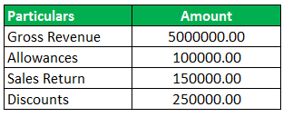

The financial world is complex, but understanding certain key elements can significantly enhance investment strategies. Net Institutional Sales (NIS) is one such element that plays a crucial role in the landscape of institutional trading and investment. Defined as the net sales of a company's shares by large institutional investors—such as pension funds and hedge funds—NIS provides valuable insights into the actions and sentiment of these influential market participants.

The importance of NIS is tied to the sheer volume of assets controlled by institutional investors, who can sway market dynamics with their transactions. A negative NIS value, for instance, indicates greater selling activity than buying, suggesting that institutional investors may have diminished confidence in the future performance of a stock. Thus, monitoring NIS data allows for a deeper understanding of market sentiment and can inform both strategic investment decisions and risk management approaches.



Algorithmic trading strategies are particularly adept at leveraging NIS data. By incorporating these metrics into their algorithms, institutional traders can better anticipate market movements and optimize their trading strategies. These automated systems utilize pre-defined criteria to execute trades, and NIS insights often serve as critical inputs for such algorithms, enhancing their ability to respond swiftly to market changes.

Despite its utility, NIS is becoming less effective as a sentiment indicator in the era of passive investing. The rise of index tracking and asset management strategies that do not involve active trading decisions is changing the market landscape. As these passive strategies grow, the direct influence of NIS data diminishes, posing challenges to traders relying solely on this metric for sentiment analysis.

In summary, while NIS remains a valuable tool for institutional investors, the evolving market environment necessitates a dynamic approach. Combining traditional financial acumen with advanced technological insights will be essential for the success of future institutional trading strategies.

## Table of Contents

## Understanding Net Institutional Sales (NIS)

Net Institutional Sales (NIS) is an important metric in financial markets, providing insight into the trading activity of large institutional investors, such as pension funds, insurance companies, and hedge funds. At its core, NIS measures the net sales activity of these entities in a company's stock. A formulaic representation of NIS can be as follows:

$$
\text{NIS} = \text{Total Institutional Sales} - \text{Total Institutional Purchases}
$$

A negative NIS value occurs when Total Institutional Purchases exceed Total Institutional Sales, suggesting strong buying interest in the stock by institutional investors. Conversely, a positive NIS indicates that these investors are primarily selling the stock, which could signal a lack of confidence or a strategic reallocation of assets.

Data on NIS is typically obtained from regulatory filings such as the 13F reports in the United States, where institutional investment managers with over $100 million in qualifying assets must disclose their holdings quarterly. This information can be mined for insights, though one challenge is its inherent lag, as data may not be released until up to 45 days after the end of a quarter.

NIS is applied in market analysis by helping analysts understand institutional sentiment toward specific stocks. Analysts might integrate NIS data into broader market models to predict price movements or assess market dynamics. Institutions that recognize shifts in NIS trends can benefit from early indicators about the stock's future performance, though this requires contextual understanding of market conditions and the investing strategies of different institutional players.

Additionally, NIS can be part of larger trading strategies for algorithmic traders, combining it with other financial metrics and indicators. However, interpreting NIS also involves understanding the quality and intent behind the institutional trades—are these trades strategic or reactive to external market changes?

Despite its value, caution is warranted due to the delayed nature of the data and the fact that not all institutional trades are equal in intent or size. Each institutional investor may have different mandates or strategies, which can dilute the broader applicability of NIS as a standalone indicator. Nevertheless, when used critically and in conjunction with real-time data and technological analysis tools, NIS remains a powerful instrument in the toolbox of market analysis.

## The Role of Institutional Investors in the Market

Institutional investors are pivotal in shaping the contours of global financial markets, primarily through their significant trading volumes which inherently influence asset prices. These entities, including pension funds, mutual funds, insurance companies, and hedge funds, possess the capacity to execute large-scale trades that not only affect market [liquidity](/wiki/liquidity-risk-premium) but also contribute to the efficiency of price discovery. The sheer [volume](/wiki/volume-trading-strategy) of trades executed by institutional investors ensures sufficient liquidity, thereby reducing transaction costs for all market participants. Consequently, their trading decisions can quickly reflect available information, adjusting asset prices to their fair values.

One of the distinguishing characteristics of institutional investors, compared to retail investors, is their ability to access an array of advanced financial instruments and technologies. Instruments such as derivatives, leverage, and short selling are routinely employed by these institutions to hedge risks, enhance returns, and capitalize on [arbitrage](/wiki/arbitrage) opportunities. For example, derivatives allow for the management of potential exposure to various market risks, enabling institutions to construct sophisticated hedging strategies. 

Moreover, institutional investors leverage cutting-edge technologies, including algorithmic and high-frequency trading systems, to optimize their trading operations. This use of technology allows for the rapid execution of trades based on complex pre-defined criteria, minimizing human error and capitalizing on fleeting market inefficiencies. For instance, algorithms can process vast amounts of data in real time and execute trades at speeds unimaginable to human traders.

Additionally, institutional investors benefit from economies of scale which enable them to negotiate lower fees, obtain better research, and access exclusive investment opportunities. Their large asset holdings confer bargaining power with brokers and other market intermediaries, facilitating cost-effective transactions and superior financial advice.

In summary, institutional investors wield considerable influence in financial markets by promoting liquidity, efficiency, and comprehensive price discovery. Their access to advanced financial tools and technology, alongside their large trading volumes, sets them apart from retail investors and underscores their critical role in the modern financial ecosystem.

## Algorithmic Trading Strategies Utilizing NIS Data

Algorithmic trading leverages automated systems for executing trades based on pre-defined criteria. It harnesses computational power to swiftly process large volumes of trading data, including Net Institutional Sales (NIS) data, which is crucial for making informed decisions in the financial markets. NIS data, by indicating the net volume of sales by large institutional investors, serves as a significant input for algorithms designed to anticipate market movements.

Institutional traders deploy complex algorithms that incorporate NIS insights to enhance their trading strategies. These algorithms analyze patterns in NIS data to gauge shifts in institutional sentiment, potentially signaling emerging trends before they are apparent in traditional market indicators. For instance, a substantial negative NIS might prompt algorithmic systems to adjust portfolios by selling off those stocks or taking short positions, in anticipation of price declines.

High-frequency trading ([HFT](/wiki/high-frequency-trading-strategies)), a subset of [algorithmic trading](/wiki/algorithmic-trading), benefits immensely from NIS data. HFT involves executing a large number of trades at extremely high speeds, often within milliseconds, to capitalize on minute price discrepancies. By integrating real-time processing of NIS data, HFT algorithms can optimize entry and [exit](/wiki/exit-strategy) points, understanding large-scale institutional actions and adjusting their strategies accordingly to improve profitability.

Moreover, algorithmic trading strategies utilizing NIS data often employ statistical models and [machine learning](/wiki/machine-learning) techniques. By doing so, they enhance predictive accuracy and ensure rapid adaptation to market changes. For example, a machine learning model might be trained on historical NIS data and other market indicators to predict future stock price movements. Here’s a simplified example in Python that shows how such a model might be implemented:

```python
from sklearn.model_selection import train_test_split
from sklearn.ensemble import RandomForestRegressor
import pandas as pd

# Sample data containing NIS and stock prices
data = pd.read_csv('stock_nis_data.csv')

# Features and target variable
X = data[['NIS', 'other_factors']]
y = data['stock_price']

# Train-test split
X_train, X_test, y_train, y_test = train_test_split(X, y, test_size=0.2, random_state=42)

# Random Forest model
model = RandomForestRegressor(n_estimators=100, random_state=42)
model.fit(X_train, y_train)

# Predicting and evaluating
predictions = model.predict(X_test)
```

In this example, a Random Forest model is used to predict stock prices using NIS data and other relevant market factors. By continuously updating models with new NIS inputs, institutional traders can refine their algorithmic approaches, adapt to evolving market dynamics, and maintain a competitive edge.

While exploiting NIS insights provides substantial benefits, traders must remain vigilant about the data's latency and the context of institutional investor trades, ensuring their strategies align with actual market conditions and investor behaviors.

## Challenges and Caveats of NIS

NIS data, while a valuable metric, presents several challenges largely due to its quarterly release schedule. This periodicity creates a time lag, rendering the data less responsive to real-time market changes. As traders seek timely insights, the delay can hinder swift decision-making, especially in fast-moving markets where immediate information is crucial. The lag implies that by the time NIS figures are available, market conditions and the underlying reasons for institutional buying or selling may have shifted significantly.

Moreover, the expertise levels among institutional investors vary, which adds another layer of complexity. Institutions range from sophisticated hedge funds with advanced analytics capabilities to pension funds that may adopt more traditional methods. Consequently, interpreting NIS data requires discerning which types of institutions are behind the trades. Are the transactions led by trend-following hedge funds or by pension funds reacting to regulatory changes? This understanding can influence market sentiment interpretation and subsequent trading strategies.

The trend toward passive investing has further complicated the utility of NIS as a sentiment indicator. With the rise of index funds, a substantial portion of institutional trading no longer reflects stock-specific views but rather follows index compositions. This shift can dilute the signal that NIS provides about investor sentiment, as large-scale movements might be related to index rebalancing rather than deliberate assessments of a company's prospects. As passive strategies gain prevalence, they increasingly contribute to market movements, rendering traditional sentiment measures, like NIS, less informative.

Despite these challenges, several solutions or workarounds can enhance the utility of NIS. Employing algorithmic models that integrate multiple data sources can offset the lag issue. For instance, combining NIS with more frequent financial metrics or [alternative data](/wiki/best-alternative-data) like sentiment analysis from news or social media can create a more comprehensive and timely trading framework.

Additionally, analyzing the nature of the institutions involved in trading can provide clearer insights. For example, incorporating data from regulatory filings, such as the SEC’s Form 13F in the U.S., can help identify the specific institutions behind significant market moves, allowing traders to adjust their strategies accordingly.

Finally, embracing advanced data analytics and machine learning models can discern trends and patterns that are not immediately evident from raw NIS data, thus improving strategic decision-making. By using these methods, traders can adapt to the evolving market structure and adequately respond to the challenges posed by the limitations of traditional NIS analysis.

## The Future of Institutional Trading

Technological advancements are profoundly transforming institutional trading. The integration of fintech innovations is leading to more sophisticated and efficient trading strategies. Algorithm-driven decision-making, for instance, employs complex models that can process vast amounts of financial data to identify profitable trading opportunities. Through machine learning, these algorithms improve their accuracy over time by learning from past trades and adjusting to new market conditions. This not only enhances decision-making speed but also improves the precision of predicting market trends.

Cybersecurity is increasingly vital in this evolving landscape. With the growing reliance on digital platforms and data sharing, there are heightened risks of data breaches and cyberattacks. Institutional traders are now prioritizing robust cybersecurity frameworks to safeguard sensitive financial information and ensure the integrity of trading operations. These measures include employing advanced encryption techniques, multi-[factor](/wiki/factor-investing) authentication, and real-time network monitoring to detect and mitigate threats promptly.

As we look forward, institutional trading strategies are poised for continuous evolution, driven by the synergy between cutting-edge technology and financial acumen. The adoption of [artificial intelligence](/wiki/ai-artificial-intelligence) (AI) is expected to further revolutionize how market data is analyzed, offering deeper insights and more predictive capability in risk management and investment strategies. Moreover, distributed ledger technologies, like blockchain, present opportunities for increased transparency and reduced transaction costs, which could redefine trading infrastructure.

The future of institutional trading will also witness greater integration of environmental, social, and governance ([ESG](/wiki/esg-investing)) considerations, as investors increasingly demand sustainable and ethical investment products. This shift will require developing new analytical tools that assess ESG factors alongside traditional financial metrics.

In summary, the future of institutional trading is intricately linked with technological progress. As institutional traders adapt to these advancements, their strategies will become more dynamic, potentially leading to greater efficiency and influence on global financial markets. This evolution necessitates a balance between leveraging technological tools and maintaining robust security protocols to protect investments and sustain investor confidence.

## Conclusion

Net Institutional Sales (NIS) continues to serve as a crucial metric for institutional investors, offering valuable insights into market dynamics and informing trading decisions. It allows stakeholders to decode shifts in market sentiment and align their strategies accordingly. Despite its utility, NIS's effectiveness is challenged by inherent reporting delays and the growing prevalence of passive investing. Consequently, the landscape of institutional trading is evolving, necessitating a more adaptive approach that fully leverages technological advancements.

For traders to successfully navigate the complexities of today’s financial markets, they must combine their financial expertise with cutting-edge technologies. This integration can involve utilizing machine learning algorithms for predictive market analysis or employing blockchain technology for secure transaction processes. Implementing high-frequency trading systems powered by artificial intelligence can enhance speed and accuracy in executing trades, while big data analytics can provide deeper market insights by processing vast datasets rapidly.

In this evolving environment, adaptability is paramount. By staying informed on technological innovations and investing in advanced analytical tools, institutional traders can maintain a competitive edge. The successful institutional trader of the future will be one who harmonizes deep financial knowledge with robust technological capabilities, ensuring they can not only interpret NIS data effectively but also respond agilely to emerging market trends.

## References & Further Reading

[1]: Lopez de Prado, M. (2018). ["Advances in Financial Machine Learning."](https://www.amazon.com/Advances-Financial-Machine-Learning-Marcos/dp/1119482089) Wiley.

[2]: Chan, E. P. (2009). ["Quantitative Trading: How to Build Your Own Algorithmic Trading Business."](https://github.com/ftvision/quant_trading_echan_book) Wiley.

[3]: Jansen, S. (2020). ["Machine Learning for Algorithmic Trading."](https://github.com/stefan-jansen/machine-learning-for-trading) Packt Publishing.

[4]: Harris, L. (2003). ["Trading and Exchanges: Market Microstructure for Practitioners."](https://www.amazon.com/Trading-Exchanges-Market-Microstructure-Practitioners/dp/0195144708) Oxford University Press.

[5]: Aronson, D. R. (2006). ["Evidence-Based Technical Analysis: Applying the Scientific Method and Statistical Inference to Trading Signals."](https://www.amazon.com/Evidence-Based-Technical-Analysis-Scientific-Statistical/dp/0470008741) Wiley.

[6]: Easley, D., & O'Hara, M. (2010). "Microstructure and Ambiguity." *The Journal of Finance*, 65(5), 1817-1846. 

[7]: Johnson, B. (2010). ["Algorithmic Trading & DMA: An Introduction to Direct Access Trading Strategies."](https://archive.org/details/algorithmictradi0000john) 4Myeloma Press.

[8]: Hasbrouck, J. (2007). ["Empirical Market Microstructure: The Institutions, Economics, and Econometrics of Securities Trading."](https://academic.oup.com/book/52241) Oxford University Press.

[9]: Menkveld, A. J. (2013). "High Frequency Trading and the New Market Makers." *Journal of Financial Markets*, 16(4), 712-740.