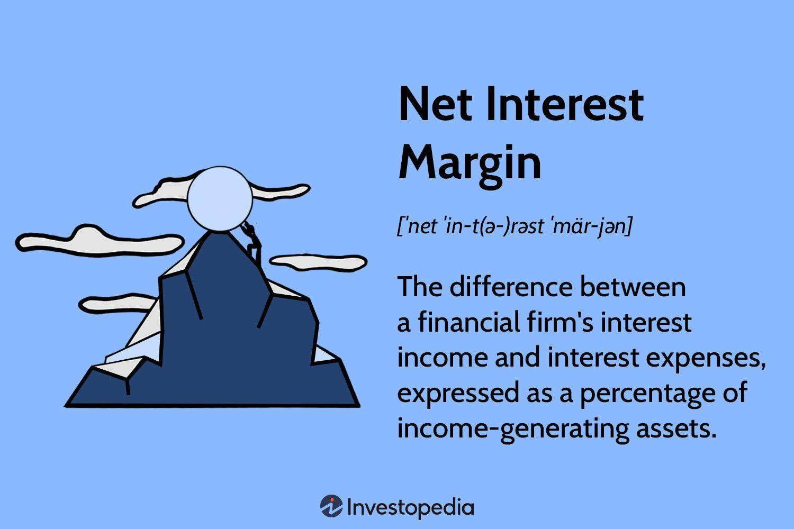

## Table of Contents

## What are Net Interest Margin Securities?

Net Interest Margin Securities, often called NIM securities, are a type of investment where the returns come from the difference between the interest earned on loans and the interest paid on deposits. Imagine a bank that takes in money from depositors and lends it out at a higher rate. The difference between what they pay out and what they earn is called the net interest margin. NIM securities are a way for investors to get a piece of that profit.

These securities are popular because they can provide a steady income stream, similar to how a bond works. They are often issued by banks or financial institutions that want to raise money without directly taking on more debt. For investors, NIM securities can be attractive because they offer a way to earn income based on the performance of a bank's loan portfolio, without having to manage the loans themselves. However, like any investment, they come with risks, such as changes in interest rates or the bank's ability to manage its loans effectively.

## How do Net Interest Margin Securities work?

Net Interest Margin Securities work by letting investors earn money from the difference between what a bank earns on loans and what it pays on deposits. This difference is called the net interest margin. When you buy a NIM security, you're basically investing in this margin. The bank uses the money from selling these securities to make more loans, and in return, you get a share of the interest income they make from those loans.

These securities are like bonds because they give you regular payments, but they're tied to how well the bank's loans are doing. If the bank does a good job and the loans perform well, you get more money. But if the loans don't do well, your payments could go down. It's a way for banks to raise money without borrowing more, and for investors to get steady income without having to handle the loans themselves. Just remember, like any investment, there are risks, especially if interest rates change or if the bank's loans start to fail.

## What is the purpose of Net Interest Margin Securities?

Net Interest Margin Securities help banks and investors. For banks, they are a way to raise money without borrowing more. Instead of taking out loans, banks can sell these securities to investors. The money from these sales can be used to make more loans to people and businesses. This helps banks grow and do more business without adding more debt to their [books](/wiki/algo-trading-books).

For investors, Net Interest Margin Securities offer a chance to earn steady income. When you buy these securities, you get a share of the interest the bank earns on its loans. It's like getting a piece of the bank's profits without having to manage the loans yourself. But remember, there are risks. If the bank's loans don't do well, or if interest rates change a lot, the amount of money you get could go down.

## Who typically invests in Net Interest Margin Securities?

People who invest in Net Interest Margin Securities are often looking for steady income. They might be retirees who want regular payments to live on, or they could be big investors like pension funds and insurance companies that need to make sure they have enough money coming in to pay their clients. These investors like NIM securities because they can get a piece of the bank's profits without having to handle the loans themselves.

Sometimes, even smaller investors might buy these securities if they understand the risks and want to diversify their investments. They see NIM securities as a way to earn money that's different from stocks or regular bonds. But it's important for everyone to know that while these securities can give you steady income, they also come with risks, like changes in interest rates or if the bank's loans start to fail.

## What are the risks associated with Net Interest Margin Securities?

Investing in Net Interest Margin Securities comes with several risks. One big risk is that interest rates might change. If interest rates go up, the bank might have to pay more on deposits, which could shrink the net interest margin. This means less money for investors. Another risk is that the loans the bank makes might not perform well. If people or businesses can't pay back their loans, the bank's profits go down, and so do the payments to investors.

There's also the risk that the bank itself might run into trouble. If the bank faces financial problems, it might not be able to pay investors as promised. This could happen if the bank makes bad loans or if there's a big economic downturn. Lastly, NIM securities can be hard to sell quickly. If you need your money back fast, you might not find a buyer right away, or you might have to sell at a lower price than you paid.

Understanding these risks is important before deciding to invest in Net Interest Margin Securities. They can offer a good income, but they're not without their challenges. It's a good idea to think about how these risks fit with your overall investment plan and comfort with risk.

## How are returns calculated for Net Interest Margin Securities?

Returns for Net Interest Margin Securities are based on the difference between the interest a bank earns on loans and the interest it pays on deposits. This difference is called the net interest margin. When you invest in these securities, you get a share of this margin. The bank takes the money you invest and uses it to make more loans. The more interest the bank earns on those loans, the more money you get back as returns.

But the returns can change. If the bank's loans do well and interest rates stay the same or go down, your returns might go up. But if the loans don't do well or if interest rates go up, the bank might have to pay more on deposits, which could shrink the net interest margin. This means your returns could go down. So, the amount of money you earn from these securities depends a lot on how well the bank manages its loans and how interest rates move.

## What factors influence the performance of Net Interest Margin Securities?

The performance of Net Interest Margin Securities depends a lot on the health of the bank's loans. If the loans are doing well and people are paying them back on time, the bank makes more money. This means more money for investors too. But if the loans start to go bad and people can't pay them back, the bank's profits drop, and so do the payments to investors.

Interest rates also play a big role. If interest rates go up, the bank has to pay more to depositors, which can shrink the net interest margin. This means less money for investors. On the other hand, if interest rates stay the same or go down, the bank can keep more of the money it earns from loans, which can lead to higher returns for investors.

Lastly, the overall economy can affect these securities. In good economic times, more people and businesses can pay back their loans, which helps the bank and investors. But in bad economic times, more loans might fail, hurting the bank's profits and the returns for investors. So, keeping an eye on the economy and interest rates can help you understand how these securities might perform.

## How do Net Interest Margin Securities compare to other fixed income securities?

Net Interest Margin Securities are a bit different from other fixed income securities like bonds or CDs. With NIM securities, your returns come from the difference between what a bank earns on loans and what it pays on deposits. This means your income can change based on how well the bank's loans are doing and what's happening with interest rates. Other fixed income securities, like bonds, usually give you a fixed payment that doesn't change much, no matter what's going on with the economy or interest rates.

Because NIM securities depend on the bank's loan performance, they can be riskier than traditional fixed income securities. If the bank's loans do well, you might earn more than you would with a regular bond. But if the loans go bad or interest rates go up, your returns could drop. On the other hand, bonds and CDs offer more predictable returns but might not give you the chance to earn as much if things go really well for the bank. So, NIM securities can be a good choice if you're okay with a bit more risk and want the chance for higher returns, while other fixed income securities might be better if you want something more stable and predictable.

## What role do interest rates play in the valuation of Net Interest Margin Securities?

Interest rates are really important when it comes to figuring out how much Net Interest Margin Securities are worth. When interest rates go up, banks have to pay more to people who put money in their savings accounts. This means the bank's net interest margin, which is the difference between what they earn on loans and what they pay on deposits, gets smaller. If this margin shrinks, there's less money for the bank to share with investors who own NIM securities. So, when interest rates rise, the value of these securities usually goes down because investors expect to get less money back.

On the other hand, when interest rates stay the same or go down, the bank can keep more of the money it earns from loans. This means the net interest margin stays big or gets even bigger, and there's more money for the bank to pay to investors. Because of this, when interest rates are low or falling, the value of NIM securities tends to go up. Investors like this because they can expect to get more money from their investment. So, keeping an eye on interest rates is a big part of understanding how much these securities are worth.

## Can you explain the impact of credit spread changes on Net Interest Margin Securities?

Credit spreads are the difference between the interest rate on a safe investment, like a government bond, and the interest rate on a riskier loan, like a loan to a business. When credit spreads get bigger, it means that banks have to pay more to borrow money because people see loans as riskier. This can make it harder for banks to make a good profit on the loans they give out. If banks have to pay more to borrow money, their net interest margin, which is the difference between what they earn on loans and what they pay on deposits, can get smaller. When the net interest margin shrinks, there's less money for the bank to share with investors who own Net Interest Margin Securities. So, when credit spreads go up, the value of these securities usually goes down because investors expect to get less money back.

On the other hand, when credit spreads get smaller, it means that loans are seen as less risky. Banks can borrow money at lower rates, which means they can keep more of the money they earn from the loans they give out. This makes the net interest margin bigger, and there's more money for the bank to pay to investors. When the net interest margin grows, the value of Net Interest Margin Securities usually goes up because investors expect to get more money from their investment. So, changes in credit spreads can have a big impact on how much these securities are worth, and it's something investors need to keep an eye on.

## How do regulatory changes affect Net Interest Margin Securities?

Regulatory changes can have a big impact on Net Interest Margin Securities. When the government or financial regulators make new rules, they can change how banks work. For example, if new rules make it harder for banks to lend money or force them to keep more money in reserve, this can shrink the bank's net interest margin. The net interest margin is the difference between what the bank earns on loans and what it pays on deposits. If this margin gets smaller because of new rules, there's less money for the bank to share with investors who own NIM securities. So, when regulations tighten, the value of these securities might go down because investors expect to get less money back.

On the other hand, if regulations become more relaxed, it can be good for Net Interest Margin Securities. Easier rules might let banks lend more money or keep less in reserve, which can make their net interest margin bigger. When the margin grows, there's more money for the bank to pay to investors. This means the value of NIM securities could go up because investors expect to get more money from their investment. So, keeping an eye on regulatory changes is important for anyone investing in these securities, as these changes can affect how much money they earn.

## What advanced strategies can be used to optimize returns from Net Interest Margin Securities?

One advanced strategy to optimize returns from Net Interest Margin Securities is to carefully watch interest rates and credit spreads. If you think interest rates are going to stay low or go down, it might be a good time to buy more NIM securities. This is because the bank's net interest margin will stay big or get even bigger, and you can earn more money. Also, if credit spreads are getting smaller, it means loans are seen as less risky, which can help the bank's profits and your returns. By keeping an eye on these things, you can try to buy NIM securities when they are likely to do well.

Another strategy is to diversify your investments. Instead of putting all your money into one bank's NIM securities, you can spread it out across different banks. This way, if one bank's loans start to go bad, you won't lose all your money. Also, you can look at different types of fixed income securities, like bonds or CDs, and mix them with NIM securities. This can help you balance the risk and still get a good return. By using these strategies, you can try to get the most out of your investment in Net Interest Margin Securities.

## What is Net Interest Margin (NIM) and how is it understood?

Net Interest Margin (NIM) is a fundamental metric in the banking sector, representing the difference between interest income generated by banks and the interest paid out to their lenders, relative to the amount of their interest-earning assets. Mathematically, it can be expressed as:

$$
\text{NIM} = \left( \frac{\text{Interest Income} - \text{Interest Expenses}}{\text{Average Interest-Earning Assets}} \right) \times 100
$$

NIM serves as an essential indicator of a bank's lending profitability and overall financial health. By measuring the effectiveness with which a bank makes its interest-[earning](/wiki/earning-announcement) resources productive, NIM directly impacts a bank’s net income and is a key focus for investors and analysts alike.

Higher NIMs are generally indicative of better profitability, suggesting that a bank is effectively managing its interest spreads. Several factors influence NIM, including the prevailing [interest rate](/wiki/interest-rate-trading-strategies) environment and the level of market competition. In a high-interest-rate scenario, banks have the potential to leverage wider spreads between deposit rates and loan rates, thereby enhancing their NIM. Conversely, in a low-interest-rate environment, tighter spreads can compress margins, challenging banks to maintain profitability.

The relevance of NIM escalates in periods of shifting interest rates. When interest rates fluctuate, banks need to actively manage their rate settings and margins to safeguard their profitability. This involves strategic decisions on asset-liability management, including the adjustment of loan products, the development of competitive savings accounts, and the management of fixed versus variable rate offerings.

Furthermore, external competitive forces can also exert pressure on NIM. As other financial institutions join the fray, offering competing services, banks may be compelled to adjust their rates to retain their customer base, thereby influencing their NIM.

Understanding and optimizing NIM is crucial not only for maintaining bank profitability but also for ensuring the institution’s ability to weather economic cycles and financial market changes. By continuously monitoring NIM, banks can make informed strategies that align with their risk profiles and financial goals, ultimately reinforcing their stability and growth trajectory within the financial industry.

## References & Further Reading

[1]: ["Algorithmic Trading: Winning Strategies and Their Rationale"](https://books.google.com/books/about/Algorithmic_Trading.html?id=WAlFDwAAQBAJ) by Ernest P. Chan

[2]: ["The Handbook of Mortgage-Backed Securities"](https://academic.oup.com/book/7943) by Frank J. Fabozzi

[3]: Brunnermeier, M. K. (2009). ["Deciphering the Liquidity and Credit Crunch 2007-2008."](https://www.princeton.edu/~markus/research/papers/liquidity_credit_crunch.pdf) Journal of Economic Perspectives, Vol. 23, No. 1, pp. 77–100.

[4]: Jegadeesh, N., & Titman, S. (1993). ["Returns to Buying Winners and Selling Losers: Implications for Stock Market Efficiency."](https://www.jstor.org/stable/2328882) The Journal of Finance, Vol. 48, No. 1, pp. 65–91.

[5]: Aldridge, I. (2013). ["High-Frequency Trading: A Practical Guide to Algorithmic Strategies and Trading Systems."](https://www.amazon.com/High-Frequency-Trading-Practical-Algorithmic-Strategies/dp/1118343506)