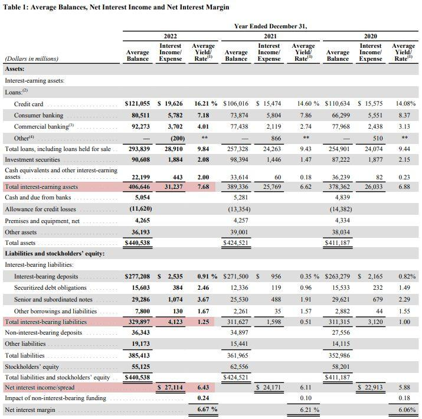

Financial metrics are quantitative measures used to assess the performance, stability, and overall health of financial products, services, or entire organizations. These metrics are crucial for stakeholders, including investors, analysts, and management, to make informed decisions. They encompass a wide range of indicators, such as profitability ratios, liquidity ratios, efficiency ratios, and leverage ratios, each offering insights into specific financial aspects of a business.

The net interest rate spread is a key financial metric particularly significant in banking and finance. It is defined as the difference between the interest income generated by banks or financial institutions and the amount of interest paid out to lenders, typically expressed as a percentage of interest-earning assets. This spread is pivotal in determining a bank's profitability, as it directly affects the net income and financial stability of banking institutions. For banks, a larger spread often indicates greater profitability and financial health, as it implies they are effectively managing the balance between lending and borrowing rates.

Profit analysis plays a vital role in evaluating the financial viability and success of businesses, especially within the financial sector. It involves analyzing revenue streams, cost structures, and overall financial operations to determine profitability. Through both qualitative and quantitative approaches, profit analysis helps businesses pinpoint areas of strength and areas needing improvement, thereby informing strategic and operational decisions. It also guides investment choices by highlighting potentially lucrative opportunities and identifying risks.

Algorithmic trading has become an integral part of modern financial markets. It involves the use of computer algorithms to execute trades at high speed and volume, based on predetermined criteria. Algorithmic trading systems utilize various financial metrics, including net interest rate spread, to make efficient trading decisions. The prevalence of this practice is driven by its ability to process large datasets rapidly, capitalize on market inefficiencies, and mitigate human emotion in trading decisions.

The purpose of this article is to explore the interplay between financial metrics, net interest rate spread, profit analysis, and algorithmic trading and to understand how these concepts collectively contribute to financial success. By examining their interconnectivity, we can gain insights into how they drive strategic decision-making and shape the dynamics of financial performance in today's complex market environment.

## Table of Contents

## Understanding Financial Metrics

Financial metrics are quantifiable measures used to gauge the financial health, performance, and efficiency of a business. These metrics provide insights into various aspects of a company's operations, allowing stakeholders to make informed decisions. There are several types of financial metrics commonly used across industries, with different metrics catering to specific areas of financial assessment and strategy formulation.

One primary category of financial metrics focuses on profitability. Key metrics in this area include:

1. **Net Profit Margin**: This metric measures how much of a company's revenue is converted into profit. It is calculated as Net Profit divided by Total Revenue. A higher net profit margin indicates a more efficient company in terms of cost control and pricing strategies.

2. **Return on Assets (ROA)**: ROA assesses how effectively a company utilizes its assets to generate earnings. It is calculated by dividing Net Income by Total Assets. A higher ROA suggests better asset management and profitability.

3. **Return on Equity (ROE)**: This metric evaluates the return generated on shareholders' equity, calculated as Net Income divided by Shareholder's Equity. ROE is crucial for investors who want to understand how well their capital is being used.

Liquidity metrics are another crucial area. These include:

1. **Current Ratio**: Representing the ability of a company to meet its short-term obligations, the current ratio is calculated by dividing Current Assets by Current Liabilities.

2. **Quick Ratio**: Also known as the acid-test ratio, it measures a company's capacity to handle short-term liabilities without relying on inventory sales. It is calculated as (Current Assets - Inventory) / Current Liabilities.

Efficiency metrics measure how well a company uses its resources. Examples include:

1. **Inventory Turnover**: This indicates how often a company sells and replaces its inventory within a period, calculated by dividing the Cost of Goods Sold (COGS) by Average Inventory. High turnover suggests efficient inventory management.

2. **Accounts Receivable Turnover**: This metric measures how efficiently a company collects revenue from its credit sales, calculated as Net Credit Sales divided by Average Accounts Receivable.

Financial metrics like these help assess a business's overall health by offering a snapshot of financial performance and operational efficiency. For example, a declining current ratio may signal [liquidity](/wiki/liquidity-risk-premium) issues, while an improving ROE might reflect effective management and robust profitability. Companies can leverage these metrics to drive strategic decisions, such as restructuring operations, adjusting pricing strategies, or reallocating resources to enhance value creation.

Financial metrics are indispensable tools for businesses to identify strengths, weaknesses, and opportunities within their operational and strategic frameworks. By focusing on key indicators like profitability, liquidity, and efficiency, companies can tailor strategies that enhance performance and sustain long-term growth.

## Net Interest Rate Spread

Net [interest rate](/wiki/interest-rate-trading-strategies) spread is a crucial financial metric used predominantly in the banking and finance industries to assess the effectiveness of an institution's lending and borrowing practices. It represents the difference between the interest rate earned on assets, typically loans, and the interest rate paid on liabilities, such as deposits. The formula for calculating the net interest rate spread is:

$$
\text{Net Interest Rate Spread} = \text{Average Interest Rate on Assets} - \text{Average Interest Rate on Liabilities}
$$

This metric is significant for banks and financial institutions as it directly affects profitability. A higher net interest rate spread indicates that a bank is [earning](/wiki/earning-announcement) more from its lending activities than it is paying out in interest on deposits, leading to higher profits. Conversely, a narrow spread can indicate a squeeze on profits, which can be detrimental to an institution's financial health.

The net interest rate spread serves as an indicator of a bank's financial stability and efficiency in asset and liability management. It reflects how well a bank is adapting to interest rate changes in the market and managing its interest rate risk. The spread is a critical driver of net interest income, which is a primary source of revenue for many banking institutions.

Several external factors can influence the net interest rate spread. Market conditions, such as supply and demand for credit, significantly impact interest rates. For example, during periods of economic growth, increased demand for credit can lead to higher interest rates on loans, potentially widening the spread. Conversely, during economic downturns, interest rates may fall, narrowing the spread.

Monetary policy also plays a crucial role in shaping the net interest rate spread. Central banks, through their control of benchmark interest rates, influence the cost of borrowing and the return on savings. An expansionary monetary policy, characterized by lower interest rates, can compress the spread, while a contractionary policy may widen it as interest rates rise.

In summary, the net interest rate spread is a vital indicator of a financial institution's profitability and stability. It is shaped by both internal management practices and external market and policy factors. Understanding and optimizing this spread is essential for banks aiming to enhance their financial performance and resilience in varying economic conditions.

## Profit Analysis in Financial Markets

Profit analysis refers to the systematic evaluation of revenues, costs, and expenses to measure an entity’s financial performance. Its primary role in financial markets is to offer insights into the profitability of various financial products, services, and overall business activities. Through this evaluation, businesses can optimize their operational strategies and improve decision-making processes related to investments.

Profit analysis can be approached using both qualitative and quantitative methods. Quantitative approaches often involve mathematical models and statistical techniques to assess profitability metrics and forecast future performance. Typical quantitative metrics include profit margins, return on investment (ROI), and economic value added (EVA). For instance, ROI can be calculated as:

$$
ROI = \frac{\text{Net Profit}}{\text{Cost of Investment}} \times 100
$$

Qualitative profit analysis, on the other hand, includes evaluating non-numeric factors such as management effectiveness, brand strength, and market position. These qualitative elements can heavily influence financial outcomes and competitive advantage, offering a different perspective when combined with quantitative data.

Profit analysis plays a vital role in informing investment and operational strategies by allowing businesses to identify areas of strength and weakness. For example, firms may decide to reallocate resources from underperforming divisions to those with higher profitability potential. Similarly, insights from profit analysis could lead to strategic shifts such as market expansion, product innovation, cost optimization, or divestment from non-core areas.

Successful case studies of profit analysis demonstrate its importance. One notable example is the transformation strategy of a leading global bank that utilized thorough profit analysis. The bank identified its high-yield areas and expanded them while simultaneously executing cost-cutting measures in less profitable sectors. These strategies led to improved financial health and competitive positioning.

Another case involves a retail company leveraging profit analysis to restructure its supply chain and optimize its product offerings. By analyzing the profitability of different product lines, the company discontinued low-margin items and expanded its successful ones, resulting in increased profit margins and market share.

In conclusion, profit analysis is a critical tool in the financial markets, offering actionable insights for investment and operational strategies. By blending qualitative and quantitative approaches, businesses can harness the power of profit analysis to achieve greater financial success and sustained growth.

## Algorithmic Trading and Financial Metrics

Algorithmic trading refers to the use of computer programs to execute trading orders based on predefined criteria, often at speeds and frequencies that are impossible for human traders. These algorithms can determine the timing, price, and quantity of orders automatically, making [algorithmic trading](/wiki/algorithmic-trading) a common practice in modern financial markets. It has revolutionized the way trading is conducted, significantly increasing market efficiency and liquidity.

Algorithmic trading leverages various financial metrics to inform its strategies. Among these metrics, the net interest rate spread—a measure of the difference between interest rates on loans and deposits—can be critical. While primarily a concern for banks, the spread can influence broader market conditions, thus affecting algorithmically determined trading strategies. Algorithms monitor these spreads alongside other economic indicators to optimize trading decisions based on predicted market movements.

The advantages of algorithmic trading are numerous. Algorithms can operate continuously without fatigue, process vast amounts of data quickly, and execute trades with precision. They enable traders to take advantage of small price discrepancies across different markets, a practice known as [arbitrage](/wiki/arbitrage). However, the use of such technology is not without its risks. Algorithmic trading can contribute to market [volatility](/wiki/volatility-trading-strategies) and has been implicated in events such as flash crashes, where rapid selling leads to a sudden and significant market decline. Moreover, there is the risk of algorithms executing faulty trades due to erroneous instructions or unforeseen market conditions.

Numerous strategies within algorithmic trading incorporate profit analysis and financial metrics. For instance, mean-reversion strategies aim to capitalize on the temporary divergence of an asset's price from its historical average, using statistical indicators to guide trades. Momentum strategies, on the other hand, seek to exploit upward or downward trends in asset prices, often relying on metrics such as [volume](/wiki/volume-trading-strategy) or moving averages to gauge market sentiment.

Some algorithms utilize [machine learning](/wiki/machine-learning) models that adapt based on input data, which might include various financial metrics. These algorithms can improve their predictions over time by identifying complex patterns from historical data. The integration of profit analysis techniques, such as the Sharpe ratio to assess risk-adjusted returns, allows for more informed decision-making within these algorithmic frameworks.

In summary, algorithmic trading is an indispensable facet of contemporary financial markets, harnessing financial metrics and profit analysis to guide trading activities. While it offers numerous benefits—such as increased efficiency, market liquidity, and precise execution—it also presents challenges, including potential contributions to market instability and systemic risk. Understanding these dimensions is crucial for participants aiming to profit from algorithmic trading strategies.

## Interconnectivity of Concepts

Net interest rate spread, profit analysis, and algorithmic trading are critical concepts in finance that, when interconnected, can significantly enhance financial performance and decision-making processes. Understanding their synergy and integration offers valuable insights into the evolving landscape of modern financial markets.

Net interest rate spread, the difference between interest earned on assets and interest paid on liabilities, serves as a primary metric for evaluating banking profitability and efficiency. It influences the financial health of lending institutions, impacting profit margins and return on assets. Profit analysis, which involves assessing revenues versus costs, utilizes several metrics, including the net interest rate spread, to evaluate financial outcomes. By analyzing profits, businesses can develop strategies to maximize returns and optimize their operations.

Algorithmic trading, on the other hand, involves using computer programs to execute trades at high speeds and volumes, often based on predefined criteria. This process relies heavily on financial metrics, including the net interest rate spread, to make informed trading decisions. Algorithms can adjust trading strategies in real-time based on changes in interest rate spreads, potentially improving profit outcomes by exploiting small variations in financial data.

The integration of these concepts into financial decision-making processes yields several synergistic effects. For instance, by combining profit analysis with algorithmic trading, financial institutions can better predict market trends and allocate resources efficiently. The insights gained from profit analysis can inform the algorithms' parameters, identifying profitable opportunities or risks in real-time trading. Similarly, understanding net interest rate spreads can assist in developing trading strategies that capitalize on interest rate differentials between borrowing and lending activities.

As financial markets become increasingly complex, incorporating these interconnected concepts allows businesses to adapt more readily to market shifts. Businesses can build robust strategies that maximize profits while minimizing risks by leveraging the analytical strengths of profit analysis, the precision of algorithmic trading, and the predictive capabilities of net interest rate spreads.

Looking ahead, the interrelationships among these financial concepts are poised for further evolution. Advancements in [artificial intelligence](/wiki/ai-artificial-intelligence) and machine learning are likely to enhance algorithmic trading, using more complex financial metrics for improved decision-making. Innovations in data analytics may also refine how profit analysis and net interest rate spreads inform business strategies, paving the way for more sophisticated financial models that integrate these concepts seamlessly.

In summary, the interconnectedness of net interest rate spread, profit analysis, and algorithmic trading highlights their collective impact on financial performance. Their integration into financial systems allows for smarter, data-driven decision-making, improving profitability and resilience in dynamic financial markets.

## Conclusion

In concluding this exploration of financial metrics, the net interest rate spread, profit analysis, and algorithmic trading, we underscore their individual and collective significance in modern finance. Financial metrics are crucial for evaluating business performance and guide strategic decisions. The net interest rate spread, as a pivotal metric for banks, directly impacts their profitability and financial stability. Profit analysis plays an essential role in decoding the financial health and operational success of entities, relying on both qualitative and quantitative methods. 

Algorithmic trading represents a progressive shift in how financial markets operate, harnessing the power of financial metrics and advanced computational methods to enhance trading efficiency and accuracy. This integration has revolutionized trading strategies and underscored the synergy between data analysis and automated decision-making.

Collectively, these concepts form a holistic framework crucial for navigating today's complex financial landscapes. Their interplay offers vast potential for augmenting financial performance and strategic foresight, emphasizing their significance in both current practice and future developments. Continued exploration and study in financial metrics, profit analysis, and algorithmic trading are encouraged to foster a deeper understanding and improve financial acumen, preparing stakeholders for challenges and opportunities that lie ahead in the dynamic world of finance.

## References & Further Reading

[1]: ["Financial Metrics: How to Evaluate Business Performance"](https://smartbooks.com/resources/articles/financial-performance-metrics-for-evaluating-business-performance/) - Investopedia

[2]: Mishkin, F. S., & Eakins, S. G. (2018). ["Financial Markets and Institutions"](https://books.google.com/books/about/Financial_Markets_and_Institutions_Globa.html?id=PPJFDwAAQBAJ) - Pearson.

[3]: ["Advances in Financial Machine Learning"](https://www.amazon.com/Advances-Financial-Machine-Learning-Marcos/dp/1119482089) by Marcos Lopez de Prado

[4]: ["Algorithmic Trading: Winning Strategies and Their Rationale"](https://www.amazon.com/Algorithmic-Trading-Winning-Strategies-Rationale-ebook/dp/B00CY5HC0U) by Ernest P. Chan

[5]: ["Trading and Exchanges: Market Microstructure for Practitioners"](https://www.amazon.com/Trading-Exchanges-Market-Microstructure-Practitioners/dp/0195144708) by Larry Harris

[6]: ["Quantitative Trading: How to Build Your Own Algorithmic Trading Business"](https://www.amazon.com/Quantitative-Trading-Build-Algorithmic-Business/dp/1119800064) by Ernest P. Chan