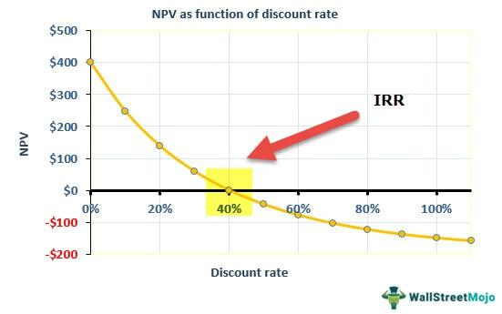

Financial metrics play an indispensable role in guiding investors toward prudent investment decisions, with the Net Internal Rate of Return (Net IRR) being particularly significant. Net IRR is a metric that offers a nuanced perspective of an investment’s profitability by adjusting for fees and carried interests. Recognized as a superior measure to the traditional Internal Rate of Return (IRR), it provides investors with an annualized return percentage, ensuring a more precise evaluation of potential yields.

As markets evolve through technological advancements, traditional metrics such as the Net IRR must also transform to align with contemporary demands. Algorithmic trading, characterized by high-speed execution of trades based on pre-set algorithms, represents a critical leap in this transformation. When combined with robust financial metrics, algorithmic trading platforms allow investors to optimize their strategies, thereby enhancing decision-making and improving investment outcomes.



This discussion explores how the integration of Net IRR with algorithmic trading strategies not only refines investment models but also provides a pathway for investors to achieve more consistent profitability. By understanding these advanced financial methodologies and adapting traditional metrics for modern applications, investors can better navigate the complexities of today's fast-paced financial markets. The objective is to arm investors with the knowledge to effectively incorporate Net IRR and algorithmic trading into their investment analysis, ultimately leading to improved decision-making processes and enhanced returns.

## Table of Contents

## Understanding Net Internal Rate of Return

Net Internal Rate of Return (Net IRR) is a crucial financial performance measurement used to assess the yield of an investment after accounting for fees and carried interests. This metric offers a refined measure of the Internal Rate of Return (IRR), thereby providing a more accurate assessment of an investment's profitability. Expressed as a percentage, Net IRR represents the annualized return an investor can expect from an investment, reflecting its true earning potential once all associated costs are factored in.

Net IRR is especially beneficial in capital budgeting and portfolio management. Through these contexts, it aids investors in determining the financial quality of their investments. Unlike the gross IRR, Net IRR accounts for management fees and carried interests, offering a more realistic picture of investment performance from the investor's standpoint.

The calculation of Net IRR involves identifying the discount rate where the net present value (NPV) of all projected cash flows becomes zero. Mathematically, the NPV is given by the formula:

$$
\text{NPV} = \sum \frac{C_t}{(1 + r)^t} - \text{Initial Investment}
$$

where $C_t$ represents the cash flows at time $t$, and $r$ is the discount rate. The Net IRR is the rate $r$ that solves this equation when the NPV equals zero. This calculation assists in evaluating the viability and efficiency of investment projects, enabling investors to allocate capital optimally.

By offering an intricate understanding of the financial returns of investments inclusive of supplementary costs, Net IRR emerges as an indispensable tool for investors striving for precise investment analysis and decision-making.

## Net IRR in Investment Analysis

Net Internal Rate of Return (Net IRR) serves as a crucial metric in investment analysis, aiding investors in assessing the profitability of various investment opportunities while accounting for associated costs and fees. This metric is particularly beneficial in investment scenarios such as private equity, where investments often require periodic cash disbursements over time. By incorporating these cash flows and associated costs into the evaluation, Net IRR provides a more precise measure of an investment's potential profitability.

The Net IRR is essentially an adjustment of the Internal Rate of Return (IRR), designed to offer a more accurate reflection by considering the effects of management fees and carried interest. A higher Net IRR typically signifies a more lucrative investment, as it indicates that the investor can expect greater annualized returns after costs are deducted. However, it's important to note that investments with a lower Net IRR may still be advantageous if they offer steady and sustainable returns over an extended period.

In practical terms, Net IRR assists investors in project evaluation, ensuring optimal allocation of capital resources. For instance, private equity investments often involve a series of capital calls and distributions, making Net IRR a suitable measure for evaluating the potential outcomes of such ventures. A higher Net IRR suggests not only better financial performance but also more efficient project execution and strategic management, which are vital in determining the viability and success of long-term investment projects.

Mathematically, the calculation of Net IRR involves finding the discount rate ($r$) that sets the net present value (NPV) of cash flows, including costs and expenses, to zero. The formula used is:

$$
NPV = \sum \frac{C_t}{(1 + r)^t} - I = 0
$$

where $C_t$ represents the cash flow at time $t$, and $I$ is the initial investment cost.

Python can be used to compute Net IRR by leveraging library functions such as `numpy`:

```python
import numpy as np

def calculate_net_irr(cash_flows):
    return np.irr(cash_flows)

# Example usage with cash flows: Initial Investment: -1000, Year 1: 200, Year 2: 300, Year 3: 700
cash_flows = [-1000, 200, 300, 700]
net_irr = calculate_net_irr(cash_flows)
print(f"The Net IRR is {net_irr:.2%}")
```

This integration of Net IRR in investment analysis provides a robust framework for comparing and selecting investment options based on their profitability and cost-effectiveness. It guides investors in making informed decisions aligned with their financial goals and risk profiles, ultimately enhancing the strategic management of their investment portfolios.

## Algorithmic Trading and Financial Metrics

Algorithmic trading leverages sophisticated technologies and pre-defined criteria to facilitate high-speed trade execution. This technological advancement offers unparalleled efficiency and precision in the financial markets, delivering significant advantages over traditional methods. At its core, [algorithmic trading](/wiki/algorithmic-trading) involves the use of algorithms derived from complex mathematical models to identify lucrative trading opportunities. These algorithms can be programmed to monitor varying market conditions and execute trades based on specific thresholds, thus eliminating human error and emotion from the trading process.

Traditional financial metrics, such as the Internal Rate of Return (IRR) and Net Internal Rate of Return (Net IRR), have become integral components of these algorithmic models. By incorporating these metrics, algorithmic trading can effectively enhance strategy formulation and optimize investment decisions. Net IRR, which adjusts the standard IRR by considering fees and carried interests, provides a more precise measure of investment profitability. When used within an algorithmic framework, the inclusion of such metrics enables more accurate assessments of potential returns and risks, thus guiding the selection and execution of trades.

The integration of financial metrics like Net IRR into algorithmic trading models is crucial for maximizing returns while minimizing risks. It allows for a data-driven approach to strategy development, where algorithms can be fine-tuned to optimize performance based on historical data and predictive analytics. For instance, algorithms can be coded in Python to continuously pull and analyze market data, calculate estimated returns in real time, and adjust trading strategies accordingly. This approach helps in making informed investment decisions promptly, thus keeping strategies resilient to changing market conditions.

Here is an example of how a simple algorithmic trading model in Python might incorporate financial metrics:

```python
import numpy as np

# Hypothetical function to calculate Net IRR
def calculate_net_irr(cash_flows):
    # Using numpy's IRR function for simplicity
    net_irr = np.irr(cash_flows)
    return net_irr

# Sample cash flow data
cash_flows = [-10000, 3000, 4200, 6800]

# Calculate Net IRR
net_irr = calculate_net_irr(cash_flows)
print(f"Net IRR: {net_irr:.2%}")

# Decision based on Net IRR
if net_irr > 0.10:  # Example threshold for a 'good' investment
    print("Invest based on Net IRR strategy.")
else:
    print("Do not invest based on Net IRR strategy.")
```

In this simplified example, the algorithm calculates the Net IRR from a series of cash flows and makes a trading decision based on a predefined threshold. As the use of algorithmic trading grows, the ability to integrate and dynamically adapt these metrics remains essential for sustaining profitability and competitive advantage. Consequently, understanding the symbiosis of algorithmic trading and financial metrics is a crucial aspect of modern investment strategies.

## Integrating Net IRR with Algo Trading Strategies

Combining Net Internal Rate of Return (Net IRR) with algorithmic trading presents an advanced methodology to analyze investment profitability dynamically. This synergy allows for more precise real-time assessments of investment performance and risk management.

The integration of Net IRR into algorithmic trading models refines the selection of trading strategies. By focusing on strategies that align with investor expectations, it ensures that both return prospects and risk profiles are considered. Net IRR, which accounts for all pertinent costs and fees, provides a nuanced view of investment performance beyond mere price appreciation.

Incorporating Net IRR into real-time trading frameworks presents several challenges. Calculating the IRR typically involves discounting various cash flows to achieve a net present value (NPV) of zero. In code, this can be approached using Python and libraries such as NumPy, which offers functions like `numpy.irr()` to compute the IRR for a sequence of cash flows:

```python
import numpy as np

def calculate_net_irr(cash_flows, fees):
    adjusted_cash_flows = [cf - fees[t] for t, cf in enumerate(cash_flows)]
    return np.irr(adjusted_cash_flows)

# Example usage
cash_flows = [-1000, 200, 300, 400, 500]  # Initial outflow followed by inflows
fees = [0, 20, 30, 40, 50]  # Fees corresponding to each period's cash flow
net_irr = calculate_net_irr(cash_flows, fees)
```

Effective integration demands advanced data processing capabilities and sophisticated predictive analytics. These tools allow for the accurate computation of Net IRR by managing voluminous, complex data efficiently, which is crucial in high-frequency trading environments.

Best practices for merging Net IRR with algorithmic trading strategies include continuous monitoring and recalibration of models. This is important to incorporate new financial metrics and market conditions promptly, ensuring that the trading algorithms remain responsive and agile. Regular updates and recalibrations enable these models to sustain accuracy and profitability over time, even as market conditions evolve.

Real-time integration of Net IRR in algorithmic trading strategies not only enhances decision-making but also encourages the development of more resilient investment approaches. By coupling financial metrics with technology-driven trading practices, investors are better equipped to optimize their asset allocation and achieve favorable returns.

## Conclusion

Net IRR is a critical metric in contemporary investment analysis, providing essential insights into the potential and efficiency of investments. As algorithmic trading reshapes financial markets, the combination of Net IRR with algorithmic strategies has the potential to enhance investment results significantly. This synergy allows for precise, data-driven decision-making that aligns closely with investor expectations on returns and risk management.

To fully exploit the benefits presented by Net IRR and algorithmic trading, investors must cultivate a strong comprehension of both methodologies. This involves a thorough understanding of how Net IRR can reflect an investment’s performance when adjusted for costs and fees, coupled with an expertise in deploying algorithmic systems designed to execute trades based on these refined metrics.

Regular adaptation of trading models to integrate Net IRR calculations is essential for maintaining the robustness and effectiveness of trading strategies. These adaptations ensure that the strategies remain relevant in the face of evolving market conditions and technological advancements. By doing so, investors can sustain a competitive edge in achieving desired financial outcomes.

Furthermore, investors should proactively explore and implement modern financial strategies that incorporate Net IRR and algorithmic trading. These methodologies empower investors to make more informed decisions, optimize asset allocation, and ultimately, yield enhanced returns. The integration of these advanced financial tools represents a forward-thinking approach to investment that capitalizes on the synergy between proven metrics and cutting-edge technology.

## References & Further Reading

Principles of Corporate Finance by Richard A. Brealey, Stewart C. Myers, and Franklin Allen offers a comprehensive overview of modern finance principles, providing insights into the valuation of investments and the strategic application of Net Internal Rate of Return (Net IRR) in capital budgeting and investment analysis. The text is a valuable resource for understanding the theoretical foundations and practical applications of financial metrics, including IRR and Net IRR, in making informed investment decisions.

Valuation: Measuring and Managing the Value of Companies by McKinsey & Company Inc. focuses on the techniques and frameworks essential for valuing businesses. It addresses the role of performance metrics like Net IRR in assessing company value and investment portfolio management. The book serves as a practical guide for professionals seeking to enhance their capabilities in financial valuation and capital management.

Investment Valuation: Tools and Techniques for Determining the Value of Any Asset by Aswath Damodaran examines the methodologies for assessing the worth of various asset classes. This reference is instrumental in applying Net IRR calculations to real-world scenarios, allowing investors to gauge potential returns and align investment strategies with financial objectives.

Algorithmic Trading & DMA: An introduction to direct access trading strategies by Barry Johnson provides insights into the application of algorithmic trading techniques within financial markets. It explores how traditional financial metrics, including IRR, can be embedded in algorithmic models to optimize trading strategies. The book effectively combines theory and practice, highlighting the technological advancements that enhance investment decision-making.

Python for Finance: Mastering Data-Driven Finance by Yves Hilpisch delves into the integration of programming, particularly Python, in financial analysis and trading. This reference is valuable for those looking to implement algorithmic trading strategies while incorporating financial metrics like Net IRR to improve precision and decision-making. The book covers data processing, predictive analytics, and model calibration techniques essential for modern finance professionals.

