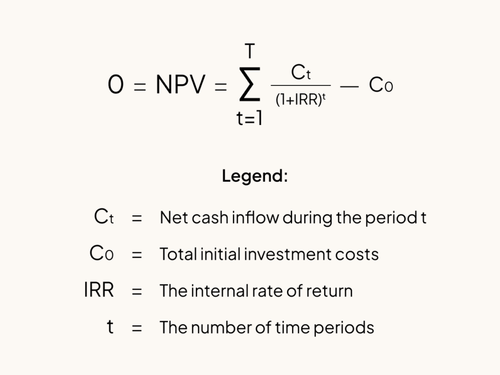

## Table of Contents

## What is the Net Internal Rate of Return (NIRR)?

The Net Internal Rate of Return (NIRR) is a way to measure how well an investment is doing over time. It takes into account the money you put in and the money you get back, and then figures out the average yearly return on that investment. Unlike the regular Internal Rate of Return (IRR), NIRR also considers the time value of money, which means it knows that a dollar today is worth more than a dollar in the future.

NIRR is really helpful for investors because it gives a more accurate picture of an investment's performance. It's especially useful for investments where money is added or taken out at different times. By using NIRR, investors can compare different investments more fairly and make better decisions about where to put their money.

## How does NIRR differ from the traditional Internal Rate of Return (IRR)?

The Net Internal Rate of Return (NIRR) and the traditional Internal Rate of Return (IRR) are both used to measure how well an investment is doing, but they do it in slightly different ways. IRR looks at the total cash flows of an investment, both the money you put in and the money you get back, and then calculates the rate at which those cash flows balance out to zero. It's like finding the interest rate that makes the investment's gains equal to its costs. However, IRR doesn't always consider the timing of when money comes in and out, which can make it less accurate for investments with irregular cash flows.

On the other hand, NIRR takes into account the time value of money, which means it knows that a dollar today is worth more than a dollar in the future. This makes NIRR more accurate for investments where you add or take out money at different times. NIRR helps you see the true performance of your investment by considering not just the amounts of money, but also when those amounts are moved in and out. This makes NIRR a better tool for comparing different investments, especially when the timing of cash flows is important.

## Why is NIRR important for investment analysis?

NIRR is important for investment analysis because it gives a more accurate picture of how well an investment is doing. It looks at not just how much money you put in and get back, but also when you do these things. This is really helpful because money today is worth more than money in the future. So, by considering the time value of money, NIRR helps you see the true performance of your investment, especially when you're adding or taking out money at different times.

Using NIRR makes it easier to compare different investments fairly. If you're looking at two investments with different cash flow timings, NIRR will give you a better idea of which one is actually performing better. This can lead to smarter investment choices because you'll have a clearer understanding of how your money is growing over time.

## How is NIRR calculated?

To calculate the Net Internal Rate of Return (NIRR), you start by figuring out all the cash flows from your investment. This means adding up all the money you put in and all the money you get back. Next, you need to find a rate that makes the present value of all these cash flows equal to zero. The present value is what the money would be worth today, taking into account that money in the future is worth less than money now. You can use a financial calculator or a computer program to find this rate, which is the NIRR.

The tricky part about calculating NIRR is that it involves trial and error. You guess a rate, calculate the present value of the cash flows, and see if it equals zero. If it doesn't, you adjust your guess and try again until you find the right rate. This process can be a bit complicated, but it's important because it gives you a good idea of how well your investment is doing, considering when you put money in and when you get it back.

## What are the key components needed to compute NIRR?

To calculate the Net Internal Rate of Return (NIRR), you need to know all the cash flows from your investment. This means adding up all the money you put into the investment and all the money you get back from it. You also need to know the exact dates when these cash flows happen, because NIRR takes into account the time value of money. This means that money today is worth more than the same amount of money in the future.

Once you have all the cash flows and their dates, you need to find a rate that makes the present value of all these cash flows equal to zero. The present value is what the money would be worth today. You can use a financial calculator or a computer program to help you find this rate. It might take a few tries to get it right, but once you do, you'll have the NIRR, which tells you how well your investment is doing over time, considering when you put money in and when you get it back.

## Can you provide a simple example of how to calculate NIRR?

Let's say you invested $1,000 in a project on January 1st, 2022. On January 1st, 2023, you added another $500 to the project. By January 1st, 2024, the project paid you back $2,000. To find the NIRR, we need to figure out the rate that makes the present value of these cash flows equal to zero, considering the time value of money.

We start by guessing a rate, let's say 10%. At this rate, the present value of the $1,000 invested on January 1st, 2022, is still $1,000. The present value of the $500 invested on January 1st, 2023, is about $454.55 (because it's discounted back one year at 10%). The present value of the $2,000 received on January 1st, 2024, is about $1,652.89 (discounted back two years at 10%). Adding these up, we get $1,000 - $454.55 + $1,652.89 = $2,198.34, which is not zero. So, we need to try a different rate.

After a few more tries, we find that a rate of about 25% makes the present values equal to zero. At 25%, the present value of the $1,000 is $1,000, the present value of the $500 is about $400, and the present value of the $2,000 is about $1,280. Adding these up, we get $1,000 - $400 + $1,280 = $1,880, which is close to zero. So, the NIRR for this investment is around 25%. This means your investment grew at an average rate of 25% per year, considering when you put money in and when you got it back.

## What are the common challenges faced when calculating NIRR?

Calculating the Net Internal Rate of Return (NIRR) can be tricky because it involves a lot of trial and error. You need to guess a rate, calculate the present value of all the cash flows at that rate, and see if it equals zero. If it doesn't, you have to keep trying different rates until you find the right one. This can take a lot of time and can be frustrating, especially if you're doing it by hand or with a simple calculator.

Another challenge is making sure you have all the right information. You need to know every time money goes into or comes out of your investment, and the exact dates of these cash flows. If you miss even one cash flow or get a date wrong, your NIRR calculation will be off. This means you have to be very careful and thorough when gathering your data, which can be hard if the investment has a lot of transactions or if the records are not well-kept.

## How does NIRR help in comparing different investment opportunities?

NIRR helps in comparing different investment opportunities by giving a clear picture of how well each investment is doing over time. It takes into account not just how much money you put in and get back, but also when these transactions happen. This is important because money today is worth more than money in the future. By considering the time value of money, NIRR shows you the true performance of an investment, making it easier to see which one is actually growing your money better.

For example, if you're looking at two investments with different cash flow timings, NIRR will help you see which one is performing better. One investment might give you money back sooner, while another might give you more money but later. NIRR helps you figure out which one is really the better deal by showing you the average yearly return, taking into account the timing of the cash flows. This way, you can make smarter choices about where to put your money, knowing that you're comparing the investments on a fair and accurate basis.

## What are the limitations of using NIRR as a performance metric?

Using NIRR as a performance metric has some limitations. One big problem is that it can be hard to calculate. You have to guess a rate, then do the math to see if it's right, and keep trying until you find the correct rate. This can take a lot of time and can be frustrating, especially if you're doing it without a computer or a special calculator. Also, you need to know every single time money goes in or out of your investment, and the exact dates of these transactions. If you miss any of these details, your NIRR calculation will be wrong.

Another limitation is that NIRR assumes you can reinvest any money you get back at the same rate. This isn't always true in real life. If you can't reinvest at the same rate, then the NIRR might make your investment look better than it really is. Also, NIRR doesn't tell you about the risk of an investment. Two investments might have the same NIRR, but one might be a lot riskier than the other. So, while NIRR is a good tool for comparing investments, it's not perfect and should be used along with other ways to measure performance.

## How can NIRR be used in conjunction with other financial metrics?

NIRR can be used with other financial metrics to get a fuller picture of how well an investment is doing. For example, you can use NIRR along with the Return on Investment (ROI) to see both the yearly return and the total return on your investment. ROI tells you how much money you made compared to what you put in, but it doesn't consider the time value of money. By looking at both NIRR and ROI, you can understand not just the overall gain but also how that gain happened over time.

Another way to use NIRR with other metrics is by looking at it with the Sharpe Ratio, which measures risk-adjusted return. The Sharpe Ratio helps you see how much extra return you're getting for the risk you're taking. While NIRR shows you the average yearly return, the Sharpe Ratio can tell you if that return is worth the risk. By using both metrics, you can make better decisions about whether an investment is a good fit for your risk tolerance and financial goals.

## What advanced techniques can be applied to improve the accuracy of NIRR calculations?

To improve the accuracy of NIRR calculations, you can use computer software or financial calculators that are made for this kind of math. These tools can do the trial and error part much faster than doing it by hand. They can try many different rates quickly until they find the one that makes the present value of all the cash flows equal to zero. This means you're more likely to get the right answer without spending a lot of time guessing and checking.

Another way to make NIRR calculations more accurate is by double-checking your data. Make sure you have all the cash flows and their exact dates right. If you miss even one small detail, your NIRR could be way off. You can also use a technique called interpolation, which helps you find the right rate by making smaller and smaller guesses until you get very close to zero. This can help you get a more precise NIRR, especially if the cash flows are complicated.

## How does NIRR apply to specific industries, such as real estate or private equity?

In real estate, NIRR is really useful for figuring out how well a property investment is doing. When you buy a property, you might put in money at different times, like when you buy it and when you fix it up. You also get money back at different times, like when you collect rent or sell the property. NIRR helps you see the average yearly return on your investment, taking into account when you put money in and when you get it back. This is important because it gives you a clear picture of how the property is performing over time, which can help you decide if it's a good investment compared to others.

In private equity, NIRR is also a great tool for measuring how well an investment is doing. Private equity investments often involve putting money into a company or a fund at different times, and getting money back when the company does well or when the fund is sold. NIRR helps you understand the true performance of these investments by considering the timing of the cash flows. This can be especially helpful when comparing different private equity opportunities, because it shows you which one is growing your money better over time.

## What is the Understanding of Net Internal Rate of Return?

Net Internal Rate of Return (Net IRR) is a crucial financial performance measurement used to assess the yield of an investment after accounting for fees and carried interests. This metric offers a refined measure of the Internal Rate of Return (IRR), thereby providing a more accurate assessment of an investment's profitability. Expressed as a percentage, Net IRR represents the annualized return an investor can expect from an investment, reflecting its true [earning](/wiki/earning-announcement) potential once all associated costs are factored in.

Net IRR is especially beneficial in capital budgeting and portfolio management. Through these contexts, it aids investors in determining the financial quality of their investments. Unlike the gross IRR, Net IRR accounts for management fees and carried interests, offering a more realistic picture of investment performance from the investor's standpoint.

The calculation of Net IRR involves identifying the discount rate where the net present value (NPV) of all projected cash flows becomes zero. Mathematically, the NPV is given by the formula:

$$
\text{NPV} = \sum \frac{C_t}{(1 + r)^t} - \text{Initial Investment}
$$

where $C_t$ represents the cash flows at time $t$, and $r$ is the discount rate. The Net IRR is the rate $r$ that solves this equation when the NPV equals zero. This calculation assists in evaluating the viability and efficiency of investment projects, enabling investors to allocate capital optimally.

By offering an intricate understanding of the financial returns of investments inclusive of supplementary costs, Net IRR emerges as an indispensable tool for investors striving for precise investment analysis and decision-making.

## What is Net IRR in Investment Analysis?

Net Internal Rate of Return (Net IRR) serves as a crucial metric in investment analysis, aiding investors in assessing the profitability of various investment opportunities while accounting for associated costs and fees. This metric is particularly beneficial in investment scenarios such as private equity, where investments often require periodic cash disbursements over time. By incorporating these cash flows and associated costs into the evaluation, Net IRR provides a more precise measure of an investment's potential profitability.

The Net IRR is essentially an adjustment of the Internal Rate of Return (IRR), designed to offer a more accurate reflection by considering the effects of management fees and carried interest. A higher Net IRR typically signifies a more lucrative investment, as it indicates that the investor can expect greater annualized returns after costs are deducted. However, it's important to note that investments with a lower Net IRR may still be advantageous if they offer steady and sustainable returns over an extended period.

In practical terms, Net IRR assists investors in project evaluation, ensuring optimal allocation of capital resources. For instance, private equity investments often involve a series of capital calls and distributions, making Net IRR a suitable measure for evaluating the potential outcomes of such ventures. A higher Net IRR suggests not only better financial performance but also more efficient project execution and strategic management, which are vital in determining the viability and success of long-term investment projects.

Mathematically, the calculation of Net IRR involves finding the discount rate ($r$) that sets the net present value (NPV) of cash flows, including costs and expenses, to zero. The formula used is:

$$
NPV = \sum \frac{C_t}{(1 + r)^t} - I = 0
$$

where $C_t$ represents the cash flow at time $t$, and $I$ is the initial investment cost.

Python can be used to compute Net IRR by leveraging library functions such as `numpy`:

```python
import numpy as np

def calculate_net_irr(cash_flows):
    return np.irr(cash_flows)

# Example usage with cash flows: Initial Investment: -1000, Year 1: 200, Year 2: 300, Year 3: 700
cash_flows = [-1000, 200, 300, 700]
net_irr = calculate_net_irr(cash_flows)
print(f"The Net IRR is {net_irr:.2%}")
```

This integration of Net IRR in investment analysis provides a robust framework for comparing and selecting investment options based on their profitability and cost-effectiveness. It guides investors in making informed decisions aligned with their financial goals and risk profiles, ultimately enhancing the strategic management of their investment portfolios.

## References & Further Reading

Principles of Corporate Finance by Richard A. Brealey, Stewart C. Myers, and Franklin Allen offers a comprehensive overview of modern finance principles, providing insights into the valuation of investments and the strategic application of Net Internal Rate of Return (Net IRR) in capital budgeting and investment analysis. The text is a valuable resource for understanding the theoretical foundations and practical applications of financial metrics, including IRR and Net IRR, in making informed investment decisions.

Valuation: Measuring and Managing the Value of Companies by McKinsey & Company Inc. focuses on the techniques and frameworks essential for valuing businesses. It addresses the role of performance metrics like Net IRR in assessing company value and investment portfolio management. The book serves as a practical guide for professionals seeking to enhance their capabilities in financial valuation and capital management.

Investment Valuation: Tools and Techniques for Determining the Value of Any Asset by Aswath Damodaran examines the methodologies for assessing the worth of various asset classes. This reference is instrumental in applying Net IRR calculations to real-world scenarios, allowing investors to gauge potential returns and align investment strategies with financial objectives.

Algorithmic Trading & DMA: An introduction to direct access trading strategies by Barry Johnson provides insights into the application of [algorithmic trading](/wiki/algorithmic-trading) techniques within financial markets. It explores how traditional financial metrics, including IRR, can be embedded in algorithmic models to optimize trading strategies. The book effectively combines theory and practice, highlighting the technological advancements that enhance investment decision-making.

Python for Finance: Mastering Data-Driven Finance by Yves Hilpisch investigates into the integration of programming, particularly Python, in financial analysis and trading. This reference is valuable for those looking to implement algorithmic trading strategies while incorporating financial metrics like Net IRR to improve precision and decision-making. The book covers data processing, predictive analytics, and model calibration techniques essential for modern finance professionals.

