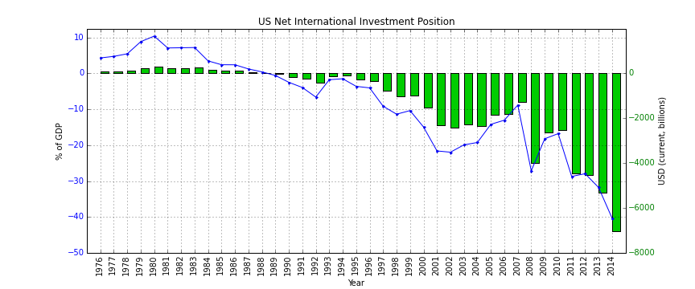

## Table of Contents

## What is the Net International Investment Position (NIIP)?

The Net International Investment Position (NIIP) is a measure that shows the difference between what a country owns abroad and what foreigners own in that country. It's like a financial snapshot that tells us if a country is a net lender or a net borrower to the rest of the world. If a country has a positive NIIP, it means they own more assets abroad than foreigners own in their country. If it's negative, it means foreigners own more assets in the country than the country owns abroad.

Understanding the NIIP is important because it can tell us about a country's economic health. A positive NIIP can be a sign of economic strength, showing that the country is investing more abroad than it is borrowing. On the other hand, a negative NIIP might suggest that a country is relying more on foreign investment to fuel its economy. This can be a concern if the country struggles to pay back what it owes, but it's not always a bad thing as it can also mean the country is attractive to foreign investors.

## Why is the NIIP important for a country's economy?

The NIIP is important for a country's economy because it shows if the country is a net lender or a net borrower to the rest of the world. If a country has a positive NIIP, it means they own more assets abroad than foreigners own in their country. This can be a good sign, showing that the country is financially strong and investing in other countries. It's like having more money in the bank than you owe on your credit cards.

On the other hand, if a country has a negative NIIP, it means foreigners own more assets in the country than the country owns abroad. This can be a concern because it might mean the country is borrowing a lot from other countries. But it's not always bad. A negative NIIP can also mean that the country is attractive to foreign investors, which can help the economy grow. It's like having a lot of credit card debt, but also having a good job that attracts investors.

## How is the NIIP calculated?

The NIIP is calculated by subtracting the total value of a country's liabilities to the rest of the world from the total value of its assets abroad. Assets can include things like foreign stocks, bonds, and real estate that the country owns. Liabilities are what the country owes to foreigners, like loans, bonds, and foreign investments in the country.

To find the NIIP, you take all the assets the country owns abroad and add them up. Then, you take all the liabilities the country owes to foreigners and add them up. Finally, you subtract the total liabilities from the total assets. If the result is positive, the country has a positive NIIP, meaning it owns more abroad than it owes. If the result is negative, the country has a negative NIIP, meaning it owes more to foreigners than it owns abroad.

## What is the difference between NIIP and the Balance of Payments?

The Net International Investment Position (NIIP) and the Balance of Payments (BOP) are both important measures in international economics, but they show different things. The NIIP is like a snapshot of a country's financial health at a specific time. It tells us if a country owns more assets abroad than what foreigners own in the country. If a country has a positive NIIP, it means they have more money invested abroad than what they owe to foreigners. If it's negative, it means foreigners own more in the country than the country owns abroad.

The Balance of Payments, on the other hand, is like a record of all the money coming in and going out of a country over a period of time, usually a year. It includes things like exports and imports, money sent home by workers abroad, and investments. The BOP is divided into two main parts: the current account, which shows the trade in goods and services, and the capital account, which shows the flow of investments. While the NIIP gives us a picture of a country's financial position at one moment, the BOP tells us how the country's financial situation has changed over time.

## Can you explain the components that make up the NIIP?

The Net International Investment Position (NIIP) is made up of two main parts: assets and liabilities. Assets are things a country owns in other countries, like stocks, bonds, and real estate. These are investments that the country has made abroad. Liabilities, on the other hand, are what the country owes to foreigners. This can include loans, bonds, and foreign investments in the country. To find the NIIP, you subtract the total liabilities from the total assets.

The NIIP gives us a snapshot of a country's financial health at a specific time. If a country has more assets than liabilities, it has a positive NIIP, which means it owns more abroad than it owes to foreigners. This can be a sign of financial strength. If a country has more liabilities than assets, it has a negative NIIP, meaning foreigners own more in the country than the country owns abroad. This can be a concern, but it's not always bad because it can also mean the country is attractive to foreign investors.

## How does a positive NIIP differ from a negative NIIP?

A positive NIIP means a country owns more assets abroad than what foreigners own in that country. It's like having more money in the bank than you owe on your credit cards. This can be a good sign because it shows the country is financially strong and is investing in other countries. It's a bit like being a net lender to the rest of the world, which can be a sign of economic health and stability.

On the other hand, a negative NIIP means foreigners own more assets in the country than the country owns abroad. It's like having more credit card debt than money in the bank. This can be a concern because it might mean the country is borrowing a lot from other countries. But it's not always bad. A negative NIIP can also mean that the country is attractive to foreign investors, which can help the economy grow. It's like having a lot of debt, but also having a good job that attracts investors.

## What are the economic implications of a country having a large negative NIIP?

When a country has a large negative NIIP, it means that foreigners own more assets in the country than the country owns abroad. This can be a bit like having a big credit card debt. It might worry people because it could mean the country is borrowing a lot of money from other countries. If the country can't pay back what it owes, it could lead to financial problems. This might make it harder for the country to borrow money in the future because lenders might see it as risky.

But having a large negative NIIP isn't always bad. It can also mean that the country is attractive to foreign investors. When foreigners invest in a country, it can help the economy grow. They might build new factories, start new businesses, or buy things that help create jobs and boost the economy. So, while a large negative NIIP can be a concern, it can also be a sign that the country is doing well enough to attract foreign investment.

## How does the NIIP affect a country's currency value?

The Net International Investment Position (NIIP) can affect a country's currency value in a few ways. When a country has a positive NIIP, it means they own more assets abroad than foreigners own in their country. This can make the country's currency stronger because it shows that the country is financially healthy and investing in other countries. People might want to buy the country's currency because they think it's a good investment.

On the other hand, a large negative NIIP can make a country's currency weaker. This happens because a negative NIIP means the country owes more to foreigners than it owns abroad. If people think the country might have trouble paying back what it owes, they might not want to buy its currency. But if the negative NIIP is because the country is attractive to foreign investors, it might not hurt the currency as much. It all depends on what people think about the country's financial health.

## What role does foreign direct investment play in the NIIP?

Foreign direct investment (FDI) is when a company or person from one country invests in a business in another country. This can be things like building a factory or buying a company. When a country gets FDI, it means foreigners are putting money into the country. This adds to the country's liabilities in the NIIP because it's money the country owes to foreigners. But if the country's businesses invest in other countries, that's money going out, which adds to the country's assets in the NIIP.

FDI can make a country's NIIP go more negative if it's getting more money from foreigners than it's investing abroad. But it's not always bad. When a country gets FDI, it can help the economy grow. New factories and businesses can create jobs and make the country more productive. So, while FDI can make the NIIP look worse, it can also be a good thing for the country's economy.

## How do changes in global interest rates impact the NIIP?

Changes in global interest rates can affect a country's NIIP because they change how much it costs to borrow money and how much people can earn from their investments. If global interest rates go up, it can make it more expensive for a country to pay back what it owes to foreigners. This can make the country's NIIP worse if it has a lot of debt. On the other hand, if the country has a lot of money invested abroad, higher interest rates can mean it earns more from those investments, which can make the NIIP better.

But it's not just about borrowing and [earning](/wiki/earning-announcement). When interest rates change, it can also affect how much money people want to invest in different countries. If interest rates go up in one country, it might attract more foreign investment because people want to earn more from their money. This can make the country's NIIP worse because it means more money coming in from foreigners. But if interest rates go up in other countries, it might make people want to take their money out of the country to invest it where they can earn more, which can make the NIIP better because it means less money the country owes to foreigners.

## Can you discuss a historical example where NIIP significantly influenced a country's economic policy?

One historical example where the NIIP significantly influenced a country's economic policy is Japan in the 1980s and 1990s. During this time, Japan had a very large positive NIIP, meaning it owned more assets abroad than foreigners owned in Japan. This was because Japan was investing a lot of money in other countries, especially the United States. The positive NIIP made Japan's economy look strong, and it helped the country's currency, the yen, become stronger. But it also led to some problems. The government worried that if the yen got too strong, it would make Japanese exports more expensive and hurt the economy. So, they tried to keep the yen from getting too strong by buying other countries' currencies and keeping interest rates low.

In response to the large positive NIIP, Japan's economic policy focused on managing the yen's value and trying to balance the benefits and risks of having so much money invested abroad. The government used a policy called "quantitative easing," where they printed more money to keep interest rates low. This was meant to encourage people to spend and invest more at home instead of sending so much money abroad. But it also led to a big bubble in the stock market and real estate, which eventually burst and caused a long period of economic trouble for Japan. So, the NIIP played a big role in shaping Japan's economic policies during this time, showing how important it can be for a country's overall economic health.

## What advanced metrics or models are used to analyze the sustainability of a country's NIIP?

When looking at how sustainable a country's NIIP is, economists often use advanced metrics like the External Wealth of Nations (EWN) model. This model helps them understand not just the current NIIP but also how it might change in the future. It looks at things like how much a country is saving, how much it's investing, and how these things might affect its NIIP over time. By using the EWN model, economists can see if a country's NIIP is likely to stay positive or negative and whether it's on a path that can be maintained in the long run.

Another useful tool is the Intertemporal Budget Constraint (IBC) model. This model helps economists figure out if a country can keep its NIIP at its current level without running into financial trouble. It looks at things like how much a country is borrowing and lending, and whether it can pay back what it owes. The IBC model is important because it helps economists see if a country's NIIP is sustainable or if it might need to change its economic policies to avoid problems in the future. Both the EWN and IBC models give a deeper look into a country's financial health and help guide decisions about economic policy.

## References & Further Reading

[1]: Lane, P. R., & Milesi-Ferretti, G. M. (2001). ["The External Wealth of Nations: Measures of Foreign Assets and Liabilities for Industrial and Developing Countries."](https://pages.stern.nyu.edu/~dbackus/BCH/capital%20flows/LaneMilesiFerretti%20JIE%2001.pdf) The Economic Journal, 112(481), 1299-1339.

[2]: Melvin, M., & Prins, J. D. (2015). ["The Global Transmission of Volatility in the Foreign Exchange Market."](https://www.public.asu.edu/~mmelvin/restatpublication.pdf) Review of Economics and Statistics, 97(1), 151-163.

[3]: Hamilton, J. D., & Wu, J. C. (2011). ["The Effectiveness of Alternative Monetary Policy Tools in a Zero Lower Bound Environment."](https://www.jstor.org/stable/41336777) National Bureau of Economic Research.

[4]: Pukthuanthong, K., & Roll, R. (2009). ["Global Market Integration: An Alternative Measure and Its Application."](https://www.sciencedirect.com/science/article/pii/S0304405X09001214) Journal of Financial Economics, 94(2), 214-232.

[5]: Arner, D. W., Barberis, J. N., & Buckley, R. P. (2015). ["The Evolution of FinTech: A New Post-Crisis Paradigm?"](https://papers.ssrn.com/sol3/papers.cfm?abstract_id=2676553) Georgetown Journal of International Law, 47(4), 1271-1319.