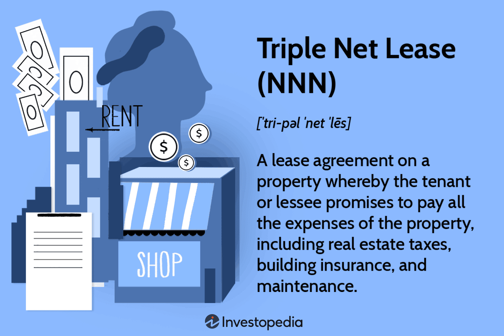

This article explores the concepts of net lease, single net lease, triple net lease, and algorithmic trading, highlighting their roles, differences, and significance in investment strategies. Net leases have become popular in the commercial real estate sector primarily because they shift various property-related expenses from landlords to tenants. This transfer often includes insurance, maintenance, and property taxes, making net leases an appealing choice for property owners seeking predictable income streams and reduced operational responsibilities. 

Algorithmic trading, a technological breakthrough in financial markets, allows investors to deploy computer algorithms for automated and rapid trading decisions. These systems utilize complex mathematical models to analyze market data and execute trades at speeds beyond human capabilities. As a result, algorithmic trading has enhanced market liquidity and efficiency while providing opportunities for investors to optimize their trading strategies and mitigate risks.



The convergence of real estate and technology creates unique opportunities and challenges for investors. On one hand, it presents avenues for increased efficiency, precision, and data-driven decision-making. On the other, it necessitates a nuanced understanding of both domains to effectively integrate new technologies into traditional real estate investment practices. This intersection holds potential for revolutionizing investment strategies, driving innovation, and shaping the future of asset management.

## Table of Contents

## Understanding Net Lease Structures

Net leases are a fundamental component of commercial real estate, representing agreements in which tenants assume a significant portion of property-related expenses that are typically borne by landlords in other lease structures. These expenses can include property taxes, insurance, and maintenance costs. The defining characteristic of a net lease is the degree to which these financial responsibilities are transferred from the landlord to the tenant, which distinguishes net leases from the more traditional gross lease agreements.

In a gross lease, the landlord is responsible for covering most, if not all, of the property-related expenses. The tenant pays a fixed rental amount, and the landlord absorbs the variability in costs associated with maintaining the property. This structure provides predictability for tenants regarding their monthly financial commitments, but it also places the burden of fluctuating property expenses on landlords.

Net leases, conversely, pass some or all these variable property expenses to tenants, depending on the type of net lease—be it single, double, or triple. In a single net lease (N lease), the tenant pays base rent plus a portion of the property taxes. A double net lease (NN lease) requires tenants to cover base rent, property taxes, and insurance premiums. A triple net lease (NNN lease) further includes maintenance costs, making it the most comprehensive transfer of financial responsibilities to tenants.

The implications for landlords engaged in net lease agreements are significant. By shifting specific financial burdens to tenants, landlords can enjoy a more stable and predictable income stream, as property-related cost fluctuations do not directly impact their bottom line. This stability is attractive for investors seeking passive income with reduced operational responsibilities.

For tenants, net lease agreements can present both opportunities and challenges. While tenants gain a degree of financial transparency related to their rental space, as they only pay for what they use, they also bear the risk of cost increases in taxes, insurance, and maintenance, which can add complexity to budgeting and financial planning.

Ultimately, net lease structures offer strategic benefits to both parties. Landlords reduce their operational risk, potentially increasing the property's attractiveness to investors seeking stable, long-term yields. Meanwhile, tenants enjoy greater control over specific property expenses, which can lead to cost savings if managed effectively. This delicate balance of responsibilities and financial implications makes net leases a widely adopted and versatile option in the commercial real estate landscape.

## Types of Net Leases: Single, Double, and Triple

Net leases are a prevalent financial structure within the commercial real estate sector, allowing the allocation of various property-related expenses between landlords and tenants. The primary variations of net leases include single, double, and triple net leases, each characterized by the different levels of expense responsibilities borne by tenants.

**Single Net Lease (N Lease):**
In a single net lease, the tenant is responsible for paying a portion of the property taxes in addition to the base rent. The landlord typically remains accountable for all other operating expenses such as maintenance, insurance, and utilities. This structure is beneficial for tenants as it limits their additional financial responsibilities, reducing complexity. For landlords, however, managing operational expenses can be cumbersome and financially binding.

*Example:* In a commercial property leased under a single net agreement, a tenant renting a 20,000 square foot space might pay $10 per square foot in base rent plus a specified amount towards property taxes. If the annual property taxes are $50,000, the tenant might cover $10,000, calculated based on their proportional occupancy.

**Double Net Lease (NN Lease):**
Double net leases transfer the responsibility of both property taxes and insurance to tenants, while landlords manage maintenance costs. This allocation provides a more balanced distribution of financial duties, often resulting in lower base rents than gross lease agreements. Tenants benefit from some predictability over property expenses, while landlords mitigate risk associated with taxes and insurance.

*Example:* Under a double net lease, a company leases office space within a large building, agreeing to pay not only the base rent but also its share of property taxes and insurance premiums. This might translate to a base rent of $12 per square foot, an additional $2 per square foot towards taxes, and $1 per square foot for insurance, leading to a total of $15 per square foot.

**Triple Net Lease (NNN Lease):**
The triple net lease places the most financial responsibility on tenants, requiring them to cover property taxes, insurance, and maintenance expenses. This lease type effectively places the tenant in a role similar to that of a property owner, offering landlords a relatively passive income. Investors often favor triple net leases due to their predictable income stream and minimal management responsibilities.

*Example:* A retail chain agrees to a triple net lease for a store location. In addition to the base rent of $15 per square foot, the tenant pays for property taxes, insurance, and maintenance costs, resulting in total expenses of $20 per square foot. This structure allows the retail chain control over its operating environment while enabling the landlord to focus on investments without extensive property oversight.

**Advantages and Disadvantages:**

- **Landlords:**
  - *Advantages:* Reduced management responsibility, potential for stable income, and risk mitigation from fluctuating taxes and insurance premiums.
  - *Disadvantages:* Possible difficulty in attracting tenants for triple net leases, exposure to tenant compliance risks, and reduced control over property maintenance quality.

- **Tenants:**
  - *Advantages:* More control over operating expenses under double and triple net leases, potential for lower base rent negotiations, and clearer financial forecasting.
  - *Disadvantages:* Increased financial obligation, risk of unexpected maintenance costs, and the complexity of managing additional expenses.

Net leases, therefore, offer tailored solutions for various tenant and investor needs, balancing risk, responsibility, and potential returns. Understanding these distinct structures enables stakeholders to optimize lease agreements in alignment with their strategic and financial goals.

## The Dynamics of Triple Net Leases

Triple net leases (NNN leases) are a prevalent choice among investors due to their distinctive financial structure, offering long-term income stability and reduced management responsibilities. In a triple net lease, tenants assume the burden of paying the net amount for three critical expense categories: property taxes, insurance, and maintenance. This arrangement contrasts with gross leases, where the landlord is responsible for these costs.

### Attractiveness to Investors

Triple net leases are favored by investors primarily because they transform property investment into a more predictable revenue stream. By transferring the operation and maintenance costs to the tenant, landlords enjoy reduced exposure to fluctuations in operating expenses. This predictable structure allows investors to receive a consistent income stream with minimal intervention, which is particularly attractive for risk-averse individuals seeking stable cash flows.

### Typical Tenants of Triple Net Leases

The types of tenants engaged in triple net leases are typically well-established corporations, often from sectors like retail, fast-food chains, and other large-scale commercial enterprises. For instance, major retailers such as Walmart and Starbucks, and fast-food chains like McDonald's, frequently enter into triple net leases. Their financial stability assures investors of reliable rent payments over the long-term duration of these contracts.

These tenants benefit from a triple net lease by gaining greater control over the property, allowing them to tailor the maintenance and insurance to their specific needs while also benefiting from potentially lower base rent. Moreover, for tenants like retailers, occupying well-located properties on a triple net lease can align their operational costs more closely with their business revenues.

### Considerations for Investors

Investors evaluating properties for triple net lease arrangements must consider several factors to maximize their returns. First, a thorough assessment of tenant creditworthiness is crucial as it directly influences the reliability of income. Properties leased to high-credit tenants are generally more secure and can command a premium price in the investment market.

Additionally, the location of the property plays a significant role in its long-term value. High-traffic or high-demand areas tend to enhance the investment's appeal as they often ensure a continuous flow of customers to tenant businesses, thus supporting stable tenancies.

Lease terms also warrant careful scrutiny. Long leases with periodic escalation clauses can protect investors from inflation by ensuring rent growth over time. Lastly, understanding the local real estate market dynamics and any impending changes in zoning or taxation regulations is crucial for a well-informed investment decision.

In summary, triple net leases offer investors a mechanism to achieve passive income with comparatively lower risks, provided they undertake diligent assessment of the property's location, market conditions, and the tenant's financial strength.

 to Algorithmic Trading

Algorithmic trading, often referred to as algo trading, involves the use of computer programs to execute trading strategies automatically. It is an innovation that has significantly transformed modern financial markets. By leveraging complex algorithms, data analysis, and high-speed execution, [algorithmic trading](/wiki/algorithmic-trading) enables investors to implement strategies that would be difficult or impossible to execute manually.

The significance of algorithmic trading in financial markets lies in its ability to increase efficiency, reduce human error, and optimize execution speed. Algorithms can process vast amounts of data and execute trades at speeds far beyond human capabilities, allowing traders to capitalize on small price movements in the market. This increased efficiency can lead to lower transaction costs and improved market [liquidity](/wiki/liquidity-risk-premium).

Key components of an algorithmic trading system include data analysis, strategy development, and execution. Data analysis involves collecting and processing market data to identify patterns, trends, and opportunities. This might utilize historical data and real-time market data to develop insights. Strategy development is the stage where specific trading rules are established based on the insights gained from data analysis. A trading algorithm might be based on a variety of strategies, such as statistical [arbitrage](/wiki/arbitrage), market-making, or trend-following.

The execution component involves the actual implementation of the trading strategy within the market. Algorithms are designed to execute orders automatically and in accordance with pre-set conditions, thereby reducing the impact of emotional decision-making and allowing for consistent strategy application.

Automation and technology play pivotal roles in enhancing trading efficiency and decision-making. Modern algo trading systems are crafted to operate in environments where seconds matter, and the ability to execute trades quickly can make a significant difference. Techniques such as [machine learning](/wiki/machine-learning) and [artificial intelligence](/wiki/ai-artificial-intelligence) are increasingly used to refine trading algorithms, allowing them to adapt to changing market conditions. Algorithms can be programmed to monitor multiple markets simultaneously, execute trades based on complex strategies, and even cancel transactions if market conditions change unfavorably.

In Python, a basic framework for an algorithmic trading strategy might involve libraries such as NumPy for numerical calculations, pandas for data manipulation, and libraries such as Backtrader for [backtesting](/wiki/backtesting). Here's a simplified example illustrating a mean-reversion trading strategy:

```python
import numpy as np
import pandas as pd
from backtrader import Cerebro, SignalStrategy, data as btdata

class MeanReversionStrategy(SignalStrategy):
    def __init__(self):
        self.data = self.datas[0]
        self.moving_average = self.data.close.rolling(window=20).mean()
        self.signal = pd.Series(index=self.data.close.index, data=0)

    def next(self):
        if self.data.close[0] < self.moving_average[0]:
            self.signal[0] = 1  # Buy
        elif self.data.close[0] > self.moving_average[0]:
            self.signal[0] = -1  # Sell

data = btdata.GenericCSVData(dataname='market_data.csv')
cerebro = Cerebro()
cerebro.adddata(data)
cerebro.addstrategy(MeanReversionStrategy)
cerebro.run()
```

This example is highly simplified and intended for educational purposes. In practice, algorithmic trading systems are much more sophisticated, employing robust error-checking, risk management features, and mechanisms for handling trading anomalies.

Overall, algorithmic trading harnesses the power of technology to create significant advantages in the financial markets, enabling the execution of complex trading strategies with precision and speed unattainable through manual processes.

## The Intersection of Real Estate and Algo Trading

Algorithmic trading, traditionally associated with equities and commodities markets, is increasingly finding applications in real estate investments. This convergence of real estate and algorithmic trading presents the prospect of enhancing efficiency in market analysis and decision-making. By employing advanced algorithms, investors can potentially automate significant portions of the investment process, reducing human error and improving the speed of transactions.

Algorithmic trading techniques in real estate primarily involve automated market analysis. Algorithms can be designed to process large volumes of data, identifying patterns and trends that may not be immediately apparent to human analysts. This includes analyzing historical property prices, rental yields, market supply and demand dynamics, and macroeconomic indicators that influence real estate markets. For instance, a machine learning algorithm could be developed to predict property price movements based on variables such as interest rates, employment figures, and regional economic growth. 

The implementation of these strategies requires detailed models that can process diverse data sets. Python, a language preferred for its extensive libraries and ease of use, can be utilized to create such models. An example of a simple predictive model might involve using linear regression to estimate future property prices. The code snippet below outlines the basics of implementing a linear regression model in Python for this purpose:

```python
import pandas as pd
from sklearn.model_selection import train_test_split
from sklearn.linear_model import LinearRegression
from sklearn.metrics import mean_squared_error

# Load dataset
data = pd.read_csv('property_data.csv')
X = data[['interest_rate', 'employment_rate', 'economic_growth']]
y = data['property_price']

# Split the data
X_train, X_test, y_train, y_test = train_test_split(X, y, test_size=0.2, random_state=42)

# Train the model
model = LinearRegression()
model.fit(X_train, y_train)

# Make predictions
predictions = model.predict(X_test)

# Evaluate the model
mse = mean_squared_error(y_test, predictions)
print(f'Mean Squared Error: {mse}')
```

Despite the promising advantages, integrating algorithmic trading into real estate presents several challenges. The real estate market is less liquid than traditional financial markets, leading to potential difficulties in executing large transactions quickly. Furthermore, the data sets in real estate can be less uniform and more localized, necessitating the development of highly customized algorithms to accommodate these unique characteristics.

Another consideration is the potential for market disruption. The application of automated strategies can result in increased [volatility](/wiki/volatility-trading-strategies) if not managed carefully, especially in smaller or less stable markets.

In summary, integrating algorithmic trading strategies into real estate investments offers significant potential for optimizing investment decisions and identifying profitable opportunities. However, it requires careful consideration of market-specific challenges and the development of sophisticated, customized algorithms. As technology continues to advance, the opportunities for applying algorithmic trading in real estate are likely to expand, offering new pathways for innovation in the sector.

## Case Studies

### Case Studies

#### Real-world Examples of Successful Net Lease Agreements and Their Financial Outcomes

A noteworthy example of a successful net lease agreement is the case involving a national retail chain entering into a triple net lease (NNN) for a prime commercial property. In this scenario, the tenant agreed to cover all property-related expenses, including property taxes, insurance, and maintenance costs. As a result, the property owner benefited from a stable and predictable cash flow, while reducing the burden of day-to-day property management. 

This agreement exemplified the advantages of NNN leases for landlords, who could focus on investment strategies with minimized risk, thanks to the tenant taking on typical ownership responsibilities. Conversely, the tenant capitalized on a long-term lease with fixed expenses, enabling precise financial forecasting and budgeting. Such agreements are especially popular among retail giants and fast-food chains, where high traffic locations justify the comprehensive tenant responsibilities.

One impactful financial outcome of such a net lease agreement is evident when examining net present value (NPV) due to deterministic cash flows. For instance, if the lease guaranteed $100,000 annually over a period of ten years, with a discount rate of 5%, the NPV would be calculated as follows:

$$
NPV = \sum_{t=1}^{10} \frac{100,000}{(1 + 0.05)^t} \approx 772,173
$$

This reflects the substantial economic advantage to the property owner given the current value of future cash inflows.

#### Case Study on the Use of Algorithmic Trading Strategies in Property Market Investments

A prominent case in the domain of algorithmic trading within property investments involved a [hedge fund](/wiki/hedge-fund-trading-strategies) developing an algorithm to predict property value fluctuations based on a multitude of market indicators. By leveraging large datasets, including historical price trends, interest rates, and economic indicators, the algorithm functioned to automate trading decisions and optimize the fund's portfolio.

The algorithm applied machine learning techniques to enhance predictive accuracy. Python and libraries like TensorFlow and pandas facilitated the data handling and model training process. A sample code snippet for a simple linear regression model might include:

```python
import pandas as pd
from sklearn.model_selection import train_test_split
from sklearn.linear_model import LinearRegression
from sklearn.metrics import mean_squared_error

# Loading dataset
data = pd.read_csv('property_data.csv')
X = data[['interest_rate', 'economic_indicator']]
y = data['property_value']

# Splitting data
X_train, X_test, y_train, y_test = train_test_split(X, y, test_size=0.2, random_state=0)

# Initializing and training model
model = LinearRegression()
model.fit(X_train, y_train)

# Predicting and evaluating
predictions = model.predict(X_test)
mse = mean_squared_error(y_test, predictions)
print(f'Mean Squared Error: {mse}')
```

This algorithm managed to achieve a high degree of accuracy by recognizing subtle patterns, resulting in lucrative investment opportunities and higher yields than traditional methods. The success of this approach exemplifies how technology can augment real estate investment strategies, providing more nuanced insights and expanding the potential for financial gain. Challenges persisted in model interpretability and data quality, yet the advantages demonstrated technology's critical role in modern investment landscapes.

## Conclusion

The integration of net leases and algorithmic trading within investment strategies offers considerable benefits to investors seeking both stability and technological enhancement. Net lease structures, particularly triple net leases, provide a reliable income source by shifting various property-related expenses to tenants. This reduces the financial burden on landlords and ensures steady cash inflows, allowing investors to focus on portfolio expansion and strategic diversification.

On the other hand, algorithmic trading brings automation, efficiency, and data-driven insight to financial markets. It enables investors to make informed decisions rapidly, capturing market opportunities that human traders might miss. The synergy between these two approaches can lead to significant improvements in investment outcomes. By applying algorithmic trading principles to real estate, investors can automate market analysis and optimize decision-making processes, thus enhancing portfolio management.

Looking ahead, the continuous evolution of technology is poised to further transform the real estate sector. Artificial intelligence, machine learning, and blockchain technology are emerging as pivotal tools for property management, valuation, and transaction security. These advancements promise to streamline operations, reduce costs, and improve transparency, fostering trust and innovation in real estate investments.

Investors are encouraged to adopt diversified strategies that integrate both traditional methods like net leasing and cutting-edge technological approaches such as algorithmic trading. This balanced strategy can mitigate risks and capitalize on diverse market opportunities, ensuring robust portfolio performance in an increasingly complex financial landscape. The fusion of real estate stability with technological agility positions investors to thrive in the dynamic and competitive world of modern finance.

## References & Further Reading

[1]: Flint, A. E., & Paladino, I. (2016). ["Commercial Real Estate Leases: Present and Future Trends."](https://www.bizapedia.com/trademarks/ghost-lube-86817078.html) Cambridge Scholars Publishing.

[2]: Geltner, D., & Miller, N. G. (2001). ["Commercial Real Estate Analysis and Investments."](https://www.researchgate.net/publication/245702364_Commercial_Real_Estate_Analysis_and_Investments) South-Western College Pub.

[3]: Narang, R. K. (2013). ["Inside the Black Box: A Simple Guide to Quantitative and High Frequency Trading."](https://onlinelibrary.wiley.com/doi/book/10.1002/9781118662717) Wiley.

[4]: Lopez de Prado, M. (2018). ["Advances in Financial Machine Learning."](https://www.amazon.com/Advances-Financial-Machine-Learning-Marcos/dp/1119482089) Wiley.

[5]: Chan, E. (2017). ["Quantitative Trading: How to Build Your Own Algorithmic Trading Business."](https://github.com/ftvision/quant_trading_echan_book) Wiley.