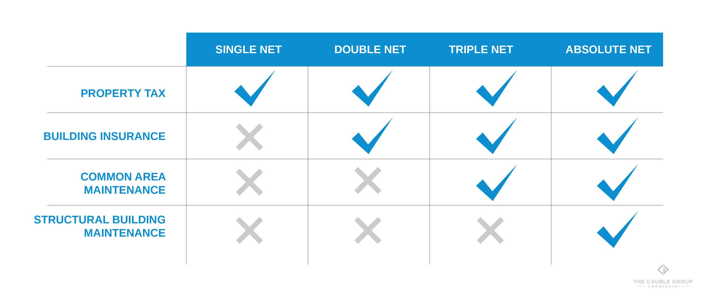

## Table of Contents

## What is a net lease?

A net lease is a type of lease agreement where the tenant pays not only the rent but also some or all of the property expenses that the landlord usually pays. These expenses can include things like property taxes, insurance, and maintenance costs. In a net lease, the tenant takes on more responsibility for the property's costs, which can help the landlord have a more predictable income.

There are different types of net leases, such as single net lease, double net lease, and triple net lease. In a single net lease, the tenant pays the rent plus the property taxes. A double net lease adds insurance costs to the tenant's responsibilities. The most common type is the triple net lease, where the tenant pays rent, property taxes, insurance, and maintenance costs. This type of lease is often used for commercial properties like shopping centers or office buildings.

## What are the different types of net leases?

Net leases come in different types, and they are called single net lease, double net lease, and triple net lease. A single net lease is the simplest one. In this type, the tenant pays the rent and also the property taxes. The landlord still takes care of the other costs like insurance and maintenance. A double net lease adds one more cost for the tenant. Besides paying rent and property taxes, the tenant also pays for the insurance of the property. The landlord handles the maintenance costs.

The most common type of net lease is the triple net lease, often called NNN lease. In a triple net lease, the tenant pays rent, property taxes, insurance, and maintenance costs. This means the tenant is responsible for almost all the costs of the property. Triple net leases are often used for big commercial properties like shopping centers or office buildings. They help the landlord have a steady income because the tenant takes care of most of the expenses.

## What is a single net lease?

A single net lease is a type of lease where the tenant pays the rent and the property taxes. It is the simplest kind of net lease. The landlord still takes care of other costs like insurance and maintenance. This type of lease is good for tenants who want to know exactly what they need to pay each month.

In a single net lease, the tenant only has to worry about the rent and property taxes. The landlord handles everything else. This can be easier for tenants who do not want to deal with many different bills. It also helps the landlord because they still have some control over the property's other costs.

## What expenses are typically covered under a single net lease?

In a single net lease, the tenant pays the rent and the property taxes. This is the only extra cost the tenant has to take care of. The landlord pays for everything else, like insurance and maintenance.

This type of lease is simple. It helps tenants know exactly what they need to pay each month. The landlord still has control over other costs, which can be good for them too.

## What is a double net lease?

A double net lease is a type of lease where the tenant pays the rent, the property taxes, and the insurance costs. This is a bit more than what tenants pay in a single net lease. In a double net lease, the tenant has to take care of two extra costs, which is why it's called a double net lease.

The landlord still pays for the maintenance of the property in a double net lease. This means the tenant does not have to worry about fixing things or keeping the property in good shape. The double net lease is good for tenants who want to know their costs but do not want to handle all the expenses of the property.

## What additional expenses are included in a double net lease compared to a single net lease?

In a double net lease, the tenant pays for more things than in a single net lease. Besides paying the rent and the property taxes, the tenant also has to pay for the insurance of the property. This means the tenant takes care of two extra costs, which is why it's called a double net lease.

The landlord still pays for the maintenance of the property in a double net lease. So, the tenant does not have to worry about fixing things or keeping the property in good shape. A double net lease is good for tenants who want to know their costs but do not want to handle all the expenses of the property.

## What is a triple net lease?

A triple net lease, often called an NNN lease, is a type of lease where the tenant pays the rent, property taxes, insurance, and maintenance costs. This means the tenant takes care of almost all the costs of the property. Triple net leases are very common for big commercial properties like shopping centers or office buildings. They help the landlord have a steady income because the tenant handles most of the expenses.

In a triple net lease, the tenant has a lot of responsibility. They need to make sure the property taxes are paid, the insurance is up to date, and the building is kept in good shape. This can be good for tenants who want to control the property and its costs. But it can also be a lot of work. The landlord benefits because they do not have to worry about these costs, making their income more predictable.

## How does a triple net lease differ from single and double net leases in terms of expense responsibilities?

A triple net lease, or NNN lease, is different from single and double net leases because the tenant pays for more things. In a triple net lease, the tenant pays the rent, property taxes, insurance, and maintenance costs. This means the tenant takes care of almost all the costs of the property. In a single net lease, the tenant only pays the rent and property taxes. The landlord pays for insurance and maintenance. In a double net lease, the tenant pays the rent, property taxes, and insurance, but the landlord still pays for maintenance.

The main difference is how many costs the tenant has to handle. A single net lease is the simplest, with the tenant only paying for property taxes on top of the rent. A double net lease adds insurance to the tenant's responsibilities. But a triple net lease goes further by making the tenant pay for maintenance too. This can be good for tenants who want to control the property and its costs, but it can also be a lot of work. Landlords like triple net leases because they do not have to worry about these costs, making their income more predictable.

## What are the advantages of a triple net lease for landlords?

A triple net lease is good for landlords because it makes their income more predictable. When tenants pay for property taxes, insurance, and maintenance costs, the landlord does not have to worry about these expenses going up or down. This means the landlord can count on getting the same amount of rent money every month, which makes planning easier.

Another advantage for landlords is that they have less work to do. In a triple net lease, the tenant takes care of almost all the costs of the property. This means the landlord does not have to spend time and money fixing things or keeping the property in good shape. The landlord can focus on other things, like finding new tenants or managing other properties.

## What are the potential risks for tenants in a triple net lease agreement?

In a triple net lease, tenants have to pay for a lot of things besides the rent. They need to pay for property taxes, insurance, and maintenance costs. This can be risky because these costs can go up over time. If the property taxes increase or if something big breaks and needs to be fixed, the tenant has to pay more money. This can make it hard for tenants to plan their budget because they do not know how much they will have to pay each month.

Another risk is that tenants have to take care of the property. They need to make sure it stays in good shape. If they do not, they could get in trouble with the landlord or even have to pay for damages. This can be a lot of work and responsibility for tenants. They might need to hire people to fix things or spend time doing it themselves. This can be stressful and take away time from other things they need to do.

## How do net lease types affect the valuation of commercial real estate?

The type of net lease can change how much a commercial property is worth. When a property has a triple net lease, it can be worth more because the landlord does not have to pay for things like property taxes, insurance, and maintenance. This makes the income from the property more predictable and less risky for the landlord. Investors like this because they know exactly how much money they will get every month, so they might be willing to pay more for the property.

On the other hand, a single net lease or a double net lease might make the property less valuable. With a single net lease, the tenant only pays for property taxes on top of the rent, so the landlord still has to pay for insurance and maintenance. This means the landlord's costs can go up and down, making the income less predictable. A double net lease is a bit better because the tenant also pays for insurance, but the landlord still has to pay for maintenance. These leases can make the property less attractive to investors because there is more risk involved.

## What are some advanced strategies for negotiating net lease terms?

When negotiating a net lease, it's important to understand all the costs involved. Start by looking at the property taxes, insurance, and maintenance costs carefully. You can ask for a cap on how much these costs can go up each year. This helps you know what you will have to pay and keeps your budget safe. You might also ask for the landlord to pay for some big repairs or improvements. This can save you money and make the lease more fair.

Another good strategy is to negotiate the length of the lease. A longer lease can give you more stability, but it might also mean you have to pay more if costs go up. You can ask for options to renew the lease at certain times, or even the right to end the lease early if you need to. It's also smart to talk about what happens if the property needs a lot of work. You could ask for a rent reduction or a break on some costs if big repairs are needed. By thinking about these things, you can make a net lease work better for you.

## What are some examples of case studies?

### Case Studies

#### Real-world Examples of Successful Net Lease Agreements and Their Financial Outcomes

A noteworthy example of a successful net lease agreement is the case involving a national retail chain entering into a triple net lease (NNN) for a prime commercial property. In this scenario, the tenant agreed to cover all property-related expenses, including property taxes, insurance, and maintenance costs. As a result, the property owner benefited from a stable and predictable cash flow, while reducing the burden of day-to-day property management. 

This agreement exemplified the advantages of NNN leases for landlords, who could focus on investment strategies with minimized risk, thanks to the tenant taking on typical ownership responsibilities. Conversely, the tenant capitalized on a long-term lease with fixed expenses, enabling precise financial forecasting and budgeting. Such agreements are especially popular among retail giants and fast-food chains, where high traffic locations justify the comprehensive tenant responsibilities.

One impactful financial outcome of such a net lease agreement is evident when examining net present value (NPV) due to deterministic cash flows. For instance, if the lease guaranteed $100,000 annually over a period of ten years, with a discount rate of 5%, the NPV would be calculated as follows:

$$
NPV = \sum_{t=1}^{10} \frac{100,000}{(1 + 0.05)^t} \approx 772,173
$$

This reflects the substantial economic advantage to the property owner given the current value of future cash inflows.

#### Case Study on the Use of Algorithmic Trading Strategies in Property Market Investments

A prominent case in the domain of [algorithmic trading](/wiki/algorithmic-trading) within property investments involved a [hedge fund](/wiki/hedge-fund-trading-strategies) developing an algorithm to predict property value fluctuations based on a multitude of market indicators. By leveraging large datasets, including historical price trends, interest rates, and economic indicators, the algorithm functioned to automate trading decisions and optimize the fund's portfolio.

The algorithm applied [machine learning](/wiki/machine-learning) techniques to enhance predictive accuracy. Python and libraries like TensorFlow and pandas facilitated the data handling and model training process. A sample code snippet for a simple linear regression model might include:

```python
import pandas as pd
from sklearn.model_selection import train_test_split
from sklearn.linear_model import LinearRegression
from sklearn.metrics import mean_squared_error

# Loading dataset
data = pd.read_csv('property_data.csv')
X = data[['interest_rate', 'economic_indicator']]
y = data['property_value']

# Splitting data
X_train, X_test, y_train, y_test = train_test_split(X, y, test_size=0.2, random_state=0)

# Initializing and training model
model = LinearRegression()
model.fit(X_train, y_train)

# Predicting and evaluating
predictions = model.predict(X_test)
mse = mean_squared_error(y_test, predictions)
print(f'Mean Squared Error: {mse}')
```

This algorithm managed to achieve a high degree of accuracy by recognizing subtle patterns, resulting in lucrative investment opportunities and higher yields than traditional methods. The success of this approach exemplifies how technology can augment real estate investment strategies, providing more nuanced insights and expanding the potential for financial gain. Challenges persisted in model interpretability and data quality, yet the advantages demonstrated technology's critical role in modern investment landscapes.

## References & Further Reading

[1]: Flint, A. E., & Paladino, I. (2016). ["Commercial Real Estate Leases: Present and Future Trends."](https://www.bizapedia.com/trademarks/ghost-lube-86817078.html) Cambridge Scholars Publishing.

[2]: Geltner, D., & Miller, N. G. (2001). ["Commercial Real Estate Analysis and Investments."](https://www.researchgate.net/publication/245702364_Commercial_Real_Estate_Analysis_and_Investments) South-Western College Pub.

[3]: Narang, R. K. (2013). ["Inside the Black Box: A Simple Guide to Quantitative and High Frequency Trading."](https://onlinelibrary.wiley.com/doi/book/10.1002/9781118662717) Wiley.

[4]: Lopez de Prado, M. (2018). ["Advances in Financial Machine Learning."](https://www.amazon.com/Advances-Financial-Machine-Learning-Marcos/dp/1119482089) Wiley.

[5]: Chan, E. (2017). ["Quantitative Trading: How to Build Your Own Algorithmic Trading Business."](https://github.com/ftvision/quant_trading_echan_book) Wiley.