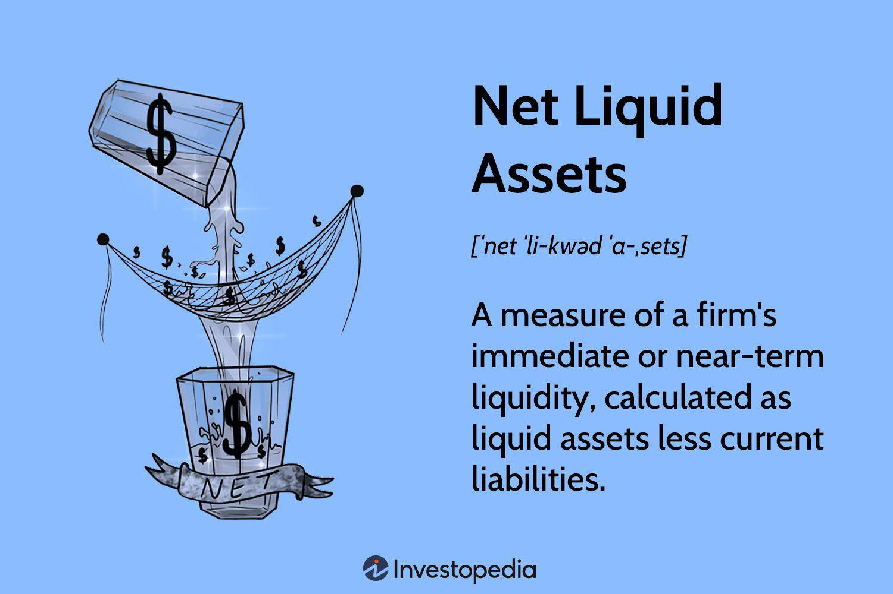

## Table of Contents

## What are net liquid assets?

Net liquid assets are the money and things you can quickly turn into money that you own, minus what you owe. This includes cash, money in bank accounts, and investments like stocks that you can sell fast. It does not include things like houses or cars, because they take longer to sell and turn into cash.

Knowing your net liquid assets is important because it shows how much money you can use right away if you need it. For example, if you suddenly need to pay for something expensive, your net liquid assets tell you how much you can spend without selling your house or car. It helps you understand your financial health and plan better for emergencies.

## How do you calculate net liquid assets?

To calculate your net liquid assets, start by adding up all the money and things you can quickly turn into cash. This includes the cash you have, money in your bank accounts, and easy-to-sell investments like stocks. These are called your liquid assets because you can use them right away if you need to.

Next, subtract any money you owe from your total liquid assets. This includes things like credit card debt, personal loans, or any other bills you need to pay soon. The number you get after subtracting what you owe from your liquid assets is your net liquid assets. This tells you how much money you can use in an emergency without selling big things like your house or car.

## Why are net liquid assets important for individuals?

Net liquid assets are important for individuals because they show how much money you can use right away if you need it. This is like having an emergency fund that you can use without selling big things like your house or car. Knowing your net liquid assets helps you understand if you are ready for unexpected costs, like a sudden car repair or a medical bill.

Having a good amount of net liquid assets can make you feel more secure. If something unexpected happens, you won't have to worry as much because you know you have money you can use quickly. It also helps you plan better for the future, making sure you can handle surprises without getting into more debt.

## What is the difference between liquid and non-liquid assets?

Liquid assets are things you own that you can quickly turn into cash. This includes money in your bank account, cash you have at home, and easy-to-sell investments like stocks. These are important because they help you pay for things right away if you need to, like an emergency or a sudden bill.

Non-liquid assets are things that take longer to turn into cash. These include your house, car, or other big items that you can't sell quickly. They are still valuable, but if you need money fast, you can't count on them because it takes time to sell them and get the money. Knowing the difference helps you plan better for emergencies and understand your overall financial situation.

## How can net liquid assets affect an individual's financial planning?

Net liquid assets play a big role in an individual's financial planning because they show how much money you can use right away if you need it. This is important for planning because it helps you know if you're ready for unexpected costs, like a sudden car repair or a medical bill. If your net liquid assets are high, you can feel more secure knowing you have money ready for emergencies without selling big things like your house or car.

Having a good understanding of your net liquid assets also helps you make better decisions about saving and spending. If you see that your net liquid assets are low, you might decide to save more money or cut back on spending to build up your emergency fund. This way, you can plan for the future better and avoid getting into more debt when unexpected things happen.

## What are some common examples of liquid assets?

Liquid assets are things you own that you can quickly turn into cash. Some common examples are the money you have in your bank account, like in your checking or savings account. Another example is the cash you keep at home or carry with you. These are easy to use if you need money right away.

Other examples of liquid assets include money market accounts, which are like savings accounts but might give you a bit more interest. Also, stocks and bonds that you can sell quickly are liquid assets. These are investments that you can turn into cash fast if you need to, without waiting a long time.

## How do businesses use net liquid assets in their financial statements?

Businesses use net liquid assets to show how much money they can use right away if they need it. This information is important for their financial statements because it helps show how healthy the business is. Net liquid assets are found by adding up all the money and things the business can quickly turn into cash, like money in the bank and easy-to-sell investments. Then, they subtract any money they owe, like loans or bills that need to be paid soon. This number tells people who look at the financial statements, like investors or banks, how much money the business has to use in an emergency without selling big things like buildings or equipment.

Knowing the net liquid assets is also important for businesses when they make plans for the future. If the net liquid assets are high, the business might feel more secure and ready to handle unexpected costs or take advantage of new opportunities. On the other hand, if the net liquid assets are low, the business might need to focus on saving more money or finding ways to get more cash quickly. This helps the business make better decisions about spending, saving, and investing, making sure they can keep running smoothly even when surprises happen.

## What role do net liquid assets play in investment strategies?

Net liquid assets are important when planning how to invest your money. They show how much cash you have that you can use right away if you need it. When you're thinking about where to put your money, knowing your net liquid assets helps you decide how much risk you can take. If you have a lot of net liquid assets, you might feel more comfortable investing in things that could go up or down a lot, like stocks. But if your net liquid assets are low, you might want to be more careful and choose safer investments, like bonds or savings accounts.

Having a good amount of net liquid assets also means you can take advantage of new investment opportunities when they come up. If you see a good chance to invest but it needs money right away, having enough net liquid assets lets you jump on it without having to sell big things like your house or car. This way, you can make smart investment choices that could help your money grow without putting yourself in a tight spot if something unexpected happens.

## How can improving net liquid assets enhance personal financial security?

Improving your net liquid assets can make you feel more secure because it gives you more money to use right away if you need it. When you have a good amount of cash, money in the bank, and easy-to-sell investments, you can handle unexpected costs like a car repair or a medical bill without worrying too much. This means you don't have to sell big things like your house or car in a hurry, which can take time and might not get you the best price.

Having more net liquid assets also helps you avoid getting into more debt. If something unexpected happens and you need money fast, having enough net liquid assets means you can pay for it without borrowing more money or using credit cards. This keeps you out of financial trouble and lets you plan better for the future, knowing you have a cushion to fall back on if things don't go as planned.

## What are the potential risks associated with a low level of net liquid assets?

Having a low level of net liquid assets can be risky because it means you might not have enough money to handle unexpected costs. If something like a car repair or a medical bill comes up, and you don't have much cash or easy-to-sell investments, you could find yourself in a tight spot. You might have to borrow money or use credit cards, which can lead to more debt and financial stress.

Another risk is that you might have to sell big things like your house or car quickly to get money. Selling these things in a hurry often means you won't get the best price, and it can take time, leaving you without the cash you need right away. This can make it hard to plan for the future and feel secure, as you're always worried about what might happen if an emergency comes up.

## How do economic conditions impact the value of net liquid assets?

Economic conditions can change how much your net liquid assets are worth. When the economy is doing well, things like stocks and bonds might go up in value, making your net liquid assets worth more. Also, if interest rates are low, you might earn less on your savings, but it can be easier to borrow money if you need it. On the other hand, if the economy is not doing well, the value of your investments might go down, which can lower your net liquid assets.

During tough economic times, like a recession, people might lose their jobs or see their income go down. This can make it harder to keep a good amount of net liquid assets because you might need to use your savings to pay for everyday things. Also, if banks are worried about the economy, they might make it harder to borrow money, which can affect how much cash you have on hand. So, keeping an eye on economic conditions can help you plan better and make sure you have enough net liquid assets to feel secure.

## What advanced strategies can be employed to optimize net liquid assets for high-net-worth individuals?

High-net-worth individuals can use advanced strategies to make their net liquid assets work better for them. One way is to put their money into things like money market funds or short-term bonds. These are safe and can be turned into cash quickly, which is good for having money ready when they need it. They can also use something called a line of credit against their investments. This means they can borrow money without selling their investments, which helps keep their net liquid assets high while still having cash to use if they need it.

Another strategy is to spread their money around in different types of investments that can be sold quickly. This is called diversification, and it helps them keep their net liquid assets safe even if one type of investment goes down in value. High-net-worth individuals can also work with financial advisors to use tax strategies that help them keep more of their money. By planning how to pay less in taxes, they can keep their net liquid assets growing and be ready for any surprises that might come up.

## What are net liquid assets?

Net liquid assets are a vital financial metric that indicate a company's capacity to fulfill short-term obligations without resorting to external financing sources. Essentially, net liquid assets reflect the liquidity available to a business after accounting for its short-term liabilities. This measure is calculated by subtracting current liabilities from liquid assets. The formula for net liquid assets can be expressed as:

$$
\text{Net Liquid Assets} = \text{Liquid Assets} - \text{Current Liabilities}
$$

Liquid assets are those that can be rapidly converted into cash with minimal impact on their market value. Common examples include cash, cash equivalents, marketable securities, and accounts receivable. In contrast, current liabilities are obligations the company must settle within a short period, typically within a year, such as accounts payable, short-term debt, and other accrued liabilities.

Maintaining a positive net liquid asset position is indicative of a company's financial health and operational flexibility. It demonstrates the company's ability to cover its immediate financial commitments without needing to raise funds externally, thereby reducing dependence on debt or additional equity financing. This financial stability provides a cushion against unforeseen expenses or revenue shortfalls, contributing to overall risk management.

Moreover, companies with strong net liquid asset positions are well-positioned to capitalize on growth opportunities. They can invest in new projects, research and development, or strategic acquisitions without incurring significant debt or diluting shareholder value. Thus, a robust net liquid asset status supports strategic decision-making and long-term financial sustainability.

In essence, net liquid assets serve as a crucial barometer of a company's short-term financial resilience and strategic flexibility. By ensuring a solid balance between liquid assets and liabilities, businesses can effectively manage their financial state and pursue growth initiatives with confidence.

## What are the Frequently Asked Questions?

### FAQs

**What are some common examples of liquid assets?**

Liquid assets are those that can be quickly converted into cash with minimal impact on their market value. Common examples include:

1. **Cash and Bank Deposits**: The most liquid asset, readily available for transactions.
2. **Marketable Securities**: These include stocks, bonds, and other financial instruments traded on public exchanges.
3. **Treasury Bills**: Short-term government securities with maturity periods typically less than a year.
4. **Money Market Instruments**: Assets such as commercial paper and certificates of deposit.

These assets provide flexibility for covering short-term liabilities and investing in opportunities as they arise.

**Why are net liquid assets important for businesses?**

Net liquid assets are vital for companies as they reflect a firm's ability to meet short-term obligations without needing additional external funding. This metric is calculated as the difference between a company's liquid assets and its current liabilities:

$$
\text{Net Liquid Assets} = \text{Liquid Assets} - \text{Current Liabilities}
$$

The importance of net liquid assets lies in:

- **Financial Health**: A positive net liquid asset position suggests that a company can efficiently manage its short-term debts and financial shocks.
- **Investment Flexibility**: Companies with adequate net liquid assets can fund new projects and growth initiatives without excessive debt reliance.
- **Risk Management**: Ensures that companies have a buffer in place to handle unforeseen economic conditions or downturns.

**How does algorithmic trading enhance liquidity management?**

Algorithmic trading enhances liquidity management by employing computer algorithms to execute trades at optimal times and prices. Algorithms analyze large volumes of market data to make informed decisions swiftly. Key aspects include:

- **Market Liquidity Assessment**: Algorithms assess liquidity levels to determine the best times to enter or exit trades, minimizing market impact.
- **Real-time Adjustments**: Algorithms continually adapt to real-time market conditions, enabling better execution quality.
- **Efficiency and Profitability**: By optimizing trade execution, algorithmic trading can improve financial performance while reducing transaction costs.

These capabilities allow traders to effectively manage liquidity, ensuring they capitalize on market opportunities while mitigating risks.

**What is the difference between liquidity and solvency?**

Liquidity and solvency are both measures of a company's financial health, but they focus on different aspects:

- **Liquidity** refers to a firm's ability to meet short-term obligations and convert assets into cash quickly. It emphasizes the availability of liquid assets, such as cash and marketable securities, to cover immediate needs.

- **Solvency**, on the other hand, indicates a company's ability to meet long-term obligations. It assesses whether a firm's asset value exceeds its liabilities, ensuring that it can sustain operations over the long term.

While liquidity focuses on short-term financial stability, solvency is concerned with the overall financial strength and viability of a business. Both are crucial for a complete understanding of a company's financial condition.

## References & Further Reading

[1]: ["Advances in Financial Machine Learning"](https://www.amazon.com/Advances-Financial-Machine-Learning-Marcos/dp/1119482089) by Marcos Lopez de Prado

[2]: ["Evidence-Based Technical Analysis: Applying the Scientific Method and Statistical Inference to Trading Signals"](https://books.google.com/books/about/Evidence_Based_Technical_Analysis.html?id=MeoJAQAAMAAJ) by David Aronson

[3]: ["Machine Learning for Algorithmic Trading"](https://github.com/stefan-jansen/machine-learning-for-trading) by Stefan Jansen

[4]: ["Quantitative Trading: How to Build Your Own Algorithmic Trading Business"](https://www.amazon.com/Quantitative-Trading-Build-Algorithmic-Business/dp/1119800064) by Ernest P. Chan

[5]: Kyle, A. S. (1985). ["Continuous Auctions and Insider Trading."](https://personal.utdallas.edu/~nina.baranchuk/Fin7310/papers/Kyle1985.pdf) Econometrica, 53(6), 1315-1335.

[6]: Hasbrouck, J. (2007). ["Empirical Market Microstructure: The Institutions, Economics, and Econometrics of Securities Trading."](https://academic.oup.com/book/52241) Oxford University Press.

[7]: Kissell, R. (2013). ["The Science of Algorithmic Trading and Portfolio Management."](https://www.sciencedirect.com/book/9780124016897/the-science-of-algorithmic-trading-and-portfolio-management) Academic Press.