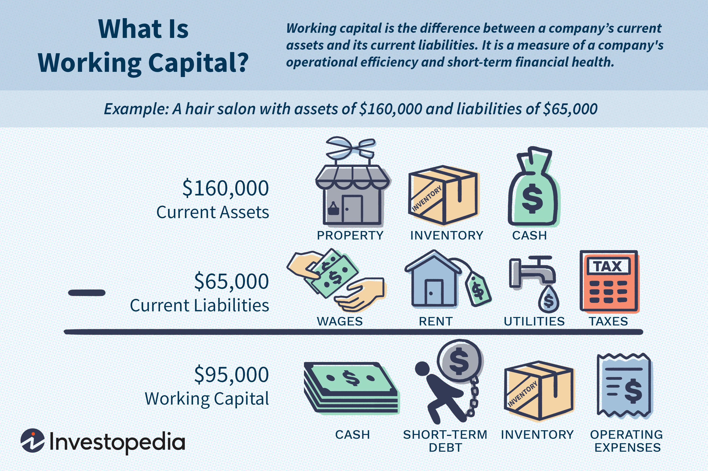

The financial markets have undergone significant transformations, driven by technological advancements that have introduced sophisticated methods like algorithmic trading and strategic approaches such as net long positions. These developments have redefined the way investors and traders engage with the markets, making it essential to understand their dynamics and implications.

Algorithmic trading, commonly referred to as algo-trading, utilizes complex algorithms and high-frequency data analysis to automate trading decisions. This technology leverages historical data, mathematical models, and statistical analysis to execute trades with speed and precision beyond human capability. It has become a cornerstone of modern trading, particularly in high-frequency trading (HFT), where rapid execution can capitalize on small price discrepancies in milliseconds. This eliminates human errors tied to emotional decision-making and enhances the efficiency and accuracy of trades.



Net long positions, on the other hand, signify a strategic stance in market speculation. A net long position arises when the quantity of an investor's long positions in a certain asset surpasses their short positions, indicating a bullish market sentiment and confidence in the asset's price appreciation. This approach is commonly adopted by investors who have a positive outlook on an asset's future performance, aiming to benefit from anticipated price increases over time.

Both algorithmic trading and net long positions are integral to contemporary investing, providing diverse approaches to optimizing returns. Algorithmic trading offers the advantage of handling vast amounts of data to make informed trading decisions rapidly, while net long positions reflect strategic asset allocation decisions aligned with market trends and predictions. Understanding these concepts provides investors with comprehensive tools to navigate complex financial landscapes, enhancing their ability to make informed decisions and potentially increasing profitability.

## Table of Contents

## Understanding Net Long Positions

Net long positions are a fundamental aspect of investment strategies, where an investor holds more long positions than short positions in a specific asset or portfolio. This situation typically signals a bullish market outlook, as the investor anticipates that the asset's price will increase over time. The concept revolves around the basic principle of buying low and selling high to gain profits from rising markets.

When an investor establishes a net long position, they express confidence in the upward price movement potential of the underlying asset. This strategy is commonly utilized in various financial markets, including equities, commodities, and foreign exchange, where market participants seek to benefit from positive price trends.

### Key Aspects of Net Long Positions

1. **Market Sentiment and Confidence**: Net long positions are directly tied to investor sentiment and confidence. An investor employing this strategy typically believes in strong underlying economic indicators or market conditions that could drive the asset's price upwards.

2. **Leverage and Margin**: Investors often use leverage to amplify the potential returns on their net long positions. This involves borrowing funds to increase the size of the investment, which can lead to significant profits if the market moves favorably. However, leverage also amplifies losses, necessitating careful risk management.

3. **Time Horizon**: The duration for holding a net long position can vary significantly depending on the investor's strategy. Some may hold these positions for a short-term market rally, while others might maintain them for more extended periods, anticipating sustained upward trends.

### Strategies and Real-World Examples

- **Buy-and-Hold Strategy**: This long-term investment approach involves purchasing assets and holding them over time, expecting appreciation. An example is an investor buying shares of a company with a strong growth outlook and holding them for several years.

- **Event-Driven Investing**: Investors might take a net long position in anticipation of specific events, such as earnings reports or product launches, that they expect will positively impact the asset's price.

- **Sector Rotation**: This involves switching between different sectors or industries to capitalize on economic cycles. For instance, an investor might maintain a net long position in technology stocks during an economic upturn and shift to defensive stocks during downturns.

In conclusion, understanding net long positions involves recognizing the strategic moves based on market sentiments and economic indicators. These positions reflect investor confidence and require a thorough analysis of market trends and potential catalysts. They serve as a core component of many investment strategies designed to harness market growth.

## Algorithmic Trading: A Revolution in Financial Markets

Algorithmic trading represents a significant shift in how financial markets operate by utilizing sophisticated algorithms and mathematical models. This form of trading automates the decision-making process based on real-time market data, enabling trades to be executed at speeds and accuracy levels unattainable by human traders. At its core, [algorithmic trading](/wiki/algorithmic-trading) involves the use of defined sets of instructions—mathematical expressions and statistical models—to analyze market conditions and execute buy or sell orders.

The rise of algorithmic trading began in the late 20th century with the advent of electronic trading platforms. Over time, the integration of technological advancements such as high-frequency trading ([HFT](/wiki/high-frequency-trading-strategies)) has facilitated an environment where thousands of trades can occur in fractions of a second. High-frequency trading represents a subset of algorithmic trading characterized by the rapid execution of numerous orders, capitalizing on small price imbalances. The primary advantage here is the reduction in human errors and the elimination of emotional biases, which often impede rational decision-making.

Algorithmic trading offers numerous benefits, including increased [liquidity](/wiki/liquidity-risk-premium), reduced transaction costs, and enhanced trade execution efficiency. By leveraging algorithms, traders can quickly process vast amounts of data, recognize trends, and deploy strategic responses in real-time. This ability to consistently apply logic-based strategies often results in more disciplined trading practices and improved market activity levels.

Despite its advantages, algorithmic trading faces several challenges. One key issue is the potential for market [volatility](/wiki/volatility-trading-strategies), exacerbated by the speed and [volume](/wiki/volume-trading-strategy) of trades executed by automated systems. These rapid transactions can lead to flash crashes—sudden, severe market downturns followed by sharp recoveries. Additionally, the complexity of building and maintaining algorithms requires substantial technical expertise and infrastructure investment. Traders must continually refine their algorithms to cope with evolving market conditions, which may necessitate considerable research and development efforts.

Another challenge for algorithmic trading is regulatory scrutiny. As algorithmic trading strategies become more prevalent, regulatory bodies across the globe are increasingly focused on ensuring market integrity and preventing manipulative practices. Regulations such as the European Union's Markets in Financial Instruments Directive II (MiFID II) impose strict reporting and transparency requirements on algorithmic traders, ensuring that automated systems promote fair and orderly markets.

Overall, algorithmic trading serves as a powerful tool in modern financial markets, offering both opportunities and challenges. As technology continues to evolve, it is likely that algorithmic trading will further reshape market dynamics, prompting ongoing discussions about its role and regulation in financial ecosystems.

## How Algorithmic Trading Enhances Long-Term Investment

Algorithmic trading, though often associated with short-term, high-frequency trading, provides substantial benefits for long-term investment strategies as well. Algorithms can systematically process vast amounts of data to inform investment decisions, which is especially useful for managing large portfolios. By optimizing entry and [exit](/wiki/exit-strategy) points, these systems can enhance the efficiency and effectiveness of long-term investment plans.

One of the primary benefits of algorithmic trading in long-term investments is the ability to manage portfolios systematically. Algorithms can monitor multiple markets and financial instruments simultaneously, ensuring that investments are balanced and diversified according to the investor's strategy. This multi-tasking capability allows for the continuous rebalancing of portfolios, which is crucial for maintaining alignment with long-term objectives.

In addition to portfolio management, algorithms optimize entry and exit points. By analyzing patterns and trends in historical data, algorithms can predict optimal times to buy or sell assets. This reduces the timing-related risks associated with manual decision-making and helps in achieving better returns over time. For instance, consider a simple trend-following strategy which uses moving averages:

```python
def moving_average(prices, window_size):
    return sum(prices[-window_size:]) / window_size

def trend_following_strategy(prices):
    short_window = 40
    long_window = 100

    if len(prices) < long_window:
        return "Hold"

    short_ma = moving_average(prices, short_window)
    long_ma = moving_average(prices, long_window)

    if short_ma > long_ma:
        return "Buy"
    elif short_ma < long_ma:
        return "Sell"
    else:
        return "Hold"
```

This simple model could guide an investor to buy an asset when its short-term performance surpasses its long-term performance and sell when the reverse occurs. Implementing such strategies allows long-term investors to adapt to changing market conditions without constant monitoring.

Additionally, risk management is a critical component of long-term investments, and algorithms excel at identifying and mitigating risks. Techniques such as mean reversion use statistical analysis to predict price movements back to historical averages. This involves buying undervalued assets expected to increase in price and selling overvalued ones expected to decrease. Here is an example in Python for a basic mean reversion strategy:

```python
def mean_reversion(prices, window_size, threshold):
    avg_price = moving_average(prices, window_size)
    current_price = prices[-1]
    deviation = (current_price - avg_price) / avg_price

    if deviation > threshold:
        return "Sell"
    elif deviation < -threshold:
        return "Buy"
    else:
        return "Hold"
```

By leveraging these strategies, long-term investors can capitalize on price corrections while maintaining their overall investment horizon.

In conclusion, algorithmic trading substantially enhances long-term investment by automating complex processes, optimizing crucial decision points, and implementing sophisticated risk management strategies. Through these methods, investors can attain a greater consistency in achieving long-term financial goals.

## Combining Net Long Strategies with Algorithmic Trading

Integrating net long strategies with algorithmic trading frameworks can significantly enhance the capabilities of investors to capitalize on bullish market trends. This synergy allows investors to systematically identify and exploit upward price movements by leveraging the strengths of both approaches.

Algorithmic trading systems can continuously monitor multiple markets, indices, and individual assets, identifying optimal entry and exit points for long positions. By employing algorithms that analyze historical price data, market trends, and other relevant indicators, investors can automate the execution of trades with high precision and efficiency. This automation minimizes human error and emotional bias, which can be detrimental in volatile markets.

For example, a common strategy employed in this integration is the trend-following algorithm. These algorithms are designed to detect and follow market trends, thereby aligning with the bullish outlook inherent in net long positions. They utilize mathematical models such as moving averages or the Relative Strength Index (RSI) to generate buy signals when an asset's price shows upward [momentum](/wiki/momentum). Consider a basic Python implementation of a moving average crossover strategy:

```python
def moving_average_crossover_strategy(prices, short_window=40, long_window=100):
    signals = pd.DataFrame(index=prices.index)
    signals['signal'] = 0.0

    # Calculate short and long moving average
    signals['short_mavg'] = prices.rolling(window=short_window, min_periods=1, center=False).mean()
    signals['long_mavg'] = prices.rolling(window=long_window, min_periods=1, center=False).mean()

    # Generate signals
    signals['signal'][short_window:] = np.where(signals['short_mavg'][short_window:] 
                                                > signals['long_mavg'][short_window:], 1.0, 0.0)   

    # Calculate positions
    signals['positions'] = signals['signal'].diff()

    return signals
```

In this code, 'prices' is a pandas DataFrame containing historical price data. The moving averages are calculated over two different window lengths to identify crossovers, which trigger a buy signal when the short-term average crosses above the long-term average.

Moreover, integrating net long strategies with [machine learning](/wiki/machine-learning) models can enhance the predictive power of trading algorithms. Machine learning models can analyze large datasets to uncover hidden patterns that might not be evident through traditional analysis. These models can adapt to new data, improving predictions and helping investors to dynamically adjust their net long positions.

However, while the integration offers substantial opportunities, it also requires rigorous [backtesting](/wiki/backtesting) and risk management to avoid overexposure to market conditions. Investors must ensure that their algorithms are robust and adaptable to various market scenarios to mitigate potential risks.

In conclusion, the strategic combination of net long positions with algorithmic trading mechanisms allows investors to maximize profits by systematically exploiting bullish market opportunities, supported by rapid execution and data-driven decision-making.

## Key Considerations and Risks

Algorithmic trading and net long positions, while offering significant advantages, also come with inherent risks and complexities that need to be carefully managed. One of the primary concerns in algorithmic trading is the risk of technological failure. Trading algorithms depend heavily on technology; thus, any malfunction in systems, such as software glitches or network downtime, can lead to substantial financial losses. Implementing robust system checks and ensuring redundancy in communication channels can mitigate these risks.

Another critical aspect is the market risk associated with net long positions. As these positions assume a bullish outlook, any unexpected market downturns can result in significant losses. To manage this, investors should employ diversified portfolios and consider using hedging strategies, such as options or futures, to protect against adverse price movements.

Regulatory challenges are also a considerable [factor](/wiki/factor-investing). Financial markets are subject to stringent regulatory frameworks to ensure fairness and transparency. Algorithmic trading, in particular, has faced scrutiny due to its potential to create market volatility and unfair trading advantages. Staying abreast of regulatory developments and ensuring compliance with legal frameworks is crucial to avoiding penalties and maintaining credibility.

Algorithmic trading also introduces the complexity of model risk. Models used in trading algorithms are based on historical data and assumptions that may not hold in changing market conditions. Continual model validation and recalibration are necessary to ensure that they remain effective under current market scenarios. Regular backtesting and stress testing of models against various market conditions can help identify potential issues before they lead to financial losses.

Additionally, liquidity risk is a vital consideration. Large-scale algorithmic trading can impact market liquidity, especially in less liquid markets, leading to price slippage and increased transaction costs. Implementing algorithms designed to optimize execution during periods of lower liquidity, such as volume-weighted average price (VWAP) or time-weighted average price (TWAP) algorithms, can help mitigate these costs.

Finally, data accuracy and security are paramount. Algorithmic trading relies on vast amounts of real-time data. Any inaccuracies or breaches in data security could lead to erroneous trades and potential losses. Employing strong cybersecurity measures and ensuring real-time data verification processes are in place is essential for the protection of trading operations.

Risk management techniques, such as the use of stop-loss orders, position sizing based on volatility, and setting limits on trade frequency, can help manage these risks effectively. Combining these strategies with thorough research and continuous monitoring of trading systems will enhance the reliability and profitability of algorithmic trading while managing the complexities associated with net long positions.

## Conclusion

Algorithmic trading and net long positions together epitomize the integration of technology and traditional investing strategies, providing unique advantages in capital markets. The synergy between these elements allows investors to optimize their approach, utilizing data-driven insights and systematic techniques to maximize profitability and manage risk effectively. 

Algorithmic trading employs sophisticated algorithms and technology to automate trading decisions and execution. This automation can enhance the speed and precision of trades, ensuring that investors can capitalize on fleeting opportunities and reduce reliance on emotional decision-making. By incorporating mathematical models and real-time data analysis, algorithmic trading systems can detect trends and signals that might not be apparent to human traders. For instance, algorithms can recognize pattern formations like moving averages or momentum oscillators, facilitating strategic positions based on empirical evidence.

Net long positions, on the other hand, reflect a bullish sentiment or an expectation of price appreciation in specific assets. By maintaining more long positions than short ones, investors demonstrate confidence in the asset's future performance. When combined with algorithmic trading, these positions can be actively managed and optimized. Algorithms can assist in determining ideal entry and exit points, effectively managing capital exposure, and dynamically adjusting positions in response to market conditions.

Strategic planning becomes paramount to harness these tools effectively. This involves a deep understanding of market dynamics, the development of robust algorithms, and thorough testing over historical data. Additionally, risk management techniques, such as diversification, stop-loss orders, and continuous monitoring, are essential to mitigate potential downsides.

In conclusion, the thoughtful integration of algorithmic trading and net long strategies can significantly enhance investment outcomes. By leveraging technology and strategic foresight, investors are better positioned to navigate complex markets, potentially leading to improved decision-making and superior returns. Continuing education and staying abreast of technological advancements are crucial for investors seeking to capitalize on these modern strategies.

## Further Learning and Resources

For individuals new to the field of algorithmic trading and net long strategies, there is a wealth of materials available to facilitate the acquisition of essential skills and knowledge. Institutions and online platforms offer a variety of courses and resources tailored to different levels of expertise.

### Online Courses and Certifications

1. **Coursera**: Offers courses like "Machine Learning for Trading" by the Georgia Institute of Technology, which provides a comprehensive introduction to using algorithms for trading [Coursera Machine Learning for Trading](https://www.coursera.org).

2. **edX**: Features courses such as "Algorithmic Trading and Finance Models with Python, R, and Stata Essential Training" by multiple universities. These courses cover quantitative trading strategies and their implementation in popular programming languages [edX Algorithmic Trading](https://www.edx.org).

3. **Udacity**: Provides the "AI for Trading" Nanodegree program, focusing on neural networks and reinforcement learning in trading scenarios [Udacity AI for Trading](https://www.udacity.com).

### Books and Publications

- **"Algorithmic Trading: Winning Strategies and Their Rationale" by Ernest P. Chan**: This book is a practical guide, providing real-world examples of algorithmic trading strategies and explaining the statistical foundations.

- **"Python for Finance: Analyze Big Financial Data" by Yves Hilpisch**: A comprehensive resource for learning to use Python to model financial markets and analyze big data.

### Tools and Platforms

- **QuantConnect**: A powerful platform offering a cloud-based environment for developing and backtesting trading algorithms. Users can utilize their extensive data library and coding IDE [QuantConnect](https://www.quantconnect.com).

- **Interactive Brokers API**: For those interested in implementing live trading algorithms, Interactive Brokers provides a robust API that can be used with languages like Python and Java [Interactive Brokers API](https://www.interactivebrokers.com).

### Research Papers and Academic Journals

Diving into academic research papers can provide advanced insights into algorithmic trading strategies and market behavior. Websites like ResearchGate and Google Scholar can be used to access such papers:

- **ResearchGate**: Offers access to a plethora of research articles on algorithmic trading strategies and the analysis of financial markets [ResearchGate](https://www.researchgate.net).

- **Google Scholar**: A freely accessible search engine providing a wide array of scholarly articles and sources that include dissertations and conference papers [Google Scholar](https://scholar.google.com).

By engaging with these resources and tools, traders and investors can develop a robust understanding of algorithmic trading and net long strategies, fostering skills that are essential in today's data-driven financial markets.

## References & Further Reading

[1]: ["Algorithmic Trading: Winning Strategies and Their Rationale"](https://books.google.com/books/about/Algorithmic_Trading.html?id=WAlFDwAAQBAJ) by Ernest P. Chan 

[2]: ["Python for Finance: Analyze Big Financial Data"](https://books.google.com/books/about/Python_for_Finance.html?id=E93SBQAAQBAJ) by Yves Hilpisch

[3]: Jovanovic, B., & Menkveld, A. J. (2012). ["Middlemen in Limit Order Markets."](https://papers.ssrn.com/sol3/papers.cfm?abstract_id=1624329) The Review of Financial Studies, 25(6), 1867–1902.

[4]: Aldridge, I. (2013). ["High-Frequency Trading: A Practical Guide to Algorithmic Strategies and Trading Systems."](https://www.amazon.com/High-Frequency-Trading-Practical-Algorithmic-Strategies/dp/1118343506) Wiley Finance.

[5]: Hendershott, T., Jones, C. M., & Menkveld, A. J. (2011). ["Does Algorithmic Trading Improve Liquidity?"](https://onlinelibrary.wiley.com/doi/full/10.1111/j.1540-6261.2010.01624.x) The Journal of Finance, 66(1), 1-33.