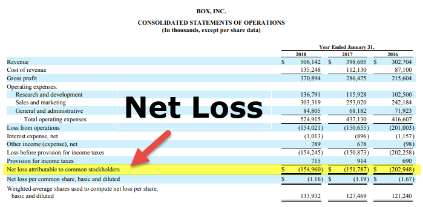

In the fast-paced world of algorithmic trading, understanding financial outcomes is crucial for success. In this environment, net loss emerges as a pivotal concept in accounting and financial analysis. It is fundamental for assessing trading performance, as it directly impacts decision-making processes and the strategic orientation of traders and financial analysts.

The concept of net loss represents the situation where total expenses of a business or trading strategy exceed the total revenue within a given timeframe, indicating negative profitability. Given that the primary objective of trading is to maximize profitability while managing risk, net loss becomes a critical indicator that signals the need for strategic revisions and enhancements.



This article examines net loss accounting, its implications on financial health, and its significance in algorithmic trading. We aim to provide a comprehensive understanding for traders and financial analysts who are determined to optimize their strategies within a trading environment where rapid assessments are necessary for sustained success. From foundational definitions to complex evaluative metrics, this article covers essential aspects of net loss and its impact on algorithmic trading.

Through systematic analysis and the application of technological advancements, traders can harness insights from net loss evaluations to refine their strategies, optimize performance, and achieve competitive advantages. Understanding and managing net loss is not merely about acknowledging deficits but also about leveraging these insights for strategic growth and long-term profitability.

## Table of Contents

## Understanding Net Loss in Accounting

Net loss in accounting is an integral part of financial analysis, highlighting when a company incurs more expenses than it generates in revenue over a given period. This situation denotes negative profitability, which can signal financial distress if not managed properly. The calculation for net loss is expressed as: 

$$
\text{Net Loss} = \text{Total Revenue} - (\text{Total Expenses} + \text{Interest Expense} + \text{Taxes} + \text{Depreciation} + \text{Amortization})
$$

This formula illustrates how various elements, such as interest expenses and non-cash charges like depreciation and amortization, contribute to a company's financial outcome.

Net loss is prominently displayed on the income statement, serving as a critical indicator of a company's financial health. Investors and analysts utilize this figure to evaluate the firm's operational efficiency, cost management, and overall financial viability. Understanding this concept involves familiarity with accounting methodologies such as accrual accounting and matching principles, which mandate that revenue and related expenses be recorded in the same period to provide accurate financial snapshots.

Several factors can lead to a net loss. Low revenue generation is a primary contributor, often stemming from weak sales performance, increased competition, or diminished market demand. Similarly, high operational and production costs can severely affect profitability. External economic pressures, including inflation, [interest rate](/wiki/interest-rate-trading-strategies) fluctuations, and economic downturns, also play significant roles in influencing net loss, as they can drive up costs and suppress revenue.

By understanding net loss, companies can analyze their financial practices to determine areas requiring improvement. Strategically addressing the causes of net loss can help businesses optimize profits, maintain financial stability, and enhance their long-term viability.

## Factors Contributing to Financial Losses

In accounting and financial analysis, net loss represents a critical indicator of a business's economic health, often arising from a variety of contributing factors. One of the most common causes of net loss is decreased revenue, which may result from declining sales, reduced market demand, or unfavorable pricing strategies that fail to cover costs. Increased production costs also contribute significantly, as rising material prices and labor costs can erode profit margins. Additionally, high operating expenses, which encompass everything from administrative salaries to rent and utilities, often exacerbate financial shortcomings when not effectively managed.

External economic conditions also play a crucial role in influencing net loss. Economic downturns, characterized by recessionary periods and reduced consumer spending, can lead to diminished sales and longer recovery times for businesses already experiencing financial strain. Moreover, competitive markets require constant innovation and adaptability; companies failing to respond to shifts in consumer preferences or employ effective marketing strategies may face eroding market share and increased losses.

Strategic missteps further compound the issue of net loss. Poorly conceived business initiatives, inadequate market research, and inefficient operational processes frequently result in non-recoverable expenses. Investments in projects that do not yield expected returns or expansion into oversaturated markets without a clear competitive edge can lead to significant financial setbacks.

Occasionally, businesses encounter net losses due to non-recurring expenses. These one-time costs can include restructuring charges, acquisition-related costs, or settlements of legal disputes. While these are not necessarily indicative of a company's ongoing financial performance, they can distort profitability metrics if not properly accounted for.

Finally, high levels of debt and substantial interest payments often exacerbate net losses, as businesses struggle to manage cash flow and cover liabilities. Debt servicing can consume a significant portion of a company’s revenue, leaving less capital available for reinvestment and growth. Proactively addressing these factors, through strategic financial planning and adaptive management practices, is imperative for minimizing losses and safeguarding a business's financial stability.

## Net Loss in Algorithmic Trading

Algorithmic trading, or algo trading, is primarily driven by data-driven decision-making, necessitating rapid assessment of profit and loss (PnL). The swift evaluation of PnL is crucial because it allows traders to adjust their strategies responsively to shifting market conditions. In the context of [algorithmic trading](/wiki/algorithmic-trading), net loss can be attributed to either suboptimal trading strategies or unfavorable market scenarios.

Inefficient trading strategies may stem from algorithms that are not finely tuned to respond to market signals or that fail to adapt to new patterns emerging in the financial markets. Adverse market conditions, such as sudden [volatility](/wiki/volatility-trading-strategies) spikes or unexpected geopolitical events, can also contribute to net losses, as these conditions can lead to rapid changes in asset prices that may not be immediately captured by existing trading algorithms.

The continual monitoring and analysis of PnL are essential components of algorithmic trading, as these activities enable traders to make real-time tweaks to their strategies. By frequently analyzing their PnL, traders can identify the strengths and weaknesses of their current approaches and recalibrate them to better fit ongoing market realities. This dynamic process is integral for minimizing net losses and optimizing trading performance.

Many algorithmic trading platforms and tools have been developed to assist traders in effectively monitoring and managing PnL. For instance, platforms such as uTrade Algos provide traders with sophisticated tools to track PnL data, allowing them to manage their strategies with greater precision. These platforms offer real-time feedback on trading performance, enabling traders to implement strategic adjustments that align their operations more closely with their financial goals.

By leveraging such platforms, traders can enhance the accuracy and effectiveness of their trading strategies. This capability to continually refine and adjust actions in response to market changes is a key advantage in the competitive landscape of algorithmic trading. Consequently, effective PnL management is critical not only for minimizing net losses but also for achieving long-term success in algorithmic trading.

## Why is PnL Important in Algo Trading?

Profit and Loss (PnL) analysis is a critical aspect of algorithmic trading, providing traders with essential insights into the effectiveness of their trading strategies. Understanding PnL allows traders to evaluate the success of their trading activities by measuring the profitability of transactions. This evaluation helps traders ascertain whether their strategies are functioning as intended, offering clear indicators of strategic performance over time.

PnL is instrumental in risk management by visualizing potential losses. By accurately forecasting possible loss scenarios, traders can establish appropriate risk control measures. For instance, stop-loss orders or automated trading limits can be implemented to mitigate financial risks. This anticipatory approach to risk management helps traders preserve capital and maintain operational longevity in volatile markets.

Benchmarking through PnL comparisons offers additional benefits, enabling traders to refine their trading strategies to gain competitive advantages. By comparing PnL across different strategies or assets, traders can identify which are underperforming and adjust them accordingly. For example, if a particular algorithm consistently yields lower profits compared to others, it might signal the need for recalibration or a complete strategic overhaul.

Moreover, analyzing strengths and weaknesses using PnL data supports strategic adjustments that enhance performance. Traders can perform an in-depth analysis of PnL to isolate factors contributing to either gains or losses. This involves evaluating various transaction aspects, such as timing, asset selection, and market conditions. Through a detailed PnL analysis, traders can make informed decisions about optimizing current strategies or exploring alternative approaches to improve overall trading performance.

In essence, PnL serves not just as a measure of past performance, but also as a potent tool for future strategy refinement. By leveraging PnL data, traders can maintain a proactive stance, continuously adapting their trading approaches to align with prevailing market dynamics and achieve sustained profitability.

## Mitigating Net Losses in Trading

To mitigate net losses in trading, traders can implement a series of strategic actions that not only help in minimizing potential setbacks but also enhance overall trading performance. A diversified strategy involving multiple asset classes or trading approaches can reduce exposure to any single market event. This diversification acts as a buffer against market volatility, allowing traders to distribute risk more evenly across their portfolios.

Effective risk management is critical in minimizing losses. Traders can set predefined stop-loss orders and maintain disciplined adherence to trading plans, thereby controlling potential losses on individual trades. By employing position sizing techniques, traders can adjust their stake in investments based on the given risk level, ensuring that no single loss can significantly impact the overall trading account.

Analyzing historical trading data provides vital insights into past performance, enabling traders to adjust and refine their strategies. Backtesting strategies on historical data allows traders to evaluate potential profitability and identify weaknesses before applying them in live markets. This iterative process promotes robust decision-making and strategy enhancement.

The use of complex algorithms and advanced technological tools has revolutionized modern trading. Algorithmic trading systems can process vast amounts of data rapidly and execute trades at speeds beyond human capability. By leveraging [machine learning](/wiki/machine-learning) models and [artificial intelligence](/wiki/ai-artificial-intelligence), traders can adapt their strategies to evolving market conditions, identify emerging patterns, and optimize execution.

Continuous learning and adaptation are essential components of success in the fast-evolving landscape of algorithmic trading. Markets are dynamic and ever-changing, thus requiring traders to remain informed of new developments, trends, and technologies. Participation in forums, seminars, and online courses can provide valuable insights and techniques to refine trading practices.

To illustrate the application of these principles, the following Python code snippet demonstrates a basic approach to backtest a simple moving average crossover strategy on historical stock data using pandas and numpy:

```python
import pandas as pd
import numpy as np

# Load historical stock data
data = pd.read_csv('historical_stock_data.csv')
data['Date'] = pd.to_datetime(data['Date'])
data.set_index('Date', inplace=True)

# Calculate moving averages
short_window = 40
long_window = 100

data['Short_MA'] = data['Close'].rolling(window=short_window, min_periods=1).mean()
data['Long_MA'] = data['Close'].rolling(window=long_window, min_periods=1).mean()

# Generate signals
data['Signal'] = 0.0
data['Signal'][short_window:] = np.where(data['Short_MA'][short_window:] > data['Long_MA'][short_window:], 1.0, 0.0)

# Calculate positions
data['Position'] = data['Signal'].diff()

# Display the resulting signals and positions
print(data[['Close', 'Short_MA', 'Long_MA', 'Signal', 'Position']].tail())
```

This example leverages historical data to simulate a trading strategy where decisions are based on moving average crossovers. Such approaches allow traders to identify potentially profitable conditions while refining their strategies through systematic analysis. Regular adaptation based on insights from [backtesting](/wiki/backtesting) and real-time market feedback is crucial in maintaining profitability and mitigating net losses.

## Conclusion

Net loss is a critical [factor](/wiki/factor-investing) in financial analysis, holding particular importance in algorithmic trading where the efficiency of trading strategies is crucial for achieving desirable outcomes. It represents a state where expenses exceed revenue, highlighting areas that require strategic adjustments. Understanding and managing net loss is essential for businesses and traders to sustain financial stability and achieve long-term profitability. This involves a systematic approach to analyzing financial statements, optimizing operational efficiency, and making informed decisions based on historical and real-time data.

Incorporating net loss evaluation into trading strategy assessments gives traders a competitive advantage in decision-making processes. By regularly analyzing profit and loss (PnL) statements, traders can refine strategies, set effective risk controls, and respond proactively to market changes. This continual evaluation process allows for the identification of trends, recognition of potential pitfalls, and the development of robust strategies aimed at minimizing losses and maximizing gains.

Leveraging analytics and sophisticated trading tools is fundamental for enhancing trading performance and aligning actions with market goals. Tools that offer real-time data analytics, risk assessment metrics, and simulation capabilities empower traders to create data-driven strategies that effectively mitigate the risks of net loss. As trading environments evolve, so too must the methods and tools employed in strategy formulation and execution, allowing traders to adapt swiftly and maintain a trajectory toward profitability.

## References & Further Reading

[1]: Bergstra, J., Bardenet, R., Bengio, Y., & Kégl, B. (2011). ["Algorithms for Hyper-Parameter Optimization."](https://dl.acm.org/doi/10.5555/2986459.2986743) Advances in Neural Information Processing Systems 24.

[2]: ["Advances in Financial Machine Learning"](https://www.amazon.com/Advances-Financial-Machine-Learning-Marcos/dp/1119482089) by Marcos Lopez de Prado

[3]: ["Evidence-Based Technical Analysis: Applying the Scientific Method and Statistical Inference to Trading Signals"](https://www.amazon.com/Evidence-Based-Technical-Analysis-Scientific-Statistical/dp/0470008741) by David Aronson

[4]: ["Machine Learning for Algorithmic Trading"](https://github.com/stefan-jansen/machine-learning-for-trading) by Stefan Jansen

[5]: ["Quantitative Trading: How to Build Your Own Algorithmic Trading Business"](https://www.amazon.com/Quantitative-Trading-Build-Algorithmic-Business/dp/1119800064) by Ernest P. Chan