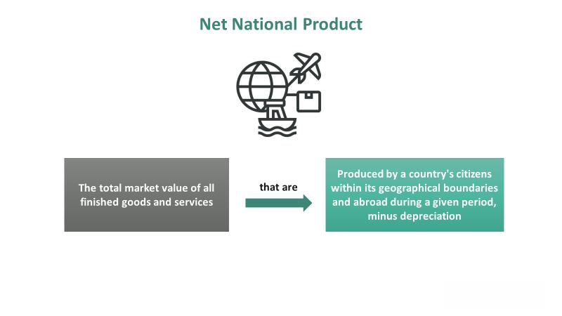

Net National Product (NNP) serves as a crucial economic indicator, providing insights into the value of goods and services produced by a nation's citizens both within and beyond its borders. By accounting for depreciation, NNP offers a nuanced view of a nation’s economic output, distinguishing it from other indicators such as Gross Domestic Product (GDP). Understanding NNP can help economists and traders make informed decisions about economic performance. 

NNP is calculated using the formula:



$$
\text{NNP} = \text{Gross National Product (GNP)} - \text{Depreciation}
$$

This calculation reflects the net value of a country's production, including goods and services that degrade in value over time. As such, NNP can offer a clearer picture of economic sustainability by factoring in the wear and tear on capital assets. This measure is increasingly relevant in discussions about long-term economic growth and environmental sustainability, considering the depletion of natural resources.

In financial markets, particularly in algorithmic trading, NNP can be a valuable data point. By incorporating NNP information, algorithms can better adjust to macroeconomic changes, thereby optimizing decision-making processes and portfolio returns. This article will discuss the calculation of NNP, its importance in economic analysis, and how it can be applied effectively in trading strategies. By the end, readers will appreciate NNP’s relevance in today's interconnected global economy, recognizing its role not only as a marker of economic health but also as a tool for achieving sustainable economic growth.

## Table of Contents

## Understanding Net National Product (NNP)

Net National Product (NNP) is a crucial economic measure that represents the total market value of all goods and services produced by the citizens of a nation, minus the depreciation of assets. In economic terms, NNP provides a clearer picture of a country's net economic output by considering the reduction in value of its productive assets over time. Depreciation reflects the gradual wearing out or obsolescence of physical and, to some extent, human capital, which is why it is subtracted from the gross production values to arrive at NNP.

Depreciation is a key component within the NNP framework because it accounts for the consumption of capital goods. By recognizing this, NNP offers a more accurate assessment of a nation's economic productivity than other measures that do not take depreciation into account, such as Gross Domestic Product (GDP). In the case of NNP, the formula used is:

$$
\text{NNP} = \text{GNP} - \text{Depreciation}
$$

Where GNP (Gross National Product) is the total value of all goods and services produced by the nation's citizens in a given period, regardless of where they are located. The deduction of depreciation from GNP yields a measure of the economy's sustainable income, highlighting a country's ability to maintain its production levels over time without depleting its capital stock.

NNP is expressed in the local currency of the nation, providing a standardized metric that allows for comparisons across different countries, accounting for differences in currency valuation and economic conditions. It serves as a vital metric for economists seeking to assess the economic success of a nation in maintaining consistent production standards across various economic cycles.

Compared to Gross National Product (GNP), NNP offers insights into the long-term economic health and performance of an economy by emphasizing the importance of sustainability in economic growth. By incorporating capital maintenance into its calculations, NNP assists in identifying the true economic wealth by showing how much of the national income can be consumed without reducing future consumption possibilities.

In summary, Net National Product stands as a significant indicator within economic analysis due to its incorporation of depreciation, presenting economists with an effective tool for evaluating the economic efficiency and sustainability of nations over time.

## Calculating NNP: The Formula

The calculation of Net National Product (NNP) is a straightforward yet essential process in economic analysis, useful for distinguishing a nation's net economic output. The core formula for calculating NNP is as follows:

$$
\text{NNP} = \text{Gross National Product (GNP)} - \text{Depreciation}
$$

In this equation, the Gross National Product (GNP) represents the total market value of all goods and services produced by a nation’s citizens, whether located within the nation's boundaries or abroad. Depreciation, also known as capital consumption, accounts for the reduction in value of the nation's fixed assets due to wear and tear, obsolescence, or age.

To illustrate, consider a scenario where a country produces $1 trillion worth of goods and $3 trillion in services. If the depreciation of the country’s capital assets is $500 billion, the NNP calculation would proceed as follows:

1. Combine the value of goods and services:
   \[ \text{GNP} = 1 \text{ trillion (goods)} + 3 \text{ trillion (services)} = 4 \text{ trillion dollars}
$$

2. Subtract the depreciation:
   \[ \text{NNP} = 4 \text{ trillion dollars} - 0.5 \text{ trillion dollars (depreciation)} = 3.5 \text{ trillion dollars}
$$

Understanding asset depreciation is crucial to ensure accurate NNP calculations. Depreciation impacts the overall net value of economic output because it reflects the declining value of productive assets over time. Different assets may depreciate at varying rates based on factors like usage, technological advancements, and market conditions. Economists must be adept in estimating these depreciation rates to provide a true reflection of economic performance.

The calculation of NNP emphasizes the importance of sustaining and investing in capital assets for ongoing economic growth. By maintaining and enhancing the productive capacity of the capital stock, nations can ensure that their economic output keeps pace with depreciation, thereby reflecting genuine increases in a nation's wealth.

In practical economic analysis and policy-making, the NNP formula serves as a tool to assess whether a country is overly consuming its capital or effectively reinvesting in its productive infrastructure—an assessment crucial for long-term economic sustainability and growth.

## The Role of Depreciation in NNP

Depreciation represents the value reduction of assets used in production and is a critical [factor](/wiki/factor-investing) in calculating Net National Product (NNP). By accounting for capital consumption, depreciation helps economists and analysts ensure accurate assessments of economic output. This is essential because it provides a true reflection of the net value produced by a nation's economy after considering the declining value of capital assets over time.

Capital consumption is often referred to as the Capital Consumption Allowance (CCA), which significantly contributes to understanding how physical and human capital depreciate. Physical capital, such as machinery, buildings, and infrastructure, experiences depreciation through wear and tear and obsolescence due to technological advancements. On the other hand, human capital depreciation occurs through factors such as workforce turnover and the obsolescence of skills, as employees may need to be retrained or replaced to remain productive.

Incorporating depreciation into the NNP calculation offers a more realistic view of a nation's economic health. Unlike Gross Domestic Product (GDP), which does not account for depreciation, NNP offers a clearer picture of how sustainable a country's current levels of production are. By subtracting depreciation from the Gross National Product (GNP), NNP ensures that the measure of economic performance reflects not just gross output but also the maintenance of that output over time. This distinction is crucial for policymakers and economists when evaluating the long-term potential of an economy, emphasizing the need for ongoing investment in capital to sustain economic growth.

## NNP in Environmental Economics

Net National Product (NNP) is an integral metric in environmental economics due to its consideration of natural resource depletion. Traditional economic indicators often overlook the environmental costs associated with economic activities. By integrating these costs, NNP provides a framework for assessing sustainable economic practices. This nuanced approach allows for a comprehensive evaluation of a nation's economic performance beyond conventional financial measures like GDP.

NNP includes the depletion of natural resources, thus reflecting the true economic cost of production activities that rely heavily on these resources. For instance, when forests are logged for timber, the depletion of this natural resource is accounted for in the NNP, thereby presenting a more realistic picture of economic output. This incorporation of environmental depletion supports the development and assessment of long-term sustainability strategies by highlighting the potential economic impacts of resource exploitation.

Furthermore, NNP serves as a guide for policymakers aiming to balance environmental sustainability and economic growth. By incorporating environmental costs into economic calculations, decision-makers can craft policies that promote sustainable development. For example, the depletion-adjusted NNP can be used to evaluate the trade-offs between short-term economic gains from resource extraction and the long-term benefits of conservation.

Overall, NNP's inclusion in environmental economics underscores its importance as a tool for crafting policies that address the intertwined challenges of economic growth and environmental stewardship. As countries continue to grapple with climate change and resource scarcity, NNP provides a critical measure for aligning economic objectives with ecological sustainability.

## NNP and Algorithmic Trading

Algorithmic trading leverages advanced computational algorithms to execute trades based on economic data, trends, and patterns. Net National Product (NNP) data can enhance these algorithms by providing a rich context of macroeconomic trends, thereby allowing traders to make more informed decisions.

1. **Context for Macroeconomic Trends**: NNP offers a detailed picture of a nation's economic performance by accounting for depreciation, unlike Gross Domestic Product (GDP) which simply measures total production. This nuanced understanding can enable trading algorithms to better predict economic cycles and adjust strategies proactively. For instance, an economy with a rising NNP despite global downturns might suggest internal economic robustness, prompting algorithms to favor securities in that market.

2. **Enhanced Risk Management and Portfolio Optimization**: By integrating NNP data, trading algorithms can improve risk management strategies. During periods where NNP data signals economic slowdown, algorithms can reduce exposure in volatile asset classes or diversify portfolios to mitigate risks. Conversely, during periods of high NNP growth, algorithms might increase leverage to capitalize on market opportunities. For example, Python code could be employed to adjust portfolio weights dynamically based on changes in NNP:

    ```python
    def adjust_portfolio_weights(current_weights, nnp_growth):
        if nnp_growth > 0.05:  # threshold for positive growth
            for asset in current_weights:
                current_weights[asset] *= 1.1  # increase weight in growing economy
        elif nnp_growth < 0:
            for asset in current_weights:
                current_weights[asset] *= 0.9  # decrease weight in slowing economy
        return current_weights

    # Example usage
    portfolio_weights = {'stocks': 0.6, 'bonds': 0.4}
    nnp_growth_rate = 0.03
    new_weights = adjust_portfolio_weights(portfolio_weights, nnp_growth_rate)
    ```

3. **Opportunity Identification in Global Markets**: NNP enables traders to assess both domestic and international economic activities, identifying lucrative opportunities. For instance, while a developed country's NNP growth might be slowing, emerging markets might show promising NNP increases, suggesting potential investment sectors. This perspective helps traders make geographically diverse investment decisions, optimizing returns based on cross-border economic data.

4. **Interconnectedness of Economic Indicators and Financial Markets**: Integrating NNP into algorithmic trading highlights the comprehensive link between myriad economic indicators and market dynamics. The alignment of NNP data with other indicators such as interest rates, inflation, and employment figures can form a multi-faceted understanding of economic environments, refining algorithm predictability and efficacy.

NNP, with its ability to offer insights into economic health and sustainability, becomes an invaluable component in [algorithmic trading](/wiki/algorithmic-trading). Leveraging NNP data aligns trading strategies with broader economic trends, facilitating informed, strategic financial decisions.

## Conclusion

Understanding and utilizing Net National Product (NNP) as an economic indicator provides crucial insights into both national and global economic health. As an economic measure, NNP offers a nuanced perspective by accounting for depreciation, which sets it apart from other indicators like Gross Domestic Product (GDP). The ability to subtract depreciation from Gross National Product (GNP) allows NNP to deliver a clearer view of a nation's economic performance and asset sustainability over time.

Incorporating NNP into various fields, especially algorithmic trading, enhances decision-making capabilities by providing a macroeconomic lens. Algorithmic trading systems can leverage NNP data to better understand macroeconomic trends and adjust strategies dynamically, optimizing portfolio returns and managing risks more effectively. By capturing the net value of goods and services produced, factoring in the wear and tear on capital assets, NNP serves as a critical tool for informed investment strategies.

Furthermore, NNP's application in environmental economics underscores its significance in evaluating sustainable economic growth. By integrating the cost of natural resource depletion into its calculations, NNP helps assess long-term sustainability strategies, ensuring economic policies align with environmental conservation efforts. This approach enables policymakers to balance economic growth with environmental stewardship, promoting a more sustainable future.

As economic environments continue to evolve, the relevance of NNP as a tool for economists, policymakers, and financial analysts remains robust. Its comprehensive nature and ability to reconcile economic and environmental considerations make it indispensable for those aiming to understand and navigate the complexities of modern economies.

## References & Further Reading

[1]: Nordhaus, William D., and Tobin, James. (1972). ["Is Growth Obsolete?"](https://www.nber.org/system/files/chapters/c3621/c3621.pdf). Columbia University Press.

[2]: Weitzman, Martin L. (1976). ["On the Welfare Significance of National Product in a Dynamic Economy."](https://scholar.harvard.edu/files/weitzman/files/1886092.pdf) The Quarterly Journal of Economics, 90(1), 156-162.

[3]: Hartwick, John M. (1977). ["Intergenerational Equity and the Investing of Rents from Exhaustible Resources."](https://www.jstor.org/stable/1828079) American Economic Review, 67(5), 972-974.

[4]: Pearce, David W., and Atkinson, Giles D. (1993). ["Capital Theory and the Measurement of Sustainable Development: An Indicator of 'Weak' Sustainability."](https://www.sciencedirect.com/science/article/pii/0921800993900399) Ecological Economics, 8(2), 103-108.

[5]: Daly, Herman E., and Cobb, John B. Jr. (1994). ["For the Common Good: Redirecting the Economy toward Community, the Environment, and a Sustainable Future."](https://archive.org/details/forcommongoodred00daly) Beacon Press.

[6]: Jorgenson, Dale W., and Fraumeni, Barbara M. (1989). ["The Accumulation of Human and Nonhuman Capital."](https://www.nber.org/system/files/chapters/c8121/c8121.pdf) The Theory and Empirical Analysis of Production, Studies in Income and Wealth, Volume 51.