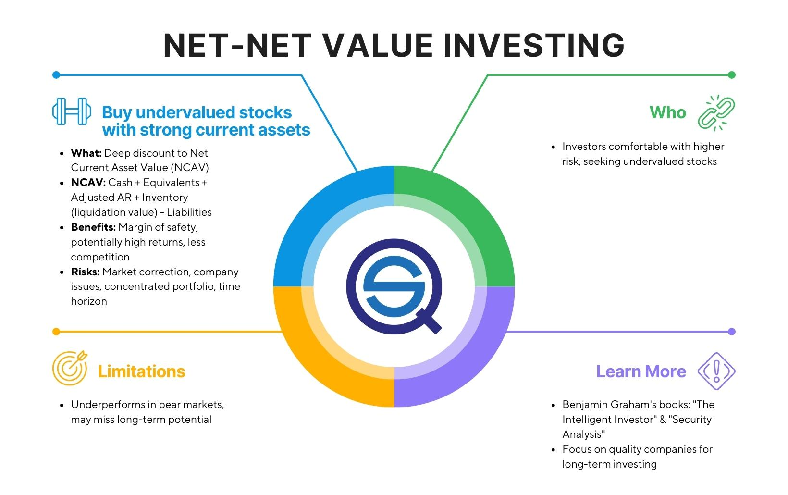

## Table of Contents

## What is the Net-Net investment strategy?

The Net-Net investment strategy is a value investing approach where investors look for companies that are selling for less than their net current asset value. This means the company's stock price is lower than the value of its current assets minus all its liabilities. The idea is to find companies that are undervalued by the market, offering a margin of safety for the investor. By buying these stocks at a discount, investors hope to profit when the market eventually recognizes the true value of the company and the stock price rises.

This strategy was popularized by Benjamin Graham, often called the father of value investing. He believed that if a company's market value is less than its net current asset value, it is a good investment opportunity. However, finding these Net-Net stocks can be challenging because they are often small, distressed companies. Investors need to carefully analyze the financial health and potential risks of these companies. Despite the risks, the Net-Net strategy can lead to significant returns if the investor is patient and thorough in their research.

## Who developed the Net-Net investment strategy?

The Net-Net investment strategy was developed by Benjamin Graham, who is often called the father of value investing. He came up with this idea to find companies that were selling for less than their net current asset value. This means the stock price of a company was lower than the value of its current assets after subtracting all its liabilities.

Graham believed that if you could buy a company for less than its net current asset value, you were getting a good deal. He thought this gave investors a margin of safety because the market was undervaluing the company. Even though finding these Net-Net stocks can be hard because they are often small and struggling companies, Graham's strategy can lead to big profits if investors are patient and do their homework carefully.

## How does the Net-Net strategy differ from other value investing strategies?

The Net-Net strategy is a specific type of value investing that focuses on buying companies for less than their net current asset value. This means you look at what the company owns right now, like cash and inventory, and subtract what it owes, like debts. If the stock price is lower than this number, it's a Net-Net stock. This approach is different from other value investing strategies because it's very strict about what counts as a good deal. Other value strategies might look at a company's future earnings or its book value, but Net-Net only cares about the current assets minus liabilities.

Other value investing strategies might use different ways to find undervalued stocks. For example, some investors might look at a company's price-to-earnings ratio or its price-to-book ratio to see if it's a good buy. These strategies focus on the company's potential to make money in the future or its overall worth on the books. The Net-Net strategy, on the other hand, is more about finding companies that are so cheap that they're almost like buying the company's assets at a discount. This makes it a more conservative approach because it's based on what the company has right now, not what it might do in the future.

## What are the key financial metrics used in identifying Net-Net stocks?

The main financial metric used to find Net-Net stocks is the net current asset value. This is calculated by taking the company's current assets, like cash, inventory, and accounts receivable, and then subtracting all its current liabilities, like debts and accounts payable. If the stock price of the company is less than this net current asset value, it's considered a Net-Net stock. This means you're buying the company for less than what its assets are worth right now.

Another important metric to consider is the working capital, which is similar to net current asset value but focuses on the company's ability to meet its short-term obligations. Investors might also look at the company's total liabilities to make sure there aren't hidden debts that could affect the net current asset value. By using these metrics, investors can spot companies that the market might be undervaluing, offering a chance to buy them at a big discount.

## How do you calculate the Net Current Asset Value (NCAV) for a company?

To calculate the Net Current Asset Value (NCAV) for a company, you start by looking at the company's balance sheet. The balance sheet shows what the company owns and what it owes. You take the total value of the company's current assets, which includes things like cash, inventory, and accounts receivable. These are things the company can turn into cash quickly, usually within a year.

Next, you subtract the total value of the company's current liabilities from the current assets. Current liabilities are the debts and other obligations the company needs to pay within a year, like accounts payable and short-term loans. The result of this subtraction is the Net Current Asset Value. If the stock price of the company is less than this NCAV, it might be a good investment because you're buying the company for less than its current assets are worth.

## What is the typical discount to NCAV that investors look for when applying the Net-Net strategy?

When using the Net-Net strategy, investors usually look for a big discount to the Net Current Asset Value (NCAV). A common rule is to buy stocks that are trading at two-thirds or less of their NCAV. This means if a company's NCAV is $100 per share, investors would look to buy the stock when it's priced at $66.67 or below. This discount is important because it gives investors a safety margin, making it less risky if the company's situation doesn't improve as hoped.

The reason for this discount is to protect against any mistakes in the calculations or unexpected problems with the company. Even though the Net-Net strategy focuses on current assets, there can still be risks. By buying at a significant discount, investors hope to have a cushion that can absorb any negative surprises. This approach helps them feel more secure that they're getting a good deal, even if the market doesn't recognize the company's true value right away.

## What are the potential risks associated with investing in Net-Net stocks?

Investing in Net-Net stocks can be risky because these companies are often small and struggling. They might be losing money, and there could be a reason the stock price is so low. Sometimes, the company's assets might not be worth as much as they seem on paper. For example, inventory might be outdated or hard to sell, and accounts receivable might not be collected. If the company goes bankrupt, the assets might not cover all the debts, leaving investors with nothing.

Another risk is that Net-Net stocks can take a long time to turn a profit. The market might not recognize the true value of the company quickly, so investors need to be patient. During this time, the stock price could drop even more, and if the company's situation gets worse, the investment could lose all its value. It's important for investors to do a lot of research and be ready for the possibility that the stock might not go up in value as expected.

## How can an investor mitigate the risks when using the Net-Net investment strategy?

To reduce the risks when using the Net-Net investment strategy, it's important for investors to do a lot of research on the companies they're thinking about buying. They should look closely at the company's financial statements to make sure the assets are really worth what they say they are. For example, they need to check if the inventory can be sold easily and if the accounts receivable will actually be paid. Investors should also look at the company's overall health, like if it's making money or losing it, and if there are any big problems that could make things worse.

Another way to lower the risks is to buy a group of Net-Net stocks instead of putting all your money into one company. This is called diversification. If one or two companies do badly, the others might do well and balance things out. Also, sticking to the rule of buying stocks at a big discount, like two-thirds or less of the Net Current Asset Value, can give investors a safety net. This means if something goes wrong, the stock price might still be lower than what the company's assets are worth, giving investors a better chance of not losing all their money.

## Can you provide a historical example of a successful Net-Net investment?

One famous example of a successful Net-Net investment is when Warren Buffett, a student of Benjamin Graham, bought shares in American Express in the early 1960s. At that time, American Express was facing a big problem because of a scandal involving a company it had given loans to. The stock price dropped a lot, making the company's market value much less than its net current asset value. Buffett saw this as a chance to use the Net-Net strategy. He bought a lot of shares when they were cheap, betting that the company would recover.

Buffett was right. American Express bounced back from the scandal and its stock price went up a lot. By sticking with the company and holding onto his shares, Buffett made a huge profit. This example shows how the Net-Net strategy can work if an investor is patient and picks the right company. Even though American Express was in trouble, its assets were still valuable, and that's what made it a good Net-Net investment.

## What are the market conditions that favor the Net-Net investment strategy?

The Net-Net investment strategy works best when the stock market is going through tough times. During a bear market or a big economic downturn, many companies' stock prices drop a lot. This can make it easier to find companies that are selling for less than their net current asset value. Investors can then buy these stocks at a big discount, hoping to make money when the market gets better and the stock prices go up again.

Another time when the Net-Net strategy can be good is when there are a lot of small or struggling companies that the market isn't paying much attention to. These companies might be undervalued because people are worried about them, but if their assets are still worth more than their stock price, they can be good Net-Net investments. It's important for investors to be patient and do a lot of research to find these opportunities, especially when the market is feeling nervous or unsure.

## How has the effectiveness of the Net-Net strategy changed over time?

The Net-Net strategy used to work really well back in the days when Benjamin Graham and Warren Buffett used it. In the mid-20th century, it was easier to find a lot of companies that were selling for less than their net current asset value. The market was less efficient back then, and there were more small, overlooked companies that investors could buy at a big discount. This made it easier for investors to find good deals and make a lot of money when the companies' stock prices eventually went up.

Over time, the effectiveness of the Net-Net strategy has changed. As the stock market has become more efficient and information is more widely available, it's harder to find companies that are truly undervalued. Many investors and computers now look for these kinds of deals, making them rarer. Also, the number of small, struggling companies that fit the Net-Net criteria has gone down. While the strategy can still work, it often requires more patience and careful research to find those rare opportunities where the stock price is much lower than the net current asset value.

## What are some advanced techniques or variations of the Net-Net strategy used by expert investors?

Expert investors sometimes use advanced techniques to make the Net-Net strategy work better. One way they do this is by looking at the quality of the company's assets. They want to make sure that the inventory can be sold easily and that the accounts receivable will actually be paid. They might also check if the company has any hidden problems that could make the assets worth less than they seem. By focusing on the quality of the assets, these investors can avoid companies that look good on paper but might not be good investments in real life.

Another technique expert investors use is to combine the Net-Net strategy with other value investing methods. For example, they might look at the company's future earnings potential or its price-to-book ratio along with its net current asset value. This helps them find companies that are not only undervalued based on their current assets but also have a good chance of growing in the future. By using these extra checks, expert investors can feel more confident that they're making smart investments, even if the market doesn't recognize the company's value right away.

## What are Net-Net Stocks and how can one understand them?

Net-net stocks are identified using a valuation technique grounded in the calculation of a company's net current asset value per share (NCAVPS). This crucial metric is derived from the formula: 

$$
\text{NCAVPS} = \frac{\text{Current Assets} - \text{Total Liabilities}}{\text{Outstanding Shares}}
$$

The method prioritizes stocks trading below their liquidation value, thus offering significant upside potential when the market re-evaluates and corrects such undervaluation. It serves as an investment strategy primarily focusing on acquiring stocks at a price lower than the net worth of the company's readily realizable assets. 

Benjamin Graham, renowned as the father of value investing, introduced this approach. He emphasized uncovering securities with a built-in margin of safety—a principle expressing the divergence between intrinsic value and market price. Graham's advocacy for this method highlights its potential to discover undervalued opportunities overlooked by the market.

Net-net investing is particularly appealing for companies in financial distress or those ignored by market participants. This approach not only emphasizes [liquidity](/wiki/liquidity-risk-premium) but also entails considerable astuteness, given that such stocks often come from firms undergoing fiscal hardships or operational mismanagement. However, this can present opportunities for investors to acquire assets at a discount, banking on eventual corporate turnaround or asset liquidation.

## How can Net-Net Strategies be integrated into Algo Trading?

Algorithmic trading can significantly enhance the identification and trading of net-net stocks by implementing automated processes based on Net Current Asset Value Per Share (NCAVPS) thresholds. This integration allows traders and investors to efficiently screen, select, and execute trades in stocks that meet specific net-net criteria, a method traditionally requiring extensive manual review.

To begin the integration of net-net strategies in algorithmic trading, it is essential to codify the entire process from data screening to trade execution. This automation ensures seamless navigation through dynamic market conditions. Here is a basic outline of how such an algorithm might be structured in Python:

1. **Data Acquisition**: Automatically fetch financial data from reliable sources such as public financial APIs or databases. This data should include current assets, total liabilities, and the number of outstanding shares, which are key to calculating NCAVPS.

2. **NCAVPS Calculation**:
   - Calculate the NCAVPS using the formula:
$$
     \text{NCAVPS} = \frac{\text{Current Assets} - \text{Total Liabilities}}{\text{Number of Outstanding Shares}}

$$
   - Stocks are selected if they trade below a pre-defined NCAVPS threshold, indicating undervaluation.

3. **Stock Screening**: Develop screening criteria in the algorithm to filter out stocks that do not meet the NCAVPS threshold. This step is crucial in focusing the trading strategy on potentially undervalued stocks.

4. **Incorporation of Machine Learning**: Enhance stock selection through machine learning models. These models can analyze historical price patterns and company performance to predict potential future performance, refining stock choices beyond simple screening.

5. **Dynamic Risk Management**: Implement risk management protocols tailored to the volatility often seen in net-net stocks. Algorithms can dynamically adjust stop-loss orders or hedge positions to protect against adverse market movements.

6. **Execution Module**: Automate the execution of buy and sell orders once a stock meets all selection criteria. This module should also allow for adjustments based on real-time market data, thus enhancing timing and precision in trades.

Below is an illustrative Python snippet demonstrating a simplified approach to calculating NCAVPS and screening stocks:

```python
import pandas as pd

# Sample function to fetch stock data
def fetch_stock_data(stock_symbol):
    # Assume this function collects data from a financial API
    return {
        'CurrentAssets': 1500000,
        'TotalLiabilities': 500000,
        'OutstandingShares': 200000
    }

def calculate_ncavps(stock_data):
    ncavps = (stock_data['CurrentAssets'] - stock_data['TotalLiabilities']) / stock_data['OutstandingShares']
    return ncavps

def screen_stocks(stocks, ncavps_threshold):
    suitable_stocks = []
    for stock in stocks:
        stock_data = fetch_stock_data(stock)
        ncavps = calculate_ncavps(stock_data)
        if ncavps > ncavps_threshold:
            suitable_stocks.append(stock)
    return suitable_stocks

# List of sample stock symbols to evaluate
stock_symbols = ['STOCK1', 'STOCK2', 'STOCK3']
ncavps_threshold = 5.0  # NCAVPS threshold

selected_stocks = screen_stocks(stock_symbols, ncavps_threshold)
print("Selected Stocks:", selected_stocks)
```

This code demonstrates the basic mechanism of calculating NCAVPS and screening stocks. While simplified, it serves as a foundation that can be expanded with real-time data fetching, advanced machine learning, and integrated risk management protocols. The continual adaptation of such algorithms ensures that trading strategies remain competitive and responsive to market changes.

## References & Further Reading

[1]: Graham, B., & Zweig, J. (2003). ["The Intelligent Investor: The Definitive Book on Value Investing."](https://www.amazon.com/Intelligent-Investor-Definitive-Investing-Essentials/dp/0060555661) HarperBusiness Essentials.

[2]: Lopez de Prado, M. (2018). ["Advances in Financial Machine Learning."](https://www.amazon.com/Advances-Financial-Machine-Learning-Marcos/dp/1119482089) Wiley.

[3]: Aronson, D.R. (2007). ["Evidence-Based Technical Analysis: Applying the Scientific Method and Statistical Inference to Trading Signals."](https://www.amazon.com/Evidence-Based-Technical-Analysis-Scientific-Statistical/dp/0470008741) Wiley.

[4]: Jansen, S. (2018). ["Machine Learning for Algorithmic Trading."](https://github.com/stefan-jansen/machine-learning-for-trading) Packt Publishing.

[5]: Chan, E.P. (2009). ["Quantitative Trading: How to Build Your Own Algorithmic Trading Business."](https://github.com/ftvision/quant_trading_echan_book) Wiley.