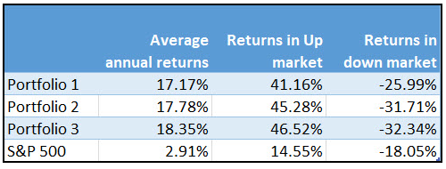

In today's fast-paced financial markets, investors are constantly seeking strategies to generate significant returns. One such approach is the net-net valuation method combined with algorithmic trading. This article explores the synergy between this traditional value investing strategy and modern algorithmic processes.

The net-net valuation method was popularized by Benjamin Graham, focusing on stocks priced below their net current asset value per share (NCAVPS). NCAVPS is calculated using the formula:



$$
\text{NCAVPS} = \frac{\text{Current Assets} - \text{Total Liabilities}}{\text{Outstanding Shares}}
$$

This method aims to identify undervalued stocks with strong balance sheets, which the market has overlooked. By focusing on companies whose shares are trading below their liquidation value, the net-net strategy seeks to provide substantial upside potential when market prices correct this undervaluation. As part of value investing, this strategy is particularly appealing for identifying companies in financial distress or those neglected by the market.

Algorithmic trading, contrastingly, utilizes computer programs to make investment decisions based on predefined criteria. These algorithms enhance the speed, precision, and execution of trades, providing a significant edge in competitive markets. Algorithms can efficiently process vast data sets, make emotion-free decisions, and adapt rapidly to changing market conditions—qualities essential for optimizing complex trading strategies.

By integrating these two approaches, investors can captivate the benefits of identifying undervalued net-net stocks through the rapid execution capabilities of algorithms. This integration enhances decision-making efficiency by automating the identification and trading of stocks based on NCAVPS criteria, potentially refining the stock selection process and optimizing risk management. The use of algorithms such as Python-based scripts can automate these aspects, facilitating a robust, technology-driven investment strategy.

This article evaluates the fundamentals of net-net investing, the advantages of its integration with algorithmic trading protocols, and the practical implementation of this hybrid strategy. We also review case studies to understand historical performance and address challenges and risks associated with combining these methodologies, providing a comprehensive overview for investors seeking to merge traditional and modern investment strategies.

## Table of Contents

## Understanding Net-Net Stocks

Net-net stocks are identified using a valuation technique grounded in the calculation of a company's net current asset value per share (NCAVPS). This crucial metric is derived from the formula: 

$$
\text{NCAVPS} = \frac{\text{Current Assets} - \text{Total Liabilities}}{\text{Outstanding Shares}}
$$

The method prioritizes stocks trading below their liquidation value, thus offering significant upside potential when the market re-evaluates and corrects such undervaluation. It serves as an investment strategy primarily focusing on acquiring stocks at a price lower than the net worth of the company's readily realizable assets. 

Benjamin Graham, renowned as the father of value investing, introduced this approach. He emphasized uncovering securities with a built-in margin of safety—a principle expressing the divergence between intrinsic value and market price. Graham's advocacy for this method highlights its potential to discover undervalued opportunities overlooked by the market.

Net-net investing is particularly appealing for companies in financial distress or those ignored by market participants. This approach not only emphasizes [liquidity](/wiki/liquidity-risk-premium) but also entails considerable astuteness, given that such stocks often come from firms undergoing fiscal hardships or operational mismanagement. However, this can present opportunities for investors to acquire assets at a discount, banking on eventual corporate turnaround or asset liquidation.

## Algorithmic Trading Basics

Algorithmic trading refers to the use of computer-driven algorithms to automate trading decisions based on pre-set rules and scenarios. This innovative approach allows for rapid execution of trades, providing an edge over traditional manual trading. One of the primary advantages of [algorithmic trading](/wiki/algorithmic-trading) is its capacity to handle vast amounts of data efficiently, facilitating quick decision-making devoid of human emotions. This reduces the potential for biases, leading to consistent application of trading strategies.

Algorithms can implement a variety of strategies that include trend-following, [arbitrage](/wiki/arbitrage), and mean reversion. Each of these strategies benefits from the precision and timing that is characteristic of algorithmic trading systems. For instance, trend-following strategies capitalize on the [momentum](/wiki/momentum) of stock price movements, while arbitrage strategies seek to exploit price discrepancies across different markets. Mean reversion strategies, on the other hand, are predicated on the assumption that asset prices will revert to their historical mean over time.

Algorithmic trading is particularly effective in adapting to real-time market conditions, a feature that aligns well with complex strategies like net-net investing. For instance, an algorithm can be programmed to monitor market conditions continuously and adjust its trading decisions in response to new data or shifts in market sentiment. In a Python-based system, this adaptability might involve libraries such as `pandas` for data manipulation and `scikit-learn` for employing [machine learning](/wiki/machine-learning) techniques to refine trading criteria.

Overall, the integration of algorithmic trading with traditional investment strategies allows for enhanced execution capabilities and the ability to capitalize on market inefficiencies consistently. This synergy between technology and strategy can be a powerful tool for investors seeking to optimize their trading performance.

## Integrating Net-Net Strategies in Algo Trading

Algorithmic trading can significantly enhance the identification and trading of net-net stocks by implementing automated processes based on Net Current Asset Value Per Share (NCAVPS) thresholds. This integration allows traders and investors to efficiently screen, select, and execute trades in stocks that meet specific net-net criteria, a method traditionally requiring extensive manual review.

To begin the integration of net-net strategies in algorithmic trading, it is essential to codify the entire process from data screening to trade execution. This automation ensures seamless navigation through dynamic market conditions. Here is a basic outline of how such an algorithm might be structured in Python:

1. **Data Acquisition**: Automatically fetch financial data from reliable sources such as public financial APIs or databases. This data should include current assets, total liabilities, and the number of outstanding shares, which are key to calculating NCAVPS.

2. **NCAVPS Calculation**:
   - Calculate the NCAVPS using the formula:
$$
     \text{NCAVPS} = \frac{\text{Current Assets} - \text{Total Liabilities}}{\text{Number of Outstanding Shares}}

$$
   - Stocks are selected if they trade below a pre-defined NCAVPS threshold, indicating undervaluation.

3. **Stock Screening**: Develop screening criteria in the algorithm to filter out stocks that do not meet the NCAVPS threshold. This step is crucial in focusing the trading strategy on potentially undervalued stocks.

4. **Incorporation of Machine Learning**: Enhance stock selection through machine learning models. These models can analyze historical price patterns and company performance to predict potential future performance, refining stock choices beyond simple screening.

5. **Dynamic Risk Management**: Implement risk management protocols tailored to the volatility often seen in net-net stocks. Algorithms can dynamically adjust stop-loss orders or hedge positions to protect against adverse market movements.

6. **Execution Module**: Automate the execution of buy and sell orders once a stock meets all selection criteria. This module should also allow for adjustments based on real-time market data, thus enhancing timing and precision in trades.

Below is an illustrative Python snippet demonstrating a simplified approach to calculating NCAVPS and screening stocks:

```python
import pandas as pd

# Sample function to fetch stock data
def fetch_stock_data(stock_symbol):
    # Assume this function collects data from a financial API
    return {
        'CurrentAssets': 1500000,
        'TotalLiabilities': 500000,
        'OutstandingShares': 200000
    }

def calculate_ncavps(stock_data):
    ncavps = (stock_data['CurrentAssets'] - stock_data['TotalLiabilities']) / stock_data['OutstandingShares']
    return ncavps

def screen_stocks(stocks, ncavps_threshold):
    suitable_stocks = []
    for stock in stocks:
        stock_data = fetch_stock_data(stock)
        ncavps = calculate_ncavps(stock_data)
        if ncavps > ncavps_threshold:
            suitable_stocks.append(stock)
    return suitable_stocks

# List of sample stock symbols to evaluate
stock_symbols = ['STOCK1', 'STOCK2', 'STOCK3']
ncavps_threshold = 5.0  # NCAVPS threshold

selected_stocks = screen_stocks(stock_symbols, ncavps_threshold)
print("Selected Stocks:", selected_stocks)
```

This code demonstrates the basic mechanism of calculating NCAVPS and screening stocks. While simplified, it serves as a foundation that can be expanded with real-time data fetching, advanced machine learning, and integrated risk management protocols. The continual adaptation of such algorithms ensures that trading strategies remain competitive and responsive to market changes.

## Challenges and Risks

The integration of net-net strategies with algorithmic trading is not without its challenges and risks. A primary concern is managing the [volatility](/wiki/volatility-trading-strategies) associated with distressed stocks often targeted in net-net strategies. These stocks can experience significant price fluctuations, making it crucial for algorithms to incorporate volatility management techniques. Implementing such measures helps safeguard portfolios against sudden adverse price movements.

Another critical aspect when combining algorithmic trading with net-net investing is the potential over-reliance on the mean reversion assumption. This belief that a stock's price will eventually revert to its average can lead to unrealistic expectations. Not all companies recover as predicted; some may continue to decline or even become insolvent, underscoring the need for careful stock selection and ongoing performance assessments.

Backtesting algorithms to ensure they function effectively with historical data introduces the risk of overfitting. Overfitted algorithms perform excellently on past data but fail to account for future market dynamics. Preventing overfitting requires ensuring that the algorithms are flexible and robust across a wide range of market conditions, not just tailored to the specific historical periods used in [backtesting](/wiki/backtesting).

Robust risk management techniques are essential for mitigating potential downsides in this blended approach. Employing tools like stop-loss orders can protect against significant losses by automatically selling a security when its price falls to a predetermined level. Diversifying portfolios by not putting all capital into a single stock or sector further spreads risk, reducing the impact of a poor-performing asset on overall returns.

A sample Python snippet demonstrating a simple stop-loss order mechanism can illustrate this approach:

```python
def monitor_position(stock_price, stop_loss_threshold):
    if stock_price <= stop_loss_threshold:
        execute_sell_order()

def execute_sell_order():
    print("Sell order executed at stop-loss threshold")
```

Incorporating these strategies into an automated trading system enhances resilience against potential pitfalls arising from market volatility and the inherent risks of investing in severely undervalued companies.

## Case Studies and Performance Backtests

Historical data from past market cycles can offer insights into how net-net strategies perform when integrated with algorithmic trading. By examining past behaviors, investors can better understand potential performance patterns and make informed adjustments to their investment strategies.

Case studies that analyze net-net strategies demonstrate that these approaches typically excel during stable market conditions when there is less volatility and investor behavior is more predictable. During such periods, the market often corrects undervaluations, resulting in significant returns for net-net investors. However, the efficacy of net-net strategies tends to decline during economic downturns or high-volatility periods. In such scenarios, distressed stocks, which are often targets of net-net approaches, may experience further financial challenges rather than recover, leading to suboptimal returns.

Performance backtests incorporating algorithmic trading augment the traditional net-net strategy by integrating momentum indicators. These indicators help in recognizing prevailing market trends and improving the alignment of trades with the market direction. When backtesting these enhanced strategies, it becomes apparent that incorporating momentum indicators can mitigate some of the drawbacks associated with a pure net-net strategy, especially during volatile periods. By ensuring trades are executed in the direction of strong market trends, the likelihood of capitalizing on short-term price movements increases, leading to improved returns.

A practical implementation example of this integrated approach uses machine learning models to optimize stock selection. By training algorithms on historical data, these models can identify patterns and parameters that are characteristic of successful net-net stocks. For instance, consider the use of a Random Forest classifier in Python to differentiate between potential outperformers and underperformers:

```python
from sklearn.ensemble import RandomForestClassifier
from sklearn.model_selection import train_test_split

# Assume data is a pandas DataFrame with relevant financial metrics and labels
X = data.drop('PerformanceLabel', axis=1)  # Features
y = data['PerformanceLabel']  # Labels (e.g., 1 for outperformers, 0 for underperformers)

# Split data into training and test sets
X_train, X_test, y_train, y_test = train_test_split(X, y, test_size=0.3, random_state=42)

# Initialize Random Forest model
rf_model = RandomForestClassifier(n_estimators=100, random_state=42)

# Train the model
rf_model.fit(X_train, y_train)

# Evaluate model performance
accuracy = rf_model.score(X_test, y_test)
print(f'Model Accuracy: {accuracy:.2f}')
```

Such models can aid in refining stock selection processes, minimizing exposure to potential underperformers, and thereby enhancing overall portfolio performance. The application of technology-driven enhancements provides investors with an edge, reinforcing decisions rooted in traditional value investment principles while adapting to dynamic market conditions.

## Conclusion

The combination of net-net valuation methods and algorithmic trading presents a compelling approach for investors aiming to exploit market inefficiencies. By integrating value-based strategies that identify undervalued stocks with technology-driven execution, investors have the opportunity to enhance their returns significantly while minimizing the emotional biases that often interfere with traditional investing practices.

Algorithmic trading platforms, capable of executing trades at high speeds based on pre-defined criteria, enable investors to act on identified market opportunities with precision and consistency. This is particularly advantageous when employing net-net strategies, as it allows for the rapid processing and analysis of large datasets to spot undervalued stocks efficiently. The underpinning technology assists in maintaining objectivity, benefiting from statistical evidence rather than subjective judgement, thus keeping emotional decision-making at bay.

The ongoing evolution in financial markets underscores the need for strategy adaptability. New data sources and technological advancements continually shape the landscape, demanding that investors remain agile in order to maintain a competitive advantage. Continuous research, development, and refinement of algorithms are essential components of this adaptability, allowing investors not only to respond to changing market conditions but also to preemptively position themselves to exploit gaps in the market caused by inefficiencies.

Ultimately, success in this hybrid approach lies in effectively balancing traditional [fundamental analysis](/wiki/fundamental-analysis) with modern technological advancements. Net-net investing principles offer a grounded framework for understanding intrinsic value, while algorithmic trading provides the tools to capitalize on these value propositions at scale and with speed. When adeptly combined, these methodologies empower investors to uncover and act upon undervalued opportunities, potentially yielding significant rewards in the fast-paced financial markets.

## References & Further Reading

[1]: Graham, B., & Zweig, J. (2003). ["The Intelligent Investor: The Definitive Book on Value Investing."](https://www.amazon.com/Intelligent-Investor-Definitive-Investing-Essentials/dp/0060555661) HarperBusiness Essentials.

[2]: Lopez de Prado, M. (2018). ["Advances in Financial Machine Learning."](https://www.amazon.com/Advances-Financial-Machine-Learning-Marcos/dp/1119482089) Wiley.

[3]: Aronson, D.R. (2007). ["Evidence-Based Technical Analysis: Applying the Scientific Method and Statistical Inference to Trading Signals."](https://www.amazon.com/Evidence-Based-Technical-Analysis-Scientific-Statistical/dp/0470008741) Wiley.

[4]: Jansen, S. (2018). ["Machine Learning for Algorithmic Trading."](https://github.com/stefan-jansen/machine-learning-for-trading) Packt Publishing.

[5]: Chan, E.P. (2009). ["Quantitative Trading: How to Build Your Own Algorithmic Trading Business."](https://github.com/ftvision/quant_trading_echan_book) Wiley.