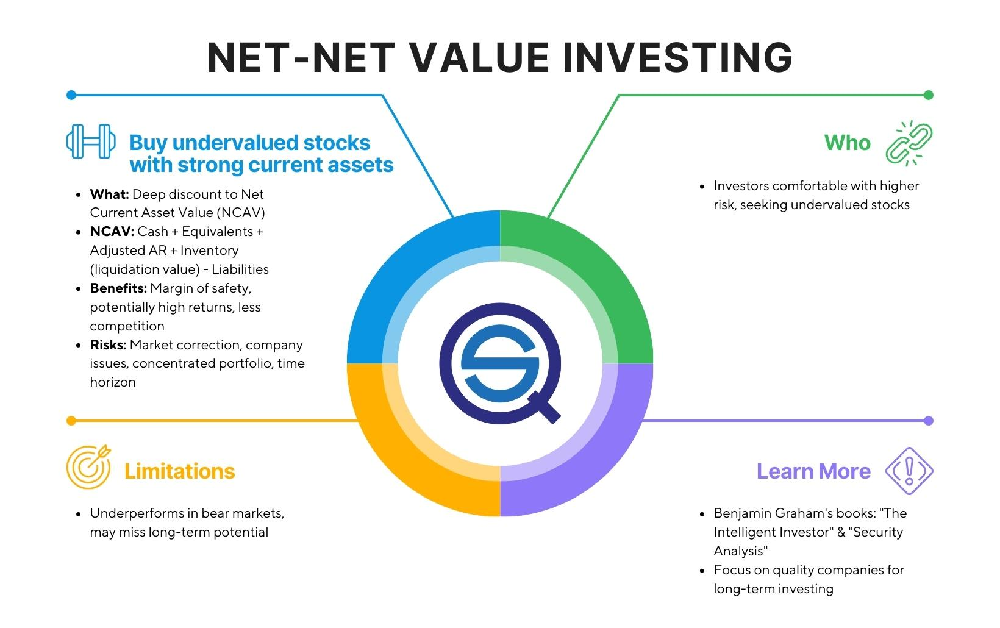

## Table of Contents

## What is the Net-Net Value Investing Strategy?

The Net-Net Value Investing Strategy is a way to find stocks that are selling for less than what the company is really worth. This strategy was made popular by Benjamin Graham, who is known as the father of value investing. The idea is to look at a company's balance sheet and see if its market price is lower than its net current asset value. The net current asset value is found by taking the company's current assets, like cash and inventory, and subtracting all its liabilities, like debts and bills. If the stock price is lower than this value, it might be a good buy because you're getting more than you're paying for.

This strategy is often used by investors who want to find undervalued companies. They believe that if a company is selling for less than its net current asset value, the stock price will eventually go up to reflect the true value of the company. This can lead to big profits if the investor buys the stock at a low price and sells it later when the price goes up. However, this strategy also has risks. Sometimes, the market might not recognize the true value of the company, or the company might have problems that make it hard to turn around. So, it's important for investors to do a lot of research before using this strategy.

## Who developed the Net-Net Value Investing Strategy?

The Net-Net Value Investing Strategy was developed by Benjamin Graham. He is often called the father of value investing. Graham came up with this strategy to help investors find stocks that were selling for less than what the company was really worth. He believed that by looking at a company's balance sheet, you could find out if the stock was a good buy.

Graham's idea was to focus on a company's net current asset value. This is calculated by taking the company's current assets, like cash and inventory, and subtracting all its liabilities, like debts and bills. If the stock price was lower than this value, Graham thought it was a good investment. He believed that the market would eventually recognize the true value of the company, and the stock price would go up. This strategy has been used by many investors looking for undervalued stocks.

## How does the Net-Net Value Investing Strategy differ from other value investing approaches?

The Net-Net Value Investing Strategy is different from other value investing approaches because it focuses on a specific way to find undervalued stocks. This strategy, developed by Benjamin Graham, looks at a company's balance sheet to see if the stock is selling for less than its net current asset value. The net current asset value is what the company would have left if it sold all its current assets and paid off all its liabilities. If the stock price is lower than this value, it might be a good buy. Other value investing approaches might look at different things, like a company's earnings, growth potential, or overall market position.

Unlike other value investing strategies that might consider a broader range of financial metrics, the Net-Net strategy is very specific and conservative. It doesn't focus on a company's future earnings or growth prospects. Instead, it only looks at what the company owns right now and what it owes. This makes it a more straightforward way to find undervalued stocks, but it also means that it might miss out on companies that are undervalued for other reasons. Other value investing approaches might use a mix of financial ratios, like price-to-earnings or price-to-book, to find good investments.

## What are the key financial metrics used in the Net-Net Value Investing Strategy?

The main financial metric used in the Net-Net Value Investing Strategy is the net current asset value. This is found by taking a company's current assets, like cash, inventory, and accounts receivable, and then subtracting all its current liabilities, like debts and bills. If the stock price is lower than this net current asset value, it means you're getting more than what you're paying for. This is the core idea of the strategy.

Besides the net current asset value, investors might also look at other simple financial metrics to make sure the company is worth investing in. For example, they might check the company's cash flow to see if it has enough money coming in to keep running. They might also look at the company's debt levels to make sure it's not too high. These extra checks help investors feel more confident that the company is really undervalued and not just struggling with other problems.

## How do you calculate the Net-Net Working Capital?

To calculate the Net-Net Working Capital, you start with a company's current assets. These are things like cash, inventory, and money that customers owe the company, which is called accounts receivable. You add up all these current assets to get the total. Then, you subtract all the company's current liabilities. These are things like debts that need to be paid soon and bills the company owes. The difference between the total current assets and the total current liabilities is the Net-Net Working Capital.

This number shows what the company would have left if it sold all its current assets and paid off all its current liabilities. If the stock price of the company is lower than this Net-Net Working Capital, it might be a good investment. This is because you're buying the company for less than what it's worth right now. Investors use this calculation to find stocks that are selling for less than their real value, hoping to make a profit when the stock price goes up.

## What are the steps to identify a Net-Net stock?

To find a Net-Net stock, you need to look at the company's balance sheet. Start by adding up all the current assets. These are things like cash, inventory, and money customers owe the company, called accounts receivable. After you have the total current assets, subtract all the current liabilities. These are things like debts and bills the company needs to pay soon. The difference between the total current assets and total current liabilities is the Net-Net Working Capital. If the stock price is lower than this Net-Net Working Capital, it might be a good investment because you're buying the company for less than what it's worth right now.

Once you find a stock with a price lower than its Net-Net Working Capital, you should do more research. Look at the company's cash flow to see if it has enough money coming in to keep running. Also, check the company's debt levels to make sure they are not too high. These extra checks help you feel more confident that the company is really undervalued and not just struggling with other problems. By following these steps, you can find stocks that might be good investments because they are selling for less than their real value.

## What are the potential risks associated with the Net-Net Value Investing Strategy?

One risk of the Net-Net Value Investing Strategy is that the market might not see the true value of the company. Even if the stock price is lower than the company's net current asset value, the market might not change its mind. This can mean the stock price stays low, and you don't make money. Another problem is that the company might have hidden issues. For example, the inventory might not be worth as much as the company says, or the company might have legal problems that make it hard to turn around.

Another risk is that the company might go out of business. Just because a company has more assets than liabilities doesn't mean it can keep running. If the company can't make enough money to pay its bills, it might have to close down. This would make your investment worthless. Also, finding Net-Net stocks can take a lot of time and work. You need to look at many companies' balance sheets and do a lot of research to find good investments. This can be hard and might not be worth the effort if you don't find good stocks.

## Can you provide examples of successful Net-Net investments?

One example of a successful Net-Net investment is the case of Berkshire Hathaway. In the 1970s, Warren Buffett used the Net-Net strategy to buy shares in Berkshire Hathaway when it was trading below its net current asset value. At the time, Berkshire Hathaway was a struggling textile company, but Buffett saw that its stock price was much lower than what its assets were worth. By buying the stock at a low price and later turning the company around, Buffett made a huge profit. This shows how the Net-Net strategy can work well if you pick the right company.

Another example is the investment in Alleghany Corporation by Benjamin Graham himself. In the 1930s, Graham found that Alleghany was trading at a price that was less than its net current asset value. He bought the stock and held onto it. Over time, the market recognized the true value of the company, and the stock price went up. Graham was able to sell his shares at a much higher price, making a good profit. This example shows that even during tough economic times, the Net-Net strategy can find undervalued stocks that turn into successful investments.

## How does market sentiment affect the performance of Net-Net stocks?

Market sentiment can have a big impact on how well Net-Net stocks do. If people feel good about the market, they might start buying more stocks, including Net-Net stocks. This can push the prices of these stocks up, even if they are still undervalued based on their net current asset value. On the other hand, if people are worried about the market, they might sell their stocks, including Net-Net stocks. This can make the prices of these stocks go down, even if the companies are still worth more than their stock prices suggest.

Sometimes, market sentiment can make it hard to find good Net-Net investments. If everyone is feeling very positive, the prices of stocks might go up so much that it's hard to find any that are selling for less than their net current asset value. But if everyone is feeling very negative, there might be a lot of Net-Net stocks to choose from. However, it can be risky to buy stocks when the market is down because the prices might keep falling. So, it's important to think about market sentiment when using the Net-Net strategy, but it shouldn't be the only thing you look at.

## What are the tax implications of investing in Net-Net stocks?

When you invest in Net-Net stocks, you need to think about taxes. If you buy a stock and then sell it for more money than you paid, you have to pay capital gains tax. This tax is on the profit you made. How much tax you pay depends on how long you held the stock. If you held it for less than a year, it's a short-term capital gain, and you pay your regular income tax rate. If you held it for more than a year, it's a long-term capital gain, and the tax rate is usually lower.

Another thing to think about is if the company pays dividends. If it does, you have to pay taxes on those dividends too. The tax rate on dividends can be different from the tax rate on capital gains. It's a good idea to talk to a tax advisor to understand all the tax rules and how they might affect your investment in Net-Net stocks. They can help you plan your investments in a way that keeps your taxes as low as possible.

## How can an investor adapt the Net-Net strategy to different market conditions?

An investor can adapt the Net-Net strategy to different market conditions by paying attention to how the market is feeling. When the market is doing well and people are happy, it might be harder to find Net-Net stocks because prices go up. But if the market is feeling bad and prices are low, there might be more Net-Net stocks to choose from. In good times, an investor might need to look harder or be more patient to find good deals. In bad times, they need to be careful because even if a stock looks like a good deal, the price could keep falling.

Another way to adapt the Net-Net strategy is by looking at more than just the net current asset value. For example, during times when the economy is not doing well, an investor might want to check the company's cash flow to make sure it has enough money to keep going. They might also look at how much debt the company has. By adding these extra checks, an investor can feel more sure that the company is really a good buy, no matter what the market is doing. This way, they can use the Net-Net strategy in different market conditions and still find good investments.

## What advanced techniques can be used to enhance the Net-Net Value Investing Strategy?

One advanced technique to enhance the Net-Net Value Investing Strategy is to use a margin of safety. This means buying stocks that are not just below their net current asset value, but significantly below it. By doing this, you give yourself a cushion in case the stock price doesn't go up as much as you hoped. This can protect you from losses if the market doesn't recognize the true value of the company as quickly as you thought. Another technique is to combine the Net-Net strategy with other value investing methods, like looking at a company's price-to-earnings ratio or its growth potential. By using more than one way to find undervalued stocks, you can have a better chance of [picking](/wiki/asset-class-picking) winners.

Another way to improve the Net-Net strategy is to do more in-depth research on the companies you are thinking about investing in. This can include looking at the quality of the company's assets. For example, if a company has a lot of inventory, you might want to check if it's really worth what the company says it is. You could also look at the company's management team to see if they have a good track record of turning things around. By doing this extra work, you can avoid companies that look like good deals but have hidden problems. This can help you find the best Net-Net investments and increase your chances of making money.

## What are Net-Net Stocks and How Can We Understand Them?

Net-net stocks represent a distinctive investment strategy that targets companies trading below their net current asset value per share (NCAVPS). This concept was pioneered by Benjamin Graham, often regarded as the father of value investing. His approach emphasized finding undervalued companies offering a margin of safety, which is crucial for protecting against downside risk while aiming for substantial returns.

NCAVPS is calculated using the formula:

$$
\text{NCAVPS} = \frac{\text{Current Assets} - \text{Total Liabilities}}{\text{Number of Outstanding Shares}}
$$

This formula filters for companies where their most liquid assets minus total liabilities suggest an inherent value that exceeds their current market capitalization. This means the company's share is being traded for less than its simple liquidation value. Graham's principle was based on the belief that the stock market tends to undervalue certain stocks, and by investing in them, one could achieve outsized returns once the market corrected its valuation discrepancy.

The focus on current assets and total liabilities ensures that only the most liquid parts of a company's balance sheet are considered. Current assets include cash, cash equivalents, and other assets that could be quickly converted to cash within a year, such as accounts receivable and inventories. Consequently, this approach often highlights companies that are financially stable but overlooked or underestimated due to their present market conditions.

However, this strategy is primarily effective for companies in financial distress or those neglected by the market. The fundamental premise is that, over time, the market will recognize their intrinsic value, leading to a price correction. Therefore, investors implementing net-net strategies must exhibit patience and a willingness to conduct thorough financial analysis to capitalize on these opportunities effectively.

## How can Net-Net Strategies be integrated into Algo Trading?

Algorithmic trading can effectively implement net-net strategies by streamlining the entire process of identifying and trading undervalued stocks. The initial step involves screening for stocks that meet specific net-net criteria. These criteria are based on Benjamin Graham's value investing principles, primarily the net current asset value per share (NCAVPS). To qualify as a net-net stock, a company’s share price must be less than its NCAVPS. This calculation is made through the formula:

$$
\text{NCAVPS} = \frac{\text{Current Assets} - \text{Total Liabilities}}{\text{Number of Shares Outstanding}}
$$

Algorithmic systems automate this screening process by continuously scanning financial data to find stocks that fit these criteria. Once identified, these stocks undergo a comprehensive evaluation of their financial health, factoring in [liquidity](/wiki/liquidity-risk-premium) and other balance sheet strengths, thus ensuring the intrinsic value is indeed higher than the market price.

Algorithmic trading algorithms execute trades based on a set of predefined conditions, which, in the context of net-net strategies, include entry and [exit](/wiki/exit-strategy) signals tailored to each stock's valuation metrics and market movements. This automation reduces errors commonly associated with human emotion and provides a higher level of precision in timing transactions, ensuring that trades are executed at optimal prices.

Moreover, these trading algorithms are dynamic, capable of adapting to changing market conditions. They employ [machine learning](/wiki/machine-learning) and data analytics to update parameters and trading decisions based on new information, such as shifts in market [volatility](/wiki/volatility-trading-strategies) or economic indicators. This adaptability limits potential losses, especially important for net-net stocks, which can be volatile.

In practice, a Python algorithm can be designed to interact with financial data APIs to automate the entire process. Below is a simple workflow of such an algorithm:

```python
import requests

# Function to calculate NCAVPS
def calculate_ncavps(current_assets, total_liabilities, shares_outstanding):
    return (current_assets - total_liabilities) / shares_outstanding

# Fetching stock data
def fetch_financial_data(stock_symbol):
    # Assuming an API endpoint provides the required data
    url = f'https://financialdataapi.com/api/stocks/{stock_symbol}'
    response = requests.get(url)
    if response.status_code == 200:
        return response.json()
    else:
        return None

# Screening stocks
def screen_stocks(stocks_list):
    qualifying_stocks = []
    for stock in stocks_list:
        data = fetch_financial_data(stock)
        if data:
            ncavps = calculate_ncavps(data['current_assets'], data['total_liabilities'], data['shares_outstanding'])
            if data['current_price'] < ncavps:
                qualifying_stocks.append(stock)
    return qualifying_stocks

# Example stock symbols
stocks = ['AAPL', 'GOOG', 'MSFT']
qualifying_stocks = screen_stocks(stocks)
print(f'Qualifying Net-Net Stocks: {qualifying_stocks}')
```

By leveraging technology and finance, investors can reap the benefits of net-net strategies efficiently, although they need to remain cautious and ensure robust [backtesting](/wiki/backtesting) and validation to mitigate risks associated with market fluctuations and distressed asset investment.

## References & Further Reading

[1]: Graham, Benjamin. **The Intelligent Investor: The Definitive Book on Value Investing.** Revised Edition. Harper Business, 2006.

[2]: Montier, James. **Value Investing: Tools and Techniques for Intelligent Investment.** Wiley, 2009.

[3]: Lopez de Prado, Marcos. **Advances in Financial Machine Learning.** Wiley, 2018.

[4]: Chan, Ernest P. **Quantitative Trading: How to Build Your Own Algorithmic Trading Business.** Wiley, 2009.

[5]: Jansen, Stefan. **Machine Learning for Algorithmic Trading: Predictive Models to Extract Signals from Market and Alternative Data for Systematic Trading Strategies with Python.** 2nd Edition, Packt Publishing, 2020.