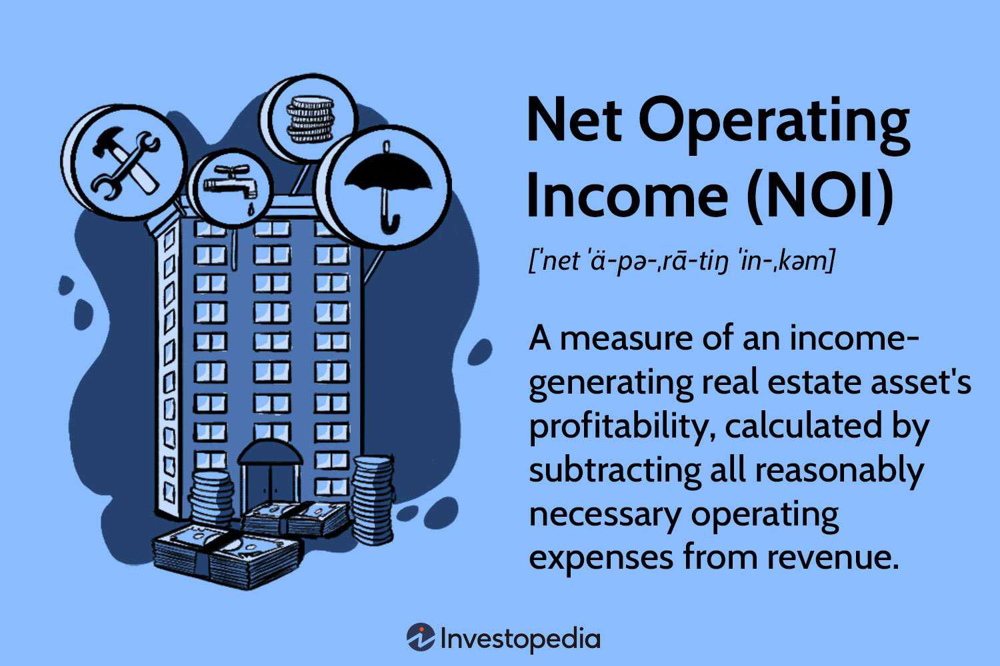

In the rapidly evolving world of real estate finance, understanding key metrics is crucial for investors and property managers alike. One of the most critical indicators of a property's financial health is Net Operating Income (NOI). NOI serves as a foundational metric that provides a clear picture of a property's profitability, excluding the impact of taxes and financing costs. It enables stakeholders to assess and compare the operational performance of different real estate assets.

This article explores the importance of NOI, delving into its calculation and its role in the burgeoning field of algorithmic trading in real estate finance. Algorithmic trading, a strategy that employs computational algorithms to make data-driven trading decisions, is increasingly being used in the real estate sector. By harnessing the power of algorithmic trading strategies, investors can leverage NOI analysis to maximize potential returns.



Whether you're new to real estate investment or a seasoned professional, gaining insights into NOI and its applications could be transformative. Understanding how to accurately calculate NOI and apply it in the context of algorithmic trading is not merely a theoretical exercise; it's a practical approach that can enhance investment strategies and contribute to better financial performance. Through this article, readers will gain an appreciation for how combining NOI analysis with algorithmic trading strategies can be a game-changer in property portfolio management and decision-making processes.

## Table of Contents

## Understanding Net Operating Income (NOI)

Net Operating Income (NOI) is a fundamental metric in real estate finance, representing the profitability of income-generating real estate assets after accounting for operating expenses. It is significant because it provides a clear picture of a property's ability to generate income, which is crucial for making informed investment and management decisions. The formula for calculating NOI is straightforward:

$$
\text{NOI} = \text{Total Revenue} - \text{Operating Expenses}
$$

### Components of NOI

1. **Total Revenue**: This encompasses all income generated from the property, including rent, parking fees, and ancillary services like laundry or vending machines. Stable tenant occupancy and competitive rental rates are critical for maximizing total revenue.

2. **Operating Expenses**: These are the costs necessary to maintain and operate the property, excluding mortgage payments, capital expenditures, and income taxes. Typical operating expenses include property management fees, utilities, repairs, maintenance, and insurance.

### Factors Affecting NOI

Several factors can influence NOI:

- **Market Conditions**: Economic conditions, such as interest rates and employment levels, can affect rental demand and pricing power.

- **Tenant Occupancy**: High occupancy rates generally increase total revenue, enhancing NOI. Conversely, high vacancy rates may necessitate incentives or reduced rental rates, negatively impacting revenue.

- **Property Management Efficiency**: Effective management can reduce operating costs through efficient maintenance protocols and utility usage, leading to an improved NOI.

### Preferred Metric

NOI is favored over other financial indicators for several reasons:

- **Exclusion of Non-operating Costs**: By excluding financing costs and taxes, NOI focuses strictly on property performance and management efficiency, offering investors a pure measure of a property's income potential.

- **Foundation for Valuation Models**: It serves as a critical component in valuation methods like the capitalization rate (cap rate) approach, where the property value is derived from the NOI divided by the cap rate.

$$
\text{Property Value} = \frac{\text{NOI}}{\text{Cap Rate}}
$$

### Impact of Changes in NOI

Shifts in NOI can directly affect property valuation and investment strategies. For instance:

- A 10% increase in NOI, due to improved occupancy or cost management, could significantly enhance the property's market value, assuming constant cap rates.
- Conversely, declining NOI might signal operational inefficiencies or market challenges, prompting a reassessment of management strategies or investment positions.

The practical applications of NOI extend far beyond valuation, influencing strategic decision-making in property acquisition, leasing strategies, and operational improvements. As a central pillar of financial analysis in real estate, understanding and optimizing NOI is essential for enhancing the overall financial performance of real estate investments.

## NOI Calculation: Step-by-Step Guide

Net Operating Income (NOI) is a pivotal metric in real estate finance, representing a property's ability to generate income. Accurate calculation of NOI is essential for evaluating property performance, making investment decisions, and enhancing portfolio management. This section provides a detailed step-by-step guide to calculating NOI.

### Step-by-Step Process to Calculate NOI

1. **Determine Total Revenue**: Total revenue consists of all income generated by the property, primarily through rental income. Additional revenues may include parking fees, service charges, and any ancillary income sources like laundry facilities or vending machines. Collecting comprehensive and accurate revenue data forms the foundation for precise NOI calculations.
$$
   \text{Total Revenue} = \text{Rental Income} + \text{Other Income}

$$

2. **Identify Operating Expenses**: Operating expenses incorporate all costs necessary to maintain and operate the property, excluding capital expenditures, taxes, depreciation, and interest. These expenses may include insurance, maintenance, utilities, and property management fees. It's crucial to accurately record these costs to ensure the NOI is a reliable measure of property performance.
$$
   \text{Operating Expenses} = \text{Insurance} + \text{Utilities} + \text{Maintenance} + \text{Management Fees} + \ldots

$$

3. **Calculate Net Operating Income (NOI)**: Subtract the total operating expenses from the total revenue to derive the NOI. This calculation reflects the property's profitability from its core operational activities.
$$
   \text{NOI} = \text{Total Revenue} - \text{Operating Expenses}

$$

### Importance of Accurate Data Collection

Accurate data collection and meticulous record-keeping are fundamental to determining an authentic NOI. Errors in recording revenue streams or misclassifying expenses can lead to erroneous conclusions about a property's financial health, subsequently affecting investment strategies and asset valuation.

### Tools and Software for Automating NOI Calculations

To streamline the NOI calculation process, several tools and software platforms are available. Software like MRI Software, Yardi Voyager, and RealPage offers integrated solutions to automate data tracking and NOI calculations. These platforms help ensure data accuracy, consistency, and efficiency, aligning with current technological trends in real estate finance.

### Common Mistakes in NOI Calculation

1. **Excluding or Misclassifying Expenses**: Common errors include omitting expenses or misclassifying capital expenditures as operating expenses, which can inflate the NOI.
2. **Ignoring Vacancy Rates and Bad Debt**: Not accounting for vacancy losses or bad debt can overestimate rental income.
3. **Irregular Data Updates**: Failing to update data regularly can lead to outdated NOI calculations, skewing investment assessments.

### Sample Calculations

Consider a hypothetical property generating $500,000 in rental income and $50,000 in other income (Total Revenue = $550,000). Operating expenses include $60,000 in insurance, $40,000 in utilities, $30,000 in maintenance, and $20,000 in management fees (Total Operating Expenses = $150,000).

$$
\text{Total\ Revenue} = \$500,000 + \$50,000 = \$550,000
$$

$$
\text{Operating\ Expenses} = \$60,000 + \$40,000 + \$30,000 + \$20,000 = \$150,000
$$

$$
\text{NOI} = \$550,000 - \$150,000 = \$400,000
$$

This calculation highlights a property with a robust operational income, assuming all data inputs are accurate and up-to-date.

In summary, calculating NOI involves a systematic process of aggregating revenue, deducting operating expenses, and ensuring precise data management. By leveraging modern tools and avoiding common pitfalls, real estate managers and investors can effectively utilize NOI to guide strategic financial decisions.

## Algorithmic Trading in Real Estate Finance

Algorithmic trading, a technique that uses computer algorithms to automatically execute trading strategies, has become increasingly popular in the financial sector, including the burgeoning field of real estate finance. It involves the use of complex algorithms to analyze vast data sets and make real-time decisions for buying, selling, or holding an asset. As financial technologies advance, [algorithmic trading](/wiki/algorithmic-trading) is becoming a crucial tool for optimizing strategies and maximizing efficiency in real estate investments.

In real estate finance, algorithmic trading can be applied by analyzing key metrics, particularly Net Operating Income (NOI), to make informed investment decisions. NOI serves as a crucial indicator of a property's profitability, and integrating it with algorithmic trading enables investors to evaluate potential returns more accurately. This is particularly useful for large portfolios where human analysis may be too slow or prone to error. Algorithms can assess historical NOI data, forecast future trends, and adjust investment strategies dynamically to optimize financial outcomes.

Benefits of using algorithmic trading strategies in the real estate sector include enhanced efficiency and data-driven decision making. By automating data collection and analysis, investors and managers can reduce human error, improve the speed of transactions, and react quickly to market changes. Furthermore, algorithms can process large volumes of information, including market trends, economic indicators, and real estate databases, to generate insights that would be challenging to obtain manually.

Technological tools and platforms designed for real estate algorithmic trading are evolving rapidly. Various software solutions and platforms offer features such as [machine learning](/wiki/machine-learning) algorithms, big data analytics, and predictive modeling. These tools not only facilitate the execution of trades but also provide comprehensive dashboards for monitoring property performance and market conditions in real time.

Case studies demonstrate the effectiveness of algorithmic trading in enhancing real estate investment outcomes. For instance, a real estate investment trust (REIT) might use an algorithm to adjust its portfolio based on predicted NOI changes due to economic shifts. By strategically reallocating resources, the trust can capture emerging opportunities or mitigate risks. Additionally, algorithmic trading platforms that incorporate complex analytics can help investors identify undervalued properties by comparing their NOI to market benchmarks, allowing them to make competitive offers before prices rise.

In conclusion, algorithmic trading in real estate finance, particularly when leveraging NOI data, offers substantial benefits for modern investors. By combining state-of-the-art technological tools with sound financial analysis, it provides a framework for enhanced investment strategies that align with the fast-paced and data-intensive nature of today's markets.

## Integrating NOI Calculation with Algor Trading Strategies

The intersection of Net Operating Income (NOI) calculations with algorithmic trading strategies provides a compelling frontier for enhancing property portfolio management. Accurate NOI predictions are critical in refining trading algorithms within real estate finance, as they directly impact the assessment of property value and potential profitability. By integrating NOI into trading models, investors can optimize their portfolios and make more informed decisions.

**Improving Trading Algorithms with Accurate NOI Predictions**

Algorithmic trading in real estate finance relies heavily on accurate data inputs to generate effective trading signals. NOI serves as a fundamental indicator of a property's performance, influencing cash flow projections and investment returns. Precise NOI calculations enable trading algorithms to better forecast market trends and respond to fluctuations in property values. This, in turn, improves decision-making accuracy, portfolio risk management, and profit potential.

For instance, consider a Python-based algorithm that predicts property valuation trends. By incorporating up-to-date NOI data, the algorithm can adjust its predictions based on changes in rental income or operating expenses:

```python
def calculate_projected_value(current_value, noi, cap_rate, market_trend):
    projected_value = (noi / cap_rate) * (1 + market_trend)
    return projected_value

# Example usage:
current_value = 500000
noi = 50000
cap_rate = 0.05
market_trend = 0.02

projected_value = calculate_projected_value(current_value, noi, cap_rate, market_trend)
```

**Advanced Analytical Techniques: Machine Learning**

Machine learning enhances the predictive power of trading algorithms by identifying complex patterns in NOI data that may not be immediately apparent through traditional analysis techniques. Techniques such as regression analysis, neural networks, and decision trees can forecast NOI changes by analyzing historical data and identifying trends.

For example, a machine learning model can be trained to predict the impact of economic factors, like unemployment rates or [interest rate](/wiki/interest-rate-trading-strategies) changes, on NOI. These insights allow investors to adjust their trading strategies proactively.

**Challenges and Limitations**

Integrating NOI calculations with algorithmic trading strategies poses challenges, including data reliability, model accuracy, and integration complexity. Inaccurate NOI inputs can lead to erroneous trading decisions, emphasizing the importance of robust data-management practices. Additionally, developing sophisticated models requires advanced technical skills and a deep understanding of both real estate finance and data science.

Furthermore, fluctuating market conditions and regulatory changes can affect model performance, necessitating continuous model updates and adjustments to maintain efficacy.

**Practical Tips for Investors and Managers**

1. **Data Infrastructure:** Establish a strong framework for data collection and management to ensure the accuracy of NOI data inputs.

2. **Technical Expertise:** Build or acquire a skilled team proficient in data analytics and algorithm development to construct and maintain sophisticated trading models.

3. **Automated Tools:** Utilize modern software solutions that integrate machine learning capabilities to automate NOI analysis and trading algorithms.

4. **Continuous Learning:** Stay informed about advances in real estate finance technologies and machine learning methodologies to remain competitive.

By successfully combining accurate NOI calculations with algorithmic trading strategies, real estate investors and managers can significantly enhance portfolio performance, achieve greater efficiency, and capitalize on emerging market opportunities.

## Conclusion

Understanding and accurately calculating Net Operating Income (NOI) is fundamental for navigating the complexities of real estate finance. NOI serves as a critical indicator of a property's financial viability, guiding investors and property managers in making informed decisions. Its significance lies in providing a clear picture of a property's profitability by considering all operational aspects without the noise of non-operational financial metrics.

Algorithmic trading, with its roots in stock markets, is increasingly relevant in real estate finance as it leverages data-driven strategies to enhance investment outcomes. Integrating NOI analysis into algorithmic trading strategies promises to refine investment approaches, resulting in better market positioning and potentially higher returns. By employing sophisticated algorithms that incorporate accurate NOI calculations, real estate professionals can remain competitive and responsive to market changes.

The embrace of technological advancements is imperative for real estate professionals aiming for superior financial performance and strategic planning. Technologies such as machine learning and advanced data analytics enhance the predictive accuracy of investment strategies, offering a competitive advantage in a data-rich industry. Automation and precision in calculating NOI can lead to more agile decision-making and improved portfolio management.

For those interested in further exploration, numerous resources are available. Books and research papers on real estate finance provide foundational knowledge, while online courses and workshops offer specialized training in algorithmic trading. Organizations such as the Urban Land Institute and real estate sections of financial journals are good starting points.

Lastly, engagement and collaboration within the real estate community are invaluable. Sharing experiences and insights can catalyze new strategies and innovations. Professionals are encouraged to contribute their findings and stay abreast of evolving techniques, fostering an environment of continuous learning and adaptation.

## References & Further Reading

[1]: Geltner, D., Miller, N., Clayton, J., & Eichholtz, P. (2007). ["Commercial Real Estate Analysis and Investments."](https://www.researchgate.net/publication/245702364_Commercial_Real_Estate_Analysis_and_Investments) Cengage Learning.

[2]: Lee, S., & Choi, Y. (2015). ["The Impact of Real Estate Prices on Bank Stability: Evidence from Macroprudential Policy."](https://www.imf.org/external/pubs/ft/wp/2015/wp1561.pdf) Journal of Financial Stability, 20, 105-127.

[3]: López de Prado, M. (2018). ["Advances in Financial Machine Learning."](https://www.amazon.com/Advances-Financial-Machine-Learning-Marcos/dp/1119482089) Wiley.

[4]: Wiley, J. (2013). ["Real Estate Finance & Investments."](https://www.amazon.com/Estate-Finance-Investments-McGraw-Hill-Insurance/dp/0073377333) McGraw-Hill Education.

[5]: Chan, E. (2008). ["Quantitative Trading: How to Build Your Own Algorithmic Trading Business."](https://github.com/ftvision/quant_trading_echan_book) John Wiley & Sons.

[6]: Palepu, K. G., & Healy, P. M. (2012). ["Business Analysis and Valuation: Using Financial Statements."](https://books.google.com/books/about/Business_Analysis_and_Valuation_Using_Fi.html?id=IDT6DwAAQBAJ) Cengage Learning.

[7]: Fabozzi, F. J., & Markowitz, H. M. (2011). ["The Theory and Practice of Investment Management."](https://onlinelibrary.wiley.com/doi/book/10.1002/9781118267028) Wiley Finance Series.