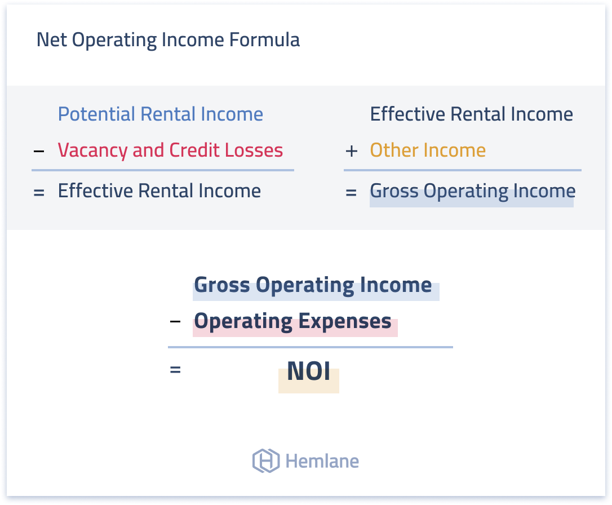

## Table of Contents

## What is Net Operating Income (NOI) in real estate?

Net Operating Income (NOI) in real estate is the money a property makes after paying all the costs to keep it running. This includes things like property taxes, insurance, and maintenance costs. NOI does not include the costs of paying back any loans on the property, like mortgage payments. It's a key number that investors look at to see how well a property is doing.

NOI is important because it helps investors figure out if a property is a good investment. By looking at the NOI, investors can see how much money the property is making from its operations alone. This helps them compare different properties and decide which ones might be the best to buy or keep. It's like checking the profit of a business, but for a building or piece of land.

## How is NOI calculated?

To find the Net Operating Income (NOI) of a property, you start with the total income the property makes. This includes money from rent, parking fees, and any other ways the property earns money. Then, you subtract all the costs of running the property. These costs include things like property taxes, insurance, maintenance, and utilities. The money left after you subtract these costs is the NOI.

NOI is important because it shows how much money a property makes just from its day-to-day operations. It doesn't include money you spend on loans, like mortgage payments. This makes NOI a good way to see how well a property is doing on its own, without considering how it was bought or financed. By looking at the NOI, you can compare different properties and decide which ones are good investments.

## Why is NOI important for real estate investors?

Net Operating Income (NOI) is important for real estate investors because it shows how much money a property makes after paying all the costs to keep it running. This helps investors see if a property is making a profit from its day-to-day operations. By looking at the NOI, investors can compare different properties and decide which ones might be the best to buy or keep. It's like checking the profit of a business, but for a building or piece of land.

NOI is also useful because it does not include costs like mortgage payments. This means it shows the true [earning](/wiki/earning-announcement) power of a property, without being affected by how it was bought or financed. This makes NOI a clear and fair way to see how well a property is doing on its own. By focusing on NOI, investors can make better choices about which properties will help them earn more money in the long run.

## Can you provide an example of how to calculate NOI for a rental property?

Let's say you own an apartment building. You collect $50,000 a year in rent from all the tenants. You also earn $5,000 a year from parking fees. So, your total income from the property is $55,000. Now, you have to pay for things like property taxes, which cost $3,000 a year, insurance at $2,000 a year, and maintenance and repairs that add up to $5,000 a year. You also pay $1,000 a year for utilities. When you add up all these costs, they come to $11,000 a year.

To find the Net Operating Income (NOI), you subtract the total costs from the total income. So, you take $55,000 (your total income) and subtract $11,000 (your total costs). This leaves you with $44,000. That $44,000 is your NOI. It shows how much money your apartment building makes after paying all the costs to keep it running. This number helps you see if your property is making a profit and can be used to compare it with other properties to see which ones are better investments.

## What are the key components that affect NOI?

The key components that affect Net Operating Income (NOI) are the total income and the total operating expenses of a property. The total income includes all the money the property makes, like rent from tenants, parking fees, and any other income sources. If you can increase the rent or add more income sources, like laundry facilities or vending machines, you can boost your NOI. On the other hand, if you lose tenants or have to lower rent, your NOI will go down.

The total operating expenses are all the costs needed to keep the property running smoothly. This includes things like property taxes, insurance, maintenance, repairs, and utilities. If these costs go up, like if property taxes increase or you need to do more repairs, your NOI will decrease. But if you can find ways to lower these costs, like getting a better deal on insurance or doing some maintenance work yourself, you can increase your NOI. Keeping a close eye on both income and expenses is important for managing and improving your NOI.

## How does NOI differ from gross operating income?

Net Operating Income (NOI) and Gross Operating Income are both important numbers for real estate, but they are different. Gross Operating Income is the total amount of money a property makes before any costs are taken out. This includes all the rent, parking fees, and any other income the property brings in. So, if you own an apartment building and you collect $50,000 in rent and $5,000 from parking fees, your Gross Operating Income would be $55,000.

NOI, on the other hand, takes the Gross Operating Income and subtracts all the costs needed to keep the property running. These costs include things like property taxes, insurance, maintenance, and utilities. Using the same example, if your total costs are $11,000 a year, you would subtract that from your Gross Operating Income of $55,000 to get an NOI of $44,000. So, NOI shows you how much money the property actually makes after all the bills are paid, while Gross Operating Income just shows the total money coming in before any costs are taken out.

## What strategies can be used to increase NOI?

To increase Net Operating Income (NOI), you can focus on boosting the income the property makes. One way to do this is by raising the rent if the market allows it. Another way is to add new income sources, like charging for parking, laundry facilities, or even renting out storage space. You might also try to fill any empty units faster by offering special deals or improving how you advertise the property. The more money you can bring in, the higher your NOI will be.

You can also work on lowering the costs of running the property. This means looking at all your expenses and finding ways to save money. For example, you could shop around for cheaper insurance, do some maintenance work yourself instead of hiring someone, or find ways to use less energy to lower utility bills. By cutting down on these costs, you'll have more money left over after paying the bills, which will increase your NOI. Keeping a close eye on both income and expenses is key to making your property more profitable.

## How does NOI impact the valuation of a property?

Net Operating Income (NOI) is really important when figuring out how much a property is worth. One way people do this is by using something called the capitalization rate, or "cap rate" for short. The cap rate is like a percentage that shows how much money the property makes compared to how much it costs. To find the value of a property, you take the NOI and divide it by the cap rate. So, if a property has an NOI of $44,000 and the cap rate is 5%, you would divide $44,000 by 0.05 to get a value of $880,000. This means that the higher the NOI, the more valuable the property is.

NOI also helps investors see if a property is a good investment. If a property has a high NOI, it means it's making a lot of money after paying all the costs to keep it running. This makes the property more attractive to buyers because it shows that the property is doing well on its own, without considering how it was bought or financed. By looking at the NOI, investors can compare different properties and choose the ones that will give them the best return on their money. So, a strong NOI can make a big difference in how much someone is willing to pay for a property.

## What are common pitfalls to avoid when calculating NOI?

When calculating Net Operating Income (NOI), one common mistake is mixing up the costs that should and shouldn't be included. NOI only includes the costs to keep the property running, like property taxes, insurance, maintenance, and utilities. It doesn't include costs like mortgage payments or interest on loans. If you include these loan costs, you'll end up with a lower NOI than you should, which can make the property look less profitable than it really is.

Another pitfall is not keeping good records of all the income and expenses. If you miss some of the money coming in, like rent or parking fees, or forget to account for all the costs, your NOI won't be accurate. It's important to keep track of everything carefully so you know exactly how much money the property is making and spending. This helps you get a true picture of the property's performance and make better decisions about it.

## How does NOI relate to cap rate in real estate investment?

Net Operating Income (NOI) and the capitalization rate, or "cap rate," work together to help figure out how much a property is worth. The cap rate is like a percentage that shows how much money a property makes compared to what it costs. To find out the value of a property, you take the NOI and divide it by the cap rate. For example, if a property has an NOI of $44,000 and the cap rate is 5%, you divide $44,000 by 0.05 to get a value of $880,000. This means that a higher NOI makes the property more valuable because it shows the property is making more money after paying all the costs to keep it running.

The cap rate also helps investors see if a property is a good investment. By comparing the NOI to the cap rate, investors can see how much return they might get on their money. If a property has a high NOI and a low cap rate, it might be a good investment because it's making a lot of money compared to what it costs. On the other hand, if the NOI is low or the cap rate is high, the property might not be as good of an investment. So, understanding how NOI and cap rate work together is really important for making smart choices about buying or selling properties.

## What role does NOI play in commercial versus residential real estate?

Net Operating Income (NOI) is important for both commercial and residential real estate, but it's used a bit differently in each. In commercial real estate, NOI is a big deal because it helps investors see how well a business, like a store or office building, is doing. Commercial properties often have longer leases and more complex income and expense setups. So, knowing the NOI helps investors figure out if the property is making enough money to cover the costs and still give a good return on their investment. It's like checking the profit of a business, but for a building.

In residential real estate, NOI is also important, but it's usually simpler to calculate. Residential properties, like apartment buildings or houses, usually have more straightforward income from rent and expenses like maintenance and utilities. Investors use NOI to see how much money the property makes after paying all the costs to keep it running. This helps them compare different properties and decide which ones are good investments. Even though the way NOI is used might be a bit different, it's still a key number for figuring out if a property is worth buying or keeping.

## How can NOI be used to compare the performance of different properties?

Net Operating Income (NOI) is a great way to compare how well different properties are doing. It shows how much money a property makes after paying all the costs to keep it running. By looking at the NOI of different properties, you can see which ones are making more money. For example, if one apartment building has an NOI of $40,000 and another has an NOI of $50,000, the second one is making more money after paying its bills. This helps you decide which property might be a better investment.

NOI also helps you see how well a property is doing over time. If you own several properties, you can use NOI to see which ones are getting better or worse. For example, if the NOI of one property goes up from $30,000 to $35,000 over a year, it means the property is doing better. But if another property's NOI goes down from $45,000 to $40,000, it might need some work to improve its performance. By comparing the NOI of different properties, you can make smarter choices about where to invest your money.

## What is Net Operating Income (NOI) and how is it calculated?

Net Operating Income (NOI) is a fundamental metric in real estate finance, representing the profitability of income-generating real estate assets after accounting for operating expenses. It is significant because it provides a clear picture of a property's ability to generate income, which is crucial for making informed investment and management decisions. The formula for calculating NOI is straightforward:

$$
\text{NOI} = \text{Total Revenue} - \text{Operating Expenses}
$$

### Components of NOI

1. **Total Revenue**: This encompasses all income generated from the property, including rent, parking fees, and ancillary services like laundry or vending machines. Stable tenant occupancy and competitive rental rates are critical for maximizing total revenue.

2. **Operating Expenses**: These are the costs necessary to maintain and operate the property, excluding mortgage payments, capital expenditures, and income taxes. Typical operating expenses include property management fees, utilities, repairs, maintenance, and insurance.

### Factors Affecting NOI

Several factors can influence NOI:

- **Market Conditions**: Economic conditions, such as interest rates and employment levels, can affect rental demand and pricing power.

- **Tenant Occupancy**: High occupancy rates generally increase total revenue, enhancing NOI. Conversely, high vacancy rates may necessitate incentives or reduced rental rates, negatively impacting revenue.

- **Property Management Efficiency**: Effective management can reduce operating costs through efficient maintenance protocols and utility usage, leading to an improved NOI.

### Preferred Metric

NOI is favored over other financial indicators for several reasons:

- **Exclusion of Non-operating Costs**: By excluding financing costs and taxes, NOI focuses strictly on property performance and management efficiency, offering investors a pure measure of a property's income potential.

- **Foundation for Valuation Models**: It serves as a critical component in valuation methods like the capitalization rate (cap rate) approach, where the property value is derived from the NOI divided by the cap rate.

$$
\text{Property Value} = \frac{\text{NOI}}{\text{Cap Rate}}
$$

### Impact of Changes in NOI

Shifts in NOI can directly affect property valuation and investment strategies. For instance:

- A 10% increase in NOI, due to improved occupancy or cost management, could significantly enhance the property's market value, assuming constant cap rates.
- Conversely, declining NOI might signal operational inefficiencies or market challenges, prompting a reassessment of management strategies or investment positions.

The practical applications of NOI extend far beyond valuation, influencing strategic decision-making in property acquisition, leasing strategies, and operational improvements. As a central pillar of financial analysis in real estate, understanding and optimizing NOI is essential for enhancing the overall financial performance of real estate investments.

## How do you calculate NOI: A Step-by-Step Guide?

Net Operating Income (NOI) is a pivotal metric in real estate finance, representing a property's ability to generate income. Accurate calculation of NOI is essential for evaluating property performance, making investment decisions, and enhancing portfolio management. This section provides a detailed step-by-step guide to calculating NOI.

### Step-by-Step Process to Calculate NOI

1. **Determine Total Revenue**: Total revenue consists of all income generated by the property, primarily through rental income. Additional revenues may include parking fees, service charges, and any ancillary income sources like laundry facilities or vending machines. Collecting comprehensive and accurate revenue data forms the foundation for precise NOI calculations.
$$
   \text{Total Revenue} = \text{Rental Income} + \text{Other Income}

$$

2. **Identify Operating Expenses**: Operating expenses incorporate all costs necessary to maintain and operate the property, excluding capital expenditures, taxes, depreciation, and interest. These expenses may include insurance, maintenance, utilities, and property management fees. It's crucial to accurately record these costs to ensure the NOI is a reliable measure of property performance.
$$
   \text{Operating Expenses} = \text{Insurance} + \text{Utilities} + \text{Maintenance} + \text{Management Fees} + \ldots

$$

3. **Calculate Net Operating Income (NOI)**: Subtract the total operating expenses from the total revenue to derive the NOI. This calculation reflects the property's profitability from its core operational activities.
$$
   \text{NOI} = \text{Total Revenue} - \text{Operating Expenses}

$$

### Importance of Accurate Data Collection

Accurate data collection and meticulous record-keeping are fundamental to determining an authentic NOI. Errors in recording revenue streams or misclassifying expenses can lead to erroneous conclusions about a property's financial health, subsequently affecting investment strategies and asset valuation.

### Tools and Software for Automating NOI Calculations

To streamline the NOI calculation process, several tools and software platforms are available. Software like MRI Software, Yardi Voyager, and RealPage offers integrated solutions to automate data tracking and NOI calculations. These platforms help ensure data accuracy, consistency, and efficiency, aligning with current technological trends in real estate finance.

### Common Mistakes in NOI Calculation

1. **Excluding or Misclassifying Expenses**: Common errors include omitting expenses or misclassifying capital expenditures as operating expenses, which can inflate the NOI.
2. **Ignoring Vacancy Rates and Bad Debt**: Not accounting for vacancy losses or bad debt can overestimate rental income.
3. **Irregular Data Updates**: Failing to update data regularly can lead to outdated NOI calculations, skewing investment assessments.

### Sample Calculations

Consider a hypothetical property generating $500,000 in rental income and $50,000 in other income (Total Revenue = $550,000). Operating expenses include $60,000 in insurance, $40,000 in utilities, $30,000 in maintenance, and $20,000 in management fees (Total Operating Expenses = $150,000).

$$
\text{Total\ Revenue} = \$500,000 + \$50,000 = \$550,000
$$

$$
\text{Operating\ Expenses} = \$60,000 + \$40,000 + \$30,000 + \$20,000 = \$150,000
$$

$$
\text{NOI} = \$550,000 - \$150,000 = \$400,000
$$

This calculation highlights a property with a robust operational income, assuming all data inputs are accurate and up-to-date.

In summary, calculating NOI involves a systematic process of aggregating revenue, deducting operating expenses, and ensuring precise data management. By leveraging modern tools and avoiding common pitfalls, real estate managers and investors can effectively utilize NOI to guide strategic financial decisions.

## References & Further Reading

[1]: Geltner, D., Miller, N., Clayton, J., & Eichholtz, P. (2007). ["Commercial Real Estate Analysis and Investments."](https://www.researchgate.net/publication/245702364_Commercial_Real_Estate_Analysis_and_Investments) Cengage Learning.

[2]: Lee, S., & Choi, Y. (2015). ["The Impact of Real Estate Prices on Bank Stability: Evidence from Macroprudential Policy."](https://www.imf.org/external/pubs/ft/wp/2015/wp1561.pdf) Journal of Financial Stability, 20, 105-127.

[3]: López de Prado, M. (2018). ["Advances in Financial Machine Learning."](https://www.amazon.com/Advances-Financial-Machine-Learning-Marcos/dp/1119482089) Wiley.

[4]: Wiley, J. (2013). ["Real Estate Finance & Investments."](https://www.amazon.com/Estate-Finance-Investments-McGraw-Hill-Insurance/dp/0073377333) McGraw-Hill Education.

[5]: Chan, E. (2008). ["Quantitative Trading: How to Build Your Own Algorithmic Trading Business."](https://github.com/ftvision/quant_trading_echan_book) John Wiley & Sons.

[6]: Palepu, K. G., & Healy, P. M. (2012). ["Business Analysis and Valuation: Using Financial Statements."](https://books.google.com/books/about/Business_Analysis_and_Valuation_Using_Fi.html?id=IDT6DwAAQBAJ) Cengage Learning.

[7]: Fabozzi, F. J., & Markowitz, H. M. (2011). ["The Theory and Practice of Investment Management."](https://onlinelibrary.wiley.com/doi/book/10.1002/9781118267028) Wiley Finance Series.