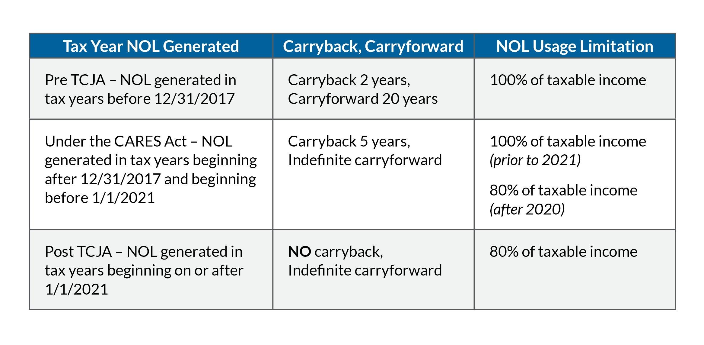

In today's dynamic business environment, understanding tax deductions is crucial for enterprises. One important area is how net operating loss (NOL) tax deductions can be leveraged. This article explores the concept of NOL carryforward, its advantages, and its relevance in algorithmic trading.

Tax implications and deductions associated with NOLs are significant for businesses striving to recover from financial setbacks. An NOL occurs when a company’s allowable tax deductions exceed its taxable income, resulting in a financial loss. For example, if a company’s taxable income for a year is $500,000, but the allowable deductions amount to $700,000, the firm incurs an NOL of $200,000. These losses can be carried forward to offset future taxable income, thereby reducing tax obligations in profitable years. Such potential for tax savings can improve a company’s financial outlook and provide a cushion in turbulent times.



The landscape of NOL carryforwards has been reshaped by legislative changes, notably the Tax Cuts and Jobs Act (TCJA) and the Coronavirus Aid, Relief, and Economic Security (CARES) Act. The TCJA imposed limitations on the carryforwards, allowing only 80% of taxable income to be offset annually by NOLs, but the CARES Act temporarily lifted some of these restrictions to provide relief during the economic downturn caused by COVID-19. As these provisions evolve, businesses are increasingly required to incorporate such changes into their tax planning strategies to maximize potential benefits, highlighting the importance of staying current with legislative changes.

Algorithmic trading represents a sector where the efficient application of NOL carryforwards can be particularly advantageous. In this rapidly evolving field, market volatility and operational losses are common challenges. Utilizing NOLs effectively allows algorithmic trading platforms to mitigate the impact of these challenges on financial performance. Strategies that integrate financial analytics with tax planning can enable such entities to better manage income fluctuations, spread losses over subsequent profitable years, and optimize their overall tax positioning.

## Table of Contents

## Understanding Net Operating Loss (NOL)

Net Operating Loss (NOL) is a financial state where a company’s allowable tax deductions surpass its taxable income, resulting in a negative taxable income. Recognizing and utilizing NOLs is pivotal in tax planning, as they enable businesses to offset taxable income in future profitable years, thereby reducing their tax obligation. This financial tool is particularly valuable for industries experiencing cyclical profits, such as agriculture and trading, where income levels can fluctuate significantly from year to year.

The ability to [carry](/wiki/carry-trading) forward NOLs provides substantial tax relief by evening out these income fluctuations over time. For example, a trading firm might encounter a year of losses due to market volatility, generating an NOL. In subsequent years, when profits return, the company can apply the NOL to reduce its taxable income, thus lowering its tax liability.

To calculate an NOL, a straightforward process is followed: subtract the company's taxable income from its allowable deductions. If the result is negative, the company incurs a net operating loss. Mathematically, this can be represented as:

$$
\text{NOL} = \text{Allowable Deductions} - \text{Taxable Income}
$$

When NOL is greater than zero (indicating a loss), the company can consider this as an asset for tax planning purposes.

NOLs also have implications as deferred tax assets on the balance sheet. These are amounts of money that a company expects to recover in future tax periods due to losses incurred. Recognizing this asset is significant for financial planning and stability, as it allows businesses to project when they will likely receive tax benefits, impacting cash flow and resource allocation decisions. Companies need to account for NOLs appropriately to leverage them effectively, thereby fostering long-term financial health and strategic planning.

## NOL Carryforward Rules and Changes

The Net Operating Loss (NOL) carryforward mechanism permits businesses to utilize losses from one fiscal year to offset taxable income in subsequent years, thus reducing tax liability during profitable periods. Under current tax regulations, the passage of the Tax Cuts and Jobs Act (TCJA) in December 2017 brought significant alterations to NOL carryforward rules. Specifically, it established a ceiling of 80% of taxable income that can be offset annually using NOL carryforwards. This constraint necessitates strategic planning for businesses aiming to optimize their tax outcomes in light of future earnings.

Further complexity was introduced with the Coronavirus Aid, Relief, and Economic Security (CARES) Act in 2020, which was a legislative response to the economic disruptions caused by the COVID-19 pandemic. The CARES Act temporarily allowed NOLs arising in the 2018, 2019, and 2020 tax years to be carried back for up to five years. This provision enabled companies to apply these losses to prior profitable years’ incomes, thereby generating cash refunds from past tax liabilities. However, this carryback opportunity was a temporary measure and has since expired.

For losses incurred post-2020, businesses are restricted to carrying these forward with adherence to the 80% limitation governed by the TCJA. This limitation emphasizes the importance of meticulous tax planning to maximize potential benefits from NOLs. Companies need to measure their taxable income projections accurately and plan their NOL utilization efficiently to minimize tax expenditures and enhance [liquidity](/wiki/liquidity-risk-premium).

The legislative environment surrounding NOL carryforwards mandates continuous monitoring of tax laws and their amendments to ensure compliance and optimize financial strategies. As such, businesses must evaluate their financial positions and strategically deploy NOLs pursuant to these changes, leveraging them to mitigate taxable income effectively in line with evolving tax regulations.

## Example and Strategic Use of NOL Carryforward

Consider a company facing a $5 million net operating loss (NOL) in a given year and a subsequent $6 million taxable income in the following year. According to the Internal Revenue Service (IRS) rules post-TCJA, up to 80% of the taxable income can be offset using NOL carryforwards. In this scenario, the calculation can be formulated as follows:

$$
\text{NOL carryforward} = \min(\text{NOL}, 0.8 \times \text{Next Year's Taxable Income})
$$

Substituting the values:

$$
\text{NOL carryforward} = \min(5,000,000, 0.8 \times 6,000,000) = \min(5,000,000, 4,800,000) = 4,800,000
$$

Therefore, the company applies $4.8 million as an NOL carryforward, reducing the taxable income from $6 million to $1.2 million ($6,000,000 - $4,800,000).

Strategically employing NOL carryforwards provides notable tax relief, smoothing fluctuating earnings, and minimizing tax liabilities during profitable periods. It allows businesses to stabilize cash flows, which is crucial for industries facing cyclical and unpredictable revenue patterns.

To capitalize fully on NOL carryforwards, businesses must remain compliant with IRS guidelines and remain informed of any legislative changes that could impact NOL management. Efficiently managing NOLs not only requires a keen understanding of current tax laws but also might benefit from integrating into a company's broader financial planning framework. This strategic approach enables companies to maximize potential tax savings and enhance overall fiscal health.

## Algorithmic Trading and NOL Tax Deductions

Algorithmic trading platforms operate in an environment characterized by rapid market shifts and complex financial data analysis. Such conditions often lead to periods of financial loss resulting from aggressive strategies aimed at maximizing returns. In this context, Net Operating Loss (NOL) deductions become a vital mechanism for managing incurred losses.

By integrating NOL deductions into their financial strategies, [algorithmic trading](/wiki/algorithmic-trading) entities can successfully handle fluctuations in taxable income. This integration allows traders to offset future profits against past losses, providing a smoother financial trajectory and offering a shield against potential tax liabilities. Given the dynamic nature of these markets, periodic losses are almost inevitable, making NOL deductions an effective method for spreading losses over time. 

Incorporating NOL considerations into algorithmic processes involves embedding tax planning within the core algorithms. By doing so, these platforms can preemptively adjust to expected periods of loss and gain, utilizing NOLs to balance net taxable income strategically. The efficacy of this approach relies on a thorough understanding of NOL regulations, which currently limit carryforwards to 80% of taxable income in any given year. Strategic planning, therefore, becomes essential: 

```python
def calculate_taxable_income(nol_carryforward, current_income):
    """
    Calculate the taxable income after applying the NOL carryforward.
    """
    max_offset = current_income * 0.8  # 80% limit
    offset = min(nol_carryforward, max_offset)
    return current_income - offset

# Example usage
current_year_income = 6_000_000
nol = 5_000_000
taxable_income = calculate_taxable_income(nol, current_year_income)
print(f"Taxable Income after NOL carryforward: ${taxable_income:,.2f}")
```

Effective tax management within algorithmic trading not only involves understanding financial markets but also navigating tax regulations to optimize profitability. Maintaining an updated awareness of changes in tax laws ensures that algorithmic trading platforms can adjust their strategies appropriately, allowing them to maximize financial outcomes and maintain operational resilience through fiscal prudence.

## Considerations and Limitations

While Net Operating Loss (NOL) carryforwards present significant tax advantages, they also come with specific considerations and limitations that businesses must navigate carefully. One of the prominent restrictions involves acquisition-related limitations under Section 382 of the Internal Revenue Code. This section aims to prevent companies from engaging in "trafficking" of NOLs — a practice where businesses acquire loss-making entities primarily to exploit their tax losses. Under Section 382, if a company undergoes an ownership change — defined as a more than 50 percentage point increase in ownership by 5% shareholders over a three-year period — its ability to utilize pre-change NOLs will be limited to a certain annual amount, calculated based on the market value of the company at the time of the change, multiplied by the long-term tax-exempt rate as published monthly by the IRS.

Additionally, the Tax Cuts and Jobs Act (TCJA) imposed a limitation where NOL carryforwards could only offset up to 80% of taxable income in a given year. This cap necessitates that businesses strategically plan their utilization of NOLs. For instance, if a company has $5 million in NOLs and generates taxable income of $4 million, only $3.2 million (80% of $4 million) can be offset by the NOL, leaving $0.8 million subject to tax.

Businesses should also consider the tax implications of earnings and stay informed about potential changes in tax legislation. For example, legislative changes might alter the carryforward or carryback periods, impacting how and when NOLs can be applied. This requires companies to continuously monitor regulatory updates and adjust their tax strategies accordingly.

A critical aspect of maximizing the benefits of NOL tax deductions is effective tax planning and compliance management. This includes maintaining accurate records, understanding intricate tax code provisions, and regularly assessing the impact of NOL strategies on overall financial health. Firms can use computational tools such as Python scripts to model and optimize their NOL utilization strategies. For example, a simple Python function could help project the tax savings based on anticipated income levels and NOL balances:

```python
def calculate_tax_savings(nol, taxable_income, cap=0.8):
    """Calculate tax savings from NOL utilization"""
    deductible_nol = min(nol, taxable_income * cap)
    remaining_income = taxable_income - deductible_nol
    tax_savings = deductible_nol  # Assuming full tax rate on income
    return tax_savings, remaining_income

# Example usage
nol = 5000000
taxable_income = 4000000
savings, income_left = calculate_tax_savings(nol, taxable_income)
print(f"Tax Savings: ${savings}, Remaining Taxable Income: ${income_left}")
```

In summary, while NOL carryforwards offer significant tax relief, businesses must navigate various restrictions and strategic considerations to fully leverage these benefits. Staying informed about tax legislation and employing robust financial planning tools are essential for maximizing NOL utility and supporting long-term financial success.

## Conclusion

Net operating loss (NOL) carryforward provisions serve as a crucial tax relief mechanism for businesses, particularly in industries characterized by market [volatility](/wiki/volatility-trading-strategies), such as algorithmic trading. These provisions allow enterprises to mitigate the impact of financial losses by offsetting future taxable income, thus smoothing out fluctuations in profitability. In a business landscape governed by intricate tax rules and limitations, understanding and leveraging the strategic advantages of NOL tax deductions is fundamental.

Effective planning is essential to optimize the use of NOLs. By carrying losses forward, businesses can stabilize their taxable income across multiple years, which in turn helps in optimizing tax liabilities and enhancing overall financial health. This forward-planning approach not only ensures compliance with tax regulations but also allows for strategic financial management.

The integration of NOL knowledge into algorithmic trading strategies can significantly enhance efficiency and success in trading ventures. Algorithmic trading platforms, prone to market conditions that cause occasional losses, can greatly benefit from the appropriate utilization of NOLs. By incorporating tax planning within their algorithmic frameworks, such trading entities can better navigate fluctuations in taxable income and optimize profitability over time.

Therefore, a comprehensive understanding of how to apply NOL rules, especially post legislative changes like those introduced by the TCJA and the CARES Act, is imperative. Businesses able to align their financial strategies with these tax provisions position themselves to not only recover from setbacks but also drive forward with greater financial stability and success.

## References & Further Reading

[1]: ["Understanding Section 382: Limitations on Net Operating Loss Carryovers"](https://swcllp.com/overview-of-section-382-limitation-on-net-operating-loss-carryforwards/) - IRS documentation on Section 382 of the Internal Revenue Code.

[2]: ["Revenue Procedure 2020-24 Guidance for NOLs Under CARES Act"](https://assets.kpmg.com/content/dam/kpmg/us/pdf/2020/04/20210.pdf) - Official IRS guidance on Net Operating Losses affected by the CARES Act.

[3]: ["The Tax Cuts and Jobs Act, Explained"](https://en.wikipedia.org/wiki/Tax_Cuts_and_Jobs_Act) - A comprehensive overview of the TCJA by the Tax Policy Center.

[4]: ["Algorithmic and High-Frequency Trading"](https://www.amazon.com/Algorithmic-High-Frequency-Trading-Mathematics-Finance/dp/1107091144) by Álvaro Cartea, Sebastian Jaimungal, and José Penalva

[5]: Internal Revenue Service. (2021). ["Publication 536: Net Operating Losses (NOLs) for Individuals, Estates, and Trusts."](https://www.irs.gov/forms-pubs/about-publication-536) - IRS publication on NOLs providing detailed guidelines and examples.