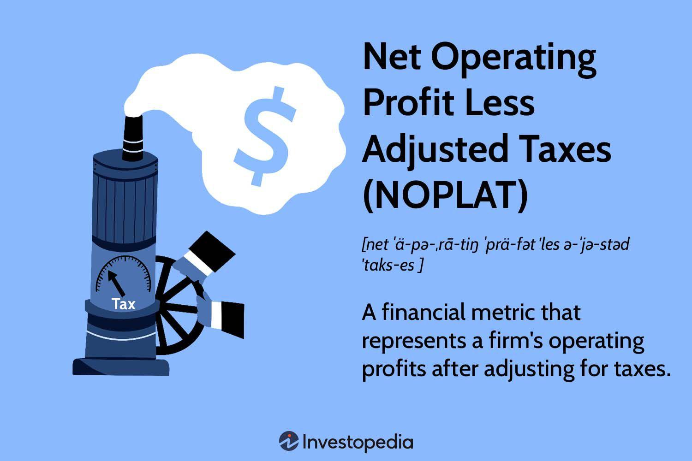

In today's rapidly evolving financial landscape, comprehending key financial metrics is more crucial than ever. Net Operating Profit Less Adjusted Taxes (NOPLAT) is one such metric that stands out for its relevance in assessing a company's true operational profitability. Unlike traditional measures that might be influenced by capital structure choices or one-time financial events, NOPLAT provides a more refined view of a company's ability to generate profits from core operations after tax adjustments.

This article explores the intersection of NOPLAT and algorithmic trading, aiming to equip investors and traders with insights for optimizing investment decisions. NOPLAT is particularly valuable in financial analysis, offering profound insights into a company's operational health and its capacity to sustain long-term growth. As algorithmic trading continues to grow in sophistication, integrating NOPLAT into trading algorithms can unlock new dimensions for enhancing trading outcomes.



By understanding how NOPLAT is calculated and its critical role in analyzing company performance, investors can better identify potential opportunities for investment. The calculation involves starting with EBIT (Earnings Before Interest and Taxes) and adjusting for taxes that apply to operational profits, ensuring a clean perspective on a company's financial health. Further, its application in algorithmic trading strategies enables the development of robust models that leverage operational efficiency for strategic trading decisions. With advanced analytical tools and machine learning approaches, past NOPLAT data can inform future performance projections, offering traders a competitive edge.

As we navigate through this discussion, we aim to provide valuable insights into how NOPLAT can be seamlessly integrated into financial strategies, thereby driving trading success. The potential of NOPLAT in shaping more informed economic decisions highlights its importance as a pivotal tool for traders and investors looking to thrive in the complex financial markets. Through this exploration, we hope to bridge theoretical financial analysis with practical market applications, guiding profitable investments.

## Table of Contents

## Understanding NOPLAT: Definition and Importance

Net Operating Profit Less Adjusted Taxes (NOPLAT) is a financial metric that offers a transparent view of a company's operational efficiency by focusing exclusively on its core operations and adjusting for taxes. Unlike net income, which encompasses interest payments, taxes, and non-operating expenses, NOPLAT isolates operational performance, providing a more precise measure of a company's genuine profitability.

### Definition and Calculation

NOPLAT is calculated by adjusting Earnings Before Interest and Taxes (EBIT) for taxes. The formula for NOPLAT can be expressed as:

$$
\text{NOPLAT} = \text{EBIT} \times (1 - \text{Tax Rate})
$$

By using EBIT as the starting point, NOPLAT excludes the impact of a company's capital structure, ensuring that the focus remains on operating performance alone. The adjustment for taxes provides a clearer picture of operational profits available after tax obligations, reflecting the actual profitability derived from core business activities.

### Importance in Financial Analysis

NOPLAT plays a critical role in multiple financial analysis frameworks, particularly in the context of mergers and acquisitions (M&A), discounted cash flow (DCF) analysis, and leveraged buyouts (LBOs). In these models, NOPLAT aids in the calculation of free cash flow (FCF), which is crucial for evaluating a company's ability to generate cash from its operations that can be used for expansion, reducing debt, or returning capital to shareholders.

Furthermore, NOPLAT helps investors and analysts gauge a company's performance independent of its financial decisions, such as debt financing or equity issuance. By removing the effects of the firm's capital structure, NOPLAT offers a purer assessment of profitability strictly from operational activities.

### Financial Strategy and Decision Making

The isolation of operational earnings in NOPLAT provides analysts with a robust tool to evaluate a firm's profit-generating capability. This measure is instrumental for investors seeking to identify firms with strong operational performance and management efficiency, uninfluenced by financing maneuvers and non-operational factors.

In sum, NOPLAT is a vital component in financial analysis that aids in understanding a company's efficiency at generating profit purely from its operations. It highlights how well a company can perform independently of its choice of financing, granting a more stable and reliable indicator for investment decisions across various industries and capital structures.

## Calculation of NOPLAT: Steps and Considerations

To calculate Net Operating Profit Less Adjusted Taxes (NOPLAT), one begins with Earnings Before Interest and Taxes (EBIT), a crucial indicator of a company's profitability from its core business operations. The subsequent adjustment for deferred taxes is essential to derive a more accurate depiction of operational profit.

Step 1: Begin with EBIT  
EBIT serves as the foundation for calculating NOPLAT. It reflects earnings from regular business activities before interest and tax considerations come into play.

Step 2: Adjust for Taxes  
Apply an appropriate tax rate to EBIT. This involves calculating taxes on EBIT without considering the effects of any interest or financial structuring. The formula for this adjustment is as follows:

$$
\text{NOPLAT} = \text{EBIT} \times (1 - \text{Tax Rate})
$$

Here, the tax rate used should reflect the taxes on unleveraged profits, offering an unclouded view of operational profitability. Deferred taxes and other tax adjustments should be factored into this rate to ensure precision.

Step 3: Exclude Non-Operating Items  
Non-operating items must be identified and excluded from the calculation. These can include:

- One-time gains or losses: Events that are not expected to recur in future accounting periods.
- Investments: Income or losses from activities not related to the core operations.
- Restructuring charges: Costs associated with restructuring activities, which can significantly impact financial statements but do not reflect ongoing operational profitability.

Incorporating these adjustments ensures that NOPLAT reflects the true [earning](/wiki/earning-announcement) power from a company's operational activities.

Step 4: Review and Adjust for Industry and Tax Environments  
Given that tax environments and industry practices can diverge significantly, the calculated NOPLAT should be reviewed in the context of the industry and geographical tax conditions. This helps in making consistent comparisons across different markets and industries. By concentrating on core operations, NOPLAT provides a stable measure of a company's performance irrespective of its financing decisions or capital structure differences.

Example in Python:
```python
def calculate_noplat(ebit, tax_rate, non_operating_items):
    # Calculate taxes on EBIT
    taxes = ebit * tax_rate
    # Adjust EBIT for taxes
    noplat = ebit - taxes
    # Exclude non-operating items
    noplat -= non_operating_items
    return noplat

# Example usage
ebit = 1000000  # Example EBIT
tax_rate = 0.30  # Example tax rate (30%)
non_operating_items = 50000  # Example non-operating items

noplat = calculate_noplat(ebit, tax_rate, non_operating_items)
print("Calculated NOPLAT:", noplat)
```

By addressing these steps diligently, businesses and analysts can derive a NOPLAT value that accurately represents a company’s operational efficiency, facilitating more informed financial analysis and comparisons.

## Strategic Applications of NOPLAT in Financial Models

Net Operating Profit Less Adjusted Taxes (NOPLAT) plays an essential role in several financial models, primarily due to its ability to accurately portray a company's operational efficiency. It serves as a foundational element in valuation frameworks such as the Discounted Cash Flow (DCF) and Economic Value Added (EVA) models, both of which are integral to evaluating company value and financial performance.

In the DCF model, NOPLAT is crucial for estimating free cash flow (FCF), which represents the net amount of cash generated by a company's operations after accounting for capital expenditures. The formula for calculating free cash flow is:

$$
\text{FCF} = \text{NOPLAT} + \text{Depreciation} - \text{Capital Expenditures} - \Delta \text{Working Capital}
$$

NOPLAT is subtracted from non-cash charges like depreciation and adjusted for changes in working capital and capital spending to estimate the cash available to investors, which is then used to assess a company's intrinsic value by discounting future free cash flows to their present value.

Economic Value Added (EVA), another pivotal financial metric, directly employs NOPLAT to determine whether a company generates returns above its cost of capital. EVA is calculated as:

$$
\text{EVA} = \text{NOPLAT} - (\text{Capital} \times \text{WACC})
$$

where WACC stands for the Weighted Average Cost of Capital. This metric highlights a company's ability to add value beyond the expected return, offering insights into management effectiveness.

These applications of NOPLAT render it indispensable in strategic financial planning and investment analysis. By focusing on operational cash flows rather than accounting earnings, NOPLAT provides investors with a clearer picture of a company's genuine financial health and potential for future growth. This insight is particularly valuable in industries where capital structures vary widely, as it isolates operational efficiency from financing effects, offering a more standardized basis for comparison across companies.

Using NOPLAT, analysts can make better-informed decisions regarding mergers and acquisitions, internal performance evaluations, and strategic planning. Consequently, NOPLAT remains a vital tool in the arsenal of financial analysts and investors aiming to understand and leverage a company's core profitability and future prospects.

## Integrating NOPLAT into Algorithmic Trading

Algorithmic trading has become an essential component of modern financial markets, leveraging quantitative models to execute trading strategies with precision and speed. Integrating NOPLAT (Net Operating Profit Less Adjusted Taxes) into these models can enhance the ability to capitalize on a company's operational efficiency. By focusing on core operational metrics like NOPLAT, traders can identify high-performing firms and refine their strategy to make more informed investment decisions.

**Screening High-Performing Firms:** Traders utilize NOPLAT as a key metric when screening for high-performing firms. The growth rate of NOPLAT serves as a valuable indicator of a company's operational performance and potential for sustained profitability. By analyzing historical NOPLAT figures alongside other financial ratios, such as return on equity (ROE) and current ratio, traders can better assess which stocks represent strong investment opportunities. This process involves setting thresholds for acceptable NOPLAT growth, allowing algorithmic models to filter and rank potential investments efficiently.

**Predicting Market Behavior:** Financial models that incorporate NOPLAT data can be instrumental in predicting future market behavior. NOPLAT offers insights into a company's true earning power, unimpeded by financing decisions or one-time events. Integrating NOPLAT into valuation models, such as Discounted Cash Flow (DCF), improves the precision of cash flow forecasts and intrinsic valuations. This feature enhances the development of robust trading strategies by closely aligning investment choices with expected market conditions.

**Machine Learning Forecasting:** With advances in machine learning, historical NOPLAT data becomes a critical element in forecasting future company performance. Machine learning algorithms can analyze vast datasets, enabling the identification of patterns and anomalies in NOPLAT growth trajectories. By training models on past NOPLAT figures, traders can predict operational performance and stock price movements with increased accuracy. The application of supervised learning techniques, such as regression analysis, facilitates the prediction of future NOPLAT values, thereby supporting more informed trading decisions.

Here is a basic example using Python and a [machine learning](/wiki/machine-learning) library such as scikit-learn:

```python
from sklearn.linear_model import LinearRegression
import numpy as np

# Sample NOPLAT data (historical figures)
noplat_history = np.array([3.5, 4.0, 4.5, 5.2, 5.8]).reshape(-1, 1)  # Example NOPLAT figures over time
time_periods = np.array([1, 2, 3, 4, 5])  # Corresponding time periods

# Linear regression model
model = LinearRegression().fit(time_periods.reshape(-1, 1), noplat_history)

# Predict future NOPLAT
future_period = np.array([[6]])
predicted_noplat = model.predict(future_period)

print(f"Predicted NOPLAT for future period: {predicted_noplat[0][0]}")
```

**Refining Risk Assessment Models:** Established fintech platforms integrate NOPLAT into risk assessment models, emphasizing a company's operational strength within investment portfolios. By focusing on NOPLAT, these platforms can adjust risk metrics in line with a company's underpinning financial health, ensuring portfolios are weighted towards firms with substantial operating prowess. This process involves creating a composite risk score, which blends NOPLAT with other measures like volatility and beta, affording a more nuanced risk evaluation.

The integration of NOPLAT in [algorithmic trading](/wiki/algorithmic-trading) represents a strategic enhancement to the analytical tools available to traders. By focusing on operational profitability, traders can achieve a better understanding of a company's performance, refining their strategies to maximize returns and mitigate risks. As financial technologies continue to evolve, the role of NOPLAT is likely to grow, providing traders with the intelligence needed to navigate complex markets successfully.

## Practical Benefits and Limitations of NOPLAT

The primary benefit of Net Operating Profit Less Adjusted Taxes (NOPLAT) is its capacity to succinctly represent a company’s operational efficiency while remaining independent of its financing effects. This characteristic makes NOPLAT a robust tool for measuring and comparing the performance of firms across different industries, especially those with diverse capital structures. By focusing solely on operational income and adjusting for taxes, NOPLAT allows analysts to evaluate a company's core profitability without the distortions introduced by debt financing and interest expenses.

One of the standout advantages of NOPLAT is its role in facilitating cross-company comparisons. In industries where companies have drastically different financial structures, such as real estate versus tech, NOPLAT offers a level playing field. It strips away the impact of financing decisions, allowing stakeholders to assess which companies generate more profit from their core operations.

However, NOPLAT is not without its limitations. A significant drawback is that it doesn't account for capital expenditures or depreciation, both of which are crucial for understanding long-term sustainability and performance. For instance, a company with significant capital investments might show strong NOPLAT figures in the short term, but its long-term viability could be compromised if its assets depreciate faster than its growth in operational profits. Evaluating NOPLAT alongside metrics that consider such expenditures provides a more comprehensive view of financial health.

Moreover, NOPLAT's reliance on statutory tax rates can introduce comparability issues across different jurisdictions. Companies operating in different countries might face varying tax environments, thus affecting NOPLAT’s comparability. Analysts must be cautious when comparing NOPLAT among multinational corporations to ensure that differences in tax regimes do not skew the interpretation of operational efficiency.

Despite these limitations, NOPLAT remains a critical tool for assessing core profitability. It informs strategic investment decisions by highlighting the underlying financial health and operational capabilities of a company. Investors, analysts, and corporate managers often incorporate NOPLAT into broader financial assessments to guide their investment portfolios and corporate strategies focused on operational performance.

## Conclusion

Net Operating Profit Less Adjusted Taxes (NOPLAT) is a vital metric for evaluating a company's operational capability and efficiency. In the financial landscape, NOPLAT transcends traditional profit metrics by focusing on operational performance and excluding influences such as interest payments and capital structure complexities. This makes it a crucial tool for both financial analysis and algorithmic trading, providing insights that drive more effective economic decision-making.

As technology continues to advance and refine financial modeling, the integration of NOPLAT into algorithmic trading strategies and financial analysis models becomes ever more essential. It offers a reliable assessment framework for evaluating operational health and future profitability, essential for crafting informed trading strategies and investment decisions. The ability to focus solely on core operations enables investors and traders to bridge the gap between theoretical financial principles and practical market applications.

By mastering the use of NOPLAT, traders and investors can engage with financial markets more successfully. It enables the identification of high-performing companies, enhances forecasting accuracy, and improves risk assessment processes. Ultimately, NOPLAT is a strategic asset that informs decisions and guides profitable investments in diverse financial environments. Understanding and applying NOPLAT effectively thus ensures a more informed and strategic engagement with financial markets.

## References & Further Reading

[1]: Damodaran, A. (2012). ["Investment Valuation: Tools and Techniques for Determining the Value of Any Asset."](https://books.google.com/books/about/Investment_Valuation.html?id=5SRHAAAAQBAJ) Wiley Finance.

[2]: Koller, T., Goedhart, M., & Wessels, D. (2015). ["Valuation: Measuring and Managing the Value of Companies."](https://www.mckinsey.com/capabilities/strategy-and-corporate-finance/our-insights/valuation-measuring-and-managing-the-value-of-companies) Wiley.

[3]: McKinsey & Company Inc. (2010). ["Valuation: Measuring and Managing the Value of Companies, University Edition."](https://www.mckinsey.com/capabilities/strategy-and-corporate-finance/our-insights/valuation-measuring-and-managing-the-value-of-companies) John Wiley & Sons.

[4]: Copeland, T., Koller, T., & Murrin, J. (2000). ["Valuation: Measuring and Managing the Value of Companies."](https://books.google.com/books/about/Valuation.html?id=rL5hCoUpr0kC) Wiley.

[5]: Penman, S. H. (2013). ["Financial Statement Analysis and Security Valuation."](https://archive.org/details/financialstateme0000penm_m9z7_5thed) McGraw-Hill Education.