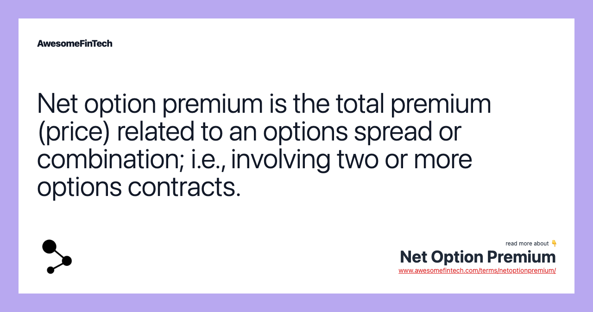

## Table of Contents

## What is a Net Option Premium?

A Net Option Premium is the total amount of money you pay or receive when you buy or sell options. When you buy an option, you pay a premium to the seller. When you sell an option, you receive a premium from the buyer. The net option premium is the difference between the premiums you pay and the premiums you receive if you are doing multiple transactions.

For example, if you buy one option for $5 and sell another option for $3, your net option premium would be $2. This is because you paid $5 to buy the first option and received $3 from selling the second option, leaving you with a net cost of $2. Understanding the net option premium is important because it helps you know how much money you are spending or earning from your options trading activities.

## How is the Net Option Premium calculated?

The Net Option Premium is found by adding up all the money you spend on buying options and then subtracting all the money you get from selling options. If you buy an option, you pay a premium. If you sell an option, you receive a premium. The difference between what you pay and what you receive is your net option premium.

For example, imagine you buy one option for $100 and sell another option for $75. To find your net option premium, you would subtract the $75 you received from the $100 you paid. This leaves you with a net option premium of $25. This number tells you how much you've spent overall on your options trading.

## What is the difference between the Option Premium and the Net Option Premium?

The Option Premium is the price you pay to buy an option or the price you get when you sell an option. It's like the cost of a single ticket when you're buying or selling one option. For example, if you buy an option for $5, that $5 is the option premium.

The Net Option Premium is different because it looks at all your option transactions together. It's the total amount you spend on buying options minus the total amount you earn from selling options. If you buy one option for $5 and sell another for $3, your net option premium is $2 because you paid $5 but got $3 back. This helps you understand your overall spending or [earning](/wiki/earning-announcement) from trading options.

## Can you explain the role of Net Option Premium in options trading?

The Net Option Premium is really important in options trading because it tells you how much money you are spending or making overall. When you trade options, you might buy some and sell others. The net option premium is what you get when you add up all the money you spent on buying options and then subtract all the money you made from selling options. This number helps you see if you're losing money or making money from your trades.

For example, if you buy an option for $10 and sell another for $7, your net option premium is $3. This means you spent $3 more than you earned. Knowing this helps you make better decisions about which options to buy or sell next. It's like keeping a running total of your costs and earnings, which is key to managing your money wisely in options trading.

## How does the Net Option Premium affect the profitability of an options trade?

The Net Option Premium directly affects the profitability of an options trade because it shows you how much money you're spending or earning overall. If your net option premium is positive, it means you've spent more money buying options than you've earned from selling them. This can make your trade less profitable or even result in a loss if the options you bought don't increase in value enough to cover your net cost.

On the other hand, if your net option premium is negative, it means you've earned more from selling options than you've spent on buying them. This can increase the profitability of your trade because you're starting with a financial advantage. By keeping an eye on your net option premium, you can better manage your trades and aim to make more profitable decisions in the options market.

## What factors influence the Net Option Premium?

The Net Option Premium is influenced by the prices at which you buy and sell options. When you buy an option, you pay a premium, and when you sell an option, you receive a premium. The difference between these amounts determines your net option premium. If you buy options at high prices and sell them at low prices, your net option premium will be higher, meaning you've spent more than you've earned. On the other hand, if you buy options at low prices and sell them at high prices, your net option premium will be lower, indicating you've earned more than you've spent.

Additionally, the number of options you trade plays a big role. If you buy many options and sell few, your net option premium will likely be high because you're spending a lot more than you're earning. Conversely, if you sell many options and buy few, your net option premium could be low or even negative, showing you've made more money than you've spent. Understanding these factors helps you manage your trades better and aim for a more favorable net option premium, which can lead to more profitable outcomes in options trading.

## How can understanding Net Option Premium help in managing risk in options trading?

Understanding the Net Option Premium is really important for managing risk in options trading because it shows you how much money you're spending or making overall. If you know your net option premium, you can see if you're losing money or making money from your trades. This helps you decide if you need to buy or sell more options to balance things out. For example, if your net option premium is high, it means you've spent a lot more than you've earned, and you might want to sell some options to bring that number down and reduce your risk.

By keeping an eye on your net option premium, you can also figure out how much money you might lose if things go wrong. If you've spent a lot on buying options and haven't earned much from selling them, you're taking on more risk. Knowing this, you can make smarter choices, like buying options that are less risky or selling options to make some money back. This way, understanding your net option premium helps you manage your money better and keep your risks under control in options trading.

## What are some strategies to optimize the Net Option Premium?

To optimize the Net Option Premium, you can focus on buying options at lower prices and selling them at higher prices. This means you should look for good deals when buying options, maybe by choosing ones that are less popular or have less time until they expire. When selling options, try to sell them when their price is high, like when the market is doing well or there's a lot of interest in the option you're selling. By doing this, you can keep your spending low and your earnings high, which will help make your net option premium more favorable.

Another strategy is to balance your trades. If you find that you're spending a lot more than you're earning, you might want to sell more options to bring in money and lower your net option premium. On the other hand, if you're earning more than you're spending, you could buy more options to take advantage of the market. It's all about keeping an eye on your net option premium and adjusting your trades to make sure you're not losing too much money. This way, you can manage your risks better and aim for more profitable outcomes in options trading.

## How does the time value of options impact the Net Option Premium?

The time value of options plays a big role in the Net Option Premium. Time value is the part of an option's price that comes from how much time is left until the option expires. Options with more time left until they expire usually cost more because there's more chance for the option to become valuable. When you buy an option with a lot of time left, you'll pay a higher premium, which can make your net option premium go up if you're not selling options to balance it out. On the other hand, if you sell an option with a lot of time left, you'll get a higher premium, which can help lower your net option premium.

As the time until an option expires gets shorter, its time value goes down, and so does its price. This means if you buy options close to their expiration date, you'll pay less, which can help keep your net option premium lower. But if you sell options close to their expiration, you'll get less money, which might not help as much in reducing your net option premium. By understanding how time value affects option prices, you can make smarter choices about when to buy and sell options to keep your net option premium in check and manage your trading better.

## Can you discuss the tax implications of Net Option Premiums?

When you trade options, the money you make or lose can affect your taxes. If you earn money from selling options, that money is usually considered income and you'll need to pay taxes on it. The tax rate depends on how long you held the option before selling it. If you held it for less than a year, it's considered short-term capital gains and is taxed at your regular income tax rate. If you held it for more than a year, it's long-term capital gains, which usually has a lower tax rate.

On the other hand, if you lose money on options trading, you might be able to use those losses to reduce your taxes. You can use these losses to offset other income, like money you made from selling other investments. This can help lower the amount of taxes you owe. It's important to keep good records of all your option trades, including the net option premium, so you can report everything correctly on your tax return. Talking to a tax professional can help you understand how to handle the tax implications of your options trading.

## How do market conditions affect the Net Option Premium?

Market conditions can really change the Net Option Premium. When the market is doing well and people are feeling good about it, option prices might go up because more people want to buy them. This means you might pay more when you buy options, which can make your net option premium higher. On the other hand, if the market is not doing so well, option prices might go down because fewer people want to buy them. This could help you buy options cheaper, which can keep your net option premium lower if you're not selling many options.

Also, market conditions can affect how much money you get when you sell options. If the market is doing great, you might be able to sell options for more money, which can help lower your net option premium because you're earning more from selling. But if the market is doing badly, you might not get as much money when you sell options, which could mean your net option premium stays high because you're not earning enough to balance out what you spent on buying options. Keeping an eye on the market can help you decide when to buy or sell options to manage your net option premium better.

## What advanced techniques can traders use to predict changes in Net Option Premium?

Traders can use advanced techniques like technical analysis to predict changes in the Net Option Premium. Technical analysis involves looking at charts and using different tools to see how option prices might move in the future. Traders might use indicators like moving averages, which show the average price of an option over time, to see if the price is going up or down. They might also use something called the Relative Strength Index (RSI) to see if an option is overbought or oversold, which can tell them if the price might change soon. By understanding these patterns and indicators, traders can make better guesses about when to buy or sell options to keep their net option premium in check.

Another technique traders use is called [volatility](/wiki/volatility-trading-strategies) analysis. Volatility is how much the price of an option goes up and down. If an option has high volatility, its price can change a lot, which can affect the net option premium. Traders might use tools like the Volatility Index (VIX) to see how much the market expects prices to move. They can also look at historical volatility to see how much an option's price has moved in the past. By understanding volatility, traders can predict when option prices might go up or down and adjust their trades to manage their net option premium better.

## What is Net Option Premium?

The net option premium is a foundational concept in options trading, especially when employing strategies that involve multiple contracts. It represents the total monetary amount paid or received for acquiring and selling options within a specific strategy. This premium is not just a simple aggregation of payments but involves strategic management of option positions to optimize financial outcomes.

When calculating the net option premium, traders must account for all premiums paid for purchased options and all premiums received from options sold. The formula for net option premium can be expressed as:

$$
\text{Net Option Premium} = \sum \text{Premiums Received from Sold Options} - \sum \text{Premiums Paid for Purchased Options}
$$

This calculation provides a clearer picture of the financial impact of engaging in options spreads, such as vertical spreads, straddles, or iron condors. These spreads typically involve buying and selling different combinations of call and put options, where the net premium directly affects the profitability and risk profile of the strategy.

Understanding the net option premium is crucial for constructing zero-cost positions, a common goal in options trading. A zero-cost position occurs when the overall cost of setting up a set of trades is negligible or zero. This is achieved when the premiums received from selling options offset the premiums paid for buying other options. For example, in a bull call spread, an investor might purchase a call option at a specific strike price and simultaneously sell another call option at a higher strike price. The premium received from the sold call can partially or fully offset the premium paid for the purchased call, potentially creating a cost-effective strategy.

To further illustrate, consider a scenario where a trader sets up an iron condor strategy, which involves two puts and two calls with four different strike prices. Each option position contributes to the net option premium, and careful tuning of each leg can optimize the strategy's cost structure.

Informed decision-making in options trading hinges on an adept understanding of the net option premium. By precisely calculating and managing this metric, traders can adjust their strategies to align with specific market conditions or investment objectives. Moreover, awareness of the net option premium allows traders to manipulate their positions with greater agility, catering to desired risk and reward balances.

The integration of this concept is not merely theoretical; in practice, traders often use [algorithmic trading](/wiki/algorithmic-trading) systems to calculate and adjust net option premiums across multiple strategies in real-time. Python, widely used in [quantitative trading](/wiki/quantitative-trading), provides tools to automate these computations efficiently:

```python
def calculate_net_option_premium(premium_received, premium_paid):
    return sum(premium_received) - sum(premium_paid)

# Example inputs
premiums_received = [200, 150]  # Premiums from sold options
premiums_paid = [100, 150]      # Premiums for purchased options

net_premium = calculate_net_option_premium(premiums_received, premiums_paid)
print("Net Option Premium:", net_premium)
```

In summary, mastering the concept of the net option premium is critical for traders aiming to maximize their leverage and return potential within the diverse field of options trading. Understanding and effectively managing these premiums can greatly enhance the ability to construct sophisticated trading strategies and achieve financial objectives with precision.

## References & Further Reading

[1]: Bergstra, J., Bardenet, R., Bengio, Y., & Kégl, B. (2011). ["Algorithms for Hyper-Parameter Optimization."](https://dl.acm.org/doi/10.5555/2986459.2986743) Advances in Neural Information Processing Systems 24.

[2]: ["Advances in Financial Machine Learning"](https://www.amazon.com/Advances-Financial-Machine-Learning-Marcos/dp/1119482089) by Marcos Lopez de Prado

[3]: ["Evidence-Based Technical Analysis: Applying the Scientific Method and Statistical Inference to Trading Signals"](https://www.amazon.com/Evidence-Based-Technical-Analysis-Scientific-Statistical/dp/0470008741) by David Aronson

[4]: ["Machine Learning for Algorithmic Trading"](https://github.com/stefan-jansen/machine-learning-for-trading) by Stefan Jansen

[5]: ["Quantitative Trading: How to Build Your Own Algorithmic Trading Business"](https://www.amazon.com/Quantitative-Trading-Build-Algorithmic-Business/dp/1119800064) by Ernest P. Chan