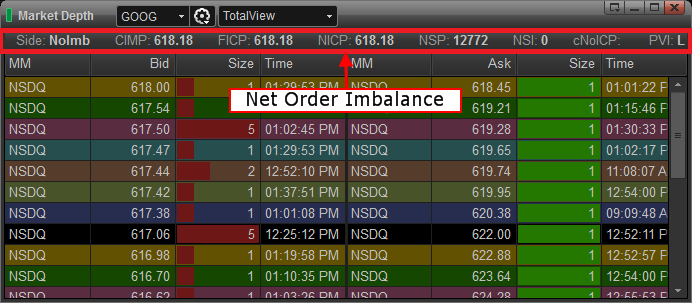

## Table of Contents

## What is the Net Order Imbalance Indicator (NOII)?

The Net Order Imbalance Indicator (NOII) is a tool used in stock markets to help traders understand the supply and demand for a stock before the market opens. It shows the difference between buy orders and sell orders during the opening auction. This helps traders see if there are more people wanting to buy or sell a stock, which can affect the opening price.

NOII is especially useful during the opening and closing auctions of the market. It gives traders important information about how the market might move when it opens or closes. By knowing the order imbalance, traders can make better decisions about buying or selling stocks at the right time.

## How does the NOII help traders and investors?

The Net Order Imbalance Indicator (NOII) helps traders and investors by giving them a sneak peek at what might happen when the market opens or closes. It shows if there are more people wanting to buy a stock or more people wanting to sell it. This information is really useful because it can help traders guess if the price of a stock will go up or down when the market starts trading. If there are more buy orders, the price might go up, and if there are more sell orders, the price might go down.

Traders can use this information to make smarter choices about when to buy or sell stocks. For example, if the NOII shows a lot more buy orders than sell orders, a trader might decide to buy the stock right at the opening because they think the price will go up. On the other hand, if there are a lot more sell orders, they might wait or even sell their own shares before the price drops. This way, the NOII helps traders and investors make better decisions and possibly make more money.

## What are the components that make up the NOII?

The Net Order Imbalance Indicator (NOII) is made up of a few important parts that help traders understand the market. The first part is the total number of shares that people want to buy or sell before the market opens. This is called the "order imbalance." If more people want to buy than sell, the order imbalance is positive. If more people want to sell than buy, it's negative. The second part is the "indicative price," which is the price at which the stock might open based on the current orders.

Another part of the NOII is the "indicative [volume](/wiki/volume-trading-strategy)," which shows how many shares might trade at the opening price. This helps traders know how much trading might happen right when the market opens. All these parts together give traders a good idea of what might happen when the market starts, helping them make better decisions about buying or selling stocks.

## How is the NOII calculated?

The Net Order Imbalance Indicator (NOII) is calculated by looking at the difference between the total number of shares people want to buy and the total number of shares people want to sell before the market opens. This difference is called the "order imbalance." If there are more shares people want to buy than sell, the order imbalance is positive. If there are more shares people want to sell than buy, it's negative. This helps traders see if there's more demand or more supply for a stock.

The NOII also includes an "indicative price," which is the price at which the stock might open based on all the current orders. To find this price, the market looks at all the buy and sell orders and tries to find a price where the most trades can happen. Another part of the NOII is the "indicative volume," which shows how many shares might trade at that opening price. By putting all this information together, the NOII gives traders a good idea of what might happen when the market starts, helping them make better decisions about buying or selling stocks.

## What is the significance of the NOII in market opening and closing?

The Net Order Imbalance Indicator (NOII) is really important when the stock market opens and closes. It helps traders see if there are more people wanting to buy a stock or more people wanting to sell it before the market starts trading. This information is useful because it can tell traders if the price of a stock might go up or down when the market opens. If there are more buy orders, the price might go up, and if there are more sell orders, the price might go down. This helps traders decide if they should buy or sell a stock right at the opening.

At the end of the trading day, the NOII is also helpful. It shows traders what might happen when the market closes. If there's a big difference between buy and sell orders, it can affect the closing price of a stock. Traders use this information to make last-minute decisions about their trades. By knowing the order imbalance, traders can try to make the best choices to either make more money or avoid losing money.

## How can the NOII be used to predict price movements?

The Net Order Imbalance Indicator (NOII) helps traders guess how the price of a stock might move when the market opens or closes. It does this by showing if there are more people wanting to buy a stock or more people wanting to sell it. If there are more buy orders than sell orders, it means there's more demand for the stock, and the price might go up when the market opens. On the other hand, if there are more sell orders, it means there's more supply, and the price might go down.

Traders use this information to make smart choices about when to buy or sell stocks. For example, if the NOII shows a lot more buy orders than sell orders, a trader might decide to buy the stock right at the opening because they think the price will go up. If the NOII shows a lot more sell orders, a trader might wait or even sell their own shares before the price drops. By looking at the NOII, traders can get a good idea of what might happen to the stock price and plan their trades accordingly.

## What are the limitations of using the NOII as a trading tool?

Using the Net Order Imbalance Indicator (NOII) as a trading tool has some limitations. One big problem is that the NOII only shows what's happening right before the market opens or closes. It doesn't tell you what will happen during the whole trading day. So, if something big happens after the market opens, the NOII won't help you with that. Also, the NOII can be affected by big orders from just a few traders. If one trader puts in a huge order, it can make the NOII look different, but it might not mean that's what everyone else is doing.

Another limitation is that the NOII doesn't tell you why people are buying or selling. Sometimes, people might be buying or selling for reasons that the NOII can't see, like news or rumors that haven't been made public yet. This means the NOII might not give you the full picture of what's going on. Traders need to use other tools and information along with the NOII to make the best decisions.

## How does the NOII interact with other market indicators?

The Net Order Imbalance Indicator (NOII) works together with other market indicators to help traders make better decisions. For example, it can be used along with the bid-ask spread, which shows the difference between the highest price someone is willing to pay for a stock and the lowest price someone is willing to sell it for. If the NOII shows a lot more buy orders than sell orders, and the bid-ask spread is small, it might mean the stock price will go up quickly when the market opens. Traders can use both pieces of information to guess what might happen and plan their trades.

Another way the NOII interacts with other indicators is with volume indicators, like trading volume. If the NOII shows a big order imbalance and the trading volume is also high, it could mean that there's a lot of interest in the stock, and the price might move a lot when the market opens. But if the trading volume is low, even a big order imbalance might not affect the price as much. By looking at the NOII along with these other indicators, traders can get a fuller picture of what's happening in the market and make smarter choices about buying or selling stocks.

## What historical data should be considered when analyzing the NOII?

When looking at the Net Order Imbalance Indicator (NOII), it's helpful to check past data to see how it has worked before. You can look at old NOII numbers to see if there were times when a big order imbalance led to big price changes when the market opened or closed. For example, if the NOII often showed more buy orders than sell orders and the price went up a lot, that might mean the NOII is good at predicting price movements for that stock. Also, you can see how the NOII worked with other things like the time of year, big news events, or how the overall market was doing.

It's also smart to look at how the NOII has worked with other market indicators in the past. For instance, you can see if times when the NOII showed a big order imbalance and the trading volume was high led to bigger price moves. Or, you can check if the NOII was more accurate when the bid-ask spread was small. By looking at this historical data, traders can get a better idea of how useful the NOII might be for their trading decisions and how it fits with other information they use.

## How do different trading platforms display or utilize the NOII?

Different trading platforms show the Net Order Imbalance Indicator (NOII) in their own ways. Some platforms might have a special part of their screen where they show the NOII numbers, like the order imbalance, the indicative price, and the indicative volume. This helps traders see all the important information in one place. Other platforms might put the NOII into their charts or graphs, so traders can see how it changes over time along with other market data. This can make it easier for traders to spot patterns and make decisions.

Some trading platforms also let traders set up alerts based on the NOII. For example, a trader might want to get a message if the order imbalance gets really big, because that might mean the stock price will move a lot when the market opens. This way, traders can keep an eye on the NOII without having to watch it all the time. Each platform might use the NOII a bit differently, but they all try to make it easy for traders to use this information to make better trading choices.

## What advanced strategies can be developed using the NOII?

Traders can use the Net Order Imbalance Indicator (NOII) to create advanced trading strategies, especially around market open and close times. One strategy is to watch the NOII closely right before the market opens. If the NOII shows a big positive order imbalance, meaning more people want to buy than sell, a trader might decide to buy the stock right at the opening. They believe the price will go up because of all the buying interest. On the other hand, if the NOII shows a big negative order imbalance, the trader might sell or short the stock, expecting the price to drop due to all the selling interest. This strategy helps traders take advantage of the price movements that often happen right at the start of the trading day.

Another strategy involves combining the NOII with other market indicators to make more accurate predictions. For example, if the NOII shows a big order imbalance and the trading volume is also high, it might mean the price will move a lot when the market opens. A trader could use this information to decide how much to buy or sell. They might also look at the bid-ask spread. If the NOII shows a big order imbalance and the bid-ask spread is small, it could mean the price will move quickly. By using the NOII along with other data, traders can develop more complex strategies that help them make better trading decisions and possibly make more money.

## How can the NOII be integrated into algorithmic trading systems?

The Net Order Imbalance Indicator (NOII) can be added to [algorithmic trading](/wiki/algorithmic-trading) systems to help them make smart choices about buying and selling stocks. These systems can use the NOII to check the order imbalance, indicative price, and indicative volume before the market opens. If the NOII shows a lot more buy orders than sell orders, the system might decide to buy the stock right at the opening because it thinks the price will go up. If there are more sell orders, the system might choose to sell or wait. This way, the algorithmic trading system can use the NOII to predict what might happen to the stock price and make trades based on that.

To make the most of the NOII, algorithmic trading systems can also combine it with other market data. For example, the system might look at the trading volume and bid-ask spread along with the NOII. If the NOII shows a big order imbalance and the trading volume is high, the system might decide to make a bigger trade because it thinks the price will move a lot. By using the NOII together with other information, the system can create more complex trading strategies that help it make better decisions and possibly make more money.

## References & Further Reading

[1]: Jones, C. M., & Lipson, M. L. (2001). ["Order Imbalances and Market Efficiency," Journal of Financial Markets.](https://www.researchgate.net/publication/227406387_Order_Imbalances_and_Market_Efficiency_Evidence_from_the_Taiwan_Stock_Exchange)

[2]: Nasdaq Stock Market. ["Order Imbalance Information,"](https://www.supermoney.com/encyclopedia/net-order-imbalance-indicator) available at Nasdaq Trader.

[3]: Nasdaq. ["Understanding Nasdaq's Order Imbalance Data,"](https://nasdaqtrader.com/Trader.aspx?id=OpenClose) available at Nasdaq Resources.

[4]: Wilmott, P. (2006). ["Industrial Financial Markets and Real-World Trading,"](https://www.amazon.com/Paul-Wilmott-Quantitative-Finance-Set/dp/0470018704) Wiley.

[5]: Lopez de Prado, M. (2018). ["Advances in Financial Machine Learning,"](https://www.amazon.com/Advances-Financial-Machine-Learning-Marcos/dp/1119482089) Wiley.

[6]: Jansen, S. (2020). ["Machine Learning for Algorithmic Trading,"](https://github.com/stefan-jansen/machine-learning-for-trading) Packt Publishing.

[7]: Chan, E. P. (2008). ["Quantitative Trading: How to Build Your Own Algorithmic Trading Business,"](https://github.com/justinchou/books-quantitative-trading) Wiley.