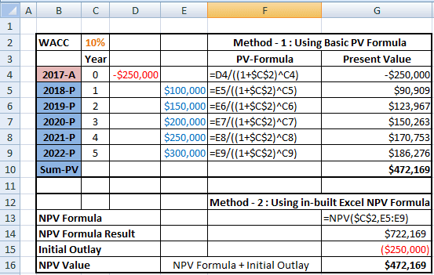

In today's fast-paced financial world, mastering tools like Excel for financial analysis is crucial, especially for algo trading. As financial markets become increasingly complex, traders and analysts require reliable methods to assess investment opportunities effectively. One such method is Net Present Value (NPV), a key metric used to evaluate the profitability of investments and projects. NPV provides a quantitative approach to determining the value of an investment by considering the time value of money, thus allowing investors to make informed decisions based on projected future cash flows.

Excel serves as an indispensable tool in this context, offering robust functionalities that simplify the computation of NPV. By integrating NPV calculations into Excel, traders can efficiently analyze potential algorithmic trading strategies and assess their financial viability. This integration not only enhances decision-making processes but also supports the optimization of trading strategies by enabling the comparison of potential investments across different scenarios. This article will explore how Excel's features, such as the NPV and XNPV functions, can be harnessed specifically for algo trading scenarios, offering insights into maximizing investment profitability.



## Table of Contents

## Understanding NPV

Net Present Value (NPV) is a financial metric that quantifies the value of an investment by considering the time value of money. It does this by summing the present values of individual cash flows, both inflows, and outflows, associated with a project or investment. The time value of money concept, fundamental to NPV calculations, states that money available today is worth more than the same amount in the future due to its potential earning capacity.

To calculate NPV, it is necessary to discount future cash flows back to their present value using a specified discount rate, which reflects the opportunity cost of capital or the rate of return that could have been earned on an investment with equivalent risk. The formula for NPV is as follows:

$$

\text{NPV} = \sum_{t=0}^{n} \frac{C_t}{(1 + r)^t} 
$$

where $C_t$ is the cash flow at time $t$, $r$ is the discount rate, and $n$ is the number of cash flow periods.

A higher NPV suggests that the present value of cash inflows exceeds the present value of cash outflows, indicating a potentially profitable investment. Conversely, a negative NPV indicates that the expected cash inflows are insufficient to cover the initial investment and the cost of capital, suggesting that the investment may not be worthwhile.

NPV is essential for comparing different projects or investment opportunities, especially when they have varying cash flow patterns and durations. By transforming future cash flows into their present values, decision-makers can more accurately assess which investments offer the best financial return. This characteristic makes NPV particularly valuable in capital budgeting and strategic financial planning, enabling organizations to allocate resources efficiently across competing projects.

## The Role of Excel in Financial Analysis

Excel is a critical tool for financial analysts due to its robust capabilities in performing complex calculations, such as Net Present Value (NPV). The software's built-in functions streamline the computation process, allowing users to efficiently evaluate investment opportunities. The NPV function in Excel is designed to calculate the present value of a series of future cash flows based on a given discount rate. This function simplifies the otherwise lengthy manual calculation process, which involves applying the formula:

$$
\text{NPV} = \sum \left(\frac{C_t}{(1 + r)^t}\right)
$$

where $C_t$ represents the cash flow at time $t$ and $r$ is the discount rate.

For situations where cash flows occur at irregular intervals, Excel provides the XNPV function. Unlike the standard NPV function, which assumes equal periods between cash flows, XNPV accounts for the actual dates of each cash flow, thereby providing a more accurate measure of an investment's value over time. This is particularly useful in algo trading scenarios where cash inflows and outflows may not follow a regular schedule.

Excel's capacity to manage large datasets further solidifies its value in financial analysis. In [algorithmic trading](/wiki/algorithmic-trading), where rapid analysis of numerous scenarios is essential, Excel's ability to sort, filter, and perform calculations on extensive data efficiently is invaluable. Financial analysts can quickly model different trading strategies, incorporating various market conditions and parameters, and assess their potential profitability using Excel's computational power.

In essence, Excel's functions, including NPV and XNPV, combined with its data-handling capabilities, empower analysts to conduct thorough financial analyses, thus enhancing the decision-making process in algo trading and other investment evaluations.

## Step-by-Step Guide to Calculating NPV in Excel for Algo Trading

To calculate Net Present Value (NPV) in Excel for algorithmic trading, follow these structured steps to ensure accuracy in your financial analysis.

### Setting Up Your Excel Sheet

1. **Organize Projected Cash Flows:**
   - Begin by listing all expected cash flows from your trading strategy in a single column. Typically, each row will represent a specific time period (e.g., daily, monthly, or yearly cash flows). 
   - Ensure that you include both inflows and outflows to capture the complete financial activity of your strategy.

2. **Determine the Discount Rate:**
   - In a separate cell, specify the discount rate applicable to your investment scenario. This rate represents your required rate of return or the cost of capital.
   - The choice of discount rate should reflect the risk and time value of money inherent in your trading strategy.

### Using the NPV Function

1. **Calculate NPV:**
   - In a new cell, use Excel's NPV function to compute the present value of the cash flows. The syntax for the NPV function is:
     ```
     =NPV(discount_rate, cash_flow_range)
     ```
   - It's important to note that the NPV function expects a series of values that occur at regular intervals, such as yearly or monthly.

2. **Include Initial Investment:**
   - To obtain the true NPV, subtract any initial investment from your NPV calculation. This accounts for the immediate cash outflow required to initiate the trading strategy.

### Exploring the XNPV Function for Irregular Cash Flows

1. **Handling Irregular Intervals:**
   - If your trading strategy generates cash flows at irregular intervals, utilize the XNPV function, which adjusts for varying time periods between cash flows. The syntax is:
     ```
     =XNPV(discount_rate, cash_flow_range, date_range)
     ```
   - Here, `cash_flow_range` involves the cash flows, while `date_range` specifies the dates on which each cash flow occurs.

2. **Ensure Date Accuracy:**
   - Ensure your date entries are correctly formatted in Excel and correspond accurately to their respective cash flows. Misalignment could lead to errors in the present value calculation.

### Final Checklist

Before finalizing your NPV analysis, verify the following:
- **Consistency**: Double-check that all cash flow and date entries correspond to each other without discrepancies.
- **Validation**: Consider cross-verifying your Excel NPV calculation using a manual calculation or alternative software tools to confirm accuracy.

By systematically following these steps, traders can harness Excel's computational power to accurately assess the potential profitability of algorithmic trading strategies. Utilizing both the NPV and XNPV functions allows for flexibility in evaluating cash flows over both regular and irregular time frames.

## Incorporating NPV Analysis into Algo Trading

Understanding the financial viability of algorithmic trading strategies using Net Present Value (NPV) analysis can provide traders with a crucial competitive edge. NPV can be particularly useful in assessing not only the expected profitability but also the risk-adjusted returns of trading strategies. Integrating NPV analysis with algorithmic trading allows traders to incorporate quantitative measures of future cash flows and discount them to their present value, enabling a more informed decision-making process.

Backtesting trading strategies with NPV analysis can be a powerful method of determining their potential profitability across varied market conditions. Historically simulated data are used to predict future performance, which involves calculating expected cash flows generated by a trading strategy over a series of time periods. These cash flows can be discounted back to the present using the formula:

$$

NPV = \sum_{t=1}^{n} \frac{C_t}{(1 + r)^t} 
$$

where $C_t$ represents the cash flow at time $t$, $r$ is the discount rate, and $n$ is the total number of periods. By calculating the NPV for trading strategies during the backtesting phase, traders can determine whether the potential return justifies the associated risk and costs.

A practical approach to incorporating NPV results with algorithmic inputs involves using programming languages like Python, which provides robust libraries for financial analysis. Python’s `numpy` and `pandas` libraries, for example, can handle time series data efficiently, enabling the computation of NPVs from simulated algorithmic trading outputs.

Here's a simple Python example demonstrating how to compute NPV for a backtested trading strategy:

```python
import numpy as np

# Simulated cash flows from the backtest
cash_flows = np.array([-100000, 30000, 35000, 40000, 45000, 50000])  # Initial investment and future cash flows
discount_rate = 0.05  # 5% discount rate

# Calculate NPV
npv = np.sum(cash_flows / (1 + discount_rate) ** np.arange(len(cash_flows)))

print(f"The NPV of the trading strategy is: ${npv:.2f}")
```

This code snippet calculates the NPV of a trading strategy based on projected cash flows and a given discount rate. Interpreting these results aids in evaluating if the trading strategy's expected returns exceed its costs, considering the time value of money.

Integrating NPV results with algorithmic inputs requires continual adjustment and refinement. By incorporating NPV data, traders can adjust algorithms to account for changing market conditions and financial assumptions. These adaptations ensure that the strategies remain aligned with risk tolerance and investment objectives, thereby maximizing their potential for profitability.

Ultimately, the effective use of NPV analysis in algo trading can significantly enhance a trader’s ability to optimize strategies, highlighting lucrative opportunities and improving overall performance.

## Common Mistakes and How to Avoid Them

In the process of calculating Net Present Value (NPV) in Excel, particularly for algo trading, it's crucial to avoid common mistakes that may compromise the accuracy of your analysis. Ensuring accuracy in cash flow inputs and selecting the appropriate discount rate requires careful attention. Here are key points to consider:

First, ensure the cash flow inputs are accurate and reliable. Inaccurate cash flow projections can lead to erroneous NPV results. Double-check the projected cash flows to reflect realistic estimates and [factor](/wiki/factor-investing) in all relevant cash inflows and outflows associated with the trading strategy. Inconsistent or misplaced data points can significantly skew calculations, resulting in misleading conclusions. 

When selecting a discount rate, choose one that aligns closely with the risk profile and the investment timeline of the algo trading strategy. The discount rate reflects the opportunity cost of capital and should account for the [volatility](/wiki/volatility-trading-strategies) and expected returns of the trading activity. A mismatched discount rate can either undervalue or overvalue the projected returns, distorting the investment's perceived viability.

Moreover, it is essential to avoid using inconsistent time intervals for cash flows. Cash flows should be structured to occur at regular intervals. Excel's NPV function assumes that cash flows occur at the end of each period in the specified series. If cash flows occur irregularly, consider using the XNPV function, which allows specifying exact dates for each cash flow, ensuring better accuracy and a more realistic valuation.

Finally, validate your NPV calculations by comparing them against manual computation methods or using alternative tools or software solutions. This cross-verification helps identify any discrepancies that might arise from formula misapplication or input errors in Excel. 

```python
import numpy as np
from datetime import datetime

# Example using Python for further validation:
cash_flows = [-10000, 3000, 4200, 6800]  # Example cash flows
dates = [datetime(2023, 1, 1), datetime(2023, 6, 1), datetime(2024, 1, 1), datetime(2025, 1, 1)]
discount_rate = 0.1

# Manual NPV calculation for irregular intervals
npv = np.npv(discount_rate, cash_flows)

print(f"The manually calculated NPV is: {npv}")
```

By implementing these practices, traders and analysts can greatly reduce calculation errors, leading to more accurate and meaningful financial analysis integral to optimizing trading strategies.

## Conclusion

Net Present Value (NPV) emerges as an indispensable tool in the evaluation of investments, particularly when optimizing trading strategies in the rapidly advancing domain of algo trading. The concept of NPV facilitates a clear understanding of an investment's potential by calculating the current value of future cash flows, adjusted for the time value of money. This fundamental principle allows traders to assess the profitability of different strategies, aiding in more informed decision-making processes.

By leveraging Excel's advanced capabilities, traders can significantly enhance these evaluations. Excel offers a wide array of functions that simplify complex financial computations such as NPV and XNPV, specifically accommodating scenarios with regular and irregular cash flow schedules. The utilization of these functions allows for the seamless integration of NPV analysis into algorithmic frameworks, enabling the rapid processing of large datasets typical in algo trading environments. As strategies are backtested and refined, the computational power of Excel ensures accurate and efficient derivations of NPV, majorly influencing strategy performance.

Continual learning and adaptation remain essential in financial analysis and algorithmic trading. As market conditions evolve, so too must the analytical techniques employed by traders. Continuous updates to trading models, informed by NPV analyses, ensure the maintenance of a competitive edge. In an industry characterized by perpetual innovation and change, the ability of a trader to adapt strategies and to precisely evaluate investments through NPV analysis represents not merely an advantage, but a necessity for success. As such, mastering tools like Excel for NPV calculations becomes an integral aspect of developing robust and profitable trading strategies in the dynamic arena of financial markets.

## References & Further Reading

[1]: ["Net Present Value (NPV) and Formula"](https://www.investopedia.com/terms/n/npv.asp) by Investopedia

[2]: Walkenbach, J. (2010). ["Excel 2010 Power Programming with VBA."](https://onlinelibrary.wiley.com/doi/pdfdirect/10.1002/9781118257616.fmatter) Wiley.

[3]: Dunn, M. (2019). ["Algorithmic Trading: Winning Strategies and Their Rationale"](https://www.semanticscholar.org/paper/Algorithmic-Trading%3A-Winning-Strategies-and-Their-Chan/8220c62caf83863b7f5fb279366d545e720ee062) by Ernest P. Chan

[4]: Benninga, S. (2014). ["Financial Modeling"](https://mitpress.mit.edu/9780262027281/financial-modeling/) MIT Press.

[5]: DeFusco, R. A., McLeavey, D. W., Pinto, J. E., & Runkle, D. E. (2015). ["Quantitative Investment Analysis, CFA Institute Investment Series."](https://books.google.com/books/about/Quantitative_Investment_Analysis.html?id=0S_dCQAAQBAJ) Pearson.