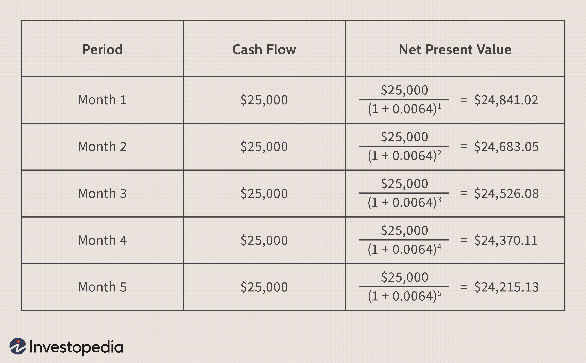

Net Present Value (NPV) is a cornerstone concept in financial analysis, allowing investors and analysts to assess the value of future cash flows relative to present value. By discounting future cash flows to their present value using a specified discount rate, NPV provides a measure of the profitability and feasibility of an investment or project. This analytical approach considers the time value of money, acknowledging that a dollar today is worth more than a dollar tomorrow. NPV is pivotal in making informed investment decisions, guiding corporations and individual investors alike to select projects that offer the greatest potential for profitability.

Expanding on the traditional NPV framework is the concept of Net Present Value of Growth Opportunities (NPVGO). NPVGO focuses on the value added by potential future growth opportunities, distinct from the core operations of a business. By isolating the value of growth prospects, such as new projects or expansions, NPVGO aids in evaluating a firm's growth potential beyond its current operations. This is crucial for determining the strategic path a business should take, especially in rapidly evolving industries where growth can be a critical driver of success.



The intersection of financial analysis, growth opportunities, and algorithmic trading highlights NPV and NPVGO's relevancy in modern finance. As markets become increasingly complex and data-driven, the ability to calculate and analyze financial metrics like NPV in real-time offers a competitive edge. Algorithmic trading, which employs automated and sophisticated mathematical models to make trading decisions, relies heavily on accurate financial analysis. Algorithms can be programmed to incorporate NPV and NPVGO calculations, enabling traders to optimize strategies and assess risks more effectively.

Algorithmic trading has revolutionized the financial landscape, offering speed, efficiency, and the capability to process and analyze large volumes of data that would be unmanageable manually. By integrating financial concepts like NPV within algorithmic frameworks, traders and institutions can improve decision-making processes, enhance risk management, and potentially increase returns. This fusion of traditional financial analysis with modern technology underscores the ever-evolving nature of finance and the importance of adapting to emerging tools and strategies.

## Table of Contents

## Understanding Net Present Value (NPV)

Net Present Value (NPV) is a fundamental concept in financial analysis that plays a crucial role in making informed investment decisions. NPV represents the difference between the present value of cash inflows and the present value of cash outflows over a specified period. Essentially, it is a method used to evaluate the profitability of an investment or project by assessing the net effect of these expected cash flows.

NPV accounts for the time value of money, a core principle in finance which suggests that a dollar today is worth more than a dollar in the future. This is due to the potential [earning](/wiki/earning-announcement) capacity of money, often attributed to factors like inflation and interest rates. To incorporate the time value of money into NPV calculations, a discount rate is utilized. This rate, typically reflecting the investor's required rate of return, is applied to future cash flows, discounting them to their present value.

The basic formula for calculating NPV is:

$$
\text{NPV} = \sum_{t=0}^{n} \frac{C_t}{(1 + r)^t}
$$

Where:
- $C_t$ represents the net cash inflow during the period $t$,
- $n$ is the total number of periods,
- $r$ is the discount rate,
- $t$ signifies each individual time period.

One of the main advantages of using NPV over other financial metrics is its ability to provide a clear picture of an investment's potential profitability by considering all cash flows and the time value of money. Unlike other metrics, such as the payback period or accounting rate of return, NPV accounts for the timing and risk of cash flows. This results in a comprehensive assessment of an investment's value. Additionally, NPV facilitates comparison between multiple projects or investments, ensuring that company resources are allocated to projects likely to generate the greatest returns.

Furthermore, NPV allows investors to consider changes in economic conditions by adjusting the discount rate, giving it flexibility in financial planning and forecasting. Overall, NPV's focus on cash flows and the time value of money makes it an essential tool in modern financial analysis, providing valuable insights that can guide strategic investment decisions.

## Exploring Net Present Value of Growth Opportunities (NPVGO)

Net Present Value of Growth Opportunities (NPVGO) is a financial metric that evaluates the additional value created by potential future investment opportunities available to a firm. Unlike the traditional Net Present Value (NPV), which assesses the value of existing assets or projects by discounting expected future cash flows to the present, NPVGO specifically quantifies the value of future projects or growth initiatives that are not yet undertaken.

The differentiation between NPV and NPVGO is crucial for understanding a company's potential to generate value beyond its current operations. Traditional NPV focuses on existing or planned investments and their ability to create value, while NPVGO underscores the significance of growth opportunities that a company may exploit to enhance shareholder value. These opportunities can arise from innovative projects, expansions, acquisitions, or entry into new markets.

Analyzing future growth opportunities is essential in financial evaluation as it provides insights into a company's long-term potential to expand and succeed. It enables investors and managers to make informed decisions about resource allocation, strategic planning, and understanding the prospects of sustained profitability. Understanding NPVGO helps stakeholders gauge whether a firm has favorable prospects for growth that exceed the value expected from its current asset base.

The formula for calculating NPVGO is often expressed as: 

$$
\text{NPVGO} = \text{P} - \left( \frac{E}{r} \right)
$$

where:
- $\text{P}$ represents the current price of the company’s stock,
- $E$ is the earnings or return expected in future periods without growth,
- $r$ is the required rate of return or discount rate.

This equation demonstrates the value inherent in growth beyond the perpetuity of existing earnings. A higher NPVGO indicates significant growth prospects, suggesting that investors are willing to pay more for the company's stock based on anticipated future growth rather than just existing operations. 

To illustrate the practical application of NPVGO, consider a hypothetical company with a current stock price $\text{P}$ of $50. The expected earnings without growth are $2 per share, and the required rate of return $r$ is 8% or 0.08 when expressed as a decimal. Calculating NPVGO:

$$
\text{NPVGO} = 50 - \left( \frac{2}{0.08} \right)
$$
$$
\text{NPVGO} = 50 - 25 = 25
$$

This result suggests that $25 of the current stock price is attributable to future growth opportunities. Investors view this company’s potential projects as highly valuable, indicating substantial opportunities for expansion and increased profitability. 

In real-world financial analysis, a thorough understanding of NPVGO aids investors in deciding whether a company's future prospects justify its stock price premium. It is an essential tool for assessing companies in dynamic industries where growth potential can significantly impact valuation.

## Role of Excel in Financial Analysis for Algo Trading

Excel is a robust tool widely used in financial calculations due to its versatility, user-friendly interface, and powerful functions. Its importance in financial analysis, particularly in [algorithmic trading](/wiki/algorithmic-trading), cannot be overstated. Excel serves as a crucial platform for performing detailed financial calculations, including the computation of Net Present Value (NPV), which is pivotal for evaluating trading strategies.

### Importance of Excel's Built-in Functions

Excel offers built-in functions such as NPV and XNPV, which are essential for computing the net present value of cash flows over time. The NPV function in Excel calculates the net present value for a series of cash flows occurring at regular intervals, given a constant discount rate. This is crucial for algorithmic trading, where evaluating the viability and profitability of different strategies is essential. The formula for the NPV function is:

$$
\text{NPV} = \text{NPV}(\text{rate}, \text{value1}, [\text{value2}, ...])
$$

Here, `rate` is the discount rate, and `value1`, `value2`, ..., are the cash flows.

For cash flows that occur at irregular intervals, the XNPV function is more appropriate. XNPV provides a more precise NPV calculation by considering the specific dates associated with each cash flow, which is particularly useful for trading scenarios where cash flows do not occur at consistent intervals. The XNPV function syntax is:

$$
\text{XNPV} = \text{XNPV}(\text{rate}, \text{values}, \text{dates})
$$

### Computational Aid in Evaluation

Excel aids in the computation of NPV by allowing users to input complex arrays of data and compute results swiftly. By leveraging Excel's computational capabilities, algorithmic traders can simulate various scenarios, analyze historical data, and adjust parameters to optimize trading strategies. Excel's functionalities enable traders to assess the potential profitability of strategies by entering actual or projected cash flows and adjusting for time value using different discount rates.

### Organizing and Analyzing Large Datasets

Handling large datasets is a common requirement in algorithmic trading, and Excel provides powerful tools for data organization and analysis. Features such as pivot tables, data sorting, filtering options, and conditional formatting allow traders to manage extensive datasets efficiently. These features help traders to identify patterns, correlations, and insights that are crucial for developing and refining trading algorithms.

Additionally, Excel's integration with various data sources and its compatibility with other data processing tools make it a versatile choice for traders who need to incorporate real-time data into their analyses. The ability to script macros and integrate with VBA (Visual Basic for Applications) further enhances Excel's capability, allowing for automation of repetitive tasks and more complex data analysis routines.

In summary, the role of Excel in financial analysis for algorithmic trading is substantial. Its built-in functions like NPV and XNPV are vital for accurate financial assessments, and its capacity to organize and process large datasets is essential for developing effective trading strategies. As Excel continues to evolve, it ensures that algorithmic traders remain equipped with the necessary tools to navigate the complexities of the financial markets efficiently.

## Step-by-Step Guide to Calculating NPV in Excel

Calculating the Net Present Value (NPV) in Excel is a useful skill for evaluating investment opportunities. Here's a comprehensive guide to setting up and executing NPV calculations in Excel, using the NPV and XNPV functions.

### Setting Up the NPV Calculation

1. **Organize Cash Flows**: Start by listing your series of cash flows in a column. The first cell typically contains the initial investment (a negative number). Subsequent cells should contain expected cash inflows or outflows for each period.

2. **Select a Discount Rate**: Identify the appropriate discount rate to reflect the time value of money. This rate should be based on the rate of return that could be earned on an investment of similar risk.

3. **Use the NPV Function**:
   - **Syntax**: `=NPV(discount rate, range of cash flows)`
   - **Example**: To calculate NPV for cash flows in the range B2:B6 using a 10% discount rate, enter `=NPV(0.10, B3:B6) + B2` into a separate cell. Note that the initial investment (B2) is added separately, as the NPV function calculates the present value of future cash flows only.

4. **Consider Uneven Cash Flow Timing with XNPV**:
   - **Syntax**: `=XNPV(discount rate, values, dates)`
   - **Example**: If cash flows occur at irregular intervals in a range B2:B6 with corresponding dates in C2:C6, use `=XNPV(0.10, B2:B6, C2:C6)`. This function is more accurate for projects with uneven cash flow timing as it considers specific dates.

### Tips for Avoiding Common Errors

- **Consistency in Periods**: Ensure that cash flows are consistent in terms of their time periods. For the NPV function, cash flows should be periodic and in the correct order.

- **Discount Rate Formatting**: Enter your discount rate as a decimal, not a percentage (e.g., 10% should be 0.10).

- **Initial Investment Handling**: Remember that Excel’s NPV function does not automatically account for the initial investment. Always add the initial cost separately to the NPV function's result.

- **Data Range Verification**: Double-check data ranges to ensure no cash flows are omitted or added inadvertently. ERRORS can skew results significantly.

### Importance of Accurate Data Entry and Validation

Accurate data entry is crucial for reliable NPV calculations. Here are essential practices to safeguard data integrity:

- **Cross-Verification**: Cross-reference with original data sources to validate cash flow amounts and timing.

- **Use Data Validation Tools**: Leverage Excel's data validation features to restrict entries to valid numeric formats and avoid incorrect data inputs.

- **Regular Updates**: Periodically review and update cash flow data to reflect any changes in financial conditions or project circumstances.

By following these steps and best practices, you can effectively calculate NPV in Excel, aiding in accurate financial analysis necessary for informed decision-making. This knowledge serves as a foundation for further integration into algorithmic trading and other advanced financial analyses.

## Integrating NPV Analysis into Algorithmic Trading

Net Present Value (NPV) analysis can be a powerful tool within the domain of algorithmic trading, particularly in the [backtesting](/wiki/backtesting) phase of trading strategies. By incorporating NPV calculations, traders can assess whether a strategy holds the potential for positive returns adjusted for the time value of money, providing a comprehensive picture of expected profitability.

The integration of NPV into backtesting involves using historical data to simulate how a trading strategy would perform over a specific period. NPV analysis aids in quantifying the profitability of these strategies by applying a discount rate to future cash flows, allowing traders to compare potential investments with varying time horizons and risk levels. It helps in optimizing trading strategies by focusing on those with the most promising NPV, thereby potentially enhancing returns and improving risk management.

Programming languages like Python simplify the computation of NPV with their robust libraries and data manipulation capabilities. Python's libraries such as NumPy and Pandas provide functions that allow for efficient computation of NPV from a series of cash flows, which can be applied to trades in historical data.

To illustrate the use of NPV in Python for algorithmic trading, consider the following simple example:

```python
import numpy as np

# Example cash flows: [Initial Investment, Periodic Profits]
cash_flows = [-1000, 200, 300, 400, 500]
# Discount rate
discount_rate = 0.1

def calculate_npv(cash_flows, discount_rate):
    npv = np.sum([cf / (1 + discount_rate) ** t for t, cf in enumerate(cash_flows)])
    return npv

npv = calculate_npv(cash_flows, discount_rate)
print(f"The NPV of the strategy is: {npv}")
```

In this example, an initial investment of $1,000 with periodic profits is evaluated using a discount rate of 10%. The `calculate_npv` function computes the NPV by discounting each cash flow to its present value and summing them. A positive NPV indicates that the strategy could potentially add value, whereas a negative NPV may suggest reassessment or adjustment of the strategy.

Overall, incorporating NPV analysis in algorithmic trading enhances the ability to screen, evaluate, and optimize strategies based on time-adjusted profitability, leading to more informed decision-making in financial markets.

## Common Mistakes and How to Avoid Them

Calculating Net Present Value (NPV) and Net Present Value of Growth Opportunities (NPVGO) requires precision and careful consideration of various financial factors. Here, we identify frequent errors in these calculations and offer advice on how to avoid them.

One of the most common errors in NPV and NPVGO calculations is incorrect estimation or selection of the discount rate. The discount rate, often reflecting the cost of capital or required rate of return, significantly influences the present value of future cash flows. Selecting an inappropriate discount rate can lead to inaccurate NPV results. To avoid this, it is crucial to consider factors such as the risk-free rate, market risk premium, and the specific risk associated with the project or investment. Sensitivity analysis can be a helpful tool to understand how changes in the discount rate affect the NPV, providing insights into the robustness of investment decisions.

Factoring in risks and uncertainties is another critical aspect of accurate NPV and NPVGO calculations. Often, overly optimistic cash flow projections or a failure to account for potential risks can distort NPV results. Incorporating probabilistic models, like Monte Carlo simulations, can help account for uncertainties by generating a distribution of possible outcomes rather than a single deterministic value. This approach allows for a more comprehensive risk analysis, ensuring that decision-makers consider a range of scenarios before proceeding with an investment.

Cross-verification of calculations is essential to ensure accuracy. Utilizing multiple methods or tools to verify results can prevent computational errors and confirm the reliability of the analysis. For instance, performing independent calculations using different software tools or manual methods can help identify discrepancies. Additionally, software features in Excel, such as the NPV and XNPV functions, can be supplemented with Python scripts for validation purposes. A simple Python code example for recalculating NPV can look like this:

```python
import numpy as np

def calculate_npv(rate, cash_flows):
    npv = np.npv(rate, cash_flows)
    return npv

cash_flows = [-1000, 200, 300, 400, 500]  # Example cash flows
rate = 0.05  # Example discount rate

npv = calculate_npv(rate, cash_flows)
print(f"The calculated NPV is: {npv}")
```

This integration of Python can provide an additional check, ensuring that Excel's built-in functions produce accurate results.

In conclusion, careful attention to the selection of the discount rate, comprehensive risk assessment, and diligent verification through multiple tools or methods can mitigate errors in NPV and NPVGO calculations. By adopting these practices, financial analysts can make more informed and reliable investment decisions.

## Conclusion

In this article, we explored the concepts of Net Present Value (NPV) and Net Present Value of Growth Opportunities (NPVGO), emphasizing their critical importance in financial analysis, particularly within the context of algorithmic trading. NPV serves as a cornerstone for investment decisions, providing a comprehensive framework that accounts for the time value of money by discounting future cash flows to their present value. This approach allows investors to assess the profitability of investments more accurately than simpler metrics, thereby guiding strategic financial decisions.

NPVGO extends the traditional NPV analysis to include growth opportunities, offering a more nuanced understanding of a company's future potential. By calculating NPVGO, investors can differentiate between the intrinsic value of existing operations and the additional value generated from potential growth opportunities. This distinction is vital for evaluating a company's long-term strategies and investment prospects.

In algorithmic trading, understanding and applying NPV and NPVGO offer significant advantages. These concepts enable traders to backtest and optimize their strategies, improving risk management and enhancing decision-making processes. Utilizing advanced computational tools such as Python and Excel, traders can effectively implement these analyses to process large datasets and extract actionable insights.

The ever-evolving technological landscape continually reshapes financial decision-making, creating opportunities for more sophisticated analyses and strategic adaptations. As such, it is imperative for financial professionals to engage in ongoing education and remain adaptable to emerging methods and tools. By doing so, they can leverage NPV and NPVGO to make informed decisions, maximizing returns, and staying competitive in a rapidly changing market.

## References & Further Reading

1. **Brealey, R. A., Myers, S. C., & Allen, F. (2016). "Principles of Corporate Finance."** This book provides comprehensive insights into key concepts such as Net Present Value and is a valuable resource for understanding the foundations of financial analysis. [Link to book](https://www.mheducation.com/)

2. **Damodaran, A. (2012). "Investment Valuation: Tools and Techniques for Determining the Value of Any Asset."** This text introduces the methods used in traditional investment valuation, including NPV and analyzes growth opportunities and investment assessments. [Link to book](https://www.wiley.com)

3. **Malkiel, B. G. (2019). "A Random Walk Down Wall Street."** This book explains various strategies for investing, touching on algorithmic trading and quantitative finance, making it ideal for learning more about the intersection of finance and technology. [Link to book](https://www.w.w.norton.com)

4. **CFA Institute. (2021). "CFA Program Curriculum."** The curriculum covers corporate finance, portfolio management, and investment analysis, with particular emphasis on NPV calculations and evaluation techniques. [Link to CFA Institute](https://www.cfainstitute.org)

5. **Fabozzi, F. J., Focardi, S. M., & Jonas, C. (2014). "Handbook of High-Frequency Trading."** This handbook provides an understanding of algorithmic trading, including analysis and implementation strategies using technologies like Excel and Python. [Link to book](https://www.wiley.com)

6. **Python's SciPy Library Documentation.** SciPy provides tools for performing scientific and technical computing in Python, including modules for optimization, linear algebra, and other necessary calculations for NPV and financial evaluations. [SciPy Documentation](https://docs.scipy.org/doc/scipy/)

7. **Excel's Official Support and Learning Center.** This website offers extensive tutorials on using Excel's financial formulas, such as NPV and XNPV functions, which are essential for executing financial calculations for trading strategies. [Excel Support](https://support.microsoft.com/excel)

8. **Hull, J. C. (2018). "Options, Futures, and Other Derivatives."** This book addresses derivatives markets and their relation to risk management processes, emphasizing the importance of assessing risk through tools like NPV analyses. [Link to book](https://www.pearson.com)

9. **Journal of Finance (American Finance Association):** Suitable for those seeking the latest research and discussions around financial theories and practices, including in-depth articles on NPV, NPVGO, and trading algorithms. [Journal Website](https://onlinelibrary.wiley.com/journal/15406261)

These references are pivotal for a detailed understanding of NPV, NPVGO, and algorithmic trading, offering both theoretical foundations and practical applications within the financial sector.

