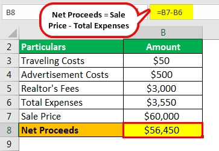

## Table of Contents

## What are net proceeds?

Net proceeds are the amount of money you get to keep after all the costs and fees are taken out. Imagine you sell something, like a car or a house. The total money you get from the sale is called the gross proceeds. But, you might have to pay for things like taxes, fees, or commissions to people who helped with the sale. After you subtract all these costs from the gross proceeds, what's left is the net proceeds.

For example, if you sell your car for $10,000 and you have to pay $1,000 in fees and taxes, your net proceeds would be $9,000. This is the money you actually get to keep. Understanding net proceeds is important because it helps you know how much money you will really have after a sale, which can be useful for planning your finances.

## How do net proceeds differ from gross proceeds?

Gross proceeds and net proceeds are two terms that come up when you sell something, like a house or a car. Gross proceeds is the total amount of money you get from the sale before any costs are taken out. It's like the full price someone pays you for your item. For example, if you sell your house for $200,000, that $200,000 is your gross proceeds.

Net proceeds, on the other hand, is what you get to keep after all the costs are subtracted from the gross proceeds. These costs can include things like taxes, fees, and commissions. Using the same example, if selling your house for $200,000 costs you $20,000 in fees and taxes, your net proceeds would be $180,000. So, net proceeds is the money you actually take home after everything is paid.

## What are the common components included in calculating net proceeds?

When you calculate net proceeds, you start with the gross proceeds, which is the total amount of money you get from selling something. But to find out the net proceeds, you need to subtract different costs that come with the sale. These costs can include things like taxes, which are payments you make to the government. Another common cost is fees, which might be charges from banks or other services that help with the sale. Commissions are also often part of the costs, which are payments to people like real estate [agents](/wiki/agents) or brokers who helped make the sale happen.

Sometimes, there might be other costs too, like closing costs if you're selling a house. These can include things like title insurance, which protects the buyer and lender, or appraisal fees, which are payments for someone to check the value of what you're selling. All these costs together are subtracted from the gross proceeds to figure out the net proceeds. This final number is what you actually get to keep after everything is paid.

## Can you provide a simple example of calculating net proceeds from selling a product?

Let's say you're selling a bike for $300. That $300 is your gross proceeds, which is the total amount of money you get before any costs. But there are some costs you need to pay. For example, you might have to pay a 10% fee to the website where you sold the bike. That fee would be $30.

To find out your net proceeds, you subtract the fee from the gross proceeds. So, you take $300 and subtract $30, which leaves you with $270. That $270 is your net proceeds, which is the amount of money you actually get to keep after paying the fee.

## How do taxes affect the calculation of net proceeds?

Taxes are an important part of figuring out net proceeds. When you sell something, you might have to pay taxes on the money you get. These taxes can be things like sales tax or capital gains tax. Sales tax is what you pay when you sell a product, and it depends on where you live. Capital gains tax is what you pay if you made a profit from selling something like a house or stocks. The tax amount gets taken away from the total money you got from the sale, which is called the gross proceeds.

Let's say you sold a piece of furniture for $500. If you have to pay a 10% sales tax, that's $50 in taxes. You subtract that $50 from the $500 you got, leaving you with $450. That $450 is your net proceeds, which is the money you actually keep after paying the taxes. So, taxes lower your net proceeds by taking a part of the money you made from the sale.

## What role do fees and commissions play in determining net proceeds?

Fees and commissions are important when figuring out net proceeds. When you sell something, you might have to pay fees to the platform or service that helped you with the sale. For example, if you sell something online, the website might charge a fee for using their service. Commissions are payments you make to people who helped with the sale, like real estate agents or brokers. These fees and commissions are taken out of the total money you get from the sale, which is called the gross proceeds.

When you subtract these fees and commissions from the gross proceeds, you get the net proceeds, which is the money you actually keep. For example, if you sell a car for $10,000 and have to pay a $500 fee to the platform and a $300 commission to a broker, you subtract $800 from $10,000. This leaves you with $9,200 as your net proceeds. So, fees and commissions lower your net proceeds by taking away part of the money you made from the sale.

## How can net proceeds be calculated for real estate transactions?

When you sell a house, figuring out the net proceeds is important because it tells you how much money you'll actually keep after everything is paid. To start, you look at the gross proceeds, which is the total amount of money you get from selling the house. For example, if you sold your house for $300,000, that's your gross proceeds. But there are costs that come with selling a house, and you need to subtract these costs from the gross proceeds to find your net proceeds.

The main costs you might have to pay include real estate agent commissions, which are usually a percentage of the sale price, like 6%. If your house sold for $300,000, the commission might be $18,000. You also have to pay closing costs, which can include things like title insurance, legal fees, and other charges that might add up to around $6,000. Then there are taxes, like property transfer taxes, which might be another $3,000. When you add up all these costs, you get $27,000. Subtracting this from the $300,000 gross proceeds leaves you with $273,000 in net proceeds, which is the money you get to keep after selling your house.

## What are some strategies to maximize net proceeds in a business sale?

When you're selling your business, you want to keep as much money as possible after paying all the costs. One good way to do this is by getting a good price for your business. You can do this by making your business look attractive to buyers. This means showing off your business's strong points, like good profits or a loyal customer base. Another way to get a better price is by having more than one buyer interested in your business. When buyers compete, they might offer more money to win the deal.

Another strategy is to lower the costs that come with selling your business. For example, you might be able to negotiate lower fees with the people who help you sell, like brokers or lawyers. You can also look for ways to save on taxes. Talking to a tax expert can help you find legal ways to pay less in taxes when you sell your business. By getting a good price and keeping your costs low, you can make sure you keep more of the money from the sale.

## How do net proceeds impact financial planning and decision-making?

Net proceeds are really important when you're planning your money and making decisions. When you know how much money you'll actually keep after selling something, like a house or a business, you can plan better. For example, if you're thinking about selling your house, knowing the net proceeds helps you decide if you can afford to buy a new house or if you need to save more money first. It's like knowing how much money you'll have in your pocket after everything is paid, which helps you make smart choices about what to do next with your money.

Also, understanding net proceeds can help you figure out if selling something is a good idea. If the costs of selling are too high, you might decide to wait or look for ways to lower those costs. For example, if selling your business means you'll only keep a small amount of money after paying fees and taxes, you might choose to keep running the business until you can get a better price or find a way to reduce the costs. Knowing your net proceeds gives you a clear picture of your financial situation, helping you make decisions that are good for your future.

## Can net proceeds be negative, and if so, under what circumstances?

Yes, net proceeds can be negative. This happens when the costs of selling something are more than the money you get from the sale. For example, if you sell your car for $5,000 but have to pay $6,000 in fees, taxes, and other costs, your net proceeds would be -$1,000. This means you end up losing money instead of making it.

Negative net proceeds can happen in different situations. It's more common when you're selling something that isn't worth much, like an old car or a house that needs a lot of repairs. Sometimes, people might choose to sell at a loss if they need to get rid of the item quickly or if keeping it would cost them even more money in the long run.

## How do accounting standards influence the reporting of net proceeds?

Accounting standards are rules that businesses follow when they report their money stuff. These rules can change how net proceeds are shown in the reports. For example, some standards might say you have to report the costs of selling something in a certain way. This can affect the final number you see for net proceeds. If the standards change, the way you calculate and report net proceeds might change too, which can make it harder to compare numbers from different years or different companies.

Different countries might use different accounting standards, like GAAP in the United States or IFRS used in many other places. These standards can have different rules about how to handle costs and taxes when figuring out net proceeds. Because of this, a business might report different net proceeds depending on which standard they use. It's important for businesses to follow these rules carefully so their reports are clear and fair, helping people who read them understand the real financial situation.

## What advanced techniques can be used to forecast net proceeds in complex financial scenarios?

To forecast net proceeds in complex financial scenarios, you can use advanced techniques like financial modeling. Financial modeling involves creating a detailed spreadsheet that shows how different costs and revenues might change over time. You put in all the numbers you know, like the price you might sell something for and the costs you'll have to pay, like taxes and fees. Then, you can change these numbers to see how they affect your net proceeds. This helps you plan better because you can see what might happen in different situations.

Another technique is using scenario analysis. This means you create different "what if" situations to see how they would affect your net proceeds. For example, you might look at what happens if the market changes, or if costs go up or down. By looking at these different scenarios, you can prepare for the future and make smarter decisions. It's like playing out different stories to see which one gives you the best outcome, helping you understand the risks and rewards of selling something.

## What are Net Proceeds and How Can They Be Understood?

Net proceeds represent the amount a seller receives upon completing a transaction, which reflects the financial gains after accounting for various costs and expenses. To calculate net proceeds, one begins with the gross proceeds, which is the total amount received from the sale. From this sum, several costs are subtracted, including, but not limited to, legal fees, broker or agent commissions, advertising expenses, and applicable taxes.

In mathematical terms, net proceeds can be expressed as follows:

$$
\text{Net Proceeds} = \text{Gross Proceeds} - (\text{Legal Fees} + \text{Commissions} + \text{Advertising Expenses} + \text{Taxes})
$$

These deductions, often variable across different asset classes, are critical in determining the seller’s actual profitability. For instance, in real estate transactions, net proceeds are calculated by subtracting agent fees and closing costs from the sale price of a property. Similarly, in securities transactions, brokerage fees and transaction taxes are deducted from the initial sale amount of stocks or bonds to arrive at net proceeds. Business sales involve reducing the gross proceeds by transaction costs, including due diligence fees and transfer taxes.

Comprehending net proceeds is essential for accurate financial reporting. Differences between gross and net amounts directly impact financial statements and can affect tax liabilities. For example, capital gains taxes are applied to gains calculated on net, not gross, proceeds. Accurate calculation of net proceeds ensures compliance with tax authorities and financial regulators, helping avoid penalties and fines.

In summary, understanding net proceeds is vital for evaluating an asset sale's final profitability and ensuring that all financial and tax obligations are met. This fundamental calculation forms a cornerstone of effective financial strategy and decision-making in business and investment contexts.

## How do you calculate net proceeds: a financial example?

Calculating net proceeds from the sale of an asset begins with the identification of gross proceeds, which represent the total amount received before any deductions are applied. To arrive at the net proceeds, one must subtract all associated sale-related costs. These costs typically include broker commissions, legal fees, and any other transaction-related expenses.

For a more practical understanding, consider the example of a housing market transaction. Suppose a homeowner sells a property for $500,000. The real estate agent’s commission stands at 6%, which amounts to $30,000. Additionally, the closing costs, which may include legal fees, inspection fees, and other expenses, total $10,000. To calculate the net proceeds, these expenses are subtracted from the gross proceeds as follows:

$$
\text{Net Proceeds} = \text{Gross Proceeds} - \text{Agent Fees} - \text{Closing Costs}
$$

Substituting the values:

$$
\text{Net Proceeds} = \$500,000 - \$30,000 - \$10,000 = \$460,000
$$

It's crucial to account for taxes, particularly capital gains tax, which applies to the net proceeds rather than the gross proceeds. Capital gains tax is calculated on the profit earned from the sale, defined as the difference between the sale price and the original purchase price post-adjustment for any applicable deductions.

The importance of precise calculation in determining net proceeds extends beyond personal financial planning to ensure compliance with financial reporting standards and tax regulations. Accurate computation helps in assessing the true profitability of the transaction and aids in aligning with the requisite financial obligations that accompany such sales. Ensuring that all potential costs are deducted before arriving at the net proceeds is essential to provide a clear financial picture.

## References & Further Reading

[1]: Bergstra, J., Bardenet, R., Bengio, Y., & Kégl, B. (2011). ["Algorithms for Hyper-Parameter Optimization."](https://dl.acm.org/doi/10.5555/2986459.2986743) Advances in Neural Information Processing Systems 24.

[2]: ["Advances in Financial Machine Learning"](https://www.amazon.com/Advances-Financial-Machine-Learning-Marcos/dp/1119482089) by Marcos Lopez de Prado

[3]: ["Evidence-Based Technical Analysis: Applying the Scientific Method and Statistical Inference to Trading Signals"](https://www.amazon.com/Evidence-Based-Technical-Analysis-Scientific-Statistical/dp/0470008741) by David Aronson

[4]: ["Machine Learning for Algorithmic Trading"](https://github.com/stefan-jansen/machine-learning-for-trading) by Stefan Jansen

[5]: ["Quantitative Trading: How to Build Your Own Algorithmic Trading Business"](https://www.amazon.com/Quantitative-Trading-Build-Algorithmic-Business/dp/1119800064) by Ernest P. Chan