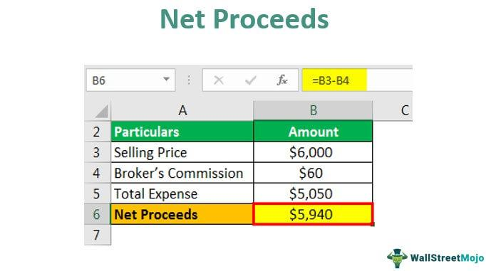

Financial calculations form the backbone of strategic decision-making in trading and investment practices. This article is centered on understanding net proceeds and their vital role in shaping financial trading strategies, specifically algorithmic trading. 

Net proceeds refer to the total income a seller acquires from an asset sale after subtracting associated costs and expenses, such as legal fees, commissions, advertising, and taxes. These proceeds offer a realistic measure of profitability, thereby influencing trading decisions and financial assessments significantly. Accurate calculations of net proceeds are crucial as they directly impact the financial reporting and tax liabilities of individuals and businesses engaged in trading activities.



Algorithmic trading represents a significant advancement in financial markets, utilizing automated systems to execute trading instructions with precision and speed. By leveraging pre-defined algorithms, these systems can eliminate emotional bias, reduce errors, and process vast data arrays instantly. This enables traders and investors to formulate trading strategies grounded in statistical models, which are vital for exploiting market trends and inefficiencies.

In exploring the intersection of net proceeds and algorithmic trading, this article intends to provide a detailed understanding for investors, traders, and stakeholders in the financial sector. The discussion aims to elucidate how these concepts can be optimized to enhance financial performance and maximize returns. By examining both the theoretical and practical implications, the article will offer insights into the nuances of these financial methodologies.

As the financial landscape continues to evolve, understanding the connection between net proceeds and algorithmic trading becomes imperative for maintaining competitiveness and securing financial growth. This article sets out to demystify these concepts, equipping readers with the knowledge to navigate the complex world of financial markets more effectively.

## Table of Contents

## Understanding Net Proceeds

Net proceeds represent the amount a seller receives upon completing a transaction, which reflects the financial gains after accounting for various costs and expenses. To calculate net proceeds, one begins with the gross proceeds, which is the total amount received from the sale. From this sum, several costs are subtracted, including, but not limited to, legal fees, broker or agent commissions, advertising expenses, and applicable taxes.

In mathematical terms, net proceeds can be expressed as follows:

$$
\text{Net Proceeds} = \text{Gross Proceeds} - (\text{Legal Fees} + \text{Commissions} + \text{Advertising Expenses} + \text{Taxes})
$$

These deductions, often variable across different asset classes, are critical in determining the seller’s actual profitability. For instance, in real estate transactions, net proceeds are calculated by subtracting agent fees and closing costs from the sale price of a property. Similarly, in securities transactions, brokerage fees and transaction taxes are deducted from the initial sale amount of stocks or bonds to arrive at net proceeds. Business sales involve reducing the gross proceeds by transaction costs, including due diligence fees and transfer taxes.

Comprehending net proceeds is essential for accurate financial reporting. Differences between gross and net amounts directly impact financial statements and can affect tax liabilities. For example, capital gains taxes are applied to gains calculated on net, not gross, proceeds. Accurate calculation of net proceeds ensures compliance with tax authorities and financial regulators, helping avoid penalties and fines.

In summary, understanding net proceeds is vital for evaluating an asset sale's final profitability and ensuring that all financial and tax obligations are met. This fundamental calculation forms a cornerstone of effective financial strategy and decision-making in business and investment contexts.

## Calculating Net Proceeds: A Financial Example

Calculating net proceeds from the sale of an asset begins with the identification of gross proceeds, which represent the total amount received before any deductions are applied. To arrive at the net proceeds, one must subtract all associated sale-related costs. These costs typically include broker commissions, legal fees, and any other transaction-related expenses.

For a more practical understanding, consider the example of a housing market transaction. Suppose a homeowner sells a property for $500,000. The real estate agent’s commission stands at 6%, which amounts to $30,000. Additionally, the closing costs, which may include legal fees, inspection fees, and other expenses, total $10,000. To calculate the net proceeds, these expenses are subtracted from the gross proceeds as follows:

$$
\text{Net Proceeds} = \text{Gross Proceeds} - \text{Agent Fees} - \text{Closing Costs}
$$

Substituting the values:

$$
\text{Net Proceeds} = \$500,000 - \$30,000 - \$10,000 = \$460,000
$$

It's crucial to account for taxes, particularly capital gains tax, which applies to the net proceeds rather than the gross proceeds. Capital gains tax is calculated on the profit earned from the sale, defined as the difference between the sale price and the original purchase price post-adjustment for any applicable deductions.

The importance of precise calculation in determining net proceeds extends beyond personal financial planning to ensure compliance with financial reporting standards and tax regulations. Accurate computation helps in assessing the true profitability of the transaction and aids in aligning with the requisite financial obligations that accompany such sales. Ensuring that all potential costs are deducted before arriving at the net proceeds is essential to provide a clear financial picture.

## Algorithmic Trading: Revolutionizing Financial Markets

Algorithmic trading employs automated and pre-programmed instructions for executing trades, significantly transforming financial markets. This approach enhances trading efficiency by removing emotional biases and reducing human errors. The high-speed execution of trades is another critical advantage, as algorithms can operate far faster than manual trading.

A fundamental characteristic of [algorithmic trading](/wiki/algorithmic-trading) is its ability to process and analyze large volumes of data simultaneously. This capability allows the development of trading strategies based on statistical models, which aim to predict market movements accurately. These algorithms can identify patterns and trends within data sets that may not be immediately apparent to human traders, thereby providing a scientific basis for decision-making.

Several types of algorithmic trading exemplify its application in financial markets, including trend-following, [arbitrage](/wiki/arbitrage) opportunities, and market-making. Trend-following algorithms are designed to capitalize on market movements by identifying and exploiting the [momentum](/wiki/momentum) of price movements. They typically use indicators like moving averages or breakouts from historical highs and lows.

Arbitrage algorithms, on the other hand, are programmed to detect and exploit price inefficiencies across different markets or instruments. They buy and sell simultaneously in different markets to capture the price differential, achieving a profit from the brief time window in which the price imbalance exists. Market-making algorithms provide [liquidity](/wiki/liquidity-risk-premium) by offering to buy and sell continuously at quoted prices, benefiting from the bid-ask spread.

The implementation of algorithmic trading profoundly impacts financial calculations, influencing revenue and net proceeds. By optimizing trade execution and minimizing transaction costs, algorithmic trading can enhance overall financial performance. For instance, precise timing in trade execution can minimize market impact costs, which are the adverse price movements caused by large trades.

Python, a popular language for developing algorithmic trading strategies, offers libraries such as NumPy, pandas, and scikit-learn for handling data and implementing statistical models. An example code snippet illustrating a simple moving average crossover strategy is shown below:

```python
import pandas as pd

def moving_average_crossover(data, short_window=40, long_window=100):
    signals = pd.DataFrame(index=data.index)
    signals['price'] = data['price']
    signals['short_ma'] = data['price'].rolling(window=short_window, min_periods=1).mean()
    signals['long_ma'] = data['price'].rolling(window=long_window, min_periods=1).mean()

    signals['signal'] = 0.0
    signals['signal'][short_window:] = np.where(signals['short_ma'][short_window:] 
                                                > signals['long_ma'][short_window:], 1.0, 0.0)   

    signals['positions'] = signals['signal'].diff()

    return signals

# example usage
data = pd.DataFrame({'price': [/* your time series data here */]})
signals = moving_average_crossover(data)
```

Algorithmic trading's role in the financial market structure is therefore substantial, as it contributes to heightened efficiency and profitability. Its integration into modern financial strategies continues to evolve with advancements in technology and data analytics, broadening the scope of its application and benefits.

## Interrelationship Between Net Proceeds and Algorithmic Trading

Algorithmic trading significantly influences net proceeds by optimizing trade execution and reducing transaction costs. This is accomplished through automated systems that follow pre-programmed instructions and leverage high-speed data processing capabilities. By executing trades with precision and speed, algorithmic trading minimizes slippage and leverages timing to benefit from narrow market windows, ultimately maximizing the net proceeds of trading activities.

One example of an algorithm designed to enhance net proceeds involves exploiting arbitrage opportunities. Arbitrage algorithms detect price discrepancies between different markets or instruments, executing trades to buy low in one market and sell high in another, capturing the price difference as profit. Another type of algorithm is the trend-following strategy, which analyzes historical data to identify and ride price trends, ensuring profitable trades. For example, moving average crossovers can predict future price movements, allowing traders to execute transactions that capitalize on emerging trends.

Advancements in technology and techniques have further improved revenue streams for businesses by increasing operational efficiency. Big data analytics and [machine learning](/wiki/machine-learning) models are now integral to algorithmic trading, allowing for the analysis of vast datasets to identify patterns and signals that were previously undetectable. For instance, machine learning algorithms can process and analyze real-time news feeds and social media sentiment, providing a competitive edge by predicting market movements.

However, challenges remain. Overfitting is a common issue where algorithms become too tailored to past data, performing well historically but failing under new market conditions. This can be mitigated by incorporating robust machine learning models that prioritize generalized performance over data-fit. Additionally, technological constraints, such as latency issues and system failures, can impede the real-time execution of trades, affecting their profitability. Ensuring redundant systems and employing cutting-edge infrastructure can help overcome these obstacles.

In summary, while algorithmic trading provides substantial benefits in optimizing net proceeds, it requires continual advancements in technology and robust frameworks to address inherent challenges, ensuring reliability and maximizing financial returns.

## Conclusion

A thorough understanding of financial calculations such as net proceeds is critical for the successful execution of various trading strategies. By considering all costs and expenses involved in a transaction, investors can determine the true profitability of their investments, thereby enhancing financial growth and optimization. Moreover, the strategic implementation of net proceed calculations ensures accurate financial reporting and meets tax obligations effectively.

Algorithmic trading, with its capacity for high-speed processing and removal of human biases, continues to revolutionize financial markets, maximizing potential gains by executing trades with unmatched efficiency. The integration of algorithmic models allows for quick adaptation to market conditions, seizing profitable opportunities that may be missed through manual trading techniques. Through statistical models and pre-programmed strategies, algorithmic trading not only enhances transaction speeds but also improves the precision of financial computations, crucial for optimizing net proceeds.

In the continuously evolving financial landscape, it is vital for businesses and investors to stay informed about advancements in algorithmic trading and financial calculations. By doing so, they ensure competitiveness and resilience in an overcrowded market. Leveraging these advanced platforms directs organizations toward more intelligent trade executions and revenue growth strategies, tapping into a future where detailed computations and strategic implementations define success. As financial markets progress, the intersection of sophisticated calculations and technological advancements shapes a promising frontier for traders and investors alike.

## References & Further Reading

[1]: Bergstra, J., Bardenet, R., Bengio, Y., & Kégl, B. (2011). ["Algorithms for Hyper-Parameter Optimization."](https://dl.acm.org/doi/10.5555/2986459.2986743) Advances in Neural Information Processing Systems 24.

[2]: ["Advances in Financial Machine Learning"](https://www.amazon.com/Advances-Financial-Machine-Learning-Marcos/dp/1119482089) by Marcos Lopez de Prado

[3]: ["Evidence-Based Technical Analysis: Applying the Scientific Method and Statistical Inference to Trading Signals"](https://www.amazon.com/Evidence-Based-Technical-Analysis-Scientific-Statistical/dp/0470008741) by David Aronson

[4]: ["Machine Learning for Algorithmic Trading"](https://github.com/stefan-jansen/machine-learning-for-trading) by Stefan Jansen

[5]: ["Quantitative Trading: How to Build Your Own Algorithmic Trading Business"](https://www.amazon.com/Quantitative-Trading-Build-Algorithmic-Business/dp/1119800064) by Ernest P. Chan