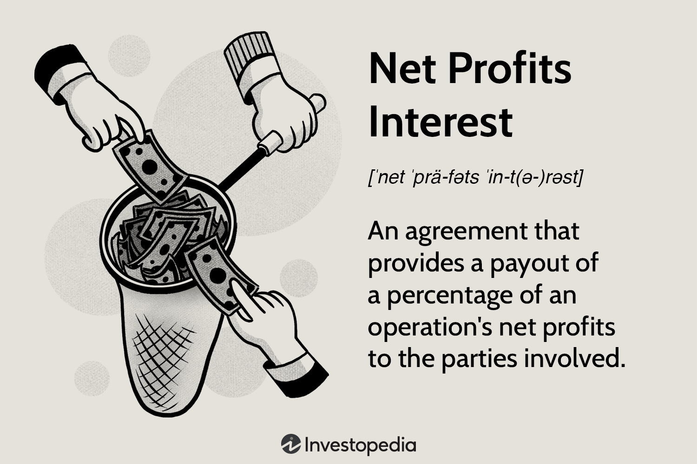

## Table of Contents

## What is Net Profits Interest (NPI)?

Net Profits Interest (NPI) is a type of financial agreement often used in the oil and gas industry. It gives the holder a share of the net profits from a project, after all costs have been paid. This means that the NPI holder gets money only if the project makes a profit. For example, if a company is drilling for oil, the NPI holder will get a percentage of the money left over after the company pays for things like drilling costs, operating expenses, and taxes.

NPI agreements can be attractive to investors because they offer the potential for high returns if the project is successful. However, they also come with risks. If the project does not make a profit, the NPI holder might not receive any money. This makes NPIs different from other types of investments, like royalties, where the investor gets a share of the revenue regardless of whether the project is profitable. Understanding these risks and rewards is important for anyone considering an NPI investment.

## How does Net Profits Interest differ from other types of interests in oil and gas?

Net Profits Interest (NPI) in the oil and gas industry is different from other types of interests because it only gives the holder a share of the profits after all costs are paid. This means if the project makes money, the NPI holder gets a part of what's left over. Other types of interests, like royalties, give the holder a share of the total revenue from the oil or gas, no matter if the project makes a profit or not. So, with royalties, you get money even if the project just breaks even or loses money.

Another type of interest is the working interest, where the holder has to pay a share of the costs to develop and operate the project. With a working interest, you might have to put in money upfront and take on more risk, but you also get a bigger share of the profits if the project does well. In contrast, NPI holders don't have to pay any costs, but they also don't get any money if the project doesn't make a profit. This makes NPI a less risky investment than working interest, but it can also mean less reward if the project is very successful.

## What are the key components that determine Net Profits Interest?

The key components that determine Net Profits Interest (NPI) are the total revenue from the project and the costs that need to be subtracted from that revenue. The total revenue comes from selling the oil or gas that is produced. The costs include things like the money spent on drilling, operating the wells, and paying taxes. After all these costs are taken out of the total revenue, what's left is the net profit. The NPI holder gets a percentage of this net profit.

Another important component is the specific terms of the NPI agreement. These terms can vary and will say exactly what percentage of the net profit the NPI holder gets. They might also include rules about how costs are calculated or when the NPI payments start. Understanding these terms is crucial because they can affect how much money the NPI holder might receive. If the terms are not clear or if there are disagreements about costs, it can lead to problems in getting the NPI payments.

## How is Net Profits Interest calculated?

Net Profits Interest (NPI) is calculated by first figuring out the total revenue from selling the oil or gas. This is the money that comes in from the project. Then, you subtract all the costs that were needed to get that oil or gas out of the ground and sell it. These costs can include drilling expenses, operating the wells, and paying taxes. After you take away all these costs from the total revenue, what you have left is the net profit.

The next step is to take the percentage of the net profit that the NPI holder is supposed to get, as written in the NPI agreement. For example, if the agreement says the NPI holder gets 20% of the net profit, you multiply the net profit by 20%. That amount is what the NPI holder will receive. It's important to read the agreement carefully because it will tell you exactly what percentage you get and how the costs are calculated.

## What are the advantages of Net Profits Interest for investors?

Net Profits Interest (NPI) offers investors a chance to earn money without having to pay any of the costs to get the oil or gas out of the ground. This means that if the project makes a profit, the NPI holder gets a share of that profit without having to spend any money upfront. This can be really attractive because it reduces the risk for the investor. They don't have to worry about losing money if the project doesn't go well, as long as they don't get any money either.

Another advantage is that NPI can lead to high returns if the project is very successful. Since the NPI holder gets a percentage of the net profit, if the project makes a lot of money after paying all the costs, the NPI holder can earn a good amount. This makes NPI a potentially rewarding investment for those who are willing to wait and see if the project does well.

## What are the potential risks associated with Net Profits Interest?

One big risk with Net Profits Interest is that you might not get any money if the project doesn't make a profit. This is different from other investments like royalties, where you get paid no matter what. With NPI, if the costs of drilling and running the project are too high, or if the price of oil or gas goes down, there might not be any profit left over for you. So, you could end up waiting a long time without seeing any return on your investment.

Another risk is that the terms of the NPI agreement can be complicated and hard to understand. If the agreement is not clear about what costs can be subtracted from the revenue, there might be disagreements later. This can lead to delays in getting your money or even legal fights. It's important to read the agreement carefully and maybe get help from a lawyer to make sure you know exactly what you're getting into.

## Can you provide a simple example of how Net Profits Interest works in practice?

Imagine a company is drilling for oil and they have an agreement with an investor who has a Net Profits Interest (NPI). The agreement says the investor gets 25% of the net profit from the oil. The company drills the well and starts selling the oil. They make $1 million from selling the oil, but they had to spend $800,000 on drilling and operating costs. So, the net profit is $1 million minus $800,000, which equals $200,000.

Now, the investor gets 25% of that $200,000 net profit. So, 25% of $200,000 is $50,000. That means the investor gets $50,000 from the project. But if the costs had been higher, say $1.2 million, then there would be no net profit at all. In that case, the investor wouldn't get any money because there's no profit to share.

## How does Net Profits Interest impact the financial statements of a company?

Net Profits Interest (NPI) can affect a company's financial statements by changing how profits are shown. When a company has an NPI agreement, it means they have to share some of their profits with the NPI holder. So, after the company figures out how much money they made from selling oil or gas and subtracts all their costs, they need to set aside a part of the remaining profit for the NPI holder. This reduces the amount of profit that the company can keep for itself, which shows up as lower net income on their income statement.

On the balance sheet, the NPI agreement might be listed as a liability if the company owes money to the NPI holder. This is because the company has to pay out the NPI share once the profit is calculated. Also, the cash flow statement will show the money going out to the NPI holder as an operating cash outflow. This can make the company's cash flow look different compared to a company without an NPI agreement. Overall, NPI agreements can make a company's financial statements look less profitable and can affect how much cash the company has on hand.

## What legal considerations should be taken into account when dealing with Net Profits Interest?

When dealing with Net Profits Interest (NPI), it's important to understand the legal terms in the agreement. The agreement should clearly say what costs can be taken away from the revenue to figure out the net profit. If the agreement is not clear, there might be disagreements later about what costs are allowed. This can lead to legal fights, which can be expensive and take a long time. It's a good idea to have a lawyer look at the agreement before signing it to make sure everything is clear and fair.

Another legal thing to think about is how the NPI agreement fits with other laws and rules. For example, there might be tax laws that affect how the NPI payments are treated. The agreement should also follow any rules set by the government about oil and gas projects. If the agreement doesn't follow these laws, it could cause problems later. So, it's important to check that the NPI agreement is legal and follows all the rules that apply to it.

## How do changes in commodity prices affect Net Profits Interest?

Changes in commodity prices, like the price of oil or gas, can have a big impact on Net Profits Interest (NPI). If the price of oil goes up, the company selling the oil will make more money from each barrel they sell. This means there's more money left over after paying all the costs, so the net profit is higher. Since the NPI holder gets a percentage of the net profit, they will get more money when the commodity prices are high. On the other hand, if the price of oil goes down, the company makes less money from selling the oil. This can make the net profit smaller or even turn it into a loss. If there's no net profit, the NPI holder doesn't get any money.

It's important for NPI holders to keep an eye on commodity prices because they can change a lot. If prices are going up and down a lot, it can be hard to predict how much money the NPI holder will get. Sometimes, the price might be high enough to make a good profit, but other times it might be too low to cover all the costs. This uncertainty is something NPI holders need to think about when deciding if this kind of investment is right for them.

## What are some advanced strategies for managing Net Profits Interest?

One advanced strategy for managing Net Profits Interest is to closely monitor the costs associated with the project. By keeping a tight control on expenses like drilling and operating costs, you can help ensure that there is more net profit left over after these costs are paid. This means the NPI holder will get a bigger share of the profit. It's also a good idea to negotiate the NPI agreement to clearly define what costs can be included. This can prevent disagreements later and make sure the costs are fair and reasonable.

Another strategy is to use financial hedging to protect against changes in commodity prices. Since the price of oil or gas can go up and down a lot, using hedging tools like futures contracts can help lock in a certain price for the oil or gas. This can make the revenue more predictable, which can help keep the net profit stable. This stability can be good for the NPI holder because it means they might get more consistent payments, even if the market prices change a lot.

## How can Net Profits Interest be used in complex financial structuring and tax planning?

Net Profits Interest can be a useful tool in complex financial structuring because it allows companies to share the profits from an oil or gas project without giving up control of the project itself. This can be attractive to investors who want a piece of the profit but don't want to deal with the day-to-day operations or costs. Companies can use NPI to raise money for new projects or to bring in investors without having to give them a say in how the project is run. This can help the company keep control while still getting the money they need to grow.

In tax planning, Net Profits Interest can also play a big role. The way NPI payments are treated for tax purposes can be different from other types of income, like royalties. This means that both the company and the NPI holder might be able to save on taxes by structuring their deal in a certain way. For example, the timing of when NPI payments are made can affect how much tax is owed in a given year. By carefully planning when and how these payments are made, both parties can work to reduce their tax burden. It's important to work with a tax professional to make sure everything is done right and follows the law.

## References & Further Reading

[1]: Bergstra, J., Bardenet, R., Bengio, Y., & Kégl, B. (2011). ["Algorithms for Hyper-Parameter Optimization."](https://dl.acm.org/doi/10.5555/2986459.2986743) Advances in Neural Information Processing Systems 24.

[2]: ["Advances in Financial Machine Learning"](https://www.amazon.com/Advances-Financial-Machine-Learning-Marcos/dp/1119482089) by Marcos Lopez de Prado

[3]: ["Evidence-Based Technical Analysis: Applying the Scientific Method and Statistical Inference to Trading Signals"](https://www.amazon.com/Evidence-Based-Technical-Analysis-Scientific-Statistical/dp/0470008741) by David Aronson

[4]: ["Machine Learning for Algorithmic Trading"](https://github.com/stefan-jansen/machine-learning-for-trading) by Stefan Jansen

[5]: ["Quantitative Trading: How to Build Your Own Algorithmic Trading Business"](https://www.amazon.com/Quantitative-Trading-Build-Algorithmic-Business/dp/1119800064) by Ernest P. Chan