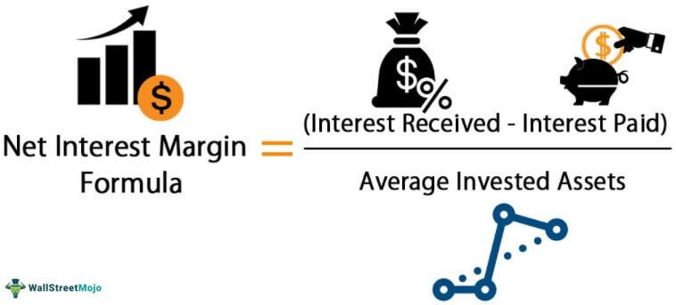

In the ever-evolving financial landscape, innovative tools and strategies continue to redefine how investors engage with markets. Among these advancements, Net Profits Interest (NPI) and Algorithmic Trading (Algo Trading) stand out for their potential to maximize investment returns. 

Net Profits Interest is a unique financial instrument particularly beneficial in resource extraction industries such as oil, gas, and mining. This agreement allows property owners to receive a share of the net profits generated by an operation without being burdened by operational losses. It offers an attractive revenue stream for property owners, particularly in capital-intensive sectors, without requiring them to engage directly in operational activities. By facilitating a risk-free way to generate income, NPIs provide financial flexibility and leverage for stakeholders with limited resources for property development.

Simultaneously, algorithmic trading employs technology to enhance trading efficiency and mitigate emotional biases inherent in traditional trading methods. By using computer algorithms to execute trades based on pre-defined criteria such as price, timing, and volume, algo trading presents advantages like high precision, speed, and reduced emotional influence in decision-making. These attributes are especially appealing to high-frequency traders and large financial institutions that aim for market efficiency. The technology behind algorithmic trading enables backtesting of strategies, scalability, and management of large trade volumes across global markets, quickly capitalizing on trading opportunities to optimize profits.

This article explores these concepts in depth, their individual workings, and how they complement each other to present strategic advantages in trading environments. By understanding how NPI and algo trading can be integrated, investors can harness both tools to optimize returns effectively, offering diverse opportunities in their financial strategies.

## Table of Contents

## Understanding Net Profits Interest

Net Profits Interest (NPI) is a financial structure that provides a payout based on the net profits generated from an operational activity. This type of agreement is primarily utilized within the oil, gas, and mining industries, where significant capital investment and operational expertise are necessary. NPIs enable property owners to receive a proportion of the profits from resource extraction activities without bearing the burden of operational losses. This is because the calculation for NPI payouts occurs only after the deduction of operational costs from the gross revenue generated by the operation. 

This contrasts with royalty interests, which are typically calculated based on gross revenue, regardless of whether the operation is profitable. The distinctive feature of an NPI lies in its dependency on the net profitability of the venture, thus aligning the interests of both the operator and the property owner. This alignment provides an incentive for operators to manage costs efficiently and maximize profitability.

For property owners, NPIs furnish a risk-free mechanism for generating income from their properties. In capital-intensive industries characterized by high risk and potential for substantial losses, such as oil and gas, the ability to earn passive income without the liabilities and operational risks inherent in these sectors is particularly appealing.

Moreover, property owners who may lack the resources or expertise to engage in full-scale property development can still benefit from their assets through NPI agreements. These agreements allow such owners to monetize their resources by partnering with skilled operators who manage the extraction and selling of resources. Consequently, NPIs offer a strategic financial vehicle for those seeking to capitalize on the value of their property without the need to undertake the complex and costly tasks associated with resource extraction. 

In summary, Net Profits Interest serves as an advantageous tool for property owners in resource-rich industries, providing a means to gain from extraction activities while avoiding the operational complexities and financial risks these ventures typically entail.

## Algorithmic Trading: An Overview

Algorithmic trading, also known as algo trading, is a sophisticated method of executing trades using computer algorithms. These algorithms are designed to follow pre-set criteria related to price, timing, and [volume](/wiki/volume-trading-strategy). The primary premise behind [algorithmic trading](/wiki/algorithmic-trading) is to achieve trades at optimal prices while maintaining efficiency and minimizing market impact. By leveraging technology, this approach ensures high precision and speed, effectively removing emotional bias from trading decisions, which is often a significant drawback in manual trading processes.

Algo trading is particularly favored by high-frequency traders and large financial institutions due to its ability to enhance market efficiency. It allows the execution of vast numbers of orders across global markets with minimal human intervention. This scalability is crucial as financial markets become increasingly complex and data-driven. Furthermore, large volumes of data can be analyzed and acted upon instantaneously, providing traders with the agility required to respond swiftly to market changes.

One of the most significant advantages of algorithmic trading is [backtesting](/wiki/backtesting). By simulating a trading strategy using historical data, traders can evaluate the potential performance of their strategies before deploying them in live markets. This process helps in refining strategies, identifying potential issues, and ensuring robust risk management.

Additionally, algo trading strategies can be extensively customized to exploit specific market inefficiencies or patterns. These strategies range from simple scenarios like moving averages crossovers to more complex systems involving [machine learning](/wiki/machine-learning) and statistical [arbitrage](/wiki/arbitrage). Python, a popular programming language for algorithmic trading, provides various libraries such as pandas for data analysis, NumPy for numerical computations, and machine learning frameworks like TensorFlow and Scikit-learn.

The primary allure of algorithmic trading is its ability to capture trading opportunities with unmatched speed and accuracy. As markets constantly evolve, the ability to adapt and capitalize on fleeting opportunities is invaluable, especially for high-frequency trading, where trades might be executed in milliseconds.

In summary, algorithmic trading represents a paradigm shift in the way financial trades are executed. By integrating technology with trading strategies, it not only amplifies the potential for profit but also instills a level of discipline and efficiency that is challenging to attain through traditional trading methods.

## The Interplay Between NPI and Algo Trading

Combining Net Profits Interest (NPI) with algorithmic trading (algo trading) offers a potent synergy that can enhance investment returns by leveraging the unique strengths of both strategies. NPI agreements, primarily utilized in industries like oil, gas, and mining, ensure that investors receive a portion of net profits while insulating them from operational losses. This feature makes it a reliable source of income in resource-heavy sectors where operational risks are significant.

Algorithmic trading, on the other hand, provides precision, speed, and emotional neutrality in executing trades. Through pre-defined criteria based on price, timing, and volume, algorithms can efficiently manage entry and [exit](/wiki/exit-strategy) points in various financial markets. This capability is particularly beneficial when correlating market conditions with NPI payouts, as it allows investors to accurately time and execute trades to optimize their revenue streams.

The automation inherent in algo trading plays a critical role in adapting to market [volatility](/wiki/volatility-trading-strategies). By continuously monitoring markets and executing trades at optimal moments, algorithms can mitigate risks associated with sudden market shifts. This is especially advantageous for investors holding NPIs, as it helps to stabilize revenue generation through timely trading actions tailored to the specific conditions affecting resource industries.

Moreover, the combination of NPI and algo trading provides diversified income avenues. While NPIs offer a relatively stable income from net profits, algo trading introduces the potential for dynamic market involvement, thereby broadening the investor's financial portfolio. This diversification is essential for enhancing overall risk management, as non-correlated income streams can buffer against downturns in either channel.

Investors benefit notably from the operational resilience of NPIs amid market fluctuations and the strategic agility of algo trading to capture emerging opportunities. The synergy between these two investment strategies supports a robust approach to capitalizing on resource-based profits while actively engaging with broader financial markets. By integrating the structured profitability of NPIs with the adaptive capabilities of algorithmic trading, investors can effectively navigate and optimize returns in today's fast-paced financial landscape.

## Advantages and Challenges

The strategic combination of Net Profits Interest (NPI) and algorithmic trading presents multiple advantages that can significantly enhance investment outcomes. One of the primary benefits is the provision of passive income through NPI agreements, which ensure a low-risk revenue model. This is particularly advantageous because property owners in sectors like oil, gas, and mining can earn a share of the profits without bearing operational losses. Such an arrangement inherently involves risk-sharing, as the property owner is insulated from direct operational expenses and losses.

Algorithmic trading complements this by providing rapid adaptability to market changes and minimizing human error. Pre-defined algorithms enable traders to execute high-frequency trades with precision and speed, allowing them to capitalize on market inefficiencies swiftly. This speed and efficiency are crucial in optimizing profit potential, especially in highly volatile markets where timing is critical.

However, despite these benefits, several challenges must be acknowledged. For NPIs, market dependency is a significant concern. The profitability of NPI agreements is inherently tied to the success and profitability of the underlying operation, meaning that downturns in commodities markets can directly affect revenue.

In the case of algorithmic trading, high infrastructure costs can be a barrier to entry, especially for individual investors and smaller firms. Establishing and maintaining robust technological infrastructure requires substantial financial investment. Additionally, users might face technical failures, where glitches or outages can disrupt trading activities, potentially leading to significant financial losses.

Algorithm overfitting is another substantial risk; it occurs when a trading algorithm is too finely-tuned to historical data, reducing its effectiveness with unseen market data. Furthermore, traders are exposed to sudden market shifts for which the algorithm may not be adequately prepared, risking substantial financial loss.

Recognizing and navigating these challenges is essential to leveraging the full potential of combining NPI and algo trading. Successful risk management involves continuous monitoring and updating of trading algorithms to address overfitting and adapt to new market conditions. Ensuring a diversified approach to NPI investments can mitigate market dependency risks, while strategic investments in technology can help manage infrastructure costs effectively.

## Conclusion

In the dynamic world of finance, both Net Profits Interest and algorithmic trading have significantly influenced investment strategies. Investors in resource-heavy industries have found NPIs to be invaluable, providing a reliable source of passive income by sharing in net profits without exposure to operational losses. This risk-minimizing model is particularly advantageous in volatile sectors such as oil, gas, and mining, where substantial capital is often required for development.

Algorithmic trading, on the other hand, has redefined market engagement by using advanced algorithms to execute trades with speed and precision, significantly reducing the emotional biases that can affect human judgment. Its adaptability and capability to handle large volumes of trade globally have enhanced market efficiency, allowing investors to quickly capitalize on opportunities and optimize profit potential.

When synergized, NPIs and algorithmic trading create a comprehensive toolset that empowers investors to optimize returns while managing risk effectively. NPI provides a steady income stream with minimized risk, whereas algo trading offers a proactive approach to market participation, adapting swiftly to market changes. Together, they foster diversified income streams and enhanced risk management strategies.

To fully exploit the potential of NPIs and algorithmic trading, investors must prioritize strategic advisement and stay informed about emerging financial technologies. The integration of these instruments requires a deep understanding of market dynamics and continual learning to navigate the complexities of modern financial environments. By maintaining adaptability and foresight, investors can leverage these transformative tools to sustain a competitive edge and achieve long-term success in an ever-evolving financial landscape.

## References & Further Reading

[1]: Bergstra, J., Bardenet, R., Bengio, Y., & Kégl, B. (2011). ["Algorithms for Hyper-Parameter Optimization."](https://dl.acm.org/doi/10.5555/2986459.2986743) Advances in Neural Information Processing Systems 24.

[2]: ["Advances in Financial Machine Learning"](https://www.amazon.com/Advances-Financial-Machine-Learning-Marcos/dp/1119482089) by Marcos Lopez de Prado

[3]: ["Evidence-Based Technical Analysis: Applying the Scientific Method and Statistical Inference to Trading Signals"](https://www.amazon.com/Evidence-Based-Technical-Analysis-Scientific-Statistical/dp/0470008741) by David Aronson

[4]: ["Machine Learning for Algorithmic Trading"](https://github.com/stefan-jansen/machine-learning-for-trading) by Stefan Jansen

[5]: ["Quantitative Trading: How to Build Your Own Algorithmic Trading Business"](https://www.amazon.com/Quantitative-Trading-Build-Algorithmic-Business/dp/1119800064) by Ernest P. Chan