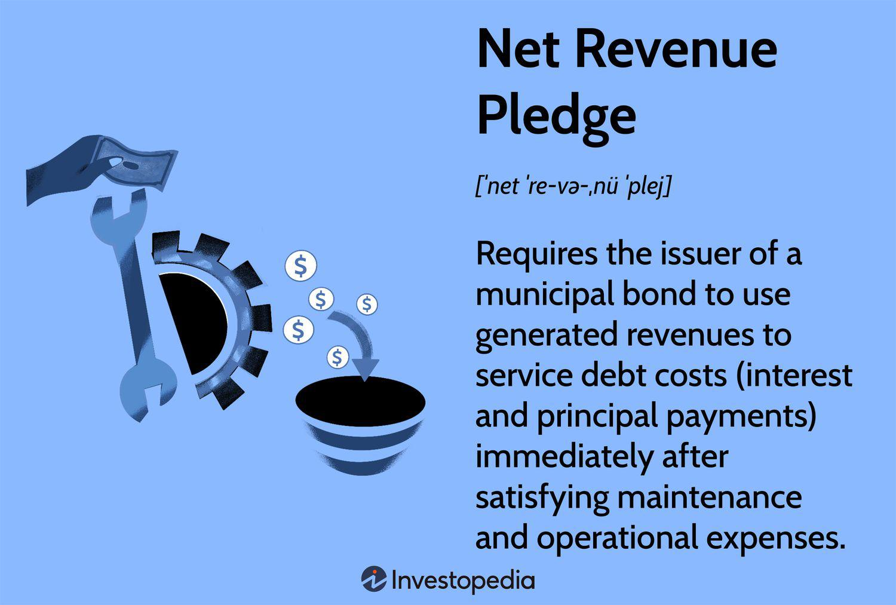

## Table of Contents

## What is the basic definition of Net Revenue Pledge?

Net Revenue Pledge is a promise made by a company or organization to use the money left over after paying all its expenses to pay back a loan or bond. This leftover money is called net revenue. When a company issues a bond or takes a loan with a net revenue pledge, it means they will use the profits they make, after all costs are covered, to make the payments on that loan or bond.

This kind of pledge is often used by public entities like cities or utility companies. It helps them borrow money for big projects, like building a new water treatment plant or expanding public transportation. By promising to use their net revenue, these organizations can reassure lenders that they have a reliable way to pay back what they owe, making it easier to get the funding they need.

## How does Net Revenue Pledge differ from Gross Revenue Pledge?

Net Revenue Pledge and Gross Revenue Pledge are two ways a company or organization can promise to repay a loan or bond, but they use different parts of their income. With a Net Revenue Pledge, the organization promises to use the money left over after all their expenses are paid, which is called net revenue. This means they first pay for everything they need to run their operations, and then use whatever is left to pay back the loan or bond.

On the other hand, a Gross Revenue Pledge means the organization promises to use all the money they earn before any expenses are paid, which is called gross revenue. This is riskier for the organization because they have to pay back the loan or bond before they cover their costs. If they don't earn enough, they might struggle to keep their operations running smoothly.

So, the main difference is that a Net Revenue Pledge is safer for the organization because it lets them pay their expenses first, while a Gross Revenue Pledge is riskier but might be more appealing to lenders because they get paid first.

## What are the typical components included in a Net Revenue Pledge?

A Net Revenue Pledge usually has a few important parts. First, it has a clear promise from the organization to use their net revenue, which is the money left after all expenses are paid, to pay back the loan or bond. This promise is written down in a legal document, so everyone knows exactly what is being promised. Second, the pledge includes details about how the net revenue will be calculated. This means the organization must show how they figure out their expenses and what's left over as net revenue.

The pledge also often includes rules about how the money should be handled. For example, it might say that the net revenue must be put into a special account just for paying back the loan or bond. This helps make sure the money is used for the right thing. Lastly, the pledge might have conditions that the organization has to meet, like keeping their finances in good shape or meeting certain performance goals. These conditions help make sure the organization can keep up with their payments and stay healthy financially.

## Who are the primary stakeholders in a Net Revenue Pledge agreement?

The primary stakeholders in a Net Revenue Pledge agreement are the borrowing organization and the lenders or bondholders. The borrowing organization could be a city, a utility company, or any public entity that needs to borrow money for big projects. They promise to use their net revenue, which is the money left after paying all their expenses, to pay back the loan or bond. This pledge helps them get the funding they need because it shows lenders they have a plan to repay what they borrow.

The lenders or bondholders are the ones who provide the money to the borrowing organization. They could be banks, investment firms, or individual investors who buy the bonds. They are interested in the Net Revenue Pledge because it tells them how they will get their money back. By agreeing to the pledge, they know that the organization will use its profits to make the payments, which makes the loan or bond less risky for them.

## What industries commonly use Net Revenue Pledge agreements?

Net Revenue Pledge agreements are often used by public entities like cities and towns. These places need money to build things like new roads, schools, or parks. By using a Net Revenue Pledge, they can borrow money from banks or investors. They promise to use the money they have left after paying all their bills to pay back the loan. This helps them get the money they need without putting too much risk on their daily operations.

Another industry that commonly uses Net Revenue Pledge agreements is the utility sector. This includes companies that provide services like water, electricity, or gas. These companies need a lot of money to build and maintain their systems. By promising to use their net revenue to pay back loans, they can get the funds they need to keep their services running smoothly. This way, they can make sure they have enough money to cover their costs and still pay back what they borrowed.

## How is the financial performance measured under a Net Revenue Pledge?

Under a Net Revenue Pledge, the financial performance is measured by looking at the net revenue of the organization. This means they calculate how much money they have left after paying all their bills and expenses. This leftover money is what they promise to use to pay back the loan or bond. To figure out the net revenue, they start with their total income, then subtract all the costs of running their operations, like salaries, maintenance, and other expenses.

This measure of financial performance is important because it shows if the organization can keep up with their promise to pay back the loan. If the net revenue is high, it means they are doing well and can easily make their payments. But if the net revenue is low or if they are losing money, it could be harder for them to pay back what they owe. Lenders and investors watch this number closely to make sure the organization can meet its obligations.

## What are the legal implications and requirements for setting up a Net Revenue Pledge?

Setting up a Net Revenue Pledge involves legal documents that outline the promise to use net revenue to pay back a loan or bond. These documents need to be clear and detailed so everyone understands what is being promised. They must include how the organization will calculate its net revenue, which means showing how they figure out their income after all expenses are paid. The legal documents also need to say how the net revenue will be handled, like putting it into a special account just for loan payments. This helps make sure the money is used the right way.

There are also rules and conditions that the organization has to follow. For example, they might need to keep their finances in good shape or meet certain performance goals. These conditions help make sure the organization can keep up with their payments and stay financially healthy. If the organization does not follow these rules, it could be seen as breaking the agreement, which might lead to legal problems or trouble with the lenders. So, it's important to set up the Net Revenue Pledge carefully and follow all the legal requirements to avoid any issues.

## How can a Net Revenue Pledge impact an organization's financial strategy?

A Net Revenue Pledge can change how an organization plans its money. When an organization uses a Net Revenue Pledge to borrow money, it means they have to use the money they have left after paying all their bills to pay back the loan. This can make them more careful about their spending because they need to make sure they have enough money left over to meet their promise. They might choose to cut costs or find new ways to make more money to make sure they can keep up with their payments. This can lead to a more disciplined approach to managing their finances.

At the same time, using a Net Revenue Pledge can help an organization grow. By promising to use their net revenue to pay back loans, they can get the money they need for big projects like building new roads or updating their water systems. This can help them improve their services and meet the needs of their community. But it also means they have to keep a close eye on their financial performance to make sure they can keep up with their payments and stay healthy financially.

## What are the risks associated with entering into a Net Revenue Pledge?

Entering into a Net Revenue Pledge can be risky for an organization. One big risk is that if the organization does not make enough money after paying all its bills, it might not have enough left over to pay back the loan. This can happen if their costs go up or if they earn less money than they expected. If they can't make their payments, they could get into trouble with the people who lent them the money, and it might hurt their reputation and make it harder to borrow money in the future.

Another risk is that the organization might have to cut back on spending to make sure they have enough net revenue to meet their promise. This could mean less money for important things like fixing roads or hiring enough workers. If they cut back too much, it might affect the quality of their services and make people unhappy. So, they have to be very careful and plan well to balance their need to pay back the loan with their need to keep their services running smoothly.

## How does a Net Revenue Pledge affect bond ratings and investor confidence?

A Net Revenue Pledge can affect bond ratings and investor confidence in important ways. When an organization uses a Net Revenue Pledge, it promises to use the money left over after paying all its bills to pay back the bond. If the organization is good at managing its money and has a strong net revenue, bond rating agencies might give it a higher rating. A higher rating means the bond is seen as less risky, which can make investors feel more confident about buying it. They believe the organization will be able to keep up with its payments, so they are more likely to invest their money.

However, if the organization struggles to make enough net revenue, it can lower the bond rating and shake investor confidence. If the organization's costs go up or its income goes down, it might not have enough money left over to pay back the bond. This makes the bond riskier, and bond rating agencies might give it a lower rating. When investors see a lower rating, they might worry that the organization won't be able to make its payments, so they might be less willing to buy the bond. This can make it harder for the organization to borrow money in the future.

## What case studies or examples illustrate successful implementations of Net Revenue Pledges?

One good example of a successful Net Revenue Pledge is the Metropolitan Water District of Southern California. They used a Net Revenue Pledge to borrow money for big projects like building new water treatment plants. By promising to use their net revenue to pay back the loans, they were able to get the money they needed without putting too much risk on their daily operations. This helped them keep their water services running smoothly and meet the needs of their community. Their careful financial planning and strong net revenue helped them keep up with their payments and maintain a good bond rating, which made investors happy and confident.

Another example is the City of Denver, Colorado. They used a Net Revenue Pledge to borrow money for building new roads and parks. By using the money left over after paying all their bills to pay back the loans, they were able to improve their city without hurting their services. Their good financial management and strong net revenue helped them keep their promises to lenders. This made bond rating agencies give them a high rating, which showed investors that the city was a safe place to put their money. As a result, the city was able to keep borrowing money for more projects, helping them grow and improve even more.

## What advanced strategies can be used to optimize the benefits of a Net Revenue Pledge?

One advanced strategy to optimize the benefits of a Net Revenue Pledge is to use careful financial planning and forecasting. This means the organization should always be looking ahead to see how much money they will have left over after paying their bills. They can use this information to make smart choices about how to spend their money and where to cut costs. By doing this, they can make sure they always have enough net revenue to meet their promise to pay back the loan. This can help them keep a good bond rating and make investors feel confident about lending them money.

Another strategy is to find new ways to make more money. This could mean starting new projects or services that bring in more income. If the organization can increase its earnings, it will have more net revenue to use for paying back the loan. This can help them pay off the loan faster and maybe even borrow more money for other projects. By growing their income, they can keep their services strong and meet the needs of their community while still meeting their financial promises.

## What is the Understanding of Net Revenue Pledge?

Net revenue pledge is integral to municipal finance, involving the allocation of a bond issuer's revenues to meet debt service obligations after operational costs are covered. This approach helps reduce the likelihood of default, which can, in turn, boost a bond's credit rating. Enhanced credit ratings can lead to lower borrowing costs for issuers and increased attractiveness to investors.

In the context of public project financing, net revenue pledges are particularly prominent. Institutions such as airports, universities, and utility services frequently employ this mechanism to secure funding. These projects often have predictable revenue streams, which provide a reliable source of income to service debt. For example, an airport might use landing fees and terminal rents as revenue sources, while a university could rely on tuition and fees.

Calculating net revenue involves subtracting operational expenses from total revenues to determine the amount available for debt service. The formula for net revenue can be expressed as:

$$
\text{Net Revenue} = \text{Total Revenue} - \text{Operating Expenses}
$$

This calculation is crucial for bondholders because it directly influences the sustainability of debt repayment. A robust net revenue figure indicates a lower risk of default, thereby protecting investors' interests.

In practical terms, net revenue pledges provide a structured framework that prioritizes debt repayment over other financial obligations. As a result, bondholders are afforded a layer of protection due to this prioritization. This security element can be especially appealing in sectors with steady and predictable revenue sources, ensuring regular bond servicing.

The implications for bondholders are significant. By investing in bonds backed by net revenue pledges, they gain exposure to financially disciplined projects with a clear commitment to debt servicing. Additionally, enhanced creditworthiness can lead to tighter spreads and improved [liquidity](/wiki/liquidity-risk-premium), making these bonds an attractive option for conservative investors seeking stable returns.

Understanding the calculation and implications of net revenue within various sectors highlights its importance as a tool for both issuers and investors. With the landscape of municipal finance continually evolving, the net revenue pledge remains a cornerstone for securing and maintaining the financial viability of large-scale public projects.

## References & Further Reading

[1]: Bergstra, J., Bardenet, R., Bengio, Y., & Kégl, B. (2011). ["Algorithms for Hyper-Parameter Optimization."](https://dl.acm.org/doi/10.5555/2986459.2986743) Advances in Neural Information Processing Systems 24.

[2]: ["Advances in Financial Machine Learning"](https://www.amazon.com/Advances-Financial-Machine-Learning-Marcos/dp/1119482089) by Marcos Lopez de Prado

[3]: ["Evidence-Based Technical Analysis: Applying the Scientific Method and Statistical Inference to Trading Signals"](https://www.amazon.com/Evidence-Based-Technical-Analysis-Scientific-Statistical/dp/0470008741) by David Aronson

[4]: ["Machine Learning for Algorithmic Trading"](https://github.com/stefan-jansen/machine-learning-for-trading) by Stefan Jansen

[5]: ["Quantitative Trading: How to Build Your Own Algorithmic Trading Business"](https://www.amazon.com/Quantitative-Trading-Build-Algorithmic-Business/dp/1119800064) by Ernest P. Chan