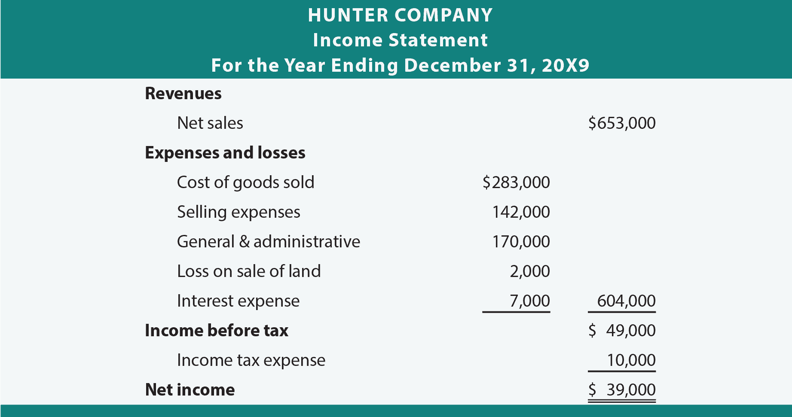

## Table of Contents

## What are net sales?

Net sales are the amount of money a business makes from selling its products or services after taking away any discounts, returns, and allowances. Think of it as the final amount of money that goes into the business's pocket from sales. For example, if a store sells a shirt for $20 but gives a $5 discount, the net sales from that shirt would be $15.

This number is important because it shows how well a business is doing at selling its products or services. It's different from gross sales, which is the total amount of money from sales before any discounts or returns. Businesses use net sales to figure out their profits and to plan for the future. By looking at net sales, a business can see if it needs to change its prices, offer different products, or find new ways to attract customers.

## How do net sales differ from gross sales?

Net sales and gross sales are two ways to look at how much money a business makes from selling things. Gross sales are the total amount of money a business gets before taking away any discounts, returns, or allowances. It's like the first number you see when you add up all the sales. For example, if a store sells 10 shirts at $20 each, the gross sales would be $200.

Net sales, on the other hand, are what's left after you take away the discounts, returns, and allowances from the gross sales. This gives a more accurate picture of the money the business actually keeps. Using the same example, if the store gave a $5 discount on each shirt and one shirt was returned, the net sales would be calculated by subtracting the total discounts and the returned shirt's value from the gross sales. So, net sales help businesses understand their real earnings from sales.

## What components are typically subtracted from gross sales to calculate net sales?

When figuring out net sales, you start with the gross sales, which is all the money made from selling things. Then, you take away three main things: discounts, returns, and allowances. Discounts are when you lower the price for customers, like giving them $5 off a shirt. Returns happen when customers bring back what they bought and get their money back. Allowances are when you give a bit of money back to customers because something was wrong with what they bought, but they keep it.

These three things - discounts, returns, and allowances - are subtracted from the gross sales to find the net sales. This gives a clearer picture of how much money the business really made from selling its products or services. For example, if a store had gross sales of $1000, but gave $100 in discounts, had $50 in returns, and $20 in allowances, the net sales would be $830. This number is important because it shows the actual money the business gets to keep after all the adjustments.

## Can you provide a basic formula for calculating net sales?

The basic formula for calculating net sales is pretty simple. You start with the gross sales, which is all the money you made from selling things. Then, you subtract any discounts you gave to customers, the value of any items that were returned, and any allowances you gave for things that were not perfect but kept by the customer. So, the formula looks like this: Net Sales = Gross Sales - Discounts - Returns - Allowances.

This formula helps businesses see how much money they really made after all the adjustments. For example, if a store had gross sales of $1000, but gave $100 in discounts, had $50 in returns, and $20 in allowances, the net sales would be $830. This number is important because it shows the actual money the business gets to keep after all the sales and adjustments.

## Why is it important for businesses to track net sales?

Tracking net sales is important for businesses because it shows them how much money they really made from selling things. When a business knows its net sales, it can see how well it is doing after taking away any discounts, returns, and allowances. This helps the business understand if it is making enough money to cover its costs and make a profit. If net sales are low, the business might need to change its prices, find new ways to sell more, or look at why people are returning things.

Also, net sales help businesses plan for the future. By keeping an eye on net sales, a business can set goals and make decisions about what to sell, how to sell it, and how to grow. For example, if net sales are growing, the business might decide to open a new store or add more products. If net sales are going down, the business might need to find new ways to attract customers or fix problems with its products. Knowing the net sales gives a clear picture of the business's health and helps guide its next steps.

## How can discounts and returns affect net sales?

Discounts and returns can lower net sales because they take money away from what the business makes. When a business gives a discount, it means they are selling something for less than the full price. For example, if a shirt costs $20 but the store gives a $5 discount, the business gets $5 less from that sale. This lowers the net sales because the money coming in is less than it would have been without the discount.

Returns also reduce net sales. When a customer brings back something they bought, the business has to give them their money back. If someone returns a $20 shirt, that $20 is taken away from the net sales. So, the more returns a business has, the less money it keeps from its sales. Both discounts and returns can make a big difference in how much money a business ends up with after selling its products.

## What are some common mistakes businesses make when calculating net sales?

One common mistake businesses make when calculating net sales is not keeping track of all discounts correctly. Sometimes, they might forget to subtract discounts from the gross sales, or they might only include some discounts and leave others out. This can make the net sales look higher than they really are. For example, if a store gives a 10% discount on all items but only subtracts the discounts on some items, the net sales will be wrong.

Another mistake is not accounting for returns properly. Businesses might forget to take away the value of returned items from their net sales. This can happen if they don't have a good system to track returns or if they just overlook them. If a customer returns a $50 item, but the business doesn't subtract that $50 from the net sales, the numbers will be off. It's important to make sure all returns are included in the calculation to get an accurate picture of net sales.

Lastly, businesses sometimes mix up allowances with discounts or returns. Allowances are when a customer keeps a product but gets a bit of money back because something was wrong with it. If a business doesn't separate allowances from discounts and returns, it can mess up the net sales calculation. For example, if a store gives a $10 allowance on a $100 item, that $10 should be subtracted from the gross sales to find the net sales. Not doing this right can lead to mistakes in the final numbers.

## How does the calculation of net sales vary across different industries?

The way businesses calculate net sales can be different depending on what kind of business they are. For example, in retail, net sales are usually calculated by taking away discounts, returns, and allowances from the total money made from selling things. This is because retail businesses often have a lot of discounts and returns, so it's important for them to track these carefully. In contrast, a manufacturing business might focus more on allowances for defective products, which can be a big part of their net sales calculation. They might not have as many discounts but need to account for the cost of fixing or replacing items that don't meet quality standards.

In the service industry, like restaurants or consulting firms, the calculation of net sales might be simpler. They usually don't have as many returns or allowances, so their net sales are often just the total money made from services minus any discounts given. However, they might need to account for things like free meals given to customers or adjustments made for poor service. Each industry has its own way of doing business, so the way they calculate net sales can be different, but the basic idea is always to find out how much money the business really made after all adjustments.

## What role do net sales play in financial statements and analysis?

Net sales are a big part of a business's financial statements because they show how much money the business really made from selling things. In the income statement, net sales are the first number listed, which means they are the starting point for figuring out if the business made a profit or not. After net sales, the business subtracts all its costs like the cost of goods sold, operating expenses, and taxes to find out the net income. So, net sales are super important because they help businesses and people looking at the financial statements understand how well the business is doing at selling its products or services.

In financial analysis, net sales are used to figure out things like profit margins and sales growth. Analysts look at net sales over time to see if the business is growing or if it's having trouble selling things. They also compare net sales to other numbers in the financial statements to see how efficient the business is. For example, by dividing net sales by the total assets, analysts can find out the asset turnover ratio, which shows how well the business is using its assets to make money. So, net sales are a key piece of information that helps everyone understand the health and performance of a business.

## How can businesses use net sales data to improve their operations?

Businesses can use net sales data to make their operations better by looking at what's working and what's not. If net sales are going up, it means the business is doing something right, like maybe their products are popular or their prices are good. By studying net sales, businesses can see which products or services are selling well and focus on selling more of those. They can also see if certain discounts are helping or hurting their sales, and adjust their pricing strategies to make more money. For example, if a store sees that net sales go up when they offer a 10% discount on certain items, they might decide to keep doing that or even try it with other items.

If net sales are going down, it's a sign that the business needs to make some changes. They can look at the data to find out why people are returning things or not buying as much. Maybe the products aren't what customers want, or the prices are too high. By understanding the reasons behind the drop in net sales, businesses can fix problems, like improving their products, changing their prices, or finding new ways to attract customers. For instance, if a business sees a lot of returns on a certain product, they might decide to stop selling it or make it better. Using net sales data helps businesses make smart decisions to keep their operations running smoothly and profitably.

## What advanced metrics can be derived from net sales for deeper analysis?

Businesses can use net sales to figure out some really helpful numbers that give them a deeper look into how they're doing. One important number is the gross profit margin, which shows how much money the business makes after paying for the things it sells. To find this, you take the net sales and subtract the cost of goods sold, then divide that by the net sales and multiply by 100 to get a percentage. This helps businesses see if they're making enough money from selling things to cover other costs like rent and salaries. Another useful number is the net profit margin, which shows how much money the business keeps after paying all its costs. You find this by taking the net income (which is net sales minus all costs) and dividing it by the net sales, then multiplying by 100. This tells the business if it's really making a profit or if it needs to cut costs somewhere.

Another advanced metric is the sales growth rate, which shows how much the business's sales are growing over time. To calculate this, you take the net sales for the current period, subtract the net sales from the previous period, divide by the net sales from the previous period, and then multiply by 100 to get a percentage. This helps businesses see if they're getting better at selling things or if they need to try new ways to grow. The inventory turnover ratio is also important, especially for businesses that sell physical products. This shows how quickly the business is selling and replacing its inventory. You find it by dividing the cost of goods sold by the average inventory value. A high turnover means the business is selling things fast, which is good, but if it's too high, it might mean they're not keeping enough stock on hand. By looking at these advanced metrics, businesses can get a clearer picture of their performance and make smarter decisions.

## How do international sales and currency fluctuations impact net sales calculations?

When a business sells things in different countries, it has to deal with different currencies. This can make calculating net sales a bit tricky. If a business sells something in another country, it gets paid in that country's money. But to figure out the net sales in its own currency, the business has to change the foreign money into its own money using the current exchange rate. If the exchange rate changes a lot, it can make the net sales go up or down even if the business sold the same amount of stuff. For example, if the US dollar gets stronger compared to the Euro, the same amount of Euros will be worth fewer US dollars, so the net sales in US dollars will be lower.

Currency fluctuations can also make it hard for businesses to plan and predict their net sales. If the value of a currency goes up or down a lot, it can change how much money the business makes from its international sales. This can affect the business's profits and make it harder to know if it's doing well or not. To deal with this, businesses might use things like forward contracts to lock in exchange rates ahead of time, or they might spread out their sales across different countries to reduce the risk. By understanding how international sales and currency changes affect net sales, businesses can make better decisions and manage their money more carefully.

## What is Understanding Net Sales?

Net sales are a fundamental element of financial analysis, providing insights into a company's true revenue generation capability. They represent the actual income a company retains after accounting for returns, allowances, and discounts, making them a critical measure for financial performance assessment. The calculation of net sales can be expressed with the formula:

$$

\text{Net Sales} = \text{Gross Sales} - \text{Returns} - \text{Allowances} - \text{Discounts} 
$$

Gross sales refer to the total sales a company makes before any deductions. Returns refer to the products that customers bring back, while allowances are price reductions for any substandard goods sold. Discounts cover various price reductions offered to customers, often for prompt payment or bulk buying. 

Understanding net sales is pivotal for assessing a company's performance and financial health. Net sales allow financial analysts and investors to obtain a clearer understanding of a company's actual revenue, as opposed to gross sales which may significantly overstate income. This is crucial for calculating various financial metrics and ratios that assess operational efficiency and profitability, such as profit margins. The profit margin is a key indicator of a company's financial health and operating performance and is calculated after net sales have been derived. 

Accurate net sales figures also offer insights into market demand and sales strategy effectiveness. By analyzing net sales trends over time, companies can evaluate the success of their sales strategies, marketing efforts, and customer satisfaction levels. This evaluation also assists in making informed projections and strategic adjustments to enhance growth and competitiveness.

In summary, net sales serve as a more accurate representation of a company's revenue, supporting robust financial analysis and strategic decision-making. Understanding and effectively computing net sales is essential for businesses aiming to assess their true financial performance and operational efficiency.

## What is the importance of net sales in financial analysis?

Net sales figures hold a central role in financial analysis due to their capacity to provide an accurate representation of a company's actual revenue. This precision is vital as it directly influences performance analysis and strategic decision-making processes within a business.

Primarily, net sales are calculated by subtracting returns, allowances, and discounts from gross sales:

$$
\text{Net Sales} = \text{Gross Sales} - \text{Returns} - \text{Allowances} - \text{Discounts}
$$

This calculation yields a more precise measure of revenue, facilitating a clearer understanding of a company's financial position and performance.

Net sales are integral to several financial metrics and ratios, notably profit margins, which serve as indicators of operational efficiency. By comparing net sales against costs, companies can assess their profitability margins. For instance, the gross profit margin is determined using net sales:

$$
\text{Gross Profit Margin} = \left( \frac{\text{Net Sales} - \text{Cost of Goods Sold}}{\text{Net Sales}} \right) \times 100
$$

This metric allows analysts to evaluate how effectively a company is managing its production costs relative to its net sales, thereby providing insights into the company’s cost control and pricing strategies.

Furthermore, net sales are crucial for understanding market demand and assessing the effectiveness of sales strategies. Analyzing net sales trends over time helps investors and analysts gauge consumer demand and market conditions. A consistent increase in net sales could indicate strong product demand and successful sales strategies, contributing to a favorable outlook for the company. Conversely, declining net sales might signal potential issues with product competitiveness or market saturation.

The analysis of net sales data can also aid in identifying areas of improvement, such as operational inefficiencies or the need to revise pricing strategies. Therefore, evaluating net sales is fundamental for investors and analysts who aim to make informed decisions regarding company valuation and investment opportunities. By understanding net sales dynamics, stakeholders can significantly enhance their assessment of a company's performance and strategic direction in the broader market context.

## References & Further Reading

[1]: ["Algorithmic Trading: Winning Strategies and Their Rationale"](https://www.amazon.com/Algorithmic-Trading-Winning-Strategies-Rationale-ebook/dp/B00CY5HC0U) by Ernest P. Chan

[2]: Narang, R. K. (2009). ["Inside the Black Box: A Simple Guide to Quantitative and High-Frequency Trading."](https://onlinelibrary.wiley.com/doi/book/10.1002/9781118267738) Wiley.

[3]: Aldridge, I. (2013). ["High-Frequency Trading: A Practical Guide to Algorithmic Strategies and Trading Systems."](https://www.amazon.com/High-Frequency-Trading-Practical-Algorithmic-Strategies/dp/1118343506) Wiley.

[4]: ["Algorithmic and High-Frequency Trading"](https://www.cambridge.org/us/universitypress/subjects/mathematics/mathematical-finance/algorithmic-and-high-frequency-trading) by Álvaro Cartea, Sebastian Jaimungal, and José Penalva

[5]: Kissell, R. (2013). ["The Science of Algorithmic Trading and Portfolio Management."](https://www.sciencedirect.com/book/9780124016897/the-science-of-algorithmic-trading-and-portfolio-management) Academic Press.