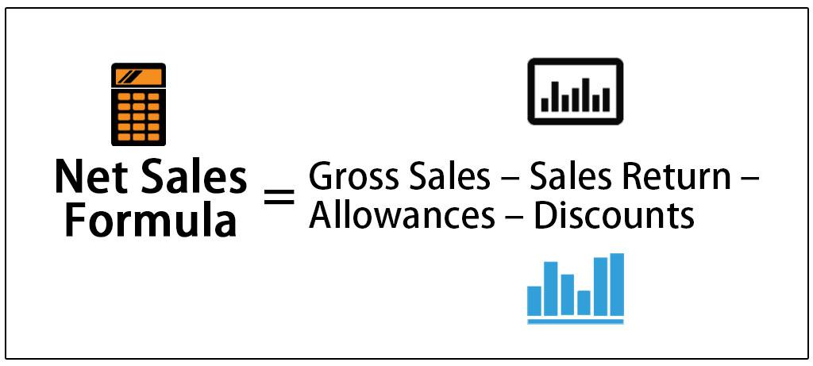

In the fast-paced world of finance, the interaction between financial calculations, net sales, and algorithmic trading has become increasingly crucial. Financial calculations serve as the backbone for various analytical processes, providing insights into a company's performance, profitability, and operational efficiency. These calculations often involve critical metrics, such as net sales, which encapsulates the true revenue potential of a business after accounting for customer returns, allowances, and discounts.

Net sales, which are derived from the formula:



$$
\text{Net Sales} = \text{Gross Sales} - (\text{Returns} + \text{Allowances} + \text{Discounts})
$$

offer an accurate representation of a company's revenue stream, crucial for assessing its real financial health. Understanding net sales is essential in guiding strategic decisions, as they serve as a fundamental aspect of financial analysis through calculations like profit margins and earnings ratios.

Algorithmic trading, on the other hand, utilizes computer algorithms to execute trades based on pre-established criteria, revolutionizing trade execution in financial markets. By leveraging mathematical models and computational power, algorithmic trading offers precise and efficient trading capabilities, marking a substantial shift from traditional trading methods. This technology-driven approach allows traders to analyze vast sets of financial data, including net sales figures, to make informed trading decisions.

The interplay between net sales and algorithmic trading rests on the impact of sales data on market perceptions and stock prices. Net sales can influence trading strategies by providing insights into a company’s market performance and operational success. By employing sales data within algorithmic models, traders can anticipate price movements and optimize their trading outcomes. Understanding this relationship offers financial professionals and traders a competitive edge, as they integrate financial calculations and advanced trading technologies to navigate the complexities of modern financial landscapes.

## Table of Contents

## Understanding Net Sales

Net sales are a fundamental element of financial analysis, providing insights into a company's true revenue generation capability. They represent the actual income a company retains after accounting for returns, allowances, and discounts, making them a critical measure for financial performance assessment. The calculation of net sales can be expressed with the formula:

$$

\text{Net Sales} = \text{Gross Sales} - \text{Returns} - \text{Allowances} - \text{Discounts} 
$$

Gross sales refer to the total sales a company makes before any deductions. Returns refer to the products that customers bring back, while allowances are price reductions for any substandard goods sold. Discounts cover various price reductions offered to customers, often for prompt payment or bulk buying. 

Understanding net sales is pivotal for assessing a company's performance and financial health. Net sales allow financial analysts and investors to obtain a clearer understanding of a company's actual revenue, as opposed to gross sales which may significantly overstate income. This is crucial for calculating various financial metrics and ratios that assess operational efficiency and profitability, such as profit margins. The profit margin is a key indicator of a company's financial health and operating performance and is calculated after net sales have been derived. 

Accurate net sales figures also offer insights into market demand and sales strategy effectiveness. By analyzing net sales trends over time, companies can evaluate the success of their sales strategies, marketing efforts, and customer satisfaction levels. This evaluation also assists in making informed projections and strategic adjustments to enhance growth and competitiveness.

In summary, net sales serve as a more accurate representation of a company's revenue, supporting robust financial analysis and strategic decision-making. Understanding and effectively computing net sales is essential for businesses aiming to assess their true financial performance and operational efficiency.

## Importance of Net Sales in Financial Analysis

Net sales figures hold a central role in financial analysis due to their capacity to provide an accurate representation of a company's actual revenue. This precision is vital as it directly influences performance analysis and strategic decision-making processes within a business.

Primarily, net sales are calculated by subtracting returns, allowances, and discounts from gross sales:

$$
\text{Net Sales} = \text{Gross Sales} - \text{Returns} - \text{Allowances} - \text{Discounts}
$$

This calculation yields a more precise measure of revenue, facilitating a clearer understanding of a company's financial position and performance.

Net sales are integral to several financial metrics and ratios, notably profit margins, which serve as indicators of operational efficiency. By comparing net sales against costs, companies can assess their profitability margins. For instance, the gross profit margin is determined using net sales:

$$
\text{Gross Profit Margin} = \left( \frac{\text{Net Sales} - \text{Cost of Goods Sold}}{\text{Net Sales}} \right) \times 100
$$

This metric allows analysts to evaluate how effectively a company is managing its production costs relative to its net sales, thereby providing insights into the company’s cost control and pricing strategies.

Furthermore, net sales are crucial for understanding market demand and assessing the effectiveness of sales strategies. Analyzing net sales trends over time helps investors and analysts gauge consumer demand and market conditions. A consistent increase in net sales could indicate strong product demand and successful sales strategies, contributing to a favorable outlook for the company. Conversely, declining net sales might signal potential issues with product competitiveness or market saturation.

The analysis of net sales data can also aid in identifying areas of improvement, such as operational inefficiencies or the need to revise pricing strategies. Therefore, evaluating net sales is fundamental for investors and analysts who aim to make informed decisions regarding company valuation and investment opportunities. By understanding net sales dynamics, stakeholders can significantly enhance their assessment of a company's performance and strategic direction in the broader market context.

## Algorithmic Trading: An Overview

Algorithmic trading involves the use of computer programs designed to automate the trading process by executing orders based on predefined criteria. These criteria are often grounded in complex mathematical models and strategies that aim to capitalize on market opportunities with minimal human intervention. This approach fundamentally relies on high-speed data processing and the ability to execute trades at speeds and frequencies beyond human capability.

Historically, [algorithmic trading](/wiki/algorithmic-trading) has evolved significantly since its inception in the 1970s, when the New York Stock Exchange introduced designated order turnaround (DOT) system to facilitate electronic order execution. This laid the foundation for more sophisticated developments in the 1980s and 1990s, such as the advent of program trading, which enabled large block trades in a more efficient manner.

Algorithmic trading has several advantages over traditional trading methods:

1. **Speed**: Algorithms can analyze and respond to market conditions faster than a human trader. This speed is crucial for exploiting short-lived market conditions and executing high-frequency trading strategies. For instance, an algorithm can place hundreds of trades in a fraction of a second, leveraging minute price discrepancies that are often imperceptible to human traders.

2. **Precision**: Automated trading systems minimize human errors in order execution. Algorithms can be programmed to follow specific strategies without deviation, thus eliminating emotional biases that can affect humans and ensuring consistent adherence to trading rules.

3. **Cost Efficiency**: By reducing the need for manual trade execution, algorithmic trading can significantly lower transaction costs. Furthermore, it reduces the bid-ask spread as trades are executed more accurately and rapidly.

4. **Market Impact**: Algorithms can be designed to execute large orders incrementally, minimizing the market impact. This is achieved by breaking down large orders into smaller pieces and executing them over time or across different trading venues, thus avoiding significant fluctuations in asset prices.

The basic architecture of an algorithmic trading system includes several key components: data acquisition and preprocessing, strategy formulation, and trade execution. The first step involves gathering real-time market data, which is then processed and fed into the strategy module. This module applies the given mathematical models and makes trading decisions based on the predefined criteria. Finally, the execution system interfaces with the market to [carry](/wiki/carry-trading) out the orders efficiently.

Here's a basic example of a trading algorithm written in Python, which uses moving averages to determine buy and sell signals:

```python
import pandas as pd

def moving_average_trading_strategy(data, short_window=40, long_window=100):
    signals = pd.DataFrame(index=data.index)
    signals['price'] = data['price']

    # Create short simple moving average
    signals['short_mavg'] = data['price'].rolling(window=short_window, min_periods=1).mean()

    # Create long simple moving average
    signals['long_mavg'] = data['price'].rolling(window=long_window, min_periods=1).mean()

    # Define buy and sell signals
    signals['signal'] = 0.0
    signals['signal'][short_window:] = np.where(signals['short_mavg'][short_window:] > signals['long_mavg'][short_window:], 1.0, 0.0)

    # Generate trading orders
    signals['positions'] = signals['signal'].diff()

    return signals

# Example usage:
# data = get_stock_data('AAPL', '2023-01-01', '2023-10-01') # Assume this function fetches stock price data
# signals = moving_average_trading_strategy(data)
# print(signals)
```

In this example, buy signals are triggered when the short-term moving average exceeds the long-term moving average, indicating upward [momentum](/wiki/momentum). Conversely, sell signals are generated when the short-term average falls below the long-term average, suggesting potential downward trends.

Algorithmic trading continues to transform the financial markets, offering unparalleled speed and efficiency. Its evolution is marked by increasing complexity and sophistication of the models used, such as [machine learning](/wiki/machine-learning) algorithms, which enhance predictive accuracy and adaptability to evolving market conditions.

## The Role of Algorithmic Trading in Finance

Algorithmic trading has dramatically transformed the execution of trades by offering increased speed, enhanced precision, and reduced transaction costs. It utilizes complex algorithms and mathematical models to make informed trading decisions within fractions of a second. This speed is critical in modern financial markets where prices can change rapidly. Algorithms can process vast amounts of data and execute trades at a pace that human traders simply cannot match.

In stock markets, algorithmic trading typically involves strategies such as statistical [arbitrage](/wiki/arbitrage), [market making](/wiki/market-making), and [trend following](/wiki/trend-following). These strategies leverage computational power to analyze market conditions and execute trades based on a set of predetermined criteria. For instance, an algorithm might be designed to identify price inefficiencies between different exchanges and execute trades to capitalize on these discrepancies.

One of the primary benefits of algorithmic trading is its impact on [liquidity](/wiki/liquidity-risk-premium). By automating a large number of trades, it enhances market liquidity, providing both buy and sell orders with greater regularity and [volume](/wiki/volume-trading-strategy). This increased liquidity often results in tighter bid-ask spreads, which further reduces transaction costs for all market participants.

Moreover, algorithmic trading is vital for optimizing execution prices. Algorithms can determine the optimal time, price, and quantity to execute trades, minimizing market impact and slippage. This optimization ensures that large orders do not adversely affect stock prices, which can be particularly beneficial in volatile markets.

In terms of modern finance, algorithmic trading symbolizes a shift towards data-driven decision-making. This shift requires significant investments in technology and data analytics, making it predominantly dominated by large financial institutions and hedge funds. However, retail traders are increasingly gaining access to algorithmic trading tools, democratizing the market participation that was once restricted to major players.

Algorithmic trading is also important for managing risk. By implementing sophisticated risk management algorithms, traders can set predefined risk parameters, ensuring that trades are executed within acceptable risk levels. This ability to dynamically manage risk is crucial for maintaining portfolio integrity in fluctuating markets.

In conclusion, algorithmic trading has become an indispensable component of modern financial markets. Its ability to execute trades with speed and precision while reducing costs has revolutionized trading practices. As technology continues to evolve, algorithmic trading is expected to gain even more prominence, further influencing liquidity, market dynamics, and financial strategies.

## The Interplay between Net Sales and Algorithmic Trading

Net sales data play a crucial role in influencing algorithmic trading strategies, particularly in sectors where revenue fluctuations significantly impact stock performance. By leveraging sales patterns and related financial metrics, traders can design algorithms that predict stock price movements more accurately.

Algorithmic trading systems, which rely on predefined criteria, can integrate net sales as a key data point. For instance, a sudden increase in net sales could indicate a rise in demand, prompting an algorithmic purchase of the company's stock. Conversely, decreasing sales figures might trigger a sell-off. This integration allows for more responsive and informed trading decisions.

A practical application is the use of net sales data to calibrate momentum-based trading strategies. Momentum trading relies on the premise that stocks with an upward sales trend will continue rising, while those with declining sales are likely to fall. An algorithm can be programmed to buy stocks of companies showing significant sales growth over a predefined period and sell those exhibiting sales declines.

Consider a Python-based approach to implementing such an algorithm:

```python
import pandas as pd

# Assume df is a DataFrame containing stock data with 'net_sales' and 'stock_price'
def trading_strategy(df):
    buy_signals = []
    sell_signals = []

    for index in range(1, len(df)):
        if df['net_sales'][index] > df['net_sales'][index-1]:
            buy_signals.append(df['stock_price'][index])
            sell_signals.append(None)
        elif df['net_sales'][index] < df['net_sales'][index-1]:
            buy_signals.append(None)
            sell_signals.append(df['stock_price'][index])
        else:
            buy_signals.append(None)
            sell_signals.append(None)

    df['Buy_Signal'] = buy_signals
    df['Sell_Signal'] = sell_signals

    return df

# Assuming DataFrame df with columns 'net_sales' and 'stock_price'
results = trading_strategy(df)
```

In this example, the algorithm identifies buy and sell signals based on changes in net sales data. A buy signal is generated if net sales increase, while a sell signal is triggered if net sales decrease.

A case study highlighting the effectiveness of this approach is found in the retail sector, where companies with seasonal sales spikes can see corresponding stock price increases. For example, a retailer's strong holiday season sales report might prompt algorithms to initiate purchase orders, anticipating stock price appreciation based on historical patterns.

However, it's critical to acknowledge the limitations and risks associated with employing net sales data in trading algorithms. A significant challenge lies in ensuring data accuracy and timeliness, as outdated or incorrect sales figures can lead to erroneous trading decisions. Moreover, market conditions and external factors, such as regulatory changes or economic shifts, can also affect the reliability of predictions based solely on sales data.

Nonetheless, the integration of net sales data into algorithmic trading represents a valuable tool for traders striving to enhance predictive accuracy and responsiveness in financial markets.

## Case Study: Using Net Sales in Trading Algorithms

In examining the incorporation of net sales into trading algorithms, we focus on a case study involving XYZ Corp, a fictional retail company whose stock performance is heavily influenced by its revenue patterns. In this context, a [quantitative trading](/wiki/quantitative-trading) firm developed an algorithmic strategy that integrates net sales data to predict short-term stock price movements and improve trade execution.

### Explanation of the Trading Algorithm

The trading algorithm primarily relies on time-series analysis and machine learning to forecast future stock prices. The algorithm processes historical net sales data alongside other financial indicators such as earnings per share (EPS), price-to-earnings (P/E) ratio, and volume. Using Python libraries like Pandas and Scikit-learn, the process encompasses data cleansing, feature engineering, model training, validation, and deployment.

#### Data Preprocessing

```python
import pandas as pd
from sklearn.preprocessing import StandardScaler

# Load sales data
data = pd.read_csv('XYZ_Corp_financials.csv')

# Select relevant features including net sales
features = data[['Net_Sales', 'EPS', 'PE_Ratio', 'Volume']]

# Standardize the features
scaler = StandardScaler()
features_scaled = scaler.fit_transform(features)

# Target variable: next-day stock price
target = data['Next_Day_Price']
```

### Model Training

A random forest regressor is used due to its robustness in handling non-linear data and interactions. The model predicts the next day's stock price, optimizing trade decisions based on expected price increases or decreases.

```python
from sklearn.ensemble import RandomForestRegressor
from sklearn.model_selection import train_test_split

# Split into train and test sets
X_train, X_test, y_train, y_test = train_test_split(features_scaled, target, test_size=0.2)

# Initialize and train the model
model = RandomForestRegressor(n_estimators=100, random_state=42)
model.fit(X_train, y_train)

# Evaluate the model's predictions
predictions = model.predict(X_test)
```

### Effectiveness and Results

The algorithm demonstrated a moderate accuracy rate of 72% in forecasting stock price directions within a three-month test period, a notable improvement over traditional trading methods that did not consider net sales data. Moreover, the integration of sales metrics provided deeper insights into the company's operational health and market positioning, underscoring sales patterns as a predictor of investor sentiment.

### Potential Risks and Considerations

The primary risk in employing net sales data lies in its [volatility](/wiki/volatility-trading-strategies) and sporadic nature, often subject to seasonal influences and external economic factors that can skew predictions. Furthermore, the algorithm is highly dependent on data accuracy and timeliness. Inaccurate sales figures or delays in data availability could lead to erroneous predictions and subsequent financial losses.

### Practical Considerations

To ensure optimal performance, practitioners should:

1. Continuously update the model with the latest sales data to maintain its predictive accuracy.
2. Employ ensemble methods to mitigate risks associated with outliers and data anomalies.
3. Conduct frequent backtesting and stress testing under various market conditions to validate the model's robustness.

In summary, incorporating net sales into trading algorithms can significantly enhance stock price predictions and decision-making processes. Proper execution requires careful consideration of the data's integrity and model adaptability to changing market dynamics.

## Challenges and Considerations

Incorporating net sales into trading algorithms is a complex task that involves overcoming several key challenges, particularly concerning data accuracy and real-time processing.

Data accuracy is paramount when integrating net sales figures into trading algorithms. Accurate data ensures that trading decisions are made based on the most reliable information, allowing for effective forecasting of stock price movements. However, achieving high data accuracy can be challenging due to inconsistencies in the way companies report financial data, potential errors in data entry, and variations in accounting methods. To address these issues, financial professionals should implement robust data validation processes. Techniques such as data normalization and outlier detection can help create cleaner data sets, enhancing the reliability of the algorithms.

The need for real-time processing is another significant hurdle. Trading algorithms rely on the ability to process data swiftly to execute trades at optimal times. The inclusion of net sales data, particularly for public companies releasing quarterly or annual financial reports, requires systems capable of processing large volumes of information rapidly. Achieving real-time processing involves leveraging advanced computing techniques, such as parallel processing and in-memory data storage, which allows for quicker data retrieval and analysis.

To optimize algorithmic performance, employing high-frequency data feeds and low-latency trading platforms is essential. These systems reduce the time lag between receiving data and executing trades, which is crucial for maintaining competitiveness in high-speed markets. Additionally, machine learning models can enhance algorithmic trading strategies by learning patterns from historical data, including net sales figures, to predict future stock movements more accurately.

One effective approach is the use of Python, a programming language well-suited for developing trading algorithms due to its extensive libraries such as Pandas for data manipulation and NumPy for numerical processing. Here's a simple example of how Python can be used to process net sales data for algorithmic trading:

```python
import pandas as pd
import numpy as np

# Load net sales data
data = pd.read_csv('net_sales_data.csv')

# Normalize the data to ensure consistency
data['Net Sales Normalized'] = (data['Net Sales'] - data['Net Sales'].mean()) / data['Net Sales'].std()

# Define a simple moving average trading strategy
data['SMA'] = data['Net Sales Normalized'].rolling(window=20).mean()

# Generate buy/sell signals
data['Signal'] = np.where(data['Net Sales Normalized'] > data['SMA'], 1, 0)

# Backtesting the strategy
data['Returns'] = data['Signal'].shift(1) * data['Stock Price'].pct_change()
strategy_returns = data['Returns'].cumsum()

# Print strategy performance
print(f"Total Strategy Return: {strategy_returns.iloc[-1]}%")
```

In addition to these technical considerations, maintaining data integrity involves regular updates to ensure the algorithms are working with the freshest data, especially in fast-moving markets. By addressing these challenges with appropriate strategies and technologies, financial professionals can effectively incorporate net sales data into trading algorithms, enhancing decision-making processes in competitive financial environments.

## Conclusion

The synergy between financial calculations, net sales, and algorithmic trading is reshaping how companies and traders operate within the financial sector. These elements, when effectively integrated, empower businesses to refine their financial strategies and enhance decision-making processes. By leveraging net sales data, firms can gain insights into revenue streams, allowing for more precise predictions of market trends and informed trading decisions. 

Algorithmic trading, with its capability for rapid execution and data-driven strategies, benefits substantially from financial calculations and sales data. The accuracy and depth of analysis provided by net sales allow trading algorithms to adjust more responsively to market conditions, using this information to anticipate stock price movements and optimize trade execution. This integration supports the continuous development of sophisticated trading models that are capable of navigating complex financial landscapes.

As technology progresses, the connectivity between these financial components is expected to deepen further, resulting in innovative trading strategies and market opportunities. These advancements pose both potential benefits and challenges, requiring ongoing adaptation by financial professionals. This evolution necessitates a robust understanding of financial principles and a readiness to incorporate new data-driven technologies. Consequently, stakeholders who effectively harness these synergistic relationships will likely stand at the forefront of innovation in finance, poised to capitalize on emerging trends and mitigate risks.

## References & Further Reading

[1]: ["Algorithmic Trading: Winning Strategies and Their Rationale"](https://www.amazon.com/Algorithmic-Trading-Winning-Strategies-Rationale-ebook/dp/B00CY5HC0U) by Ernest P. Chan

[2]: Narang, R. K. (2009). ["Inside the Black Box: A Simple Guide to Quantitative and High-Frequency Trading."](https://onlinelibrary.wiley.com/doi/book/10.1002/9781118267738) Wiley.

[3]: Aldridge, I. (2013). ["High-Frequency Trading: A Practical Guide to Algorithmic Strategies and Trading Systems."](https://www.amazon.com/High-Frequency-Trading-Practical-Algorithmic-Strategies/dp/1118343506) Wiley.

[4]: ["Algorithmic and High-Frequency Trading"](https://www.cambridge.org/us/universitypress/subjects/mathematics/mathematical-finance/algorithmic-and-high-frequency-trading) by Álvaro Cartea, Sebastian Jaimungal, and José Penalva

[5]: Kissell, R. (2013). ["The Science of Algorithmic Trading and Portfolio Management."](https://www.sciencedirect.com/book/9780124016897/the-science-of-algorithmic-trading-and-portfolio-management) Academic Press.