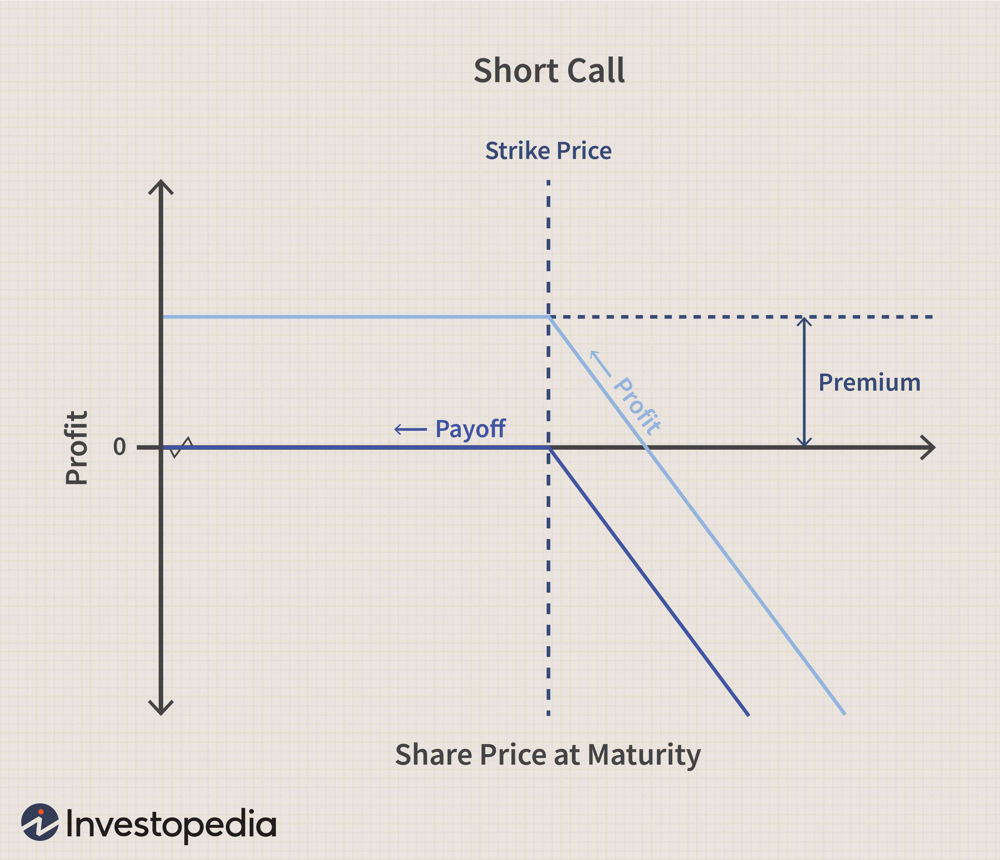

Net short investment strategy is a cornerstone concept in modern finance, allowing investors to potentially profit from declining asset prices. Short selling is a fundamental mechanism that enables this strategy. It involves borrowing securities to sell them on the market with the aim of repurchasing them later at a lower price. The borrower then returns the securities to the lender, keeping the difference as profit. This approach can significantly influence financial markets as it contributes to price discovery and market efficiency by allowing investors to express negative views on overvalued assets.

Algorithmic trading blends well with short selling, using complex mathematical models and high-speed computations to make trading decisions. Algorithms can analyze vast amounts of market data far more quickly than human traders, executing trades with precision and speed. This integration can enhance the execution of short selling strategies by identifying optimal entry and exit points, thus maximizing potential profits while minimizing risks.



However, short selling is not without its risks. The potential for unlimited losses exists if asset prices rise rather than fall, causing the price at which the securities must be repurchased to exceed that at which they were sold. This makes thorough risk assessment and management crucial components of any short selling strategy. Effective use of stop-loss orders and careful consideration of market conditions are vital to mitigating these risks.

The intersection of algorithmic trading and short selling offers myriad opportunities to enhance trading strategies. But it demands a nuanced understanding of both the mechanics involved and the complexities of the financial markets. As technological advancements continue to reshape trading landscapes, the capability to leverage such tools judiciously can offer significant competitive advantages in trading strategies.

## Table of Contents

## Understanding Net Short Positions

A net short position refers to a situation where an investor's total short positions in a security or market exceed the total long positions. In financial markets, this strategy is of paramount importance as it allows investors to profit from declining asset prices. Such a position can be calculated by taking the difference between an investor’s short positions and their long positions, denoted as:

$$
\text{Net Short Position} = \text{Total Short Positions} - \text{Total Long Positions}
$$

If this value is positive, it indicates a net short position.

Investors typically adopt net short positions when they anticipate a decline in the prices of the underlying assets. The primary mechanism of benefiting from these declines is straightforward — by borrowing and selling assets at current high prices, investors can repurchase them later at a lower price, thereby securing a profit.

An iconic example of the successful execution of a net short strategy is George Soros’s speculative attack on the British pound in 1992, often referred to as 'Black Wednesday.' In this instance, Soros's [hedge fund](/wiki/hedge-fund-trading-strategies), the Quantum Fund, built a substantial short position against the British pound. At that time, the pound was part of the European Exchange Rate Mechanism (ERM), which pegged it to the Deutsche Mark. However, Soros anticipated that economic pressures would force the Bank of England to devalue the currency. His predictions came true when the UK government withdrew the pound from the ERM, leading to a significant drop in its value. Soros's fund profited approximately $1 billion from this depreciated value, illustrating the potential for substantial gains through well-calculated net short positions.

In conclusion, net short positions serve as a strategic tool for investors aiming to hedge against or speculate on asset price declines. They embody a sophisticated understanding of market dynamics and require precise timing and analysis to execute effectively.

## Mechanics of Short Selling

Short selling is a trading strategy that involves selling borrowed shares with the expectation that their price will decline, allowing them to be bought back at a lower price for a profit. This process begins with borrowing shares from a brokerage firm. Investors who want to short an asset must locate shares to borrow, often facilitated by brokers who maintain inventories or have relationships with other institutions holding the desired shares. 

### Role of Brokers

Brokers play a crucial role in facilitating short sales. They manage the loan of shares through a process called securities lending. Importantly, brokers require a margin account as collateral for the borrowed shares. This involves the short seller depositing an initial margin, which acts as security for the loaned shares and is subject to maintenance requirements to cover any potential losses. If the price of the stock rises instead of falling, the short seller might receive a margin call to deposit additional funds.

### Costs of Short Selling

Short selling incurs several costs. The primary cost is the interest or fees paid for borrowing the shares, known as the borrow fee. This fee can vary significantly, depending on the availability of the stock and the current demand for shorting it. furthermore, short sellers must also pay dividends on the borrowed shares if the company issues them while the shares are out on loan. Additionally, some brokers charge a commission for executing short sale transactions.

Moreover, the costs associated with maintaining the margin account should be considered. If the price of the shorted stock rises, the short seller might face additional expenses to meet margin requirements, further increasing the financial risk.

### Regulatory Considerations: The Uptick Rule

Short selling is subject to regulatory oversight to prevent market manipulation and excessive downside pressure on stocks. One such regulation is the "Uptick Rule," also known as Rule 10a-1, which was established by the U.S. Securities and Exchange Commission (SEC). It stipulates that a short sale can only be executed at a higher price than the last traded price (an uptick) to curb downward spirals in stock prices during broad market sell-offs. Although the original rule was repealed in 2007, a modified form known as the Alternative Uptick Rule (Rule 201) was reintroduced in 2010 after the financial crisis. This rule restricts short selling during periods when a stock's price has declined significantly from the previous day’s closing price.

In summary, the mechanics of short selling involve sophisticated interactions with brokerage firms, entail specific costs, and are governed by regulatory considerations that aim to maintain fair and orderly markets. Understanding these elements is essential for effectively employing short selling strategies.

## Algorithmic Trading Systems: An Overview

Algorithmic trading refers to the use of computer programs to automate financial trading decisions, employing a set of rules based on quantitative and statistical models to execute trades. These systems are designed to minimize human intervention, enhance speed, and improve the precision of order execution. Algorithmic trading can be broken down into several core components, which typically include data analysis, trade execution, and risk management.

**Introduction to Algorithmic Trading and its Components**

Algorithmic trading systems operate using algorithms that can process vast amounts of data and execute trades at speeds unattainable by human traders. The primary components of an [algorithmic trading](/wiki/algorithmic-trading) system include:

1. **Data Analysis**: The backbone of any trading algorithm is data analysis. Traders can derive valuable insights from historical data, including price movements, trading volumes, and other financial indicators. Algorithms can apply statistical tests and machine learning models to identify patterns and forecast future price movements. For instance, algorithms might employ techniques such as regression analysis, time series forecasting, or clustering to derive trading strategies.

2. **Trade Execution**: Once a trading signal is generated, the algorithm proceeds to execute the trade automatically. This involves determining the optimal timing and size of the trade, selecting the appropriate trading venue, and submitting the order. Algorithms can also split large orders into smaller ones to minimize market impact, a technique known as "order slicing." High-frequency trading (HFT) is a subset of algorithmic trading characterized by extremely rapid trade executions and is known for exploiting minute price discrepancies across different markets.

3. **Risk Management**: Effective risk management is crucial in algorithmic trading to protect against unexpected market movements and operational failures. Algorithms assess the risk by evaluating market conditions, position sizes, and potential downdrafts. They may include predefined stop-loss limits, diversification strategies, and real-time risk adjustments based on market volatility.

**Advantages of Using Automated Systems in Trading**

Automated trading systems provide numerous advantages:

- **Speed and Efficiency**: Algorithms can analyze complex data and execute trades in fractions of a second, which is especially vital in fast-moving markets.

- **Minimized Emotional Bias**: By automating decision-making processes, algorithms eliminate human emotions, such as fear and greed, which can lead to suboptimal trading decisions.

- **Consistency and Accuracy**: Automated systems can ensure consistent adherence to trading strategies without being subject to human fatigue or error.

- **Scalability**: Algorithms can simultaneously monitor and process information across multiple markets or asset classes, offering scalability that humans cannot match.

- **Cost Reduction**: By executing trades more efficiently and potentially avoiding human errors, algorithmic trading can reduce transaction costs and improve overall profitability.

**Data Analysis, Trade Execution, and Risk Management in Algo Trading**

In algorithmic trading, data analysis is paramount for developing and fine-tuning trading models. Python is a popular language used due to its rich ecosystem of libraries such as NumPy, Pandas, and scikit-learn, which facilitate data manipulation and [machine learning](/wiki/machine-learning) processes. 

For trade execution, algorithms might utilize Application Programming Interfaces (APIs) provided by brokers. These APIs enable the real-time placement of trade orders and monitoring of market conditions. Here's a simple example of how Python might be used to execute a trade via an API:

```python
import requests

def execute_trade(symbol, quantity, order_type):
    endpoint = "https://api.broker.com/v1/orders"
    payload = {
        "symbol": symbol,
        "quantity": quantity,
        "type": order_type
    }
    response = requests.post(endpoint, json=payload)
    return response.json()
```

In risk management, real-time analytics and alert systems play a critical role. Algorithms continually assess potential risks and adjust positions accordingly to protect capital. Methods such as Value at Risk (VaR) are often used to estimate the potential loss in an investment portfolio over a defined period.

Overall, the strategic integration and implementation of these components enable algorithmic traders to efficiently and effectively navigate the complexities of financial markets.

## Integrating Short Selling into Algo Trading

Algorithmic trading has significantly transformed the landscape of financial markets, enabling more efficient execution of trades, including short selling. The strategic integration of short selling into algorithmic strategies is driven by the ability to capitalize on declining asset prices with precision and speed, facilitated by technology.

### Technical Indicators in Algorithmic Short Selling

Technical indicators are pivotal in enhancing the effectiveness of short selling within algorithmic trading systems. One such indicator is the Relative Strength Index (RSI), which measures the speed and change of price movements. Utilized within algorithms, the RSI helps identify potential overbought or oversold conditions, which could signal a short selling opportunity.

For example, a common strategy is to short a stock when the RSI crosses below a predefined threshold, such as 70, indicating that the asset may be overbought. The implementation within an algorithm allows for rapid detection and execution of short positions, optimizing timing and capitalizing on transient market conditions.

```python
import pandas as pd
import talib

# Sample code to detect short selling signals using RSI
def detect_short_signals(prices):
    rsi = talib.RSI(prices, timeperiod=14)
    short_signals = rsi < 30
    return short_signals

# Assume 'prices' is a pandas Series of stock closing prices
prices = pd.Series([...] )  # Fill with real closing prices
signals = detect_short_signals(prices)
```

### Advanced Strategies: Statistical Arbitrage

Statistical [arbitrage](/wiki/arbitrage) involves the simultaneous buying and selling of securities to exploit price inefficiencies. This strategy, which may incorporate short selling, relies heavily on mathematical models and statistical techniques. It often leverages historical price data to forecast future price movements and identify temporary mispricings between related assets.

For instance, consider a simple pairs trading strategy where two historically correlated assets deviate from their expected pricing relationship. An algorithm might initiate a short position on the overperforming asset while taking a long position on the underperforming counterpart, assuming that prices will revert to their mean relationship.

The effectiveness of [statistical arbitrage](/wiki/statistical-arbitrage) in short selling lies in the ability to process vast amounts of data and execute trades with minimal delay, accommodating rapid fluctuations and enhancing the probability of success.

### Conclusion

Integrating short selling into algorithmic trading provides a sophisticated toolset for leveraging declines in asset prices. By employing technical indicators like RSI and sophisticated strategies such as statistical arbitrage, traders can enhance their decision-making processes. However, these strategies demand rigorous data analysis and model validation to effectively mitigate risks and capitalize on market inefficiencies.

## Key Strategies for Short Selling in Algo Trading

Momentum and trend-following strategies play a pivotal role in short selling within algorithmic trading systems. Momentum strategies capitalize on the continuation of existing market trends. In the context of short selling, these strategies identify assets exhibiting downward [momentum](/wiki/momentum). They then initiate short positions with the expectation that the asset's price will continue to decline.

Mathematically, momentum can be measured using indicators like the Rate of Change (RoC) or the Relative Strength Index (RSI). The RSI, for example, is calculated as follows:

$$
RSI = 100 - \frac{100}{1 + RS}
$$

where $RS$ (Relative Strength) is the average gain of up periods during a specified time frame divided by the average loss of down periods.

Trend-following strategies, on the other hand, rely on identifying the general price movement direction of an asset over time. Algorithmic systems often use moving averages to determine trends. A common method involves shorting an asset when its short-term moving average crosses below its long-term moving average, indicating a bearish trend.

Pair trading and statistical arbitrage exploit market inefficiencies. Pair trading involves identifying two correlated assets, predicting deviations, and executing long and short positions to profit from eventual reversion to the mean. For example, if two stocks historically move together but temporarily deviate, a trader could short the overperforming stock and long the underperforming one.

Statistical arbitrage extends [pair trading](/wiki/pair-trading) by increasing the basket of assets analyzed, utilizing advanced statistical models to identify pricing discrepancies. This approach leverages econometric models like cointegration tests to detect and exploit temporary dislocations between related financial instruments.

Risk management is crucial for the success of short selling strategies. Key techniques include setting stop-loss orders to limit potential losses and employing position sizing to mitigate risk. This involves calculating the optimal size of a trade relative to the total portfolio size, often determined using the Kelly Criterion or similar risk management formulae.

Additionally, monitoring leverage and ensuring diversification across trades can prevent significant capital erosion due to adverse market movements. Algorithms may implement these risk management practices through automation, using thresholds and parameters that can be adjusted in response to changing market conditions.

Effective management of short selling in algorithmic trading requires a robust strategy comprising informed entry and [exit](/wiki/exit-strategy) signals, market inefficiency exploitation, and comprehensive risk mitigation techniques.

## Challenges and Risks in Short Selling via Algorithms

Short selling through algorithmic trading presents unique challenges and risks that must be carefully managed to ensure effective outcomes. 

**Market Risks**

Short selling inherently carries the risk of unlimited losses since the price of an asset can theoretically increase indefinitely. When automated through algorithms, these risks can be amplified by unforeseen market events. Large price swings or flash crashes can trigger automated short positions at inopportune times, leading to significant financial losses. Furthermore, short squeezes, where rapidly increasing stock prices force short sellers to cover their positions, can result in quick and substantial losses. Algorithms need to be designed to detect and react to such scenarios promptly to protect capital. 

**Technological Errors**

Technology is at the heart of algorithmic trading, and any errors in software development or system operations can lead to disastrous consequences. Issues may arise from coding errors, erroneous data inputs, network failures, or hardware malfunctions. Therefore, comprehensive testing and robust systems architecture are crucial. Implementing redundant systems and real-time monitoring can help in mitigating these risks. Trading algorithms should also include failsafe mechanisms to pause operations when anomalies are detected. 

**Operational Concerns**

Operational risks involve the possibility of human error, especially during the development and deployment phases of algorithmic systems. Inadequately trained staff or poor communication during updates and maintenance can result in unintended trading activities. High-frequency trading systems, which often execute thousands of trades in a short period, require meticulous oversight. Regular audits and comprehensive documentation are part of effective operational risk management.

**Regulatory Compliance Challenges**

Algorithmic short selling faces a complex regulatory landscape that varies significantly across jurisdictions. In the United States, regulatory bodies such as the Securities and Exchange Commission (SEC) impose strict rules concerning trade reporting and the use of certain trading strategies, such as the uptick rule. The European Securities and Markets Authority (ESMA) and other international regulators enforce their own sets of rules that might include restrictions on naked short selling or specific reporting requirements. Algorithms must be designed to comply with these regulations, adapting dynamically to changes in the legal environment. 

To navigate these compliance challenges, financial firms often invest in legal expertise and compliance frameworks to ensure all automated trading activities are within the legal boundaries. Advanced monitoring tools can help in maintaining adherence to the requisite regulatory norms by examining trading patterns and generating compliance reports.

**The Need for Robust Checks**

Algorithmic trading systems require fail-safes and validation processes to preempt potential failures. By integrating real-time risk assessment algorithms, traders can establish protective measures against excessive losses. Also, adopting a continuous improvement approach through machine learning can enhance algorithms over time, enabling them to learn from past mistakes and optimize their performance. Regular back-testing against historical data further ensures the reliability of algorithmic strategies under a variety of market conditions.

In summary, although short selling via algorithms offers potential efficiencies and opportunities, it is fraught with market, technological, and regulatory challenges. A proactive approach emphasizing checks and balances, technological redundancies, and regulatory compliance is essential for mitigating these risks.

## Future Trends and Developments

Advancements in machine learning are significantly enhancing short selling strategies by offering more sophisticated data analysis, prediction, and decision-making capabilities. Machine learning (ML) algorithms can process vast amounts of financial data at unparalleled speeds, identifying trends and patterns that human traders might overlook. This allows traders to develop predictive models that can anticipate market downturns, making short selling more effective.

A common approach in ML-driven short selling is sentiment analysis, where algorithms analyze news articles, social media posts, and financial reports to gauge market sentiment. This data helps refine short selling strategies by predicting price movements before they become apparent through traditional metrics. Additionally, [reinforcement learning](/wiki/reinforcement-learning), a subset of machine learning, is increasingly used in developing algorithms that learn optimal short selling strategies by interacting with simulated market environments.

Regulatory changes remain a pivotal [factor](/wiki/factor-investing) affecting the future of algorithmic trading and, consequently, short selling strategies. Institutions across the globe are imposing stricter regulations to mitigate the risks associated with high-frequency trading, including short selling. These regulations could mandate more transparency in algorithmic strategies, requiring traders to disclose more detailed information about their trading algorithms to regulatory bodies.

Potential regulatory changes could also involve the expansion of the uptick rule, designed to prevent short selling from exacerbating market declines. Such changes may necessitate algorithmic adjustments to ensure compliance while still capitalizing on short selling opportunities.

Artificial intelligence (AI) significantly influences the adaptability of short selling strategies. AI systems, with their capability to learn and adapt, can optimize short selling strategies by continuously analyzing large datasets. They can autonomously adjust trading algorithms in response to new information, ensuring strategies remain effective in fluctuating market conditions.

Moreover, AI-driven algorithms can implement complex strategies, such as statistical arbitrage, which require the simultaneous analysis and trading of multiple assets to exploit price discrepancies. The AI can execute these trades with precision and speed, which is crucial for maintaining a competitive edge in short selling.

The interplay of machine learning advancements and potential regulatory changes underscores the dynamic nature of short selling strategies. As technology continues to evolve, traders must remain vigilant to leverage these tools effectively while navigating the changing regulatory landscape.

## Conclusion

Integrating short selling with algorithmic trading presents several advantages, primarily in enhancing precision and efficiency in executing trades that profit from declining asset prices. Algorithmic trading systems allow traders to automate the complex processes involved in short selling, including the timing of trades and execution precision. This integration assists in processing vast amounts of data quickly, leading to more informed decision-making and the ability to exploit short-term market inefficiencies effectively.

Understanding the mechanics and risks of short selling and algorithmic trading is crucial for harnessing these advantages. Short selling involves nuances such as borrowing costs, regulatory frameworks, and the potential for unlimited losses if the asset price rises indefinitely. When executed algorithmically, these trades require robust risk management protocols to mitigate technological risks, such as software glitches and timing errors. Algorithms must be well-calibrated to respond to market signals accurately, utilizing technical indicators and market data without succumbing to unforeseen [volatility](/wiki/volatility-trading-strategies) or [liquidity](/wiki/liquidity-risk-premium) issues.

Ongoing learning is vital to optimizing short selling strategies using technology. As markets evolve, continual adaptation and refinement of trading algos are necessary. Leveraging advancements in areas such as machine learning can significantly enhance the adaptability and sophistication of these algorithms. Machine learning models can analyze patterns in vast datasets, identifying subtle signals that traditional models may overlook, thus refining the decision-making process in short selling trades.

In summary, while integrating short selling into algo trading offers substantial benefits through automation and data-driven strategies, it demands a comprehensive understanding of both the mechanics involved and the inherent risks. Traders are encouraged to keep abreast of technological advancements and regulatory changes to maintain a competitive edge in enhancing their trading efficacy and risk management methodologies.

## References & Further Reading

### References & Further Reading

1. **Books and Academic Papers on Algorithmic Trading and Short Selling:**
   - *Algorithmic Trading: Winning Strategies and Their Rationale* by Ernie Chan [Chan, E. (2013). Algorithmic Trading: Winning Strategies and Their Rationale. Wiley Trading Series.]
   - *Quantitative Trading: How to Build Your Own Algorithmic Trading Business* by Ernie Chan [Chan, E. (2008). Quantitative Trading: How to Build Your Own Algorithmic Trading Business. Wiley.]
   - "The Limits of Arbitrage" by Andrei Shleifer and Robert Vishny is a crucial paper that discusses market inefficiencies which can be exploited through strategies like statistical arbitrage. [Shleifer, A., & Vishny, R. W. (1997). The Limits of Arbitrage. The Journal of Finance, 52(1), 35-55.]
   - "Short Selling: Concepts and Strategies" explores various aspects of short selling and is an excellent academic resource for traders. [Reed, A. (2013). Short Selling: Concepts and Strategies. CFA Institute Research Foundation.]

2. **Resources for Learning About Regulations Affecting Trading Strategies:**
   - The U.S. Securities and Exchange Commission (SEC) website provides comprehensive rules and regulations on short selling. [SEC.gov, "Short Sales," available at: https://www.sec.gov/investor/pubs/regsho.htm]
   - The Financial Industry Regulatory Authority (FINRA) offers resources and guidelines on algorithmic trading and its regulations. [FINRA.org, "Algorithmic Trading," available at: https://www.finra.org/rules-guidance/key-topics/algorithmic-trading]
   - *Regulation of Securities, Markets, and Transactions: A Guide to the New Environment* by Patrick S. Collins offers detailed insights into regulatory frameworks. [Collins, P. S. (2011). Regulation of Securities, Markets, and Transactions: A Guide to the New Environment. Wiley Finance.]

3. **Tools and Platforms for Implementing Short Selling Strategies:**
   - **QuantConnect**: An open-source algorithmic trading platform that provides a vast library of data and trading algorithms. It supports multiple asset classes including stocks, futures, options, and forex.
     ```python
     import quantconnect
     # Example code to initialize a trading algorithm
     self.SetCash(100000)  # Set starting capital
     self.AddEquity("AAPL", Resolution.Daily)  # Add Apple stock with daily resolution
     ```
   - **Interactive Brokers**: Offers a robust API that can be utilized for executing short-selling strategies programmatically.
   - **MetaTrader 5**: A multi-asset platform suitable for algo trading, offering hedging and netting systems, technical analysis tools, and graphical applications.
   - **TradeStation**: Provides a comprehensive suite for developing and executing algorithmic trading strategies with a focus on technical analysis and backtesting capabilities.

These resources provide foundational knowledge and practical tools necessary to effectively engage in algorithmic trading and implement short-selling strategies while navigating regulatory environments.