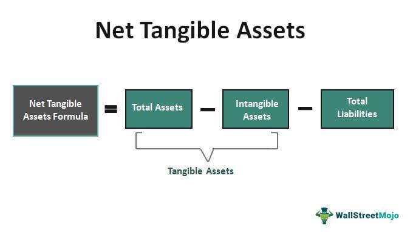

## Table of Contents

## What are Net Tangible Assets?

Net Tangible Assets are the total value of a company's physical assets minus its liabilities and intangible assets. Physical assets include things like buildings, machinery, and inventory that you can touch and see. Liabilities are the company's debts and obligations. Intangible assets are things like patents, trademarks, and goodwill, which are valuable but not physical.

This number is important because it gives a clear picture of what the company would be worth if it had to be sold off quickly. It helps investors understand the real, tangible value of a company, separate from its brand or intellectual property. By focusing on tangible assets, investors can better assess the financial health and stability of a business.

## How do you calculate Net Tangible Assets?

To calculate Net Tangible Assets, you start with the total assets of the company. These are all the things the company owns, like buildings, machines, and inventory. Next, you subtract the intangible assets. These are things you can't touch, like patents, trademarks, and goodwill. After that, you subtract all the liabilities. Liabilities are what the company owes, like loans and bills. What you're left with is the Net Tangible Assets.

This calculation helps show what the company would be worth if you had to sell everything quickly. It's a way to see the real, solid value of the company, without counting things like brand names or customer loyalty. Investors use this number to understand how financially stable a company is and what it might be worth in a tough situation.

## Why are Net Tangible Assets important for investors?

Net Tangible Assets are important for investors because they show the real value of a company. They help investors see what a company would be worth if it had to sell everything quickly. This is useful because it shows the solid, touchable parts of a company, like buildings and machines, without counting things like brand names or patents. By looking at Net Tangible Assets, investors can understand how much money they might get back if the company had to close down and sell everything.

This information is also helpful for investors who want to know if a company is financially stable. If a company has a lot of Net Tangible Assets, it means they have a good base of real things that can be sold if needed. This can make investors feel more secure about putting their money into the company. It's like having a safety net; if things go wrong, the company has something solid to fall back on.

## What is the difference between tangible and intangible assets?

Tangible assets are things you can touch and see. They include stuff like buildings, machines, and the products a company has in stock. These are important because they help a company do its work and make money. For example, a factory needs machines to make things, and a store needs products to sell. If a company had to sell everything quickly, these tangible assets would be what they could sell.

Intangible assets are different because you can't touch them. They include things like patents, which protect new ideas; trademarks, which protect brand names and logos; and goodwill, which is the value of a company's reputation. Even though you can't see them, these assets are valuable because they help a company stand out and make money. For example, a famous brand name can help sell more products, even if the products themselves are the same as others.

Both types of assets are important for a company. Tangible assets give a company the tools it needs to operate, while intangible assets help build and maintain the company's value in the market. Understanding the difference between them helps investors see the full picture of what a company is worth.

## Can you give examples of tangible assets?

Tangible assets are things you can touch and see. They are important for companies because they help them do their work and make money. Some examples of tangible assets are buildings, like a factory or an office; machines, like the ones used to make cars or food; and inventory, which is the stuff a company has ready to sell, like clothes in a store or parts in a warehouse. These things are easy to see and count, and if a company needs money fast, they can sell these assets.

Another example of tangible assets is land. A company might own a big piece of land where they build their stores or factories. Vehicles are also tangible assets; these can be trucks a company uses to deliver products or cars used by employees. Even furniture and computers in an office are tangible assets because you can see and touch them. All these examples show how tangible assets are the physical things that help a company operate every day.

## How do Net Tangible Assets affect a company's valuation?

Net Tangible Assets are important when figuring out how much a company is worth. They show the value of the things a company owns that you can touch, like buildings and machines, after taking away what the company owes and the value of things you can't touch, like patents and brand names. When investors look at a company, they want to know what would be left if the company had to sell everything quickly. This helps them understand the real, solid value of the company, not just the value of its ideas or reputation.

If a company has a lot of Net Tangible Assets, it can make investors feel more confident. They see that the company has a strong base of physical things that can be sold if needed. This can make the company seem more stable and less risky. On the other hand, if a company has low Net Tangible Assets, it might worry investors because it means the company doesn't have much to fall back on if things go wrong. So, Net Tangible Assets play a big role in how investors see and value a company.

## What role do Net Tangible Assets play in financial analysis?

Net Tangible Assets are important in financial analysis because they show what a company is really worth, not counting things like brand names or patents. Analysts look at this number to see how much money a company would have if it had to sell all its physical things quickly. This helps them understand if the company is strong and stable. If a company has a lot of Net Tangible Assets, it means they have a good base of real things that can be sold if needed. This makes the company seem safer to invest in.

In financial analysis, Net Tangible Assets help compare different companies. Analysts can see which companies have more solid things to fall back on. This is useful when deciding where to put money. If one company has more Net Tangible Assets than another, it might be a better choice because it's less risky. So, Net Tangible Assets are a key part of understanding a company's financial health and making smart investment decisions.

## How can a company improve its Net Tangible Assets?

A company can improve its Net Tangible Assets by buying more physical things, like buildings or machines. These things are easy to see and count, and they add to the company's value. If the company buys a new factory, for example, that factory becomes part of the Net Tangible Assets. Another way is to sell off things that the company doesn't need anymore. If they have old machines that aren't being used, selling those can bring in money and lower the amount of liabilities, which helps increase Net Tangible Assets.

The company can also work on paying down its debts. When a company owes less money, its liabilities go down, and this makes the Net Tangible Assets go up. For example, if the company pays off a big loan, that money isn't owed anymore, so the Net Tangible Assets increase. Another way is to turn some intangible things into tangible ones. If the company uses its brand name to get a good deal on buying a new building, that building becomes a tangible asset. By focusing on these strategies, a company can make its Net Tangible Assets stronger and show investors that it's a solid and stable business.

## What are the limitations of using Net Tangible Assets as a financial metric?

Net Tangible Assets can be a useful number, but they don't tell the whole story about a company. One big problem is that they don't count things like brand names or patents, which can be very valuable. For example, a company like Coca-Cola has a famous brand that helps it sell a lot of drinks, but that brand isn't part of the Net Tangible Assets. So, if you only look at Net Tangible Assets, you might think the company is worth less than it really is.

Another issue is that Net Tangible Assets can be hard to figure out correctly. The value of buildings and machines can change over time, and it's not always easy to know what they're really worth. Also, if a company has a lot of debt, the Net Tangible Assets might look low even if the company is doing well in other ways. So, while Net Tangible Assets can give you some idea about a company's value, they shouldn't be the only thing you look at when deciding if a company is a good investment.

## How do Net Tangible Assets relate to a company's book value?

Net Tangible Assets and book value are related but not the same thing. Book value is the total value of everything a company owns, minus everything it owes. It's like looking at the company's balance sheet and seeing what's left after paying off all the debts. Net Tangible Assets are a part of the book value, but they only count the things you can touch, like buildings and machines, and they don't include things like brand names or patents.

When you look at a company's financial health, both numbers can be helpful. Book value gives you a broad picture of the company's worth, including both tangible and intangible things. Net Tangible Assets, on the other hand, focus just on the solid, physical stuff. Investors might use Net Tangible Assets to see what a company would be worth if it had to sell everything quickly, while book value helps them understand the overall financial position of the company, including its less tangible assets.

## In what scenarios might Net Tangible Assets be more relevant than other financial metrics?

Net Tangible Assets are really useful when a company might need to sell everything fast, like if it's in trouble or going bankrupt. Investors want to know what the company would be worth if it had to get rid of all its stuff quickly. By looking at Net Tangible Assets, they can see the value of the buildings, machines, and other things the company owns that you can touch. This helps them understand how much money they might get back if the company has to close down.

Another time when Net Tangible Assets are important is when investors are trying to figure out if a company is stable and safe to invest in. If a company has a lot of Net Tangible Assets, it means they have a strong base of real things that can be sold if needed. This can make investors feel more secure because they know the company has something solid to fall back on if things go wrong. So, in these situations, Net Tangible Assets give a clear picture of the company's real, touchable value.

## How do accounting standards impact the reporting of Net Tangible Assets?

Accounting standards can have a big effect on how a company reports its Net Tangible Assets. These standards are rules that companies have to follow when they write down their financial information. For example, some standards might say how to figure out the value of buildings and machines. If one standard says to use the price you paid for something, and another says to use what it's worth now, the numbers for Net Tangible Assets can be different. This means that the same company might look more or less valuable depending on which rules it follows.

Different countries might use different accounting standards, which can make it hard to compare companies from different places. For example, the U.S. uses a standard called GAAP, while many other countries use IFRS. These standards might have different ways to count things like depreciation, which is how much a building or machine loses value over time. Because of these differences, the Net Tangible Assets reported by a company in one country might not be the same as a similar company in another country, even if they have the same stuff. So, it's important to know which standards a company is using when you look at their Net Tangible Assets.

## What are net tangible assets?

Net Tangible Assets (NTA) serve as a key metric in evaluating a company's worth based purely on its physical, verifiable resources. Calculated by subtracting intangible assets and total liabilities from a company's total assets, NTA provides a metric for assessing a company's tangible, book-valued strength. The formula is expressed as:

$$
\text{Net Tangible Assets (NTA)} = \text{Total Assets} - \text{Intangible Assets} - \text{Total Liabilities}
$$

**Components of Net Tangible Assets:**

1. **Total Assets**: This encompasses everything the company owns, both current and non-current. Current assets include items like cash, accounts receivable, and inventory, easily convertible to cash within a year. Non-current assets, such as property, plant, and equipment (PPE), are long-term investments not easily liquidated.

2. **Intangible Assets**: These are non-physical assets, including intellectual property like patents, trademarks, and goodwill. Although vital to a company's overall value, they are excluded from NTA as they lack the verifiable substance of physical assets.

3. **Liabilities**: Debts or obligations the company needs to settle, including both current liabilities like accounts payable and long-term liabilities such as bonds payable.

**Significance in Financial Statements:**

NTA's inclusion in balance sheets aids stakeholders in understanding a firm's tangible net worth, distinct from more volatile market valuations. By emphasizing tangible value, NTA offers a measure immune to market sentiment overshooting intangible values often subject to irrational exuberance or pessimism. Evaluating NTA helps in determining bankruptcy risk, providing a cushion against liabilities, and serving as collateral.

**Relevance in Different Sectors:**

The applicability and insight offered by NTA vary across industries. For asset-heavy sectors like manufacturing or real estate, NTA serves as a robust indicator of financial health, reflecting substantial physical assets. In contrast, technology or service sectors, where intangible assets dominate, may see limited relevance, given their lesser emphasis on physical assets.

Through its focus on physical, tangible assets, NTA provides a solid foundation for assessing a firm's intrinsic value, crucial for industries relying heavily on physical capital to generate revenue and protect against liabilities.

## How do you calculate net tangible assets?

Calculating Net Tangible Assets (NTA) involves a simple formula, yet it provides crucial insights into a company's financial health. The formula for NTA is:

$$
\text{Net Tangible Assets} = \text{Total Assets} - \text{Intangible Assets} - \text{Total Liabilities}
$$

This section provides a guide for calculating NTA using a hypothetical company's data, and illustrates how such calculations can assist investors in evaluating a company's tangible asset base against its liabilities.

### Step-by-Step Calculation Guide:

**1. Identify Total Assets:**
   - Total assets include everything of value that a company owns. Items typically found in total assets include cash, inventory, accounts receivable, equipment, and real estate.
   - For this example, suppose a company reports total assets of \$500 million.

**2. Determine Intangible Assets:**
   - Intangible assets are non-physical assets such as intellectual property, trademarks, brand value, and goodwill.
   - Assume the company has intangible assets worth \$100 million.

**3. Calculate Total Liabilities:**
   - Total liabilities encompass all financial obligations, such as loans, accounts payable, and accrued expenses.
   - In our example, the company's total liabilities amount to \$250 million.

**4. Apply the NTA Formula:**

Using the formula:

$$
\text{NTA} = \$500\, \text{million} - \$100\, \text{million} - \$250\, \text{million}
$$

$$
\text{NTA} = \$150\, \text{million}
$$

The calculated Net Tangible Assets for this hypothetical company amount to \$150 million. 

### Interpretation:

The NTA value of \$150 million indicates the net worth of the company’s physical assets, which are free from liabilities and intangible values. This figure helps investors assess whether a company's tangible asset base is substantial and provides insights into the company's liquidation value. 

### Python Code Sample:

Here's a basic Python snippet to calculate NTA:

```python
def calculate_nta(total_assets, intangible_assets, total_liabilities):
    nta = total_assets - intangible_assets - total_liabilities
    return nta

# Hypothetical data
total_assets = 500e6  # $500 million
intangible_assets = 100e6  # $100 million
total_liabilities = 250e6  # $250 million

# Calculate NTA
nta = calculate_nta(total_assets, intangible_assets, total_liabilities)
print(f"Net Tangible Assets: ${nta} million")
```

This code allows for rapid calculation of NTA given different financial inputs, assisting investors and analysts in evaluating a company’s tangible asset strength relative to its liabilities. Understanding these calculations is instrumental in identifying firms with a strong physical asset base, which is often considered a sign of financial stability.

## What are the advantages and disadvantages of net tangible assets?

Net Tangible Assets (NTA) serve as a crucial benchmark in evaluating the financial health of a company by focusing on tangible, physical assets. These assets offer a more stable measure of value because they are less susceptible to market sentiment fluctuations compared to intangible assets like goodwill or brand reputation.

### Advantages of Net Tangible Assets

1. **Reliable Assessment of Physical Assets**: NTA provides a more dependable valuation metric by emphasizing physical assets. This reduces the likelihood of overvaluation that can result from inflated intangible assets, which are often subjective and volatile. Investors can use NTA to find companies with substantial backing in real, tangible resources, making it a critical factor in sectors like manufacturing and real estate, where physical assets drive business value.

2. **Mitigates Volatility Risks**: Given that intangible assets such as patents or trademarks can depreciate rapidly due to technological advancements or market competition, NTA offers a stable financial measure. By focusing on tangible assets, investors gain insights that are less impacted by market volatility or speculative bubbles associated with intangibles.

3. **Simplicity and Clarity**: NTA is a straightforward calculation, which makes it easier for investors and analysts to employ without requiring complex financial modeling. The formula is:  
$$
   \text{NTA} = \text{Total Assets} - \text{Intangible Assets} - \text{Total Liabilities}

$$
   This simplicity enhances its application across different financial analyses, from initial assessments to detailed evaluations.

### Disadvantages of Net Tangible Assets

1. **Variable Relevance Across Industries**: NTA's applicability can be limited depending on the industry. For instance, technology and pharmaceutical companies often rely on intangible assets as their primary value drivers. In these sectors, NTA might downplay critical components of a company's worth, leading to undervaluation. Investors should be cautious when applying NTA to these fields, considering additional metrics that account for intangibles.

2. **Potential Oversight of Intangible Assets**: Although NTA emphasizes tangible value, it might overlook intangible assets' contribution to a company's long-term profitability and competitive edge. Companies with robust intellectual property portfolios or strong brand equity could appear undervalued if assessed solely by their NTA. Therefore, integrating NTA with other analyses can provide a more comprehensive evaluation.

3. **Ignoring Future Growth Prospects**: Focusing solely on NTA can lead to overlooking potential future growth tied to a company's intangible assets. Firms investing heavily in research and development or expanding their market presence may have significant growth potential that NTA does not capture. Consequently, investors should balance NTA assessments with growth potential indicators.

In conclusion, while Net Tangible Assets offer valuable insights into a company's physical resource base, investors must recognize its limitations and apply it in tandem with other metrics for a holistic financial analysis.

## References & Further Reading

[1]: Palepu, K. G., Healy, P. M., & Peek, E. (2019). ["Business Analysis and Valuation: IFRS edition."](https://books.google.com/books/about/Business_Analysis_and_Valuation_Using_Fi.html?id=IDT6DwAAQBAJ) Cambridge University Press.

[2]: Damodaran, A. (2012). ["Investment Valuation: Tools and Techniques for Determining the Value of Any Asset, University Edition."](https://books.google.com/books/about/Investment_Valuation.html?id=5SRHAAAAQBAJ) Wiley.

[3]: Penman, S. H. (2012). ["Financial Statement Analysis and Security Valuation."](https://archive.org/details/financialstateme0000penm_r9u4) McGraw-Hill.

[4]: Greenblatt, J. (2010). ["The Little Book That Still Beats the Market."](https://archive.org/details/littlebookthatst0000gree) Wiley.

[5]: Bodie, Z., Kane, A., & Marcus, A. J. (2014). ["Investments."](https://www.mheducation.com/highered/product/Investments-Bodie.html) McGraw-Hill Education.

[6]: Fabozzi, F. J., & Peterson Drake, P. (2009). ["Finance: Capital Markets, Financial Management, and Investment Management."](https://books.google.com/books/about/Finance.html?id=mUBsAwAAQBAJ) Wiley.

[7]: Graham, B., & Dodd, D. (2009). ["Security Analysis: Sixth Edition, Foreword by Warren Buffett."](https://www.amazon.com/Security-Analysis-Foreword-Buffett-Editions/dp/0071592539) McGraw-Hill Education.