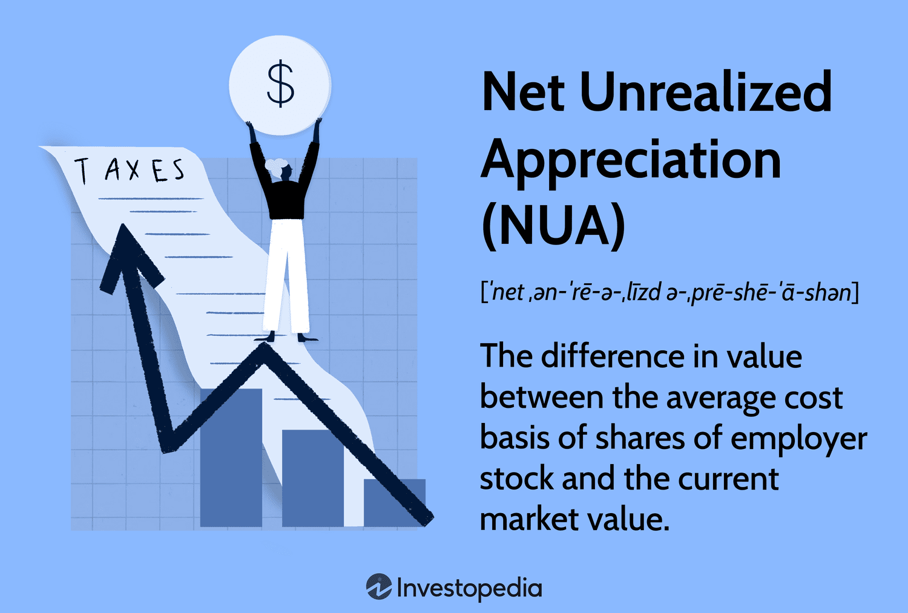

## Table of Contents

## What is Net Unrealized Appreciation (NUA)?

Net Unrealized Appreciation (NUA) is a tax strategy that can help people save money when they leave their job and take money out of their company's retirement plan. It applies to people who have company stock in their 401(k) or other employer-sponsored retirement plans. When you use NUA, you pay regular income tax on the cost basis of the stock, which is the original price you or your employer paid for it. But, you pay a lower capital gains tax rate on the increase in the stock's value, which is the NUA.

To use NUA, you must follow certain rules. First, you need to take a lump-sum distribution of your entire retirement account, which means you take all the money out at once. Second, you need to do this after a triggering event like quitting your job, retiring, or reaching age 59½. Third, you must move the company stock to a regular investment account, not an IRA. If you follow these steps correctly, you can save on taxes because you'll pay the lower capital gains rate on the NUA instead of the higher regular income tax rate.

## How does NUA relate to employee stock options?

Net Unrealized Appreciation (NUA) can be important for people who have employee stock options in their company's retirement plan. When you have stock options, you might be able to buy your company's stock at a lower price than what it's worth on the market. If you do this and put the stock in your retirement plan, the difference between what you paid and what the stock is worth is called the NUA. This can be a big deal because when you leave your job and take the stock out of the plan, you can pay less in taxes on that growth in value.

To use NUA with employee stock options, you need to follow some rules. You have to take all the money out of your retirement plan at once, which is called a lump-sum distribution. You also need to do this after you leave your job, retire, or turn 59½. When you take the stock out, you'll pay regular income tax on what you originally paid for it, but you'll pay a lower capital gains tax on the NUA. This can save you a lot of money if the stock has gone up a lot in value.

## What are the basic tax implications of NUA?

When you use Net Unrealized Appreciation (NUA), you pay taxes in a special way. The original price you paid for the stock, called the cost basis, is taxed as regular income when you take it out of your retirement plan. This means you'll pay the same tax rate as you do on your normal income. But, the increase in the stock's value, which is the NUA, is taxed at a lower rate called the long-term capital gains rate. This rate is usually less than the regular income tax rate, so you can save money on taxes.

To use NUA, you need to take all your money out of your retirement plan at once, which is called a lump-sum distribution. You also need to do this after you leave your job, retire, or turn 59½. When you take the stock out, you'll pay regular income tax on the cost basis, but the NUA will be taxed at the lower long-term capital gains rate when you sell the stock. This can be a big tax advantage if the stock has gone up a lot in value.

## When can an individual take advantage of NUA?

An individual can take advantage of Net Unrealized Appreciation (NUA) when they leave their job, retire, or turn 59½. To use NUA, they need to take all their money out of their retirement plan at once. This is called a lump-sum distribution. They also need to move the company stock to a regular investment account, not an IRA. If they follow these rules, they can save on taxes.

When using NUA, the original price paid for the stock, called the cost basis, is taxed as regular income. This means you pay the same tax rate as your normal income. But the increase in the stock's value, which is the NUA, is taxed at a lower rate called the long-term capital gains rate. This rate is usually less than the regular income tax rate. So, if the stock has gone up a lot in value, using NUA can save you a lot of money on taxes.

## What are the steps to qualify for NUA tax treatment?

To qualify for NUA tax treatment, you need to take all your money out of your retirement plan at once. This is called a lump-sum distribution. You can only do this after you leave your job, retire, or turn 59½. You also need to move the company stock to a regular investment account, not an IRA. If you follow these steps, you can use NUA to save on taxes.

When you use NUA, you pay regular income tax on the original price you paid for the stock, which is called the cost basis. But the increase in the stock's value, which is the NUA, is taxed at a lower rate called the long-term capital gains rate. This rate is usually less than the regular income tax rate. So, if the stock has gone up a lot in value, using NUA can save you a lot of money on taxes.

## How does the cost basis affect NUA?

The cost basis is really important when you use NUA. It's the price you or your employer paid for the stock when you first got it. When you take the stock out of your retirement plan, you pay regular income tax on this cost basis. This means you pay the same tax rate as you do on your normal income.

The NUA is the difference between the cost basis and what the stock is worth when you take it out of the plan. This part is taxed at a lower rate called the long-term capital gains rate. So, if the stock has gone up a lot in value since you got it, using NUA can save you a lot of money on taxes because you'll pay less on the increase in value.

## What are the potential tax savings with NUA?

Using NUA can help you save a lot on taxes. When you take the stock out of your retirement plan, you pay regular income tax on the cost basis, which is what you or your employer paid for the stock. But the increase in the stock's value, called the NUA, is taxed at a lower rate called the long-term capital gains rate. This rate is usually less than the regular income tax rate, so you can save money if the stock has gone up a lot in value.

To use NUA, you need to take all your money out of your retirement plan at once, which is called a lump-sum distribution. You also need to do this after you leave your job, retire, or turn 59½. If you follow these rules, you can move the company stock to a regular investment account and take advantage of the lower tax rate on the NUA. This can be a big tax advantage, especially if the stock has grown a lot since you got it.

## What are the risks and considerations of using NUA?

Using NUA can help you save on taxes, but it also comes with some risks and things to think about. One big risk is that you have to take all your money out of your retirement plan at once. This means you can't leave any money in the plan, which might not be what you want if you need to spread out your withdrawals for other reasons. Also, if you don't follow the rules exactly, you might lose the tax benefits of NUA. This can be tricky because you need to make sure you do everything right, like moving the stock to a regular investment account and not an IRA.

Another thing to consider is that using NUA means you'll pay taxes on the cost basis right away. This can be a lot of money upfront, especially if the cost basis is high. You also need to think about what will happen to the stock's value after you take it out of the plan. If the stock goes down in value, you might end up paying taxes on money you don't actually get. So, it's important to look at the stock's potential and your overall financial situation before deciding to use NUA.

## How does NUA impact estate planning?

Using NUA can affect your estate planning. When you use NUA, you take the company stock out of your retirement plan and move it to a regular investment account. If you pass away and the stock is still in that account, your heirs might get a special tax benefit called a step-up in basis. This means the cost basis of the stock gets updated to its value at the time of your death. So, if your heirs sell the stock right away, they might not have to pay much in taxes on the NUA because the increase in value happened before you died.

But, there are some things to think about. If you leave the stock in your retirement plan instead of using NUA, your heirs will have to take the money out of the plan within a certain time after you die. They'll pay regular income tax on the whole amount, including the NUA. So, using NUA can be a good way to save on taxes for your heirs, but it depends on your situation. You should talk to a financial advisor to see if NUA is the right choice for your estate plan.

## What are the differences between NUA and other tax strategies for stock options?

NUA is different from other tax strategies for stock options because it focuses on company stock held in a retirement plan. When you use NUA, you take all the money out of your retirement plan at once and move the company stock to a regular investment account. You pay regular income tax on the original price you paid for the stock, but the increase in the stock's value is taxed at a lower rate called the long-term capital gains rate. This can save you a lot of money if the stock has gone up a lot since you got it. Other strategies, like exercising stock options and holding the stock in a taxable account, might not give you this tax break on the increase in value.

Another common strategy is to roll over your retirement plan into an IRA. When you do this, you don't pay taxes right away, but you'll have to pay regular income tax on the whole amount, including the increase in the stock's value, when you take money out of the IRA later. With NUA, you pay taxes on the original price right away, but you get a lower tax rate on the increase in value. So, NUA can be a better choice if you want to save on taxes now and in the future, but it depends on your situation. You should talk to a financial advisor to see which strategy is best for you.

## How does one calculate the NUA for a specific stock?

To calculate the NUA for a specific stock, you need to know two things: the cost basis and the fair market value of the stock when you take it out of your retirement plan. The cost basis is the price you or your employer paid for the stock when you first got it. The fair market value is what the stock is worth when you take it out of the plan. The NUA is the difference between these two numbers. For example, if you got the stock for $10 per share and it's worth $50 per share when you take it out, the NUA is $40 per share.

Once you know the NUA, you can figure out how much you'll pay in taxes. When you take the stock out of your retirement plan, you'll pay regular income tax on the cost basis. In our example, you'd pay regular income tax on $10 per share. But the NUA, which is $40 per share, is taxed at a lower rate called the long-term capital gains rate. This rate is usually less than the regular income tax rate, so you can save money on taxes if the stock has gone up a lot in value.

## What are the latest IRS regulations regarding NUA and how do they affect tax planning?

The IRS has some rules about NUA that can change how you plan your taxes. The rules say you need to take all your money out of your retirement plan at once to use NUA. This is called a lump-sum distribution. You also have to do this after you leave your job, retire, or turn 59½. If you don't follow these rules exactly, you won't get the tax benefits of NUA. So, it's important to make sure you do everything right, like moving the stock to a regular investment account and not an IRA.

These rules can affect how you plan your taxes because using NUA means you'll pay regular income tax on the cost basis right away. This can be a lot of money upfront, especially if the cost basis is high. But the increase in the stock's value, which is the NUA, is taxed at a lower rate called the long-term capital gains rate. This can save you money if the stock has gone up a lot in value. So, when you're planning your taxes, you need to think about these rules and see if using NUA makes sense for your situation.

## What is the tax treatment of Net Unrealized Appreciation (NUA)?

Typically, distributions from retirement accounts are subject to ordinary income tax rates. However, the net unrealized appreciation (NUA) provision offers a distinct tax advantage for those holding employer stock within their retirement plans. This tax treatment applies specifically when these shares are distributed from a tax-deferred retirement account, like a 401(k), and certain conditions are satisfied. 

The NUA tax treatment bifurcates the taxation of employer stock into two components:

1. **Ordinary Income Tax on Cost Basis**: The cost basis refers to the original purchase price of the employer stock within the plan. When the stock is distributed, this cost basis is subjected to ordinary income tax. For instance, if the shares were acquired at $10,000 and this represents their value within the retirement account, this amount is taxed as ordinary income upon distribution.

2. **Capital Gains Tax on NUA**: The NUA, which is the difference between the stock's market value at the time of distribution and its original cost basis, potentially receives a favorable tax treatment. This appreciation is taxed at the long-term capital gains rate, which is generally lower than the ordinary income tax rate. For example, if the market value of the stock at distribution is $50,000, and the cost basis is $10,000, the NUA of $40,000 is subject to capital gains tax. The formula to determine NUA is as follows:
$$
   \text{NUA} = \text{Market Value at Distribution} - \text{Cost Basis}

$$

Optimizing tax treatment through NUA can have a profound impact on the net proceeds from stock sales. By leveraging the preferential capital gains rate on the NUA portion, investors can reduce their overall tax liability significantly compared to treating the entire distribution as ordinary income. This strategy is particularly beneficial when the difference between ordinary income tax rates and capital gains tax rates is substantial, often resulting in enhanced after-tax financial outcomes for retirement planning.

Understanding how to utilize the NUA tax treatment effectively requires thorough knowledge of the IRS rules that govern these transactions. By meeting the necessary conditions and strategically planning the timing of distributions, individuals can maximize the tax benefits associated with appreciated employer stock, thereby optimizing their retirement savings.

## References & Further Reading

[1]: Bierman, H. (2010). ["Net Unrealized Appreciation (NUA): Maximizing Value Through Employer Stock."](https://www.kitces.com/blog/net-unrealized-appreciation-irs-rules-nua-from-401k-and-esop-plans/) The Journal of Wealth Management.

[2]: "IRS Guidelines on NUA Tax Treatment" [Internal Revenue Service](https://www.irs.gov/irb/2024-45_IRB)

[3]: Poterba, J., Venti, S., & Wise, D. (1998). ["Lump-Sum Distributions from Retirement Saving Plans: Receipt and Utilization"](https://www.nber.org/papers/w5298) National Bureau of Economic Research.

[4]: "Algorithmic Trading Strategies: The Transition to Digital Financial Markets" [CME Group](https://www.cmegroup.com/market-data/cme-group-benchmark-administration/term-sofr.html)

[5]: Darolles, S., & Le Fol, G. (2012). ["What is a Realistic Simulation? Statistical Inference of Lead-Lag Relationships, Algorithmic Trading & Plausibility."](https://articles.sk/author/P.D.%20Le) Quantitative Finance.

[6]: Lopez de Prado, M. (2018). ["Advances in Financial Machine Learning"](https://books.google.com/books/about/Advances_in_Financial_Machine_Learning.html?id=oU9KDwAAQBAJ) Wiley.