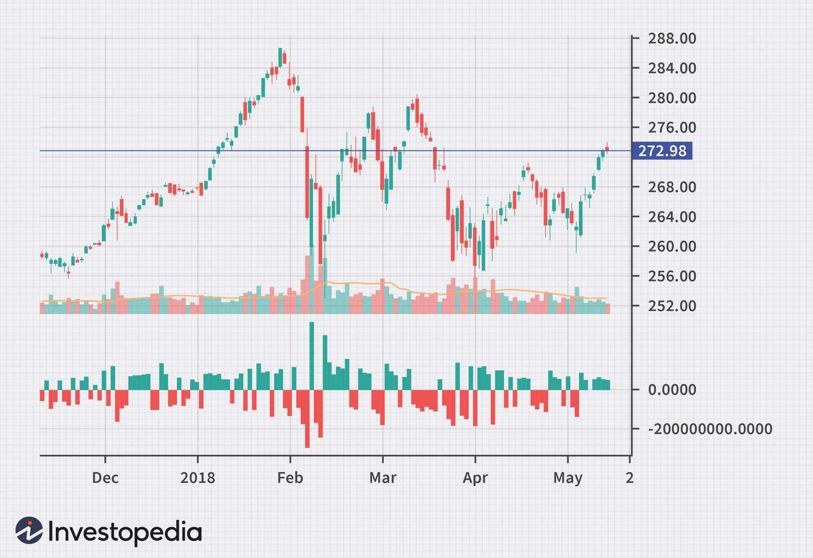

## Table of Contents

## What is net volume measurement?

Net volume measurement is a way to figure out how much space something takes up, but only counting the space that the actual material occupies. Imagine you have a sponge that is full of holes. If you want to know the net volume, you would only measure the parts of the sponge that are solid, not the empty spaces inside it.

This type of measurement is important in many fields, like manufacturing and science. For example, if a company is making parts for a machine, they need to know the net volume of the material to make sure it fits perfectly and works right. In science, understanding the net volume helps researchers study how different materials behave and interact with each other.

## Why is net volume measurement important in various industries?

Net volume measurement is important in industries like manufacturing because it helps companies make sure their products are the right size. When a company makes parts for machines, they need to know exactly how much space the material takes up. If they don't measure the net volume correctly, the parts might not fit together well, and the machine might not work properly. This can lead to wasted materials and time, which costs money.

In the science and research industry, knowing the net volume of materials is key to understanding how they work. Scientists often study how different materials interact with each other, and the net volume helps them figure this out. For example, if they are studying a new type of foam, they need to know the net volume to understand how much of it is solid and how much is air. This information helps them predict how the foam will behave in different situations, which is important for creating new products or solving problems.

In the food industry, net volume measurement is also crucial. When packaging food, companies need to know the net volume to make sure they are giving customers the right amount of product. If they don't measure correctly, they might end up giving too much or too little, which can affect customer satisfaction and the company's reputation. Accurate net volume measurement helps ensure that the food is packaged fairly and efficiently.

## How is net volume different from gross volume?

Net volume and gross volume are two ways to measure how much space something takes up, but they look at different things. Net volume only counts the space that the actual material takes up. Imagine a sponge with lots of holes. The net volume would be just the solid parts of the sponge, not the empty spaces inside it. This is important when you need to know exactly how much solid material you have.

Gross volume, on the other hand, includes everything, even the empty spaces. Using the same sponge example, the gross volume would be the total size of the sponge, including all the holes. This type of measurement is useful when you need to know the overall size of an object, like when you're packing it into a box or a container. So, net volume is about the solid material, while gross volume is about the total space an object takes up.

## What are the basic tools needed for measuring net volume?

To measure net volume, you need a few basic tools. The most important tool is a scale to weigh the object. By knowing the weight, you can figure out the density of the material if you know what it is made of. Another useful tool is a container that can hold water, like a graduated cylinder or a beaker. You can use this to find out the volume of the object by seeing how much water it displaces when you put it in.

Another tool that can help is a caliper, which is used to measure the dimensions of the object. By knowing the length, width, and height, you can calculate the volume if the object is a simple shape like a cube or a cylinder. For more complex shapes, you might need special software or a 3D scanner to get an accurate measurement of the net volume. These tools together help you find out how much space the solid part of the object takes up.

## Can you explain the process of measuring net volume in liquids?

Measuring the net volume of a liquid is pretty straightforward. You need a container that can measure volume, like a graduated cylinder or a beaker. Pour the liquid into the container and read the level where the liquid stops. That number is the gross volume of the liquid, which is the same as the net volume because liquids don't have empty spaces inside them like sponges do. So, for liquids, the net volume and gross volume are the same.

Sometimes, you might need to measure the net volume of a liquid that has stuff floating in it, like a mixture of water and oil. In this case, you need to separate the different parts first. You can do this by letting the mixture sit until the different liquids separate on their own, or you can use a special tool like a centrifuge to speed up the process. Once the liquids are separated, you can pour each one into a measuring container and read the volume of each part. The net volume of each liquid is the volume you read on the container.

## What are the common units of measurement used in net volume?

The common units of measurement used for net volume are the same as those used for any volume. These include cubic centimeters (cm³), cubic meters (m³), liters (L), and milliliters (mL). Cubic centimeters and cubic meters are used in the metric system and are good for measuring the volume of solid objects. Liters and milliliters are also part of the metric system but are more commonly used for measuring liquids.

In the United States, you might also see gallons, quarts, pints, and fluid ounces used to measure volume. These units are part of the imperial system and are often used for liquids, like when you're measuring the volume of a bottle of water or a can of soda. No matter which units you use, the important thing is to make sure you're measuring the net volume correctly, which means only counting the space taken up by the actual material.

## How does temperature affect net volume measurement?

Temperature can change how much space a thing takes up. When things get warmer, they usually get bigger. This means the net volume of a solid or liquid will be a bit more when it's hot than when it's cold. For example, if you heat up a piece of metal, it will expand and take up more space. So, if you measure the net volume of the metal when it's hot, you'll get a bigger number than if you measured it when it was cold.

For liquids, like water, temperature can also make a difference. When water gets warmer, it expands and its volume goes up. If you measure the net volume of a bottle of water at room temperature and then heat it up, the volume will be larger. It's important to know the temperature when you measure net volume because it can affect how accurate your measurements are.

## What are the challenges in measuring net volume accurately?

Measuring net volume accurately can be tricky because of a few reasons. One big challenge is the shape of the object. If the object is not a simple shape like a cube or a sphere, it can be hard to figure out its net volume. You might need special tools like 3D scanners or software to get it right. Another challenge is the material itself. Some materials, like sponges or foams, have lots of empty spaces inside them. You need to be careful to only measure the solid parts and not the holes.

Temperature can also make it hard to measure net volume accurately. When things get warmer, they expand and take up more space. So, if you measure the net volume of something at different temperatures, you might get different results. It's important to keep the temperature the same when you measure to make sure your numbers are right. Also, human error can mess things up. If you're not careful when you read the measurements or if you use the wrong tools, your net volume numbers might not be accurate.

## What advanced technologies are used to enhance net volume measurement?

Advanced technologies like 3D scanners and computer software are used to make measuring net volume easier and more accurate. 3D scanners can take pictures of an object from all sides and create a detailed model of it. This model shows the exact shape and size of the object, even if it's not a simple shape like a cube or a sphere. The software then uses this model to figure out the net volume, making sure to only count the solid parts of the object.

Another technology that helps with net volume measurement is called computed tomography (CT) scanning. This is like the 3D scanner but goes even deeper. CT scanners can look inside the object and see all the tiny details, like the empty spaces in a sponge or foam. This helps to measure the net volume very accurately by showing exactly where the solid material is and where the holes are. Both of these technologies make it easier to get precise measurements, which is important in industries like manufacturing and science.

## How do regulatory standards impact net volume measurement practices?

Regulatory standards are rules that companies and scientists have to follow when they measure net volume. These rules make sure that everyone measures things the same way, so the numbers are fair and correct. For example, in the food industry, there are rules about how much food should be in a package. If a company doesn't measure the net volume right, they might put too much or too little food in the package, which can get them in trouble. So, following these standards helps companies stay out of trouble and keep their customers happy.

In other industries, like manufacturing and science, regulatory standards also help make sure that measurements are accurate. If a company is making parts for a machine, they need to measure the net volume of the material very carefully. If they don't follow the rules, the parts might not fit together right, and the machine might not work. Scientists also need to follow these standards when they are doing experiments. If they don't measure the net volume correctly, their results might be wrong, and they might not be able to solve the problems they are working on. So, regulatory standards are important for making sure that net volume measurements are done right.

## What are the best practices for ensuring accuracy in net volume measurement?

To make sure you measure net volume accurately, it's important to use the right tools and follow a good process. Start by choosing the right tool for the job. For solids, a scale to weigh the object and a container like a graduated cylinder to measure displacement can help. For liquids, a graduated cylinder or beaker is perfect. Make sure your tools are working well and are clean. When you measure, do it carefully and take your time. If the object is not a simple shape, use a 3D scanner or software to help you get the right numbers. Always double-check your measurements to make sure they are correct.

Temperature can also affect how accurate your measurements are. Always measure at the same temperature to keep your results consistent. If you're measuring a liquid, let it sit until it's at room temperature before you start. For solids, if you can, keep them at a steady temperature too. Another good practice is to follow any rules or standards that apply to your industry. These rules help make sure everyone measures things the same way, so your numbers are fair and correct. By using the right tools, being careful, and following the rules, you can make sure your net volume measurements are as accurate as possible.

## How can errors in net volume measurement be minimized in industrial applications?

To minimize errors in net volume measurement in industrial settings, it's important to use the right tools and keep them in good shape. A scale for weighing and a graduated cylinder for measuring displacement work well for solids, while a beaker or graduated cylinder is perfect for liquids. Make sure these tools are clean and working properly. Also, take your time when you measure. If the object is not a simple shape, use advanced tools like 3D scanners or special software to help you get the right numbers. Double-check your measurements to make sure they are correct and reduce mistakes.

Temperature can also affect how accurate your measurements are, so always measure at the same temperature. For liquids, let them sit until they reach room temperature before you start measuring. For solids, try to keep them at a steady temperature too. Following industry standards and rules is another way to minimize errors. These standards make sure everyone measures things the same way, so your numbers are fair and correct. By using the right tools, being careful, and following the rules, you can make sure your net volume measurements in industrial applications are as accurate as possible.

## What is Volume Calculation and Measurement?

Volume calculation involves determining the total number of shares or contracts traded in a security or market within a given timeframe. This metric is crucial for traders as it provides insights into the level of activity and [liquidity](/wiki/liquidity-risk-premium) of a security, which are imperative for evaluating the strength or weakness of a price trend. High trading volume indicates strong interest and conviction among investors, often signaling potential price movements or trend continuations. Conversely, low volume might suggest a lack of investor confidence or interest, potentially indicating the likelihood of a trend reversal or stagnation.

Various tools and indicators have been developed to aid traders in interpreting volume data efficiently. Among them, the On-Balance Volume (OBV) and the Volume-Weighted Average Price (VWAP) are particularly prominent. 

The OBV is a [momentum](/wiki/momentum) indicator that utilizes volume flow to predict changes in stock price. It is calculated using a cumulative total of volume, which is added on up days and subtracted on down days, as shown in the formula:

$$
\text{OBV} = \begin{cases} 
\text{Previous OBV} + \text{Current Volume,} & \text{if current close} > \text{previous close} \\
\text{Previous OBV} - \text{Current Volume,} & \text{if current close} < \text{previous close} \\
\text{Previous OBV,} & \text{if current close} = \text{previous close}
\end{cases}
$$

This indicator provides a comprehensive view of the overall [volume](/wiki/volume-trading-strategy) trends and their relationship with price changes, allowing traders to confirm potential breakouts or reversals.

VWAP, on the other hand, serves as a trading benchmark and measures the average price a security has traded at throughout the day, based on both volume and price. It is particularly beneficial for assessing the trading efficiency throughout the day and helping traders make more informed buy or sell decisions.

$$
\text{VWAP} = \frac{\sum (\text{Price} \times \text{Volume})}{\sum (\text{Volume})}
$$

VWAP is a widely-used tool, especially by institutional traders, due to its ability to provide a clearer picture of a security’s price relative to its typical trading range over a specified duration.

These indicators, among others, enable traders to assess market sentiment and make data-driven decisions, often leading to enhanced confidence in trading strategies.

## What is Understanding Net Volume?

Net volume is a critical technical indicator utilized in trading to gain a deeper understanding of market sentiment. It reflects the net difference between uptick volume and downtick volume over a specified period. Uptick volume refers to the total volume of shares or contracts traded at a price higher than the previous transaction, while downtick volume represents those traded at a lower price. By calculating the net volume, traders can ascertain whether a market trend is predominantly bullish or bearish.

The net volume calculation is straightforward: 

$$
\text{Net Volume} = \text{Uptick Volume} - \text{Downtick Volume}
$$

This metric offers traders a nuanced view beyond mere volume numbers, highlighting the underlying conditions of the market. A positive net volume indicates more aggressive buying (bullish sentiment), while a negative net volume suggests stronger selling pressure (bearish sentiment). Compared to standard volume measurements, net volume provides traders with an additional layer of insight, allowing them to fine-tune their strategies by understanding the flow of buy and sell orders.

In practice, traders often use net volume to validate trends. For instance, if a rising stock price is accompanied by a consistently positive net volume, it confirms strong buyer interest, supporting the continuation of the uptrend. Conversely, a negative net volume during a price decline may validate the strength of a downtrend. 

Net volume is particularly advantageous as it sheds light on the intensity and conviction of market participants, offering traders a clearer picture of potential future movements. It is especially beneficial when markets exhibit subtle shifts in sentiment that might not be apparent through price changes alone. This deeper analysis of trading activity makes net volume an indispensable tool for traders who wish to go beyond traditional volume data in their market assessments.

## What are the practical applications of volume indicators?

Volume indicators are integral tools for traders aiming to confirm trends and foresee potential reversals within financial markets. These indicators analyze the volume of traded assets to provide insights into market sentiment and validate price movements. They are pivotal in distinguishing between genuine price changes and misleading fluctuations caused by market noise.

One of the most commonly used volume indicators is the On-Balance Volume (OBV). OBV operates on the principle that volume precedes price movement. It assigns a cumulative total to trading volume according to the direction of price changes. When the closing price is higher than the previous close, the volume is added, whereas it is subtracted when the closing price is lower:

$$

\text{OBV} = \begin{cases} 
\text{OBV}_{\text{previous}} + \text{Volume}, & \text{if } \text{Close}_{\text{today}} > \text{Close}_{\text{yesterday}} \\
\text{OBV}_{\text{previous}} - \text{Volume}, & \text{if } \text{Close}_{\text{today}} < \text{Close}_{\text{yesterday}} \\
\text{OBV}_{\text{previous}}, & \text{otherwise}
\end{cases}
$$

This calculation helps traders ascertain whether the current market movements have substantial volume support, distinguishing sustainable trends from short-lived spikes.

Another popular tool is the Volume-Weighted Average Price (VWAP), which provides an average price of a security over a specified period, adjusted for volume:

$$

\text{VWAP} = \frac{\sum (\text{Volume}_i \times \text{Price}_i)}{\sum \text{Volume}_i} 
$$

VWAP is instrumental for traders in evaluating whether to buy or sell assets during a trading period. A price below the VWAP indicates a good entry point for buying, as it suggests the asset may be undervalued relative to its volume-weighted average. Conversely, a price above the VWAP could signal a selling opportunity.

The practical application of these indicators spans both [day trading](/wiki/day-trading-spy) and long-term investment strategies. Day traders, for instance, rely on intraday volume analysis to make quick trading decisions, using indicators like VWAP to determine entry and [exit](/wiki/exit-strategy) points. Long-term investors may use OBV to confirm trends over longer periods, identifying buying opportunities when volumes indicate long-term bullish sentiment.

Incorporating volume indicators into a trading strategy enhances the analytical foundation of decision-making processes. They complement other tools in the technical analysis toolkit, such as moving averages and oscillators, to provide a more comprehensive market perspective. For traders seeking to refine their strategies, understanding and applying volume indicators is crucial for effectively navigating market dynamics.

## References & Further Reading

[1]: Bergstra, J., Bardenet, R., Bengio, Y., & Kégl, B. (2011). ["Algorithms for Hyper-Parameter Optimization."](https://dl.acm.org/doi/10.5555/2986459.2986743) Advances in Neural Information Processing Systems 24.

[2]: ["Advances in Financial Machine Learning"](https://www.amazon.com/Advances-Financial-Machine-Learning-Marcos/dp/1119482089) by Marcos Lopez de Prado

[3]: ["Evidence-Based Technical Analysis: Applying the Scientific Method and Statistical Inference to Trading Signals"](https://www.amazon.com/Evidence-Based-Technical-Analysis-Scientific-Statistical/dp/0470008741) by David Aronson

[4]: ["Machine Learning for Algorithmic Trading"](https://github.com/stefan-jansen/machine-learning-for-trading) by Stefan Jansen

[5]: ["Quantitative Trading: How to Build Your Own Algorithmic Trading Business"](https://www.amazon.com/Quantitative-Trading-Build-Algorithmic-Business/dp/1119800064) by Ernest P. Chan