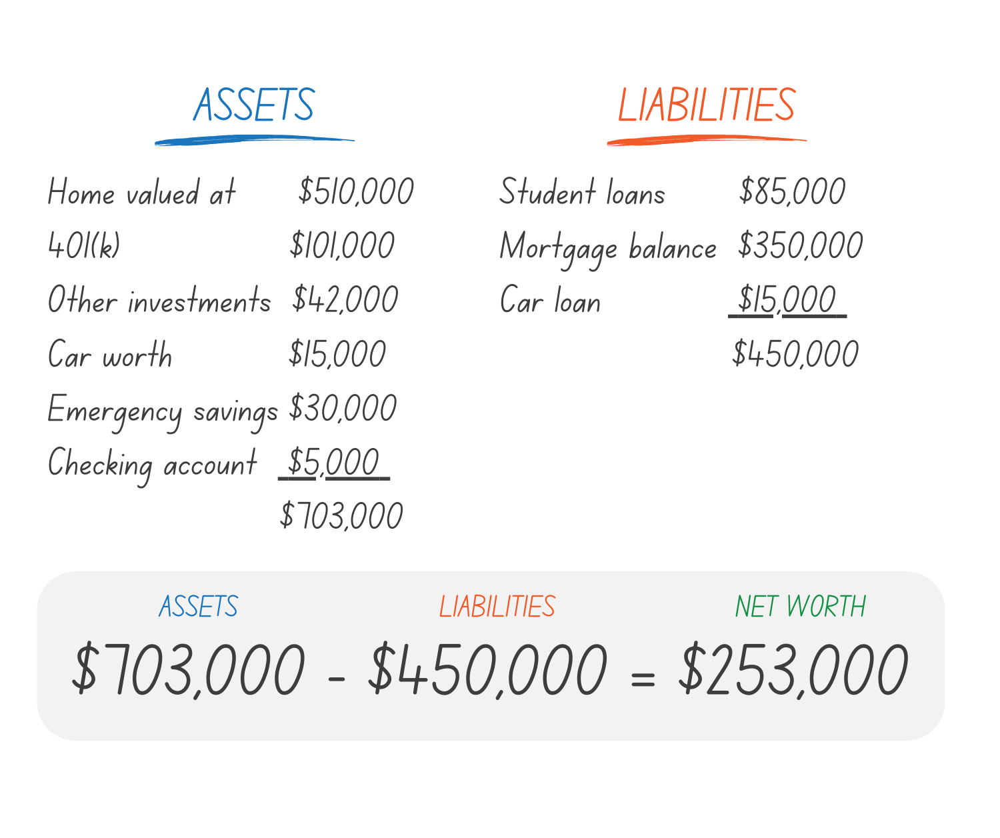

## Table of Contents

## What is net worth and why is it important to calculate?

Net worth is the total value of everything you own minus everything you owe. It's like a financial snapshot that shows how much money you would have if you sold all your assets and paid off all your debts. This can include things like your home, car, savings, and investments on the asset side, and mortgages, car loans, and credit card debt on the liability side.

Calculating your net worth is important because it helps you understand your financial health. By knowing your net worth, you can see if you are moving towards your financial goals or if you need to make changes. It can also help you plan for the future, like saving for retirement or buying a home. Regularly checking your net worth can keep you motivated and on track with your financial plans.

## How do you calculate your net worth?

To calculate your net worth, you first need to add up everything you own. This includes your savings, the value of your home, any investments like stocks or bonds, and even personal items like your car or jewelry. Let's call this total the value of your assets. 

Next, you need to add up everything you owe. This includes your mortgage, car loans, student loans, and any credit card debt. Let's call this total the value of your liabilities. To find your net worth, you subtract the total value of your liabilities from the total value of your assets. If your assets are worth more than your liabilities, you have a positive net worth. If your liabilities are worth more than your assets, you have a negative net worth.

## What are the key components of net worth?

The key components of net worth are your assets and your liabilities. Assets are things you own that have value. This includes money in your bank accounts, the value of your home, any investments you have like stocks or bonds, and personal items like your car or jewelry. Anything that you could sell for money counts as an asset.

Liabilities, on the other hand, are things you owe. This includes your mortgage, car loans, student loans, and credit card debt. These are debts that you need to pay back. To find your net worth, you subtract the total of your liabilities from the total of your assets. If your assets are worth more than your liabilities, you have a positive net worth. If your liabilities are worth more than your assets, you have a negative net worth.

## How often should you calculate your net worth?

You should calculate your net worth at least once a year. This helps you see if you are getting better at saving money and paying off debts. It's like checking your progress on a big goal.

Some people like to check their net worth more often, like every month or every three months. This can be good if you are trying to make big changes in your money habits. It keeps you focused and helps you make quick fixes if you need to.

## What are common mistakes people make when calculating their net worth?

One common mistake people make when calculating their net worth is forgetting to include all their assets and liabilities. They might remember their savings and home value, but forget about smaller things like jewelry or credit card debt. It's important to think of everything you own and owe to get a true picture of your net worth.

Another mistake is not updating the values of assets and liabilities. The value of your home or investments can change over time, and so can the amount you owe on loans. If you don't use the most current numbers, your net worth calculation won't be accurate. It's a good idea to check and update these values regularly.

Lastly, some people might get too caught up in small details and lose sight of the bigger picture. They might spend a lot of time trying to find the exact value of every little thing they own, which can be stressful and unnecessary. It's better to use good estimates and focus on the overall trend of your net worth over time.

## How does net worth differ from income?

Net worth and income are two different things when it comes to your money. Net worth is like a snapshot of your financial health at a certain time. It's what you get when you take everything you own (your assets) and subtract everything you owe (your liabilities). So, if you have a house, some savings, and investments but also a mortgage and some credit card debt, your net worth is the total value of the house, savings, and investments minus the mortgage and debt. It shows how much wealth you have built up over time.

Income, on the other hand, is the money you earn over a period of time, like a month or a year. This can come from your job, investments, or any other sources. It's the money that comes into your pocket regularly. While income is important because it helps you pay for your life and add to your assets, it doesn't tell you about your overall financial health like net worth does. You could have a high income but still have a low or negative net worth if you spend more than you earn or have a lot of debt.

## What role do assets play in net worth calculation?

Assets are really important when you figure out your net worth. They are all the things you own that have value, like your savings, your home, and even your car. When you add up the value of all these things, you get the total value of your assets. This number is a big part of your net worth because it shows how much money you would have if you sold everything you own.

To find your net worth, you take the total value of your assets and subtract the total value of your liabilities, which are the things you owe money on. So, the more valuable your assets are, the higher your net worth can be. It's like a balance between what you own and what you owe. If your assets are worth more than your liabilities, you'll have a positive net worth, which means you're doing well financially.

## How do liabilities affect your net worth?

Liabilities are the things you owe money on, like loans or credit card debt. When you calculate your net worth, you take the total value of everything you own, which are your assets, and then you subtract the total of your liabilities. So, the more money you owe, the lower your net worth will be. If your liabilities are bigger than your assets, you'll end up with a negative net worth, which means you owe more than you own.

It's important to keep an eye on your liabilities because they can really change your financial picture. If you're working on paying down your debts, your net worth can go up even if the value of your assets stays the same. This shows that managing your liabilities well is just as important as growing your assets when you want to improve your net worth.

## What strategies can be used to increase net worth?

To increase your net worth, you need to focus on two main things: increasing your assets and decreasing your liabilities. One way to grow your assets is by saving more money. You can do this by spending less than you earn and putting the extra money into savings or investments. Another way to increase your assets is by investing wisely. This can mean buying stocks, real estate, or other things that might grow in value over time. The key is to choose investments that match your goals and how much risk you're willing to take.

Reducing your liabilities is just as important. You can do this by paying off debts like credit cards, loans, or your mortgage. Start by paying off the debts with the highest interest rates first because they cost you the most money over time. You can also try to avoid taking on new debt if you can. If you need to borrow money, look for loans with low interest rates. By managing your debts well, you can lower your liabilities and increase your net worth.

Keeping track of your net worth regularly can also help you stay on the right path. By checking your net worth every few months or once a year, you can see if you're making progress. If you see that your net worth isn't going up, you can figure out why and make changes. Maybe you need to save more, invest differently, or pay off debts faster. The important thing is to keep working on both growing your assets and reducing your liabilities to build your wealth over time.

## How can net worth be used as a financial health indicator?

Net worth is a great way to see how healthy your money situation is. It's like taking a picture of your finances at a certain time. When you know your net worth, you can see if you're getting better at saving money and paying off what you owe. If your net worth is going up over time, it means you're doing well because you're building up more of what you own compared to what you owe. This can make you feel good about your money choices and help you plan for big things like buying a house or retiring.

On the other hand, if your net worth is going down or staying the same, it might mean you need to make some changes. Maybe you're spending too much, not saving enough, or not paying off your debts fast enough. By looking at your net worth regularly, you can catch problems early and fix them. It's like a check-up for your money, helping you stay on track and reach your financial goals.

## What are advanced methods for calculating net worth, including non-traditional assets?

When you want to figure out your net worth in a more detailed way, you can include non-traditional assets like intellectual property, cryptocurrencies, and collectibles. Intellectual property might be things like patents, trademarks, or copyrights that you own. These can be hard to put a price on, but you can look at similar items that have been sold or get an expert to help you. Cryptocurrencies, like Bitcoin or Ethereum, can go up and down a lot in value, so it's important to use the current market price when you add them to your net worth. Collectibles, like art, rare coins, or vintage cars, also need to be valued at what they might sell for now. Adding these non-traditional assets can give you a fuller picture of your wealth.

To get an even better idea of your net worth, you can also think about future income sources and potential liabilities. For example, if you have a pension or an inheritance coming, you might want to include the present value of those in your assets. On the other hand, if you have potential legal issues or big future expenses, you should think about those as liabilities. It's a bit tricky to guess these things, but trying to include them can help you plan better. By looking at all parts of your financial life, including these advanced and non-traditional elements, you can get a clearer and more complete view of your net worth.

## How can net worth calculations be adjusted for inflation and economic changes?

When you calculate your net worth, you might want to think about how inflation and changes in the economy can affect it. Inflation means that the value of money goes down over time, so the money you have saved or the value of things you own might not be worth as much in the future. To adjust for this, you can use a tool called an inflation calculator to see what your money or assets would be worth in today's dollars. This helps you understand if your net worth is really growing or if it's just keeping up with the rising prices.

Economic changes, like a recession or a boom, can also change the value of your assets and liabilities. For example, if the economy is doing well, the value of your house or stocks might go up, making your net worth look better. But if the economy is struggling, those same assets might go down in value. To account for these changes, you should regularly update the values of your assets and liabilities based on current market conditions. This way, your net worth calculation will give you a more accurate picture of your financial health, even when the economy is changing.

## What is Wealth Assessment?

Wealth assessment involves evaluating the financial health of an individual or entity by analyzing their assets and liabilities. This process extends beyond the mere accounting of tangible assets, such as real estate and physical property, by also including financial instruments like stocks, bonds, and mutual funds, as well as savings accounts and other financial reserves. The goal of a comprehensive wealth assessment is to ascertain an accurate picture of one’s overall financial standing. This holistic view is crucial for sound financial planning and decision-making, allowing individuals and entities to set realistic financial goals and devise strategies to achieve them.

A typical wealth assessment evaluates the balance between assets and liabilities. Assets encompass everything that holds value and can be liquidated or converted into cash. Common examples include real estate holdings, investment portfolios, and liquid assets such as cash savings. Liabilities, on the other hand, consist of financial obligations that an individual or entity is responsible for, including debts like mortgages, loans, and credit card balances. The formula for calculating net worth, a primary indicator in wealth assessment, is:

$$
\text{Net Worth} = \text{Total Assets} - \text{Total Liabilities}
$$

A positive net worth indicates an abundance of assets over liabilities, suggesting financial stability. Conversely, a negative net worth signifies that liabilities exceed assets, which may indicate financial distress.

In a business context, wealth assessment manifests as evaluating a company's net worth through its financial statements. These statements provide detailed insights into a company's assets, liabilities, and equity, thus enabling stakeholders to make informed decisions regarding investments and business strategies. Companies must regularly assess their wealth to ensure they are on track to meet financial targets and to identify potential areas for improvement or investment.

Wealth assessments are not static; they require regular updates to accommodate changes in market conditions, asset values, and personal or organizational financial commitments. By identifying trends and understanding shifts in one's financial landscape, individuals and businesses can adapt their strategies to both capitalize on opportunities and mitigate potential risks. 

In summary, wealth assessment plays a critical role in assessing and maintaining financial health. By offering a comprehensive overview of assets and liabilities, wealth assessment serves as a foundational tool for effective financial management and planning.

## How do you calculate net worth?

Net worth is a vital indicator of financial health, representing the difference between total assets and total liabilities. Mathematically, it is expressed as:

$$
\text{Net Worth} = \text{Total Assets} - \text{Total Liabilities}
$$

Assets encompass all items or investments that hold monetary value and can be liquidated or converted to cash. Typical examples of assets include real estate properties, stocks, bonds, and bank deposits. Each of these categories can vary in [liquidity](/wiki/liquidity-risk-premium) and risk, affecting their valuation and role in the overall financial strategy.

Liabilities, on the other hand, are financial obligations or debts that detract from the total value of an individual's or entity's economic standing. Common liabilities include mortgages, credit card debts, and personal or business loans. These obligations, when considered collectively, provide insight into an entity's financial risks and commitments.

A positive net worth occurs when the total value of assets exceeds the total liabilities, signaling a state of financial stability and often implying capacity for investment and growth. Conversely, a negative net worth indicates that liabilities surpass assets, potentially reflecting financial distress and necessitating strategic readjustments.

The regular calculation of net worth is crucial for both individuals and businesses as it serves as a barometer of financial progress over time. By periodically assessing net worth, one can gauge the effectiveness of current financial strategies and make necessary adjustments to achieve desired financial goals or mitigate potential issues. Adopting tools and systematic approaches for this evaluation can lead to more informed decision-making and efficient resource allocation.

## References & Further Reading

[1]: ["Advances in Financial Machine Learning"](https://www.amazon.com/Advances-Financial-Machine-Learning-Marcos/dp/1119482089) by Marcos Lopez de Prado

[2]: ["Evidence-Based Technical Analysis: Applying the Scientific Method and Statistical Inference to Trading Signals"](https://www.amazon.com/Evidence-Based-Technical-Analysis-Scientific-Statistical/dp/0470008741) by David Aronson

[3]: ["Machine Learning for Algorithmic Trading"](https://github.com/stefan-jansen/machine-learning-for-trading) by Stefan Jansen

[4]: ["Quantitative Trading: How to Build Your Own Algorithmic Trading Business"](https://www.amazon.com/Quantitative-Trading-Build-Algorithmic-Business/dp/1119800064) by Ernest P. Chan 

[5]: Cartea, Álvaro, Jaimungal, Sebastian, & Penalva, José. (2015). ["Algorithmic and High-Frequency Trading."](https://assets.cambridge.org/97811070/91146/frontmatter/9781107091146_frontmatter.pdf) Cambridge University Press.

[6]: Hasbrouck, J. (2007). ["Empirical Market Microstructure: The Institutions, Economics, and Operation of Securities Trading."](https://academic.oup.com/book/52241) Oxford University Press.