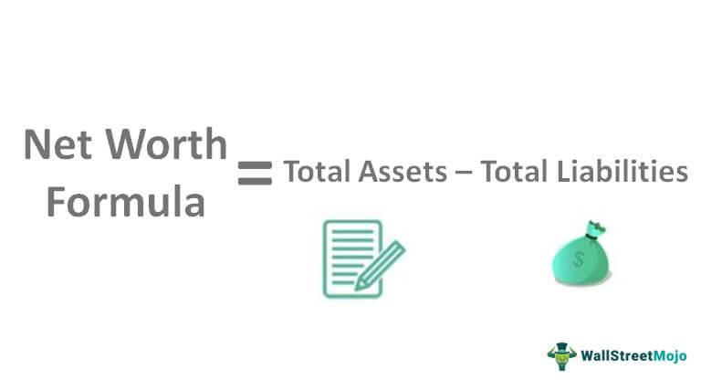

In today's complex financial landscape, understanding the intricacies of wealth assessment and net worth calculation is essential for maintaining both personal and business financial health. As technology advances, algorithmic trading has gained prominence, presenting new avenues for effective wealth management and investment strategies. This article investigates the convergence of financial calculation methods, wealth assessment, and the role of algorithmic trading in modern finance. By gaining insight into these concepts, individuals and businesses can make informed financial decisions, thereby optimizing their strategies for financial growth.

Algorithmic trading, which leverages computer programs to execute trades with speed and efficiency, highlights how technological innovation is shaping financial management. By automating trading processes, algorithmic strategies can minimize errors and capitalize on market opportunities, offering significant advantages over traditional trading methods. This technological evolution underscores the relevance of understanding complex financial concepts to enhance one's economic standing.



Overall, this guide aims to demystify these interconnected topics and underscore their significance within the current economic environment. With an informed approach to wealth assessment and an understanding of algorithmic trading dynamics, stakeholders can better navigate financial complexities, ultimately leading to more strategic and beneficial financial outcomes.

## Table of Contents

## What is Wealth Assessment?

Wealth assessment involves evaluating the financial health of an individual or entity by analyzing their assets and liabilities. This process extends beyond the mere accounting of tangible assets, such as real estate and physical property, by also including financial instruments like stocks, bonds, and mutual funds, as well as savings accounts and other financial reserves. The goal of a comprehensive wealth assessment is to ascertain an accurate picture of one’s overall financial standing. This holistic view is crucial for sound financial planning and decision-making, allowing individuals and entities to set realistic financial goals and devise strategies to achieve them.

A typical wealth assessment evaluates the balance between assets and liabilities. Assets encompass everything that holds value and can be liquidated or converted into cash. Common examples include real estate holdings, investment portfolios, and liquid assets such as cash savings. Liabilities, on the other hand, consist of financial obligations that an individual or entity is responsible for, including debts like mortgages, loans, and credit card balances. The formula for calculating net worth, a primary indicator in wealth assessment, is:

$$
\text{Net Worth} = \text{Total Assets} - \text{Total Liabilities}
$$

A positive net worth indicates an abundance of assets over liabilities, suggesting financial stability. Conversely, a negative net worth signifies that liabilities exceed assets, which may indicate financial distress.

In a business context, wealth assessment manifests as evaluating a company's net worth through its financial statements. These statements provide detailed insights into a company's assets, liabilities, and equity, thus enabling stakeholders to make informed decisions regarding investments and business strategies. Companies must regularly assess their wealth to ensure they are on track to meet financial targets and to identify potential areas for improvement or investment.

Wealth assessments are not static; they require regular updates to accommodate changes in market conditions, asset values, and personal or organizational financial commitments. By identifying trends and understanding shifts in one's financial landscape, individuals and businesses can adapt their strategies to both capitalize on opportunities and mitigate potential risks. 

In summary, wealth assessment plays a critical role in assessing and maintaining financial health. By offering a comprehensive overview of assets and liabilities, wealth assessment serves as a foundational tool for effective financial management and planning.

## Calculating Net Worth

Net worth is a vital indicator of financial health, representing the difference between total assets and total liabilities. Mathematically, it is expressed as:

$$
\text{Net Worth} = \text{Total Assets} - \text{Total Liabilities}
$$

Assets encompass all items or investments that hold monetary value and can be liquidated or converted to cash. Typical examples of assets include real estate properties, stocks, bonds, and bank deposits. Each of these categories can vary in [liquidity](/wiki/liquidity-risk-premium) and risk, affecting their valuation and role in the overall financial strategy.

Liabilities, on the other hand, are financial obligations or debts that detract from the total value of an individual's or entity's economic standing. Common liabilities include mortgages, credit card debts, and personal or business loans. These obligations, when considered collectively, provide insight into an entity's financial risks and commitments.

A positive net worth occurs when the total value of assets exceeds the total liabilities, signaling a state of financial stability and often implying capacity for investment and growth. Conversely, a negative net worth indicates that liabilities surpass assets, potentially reflecting financial distress and necessitating strategic readjustments.

The regular calculation of net worth is crucial for both individuals and businesses as it serves as a barometer of financial progress over time. By periodically assessing net worth, one can gauge the effectiveness of current financial strategies and make necessary adjustments to achieve desired financial goals or mitigate potential issues. Adopting tools and systematic approaches for this evaluation can lead to more informed decision-making and efficient resource allocation.

## The Role of Algorithmic Trading in Financial Calculation

Algorithmic trading is a method of executing trades using computer programs that follow a defined set of instructions or algorithms. These algorithms are designed to perform trades based on variables such as market data, [volume](/wiki/volume-trading-strategy), timing, and price, allowing trades to be conducted at speeds and frequencies that are impossible for human traders. This form of trading aims to maximize financial returns by leveraging computational efficiency and real-time data analysis.

One of the primary advantages of [algorithmic trading](/wiki/algorithmic-trading) is its ability to minimize human error and capitalize on market opportunities as they arise. By utilizing algorithms that process vast amounts of data at high speed, traders can execute trades with greater precision and effectiveness. This capability is particularly beneficial in volatile or fast-moving markets, where timing and speed are crucial.

Algorithmic trading is prevalent in financial markets due to its numerous benefits. Among these, improved execution speed is paramount, as algorithms can execute trades in milliseconds. Additionally, transaction costs are often reduced since algorithms can optimize trade execution across various trading venues, securing the best possible prices and efficiently managing order [books](/wiki/algo-trading-books).

However, the utilization of algorithmic trading comes with challenges. Its reliance on technology means that system failures can have significant consequences. Technical glitches or malfunctions can lead to unintended trades or financial losses. Furthermore, the complexity and opacity of some algorithms can lead to regulatory scrutiny, as market practices must adhere to evolving regulations designed to maintain fair and transparent markets.

The integration of algorithmic trading into wealth assessment tools offers enhanced decision-making and investment strategy formulation. By providing real-time data analysis and optimization, these tools enable investors to better evaluate their portfolios and adjust strategies accordingly. As financial technologies progress, the amalgamation of algorithmic trading with wealth evaluation methodologies is expected to become more pronounced, fostering a more comprehensive approach to financial management. This synergy can lead to more strategic and informed investment decisions, optimizing financial returns while concurrently managing risks.

## Strategies and Considerations for Implementing Algo Trading

Algorithmic trading encompasses several strategies, each designed to leverage mathematical models and software capabilities to improve trading efficiency. Among the popular strategies are trend-following, [arbitrage](/wiki/arbitrage), and high-frequency trading.

Trend-following strategies aim to capitalize on the [momentum](/wiki/momentum) of asset prices moving in a particular direction. These strategies often utilize moving averages, oscillators, and other momentum indicators to identify entry and [exit](/wiki/exit-strategy) points. For example, a simple moving average crossover strategy might involve buying an asset when a shorter-term moving average crosses above a longer-term moving average, signaling a potential upward trend.

Arbitrage strategies seek to exploit price discrepancies between correlated financial instruments or across different markets. This could involve [statistical arbitrage](/wiki/statistical-arbitrage), where mispricings are identified between related securities, or pairs trading, where a trader might short one asset while buying another to take advantage of mean reversion tendencies. 

High-frequency trading ([HFT](/wiki/high-frequency-trading-strategies)) focuses on executing a large number of orders at very fast speeds. These strategies rely on advanced algorithms that can analyze market data and execute trades within microseconds. HFT can take advantage of small price inefficiencies, often utilizing direct market access and co-location services to minimize latency.

For successful implementation, these strategies require precise mathematical modeling and consistently reliable data feeds. A robust technical infrastructure is vital, ensuring high-speed data processing and minimal latency. Risk management is another critical consideration, involving the establishment of stop-loss orders, regular monitoring of algorithm performance, and stress testing the models against historical market anomalies.

Compliance with regulatory requirements is essential, given the scrutiny surrounding algorithmic trading practices. Investors need to be aware of market regulations and ensure that their trading activities adhere to the relevant laws and ethical standards, such as the Market Abuse Regulation (MAR) in the European Union or the Securities Exchange Act in the United States.

Investors harnessing these strategies must balance the potential for high returns with inherent risks like market [volatility](/wiki/volatility-trading-strategies) and technological failures. Algorithms should be thoroughly tested and backtested under different market conditions to assess their robustness. The process requires careful attention to detail and constant optimization to align with changing market dynamics.

Understanding the technical requirements and developing a well-researched algorithm are crucial for employing effective algorithmic trading strategies. The use of [machine learning](/wiki/machine-learning) and data analytics can further enhance model prediction capabilities, allowing for more adaptive and self-learning systems. In Python, libraries like NumPy for numerical calculations, pandas for data manipulation, and scikit-learn for machine learning provide powerful tools for developing and testing trading algorithms.

In conclusion, a well-prepared approach to algorithmic trading requires not only sophisticated models and advanced computing infrastructure but also careful risk management and regulatory compliance to navigate the challenges and opportunities within financial markets.

## The Impact of Algorithimic Trading on Net Worth Calculation

Algorithmic trading, employing computer programs for executing trading strategies, significantly influences net worth through enhanced portfolio performance. By leveraging these automated systems, transactions are executed with precision, taking advantage of market inefficiencies that may be missed by human traders. This often results in increased returns and reduced costs, contributing positively to overall net worth over time.

An efficient algorithm can capitalize on minute price discrepancies and market trends, thereby optimizing trading profits. For instance, consider an algorithm designed using a trend-following strategy. Python libraries such as `numpy` and `pandas` can aid in building and testing such algorithms. Here's a simplistic example:

```python
import pandas as pd
import numpy as np

# Load historical market data
data = pd.read_csv('market_data.csv')

# Calculate moving averages
data['short_mavg'] = data['Close'].rolling(window=40).mean()
data['long_mavg'] = data['Close'].rolling(window=100).mean()

# Generate buy/sell signals
data['signal'] = np.where(data['short_mavg'] > data['long_mavg'], 1, 0)

# Calculate returns
data['returns'] = data['Close'].pct_change()
data['strategy_returns'] = data['signal'].shift(1) * data['returns']

# Calculate cumulative strategy returns
cumulative_returns = (1 + data['strategy_returns']).cumprod()

print(cumulative_returns)
```

However, the high potential for returns comes with risks. Poorly constructed algorithms, possibly lacking rigorous [backtesting](/wiki/backtesting), can underperform or even skew financial health negatively. Unforeseen market events, like flash crashes or sudden economic changes, can also lead to significant losses. These risks necessitate robust risk management and constant monitoring to mitigate potential adverse impacts on net worth.

Integration of algorithmic trading with traditional wealth assessment methods enhances financial management efficiency. Traditional methods tend to focus on historical data and [fundamental analysis](/wiki/fundamental-analysis), while algorithms bring the capacity to process vast datasets in real-time, providing a more actionable insight. Therefore, combining these approaches offers a holistic financial management strategy, adapting to both historical trends and real-time dynamics.

As financial technologies advance, the integration of algorithmic trading with wealth management will become increasingly relevant. The synergy improves the assessment of risks, potential returns, and broader market conditions, ensuring more strategic financial decisions. The continuous evolution of algorithms and computational finance reflects the dynamic nature of financial strategy in contemporary settings.

## Conclusion

Wealth assessment, net worth calculation, and algorithmic trading serve as foundational pillars in contemporary financial management. For both individuals and businesses intent on bolstering their financial health, it is imperative to comprehend and effectively implement these components. This understanding fosters the development of strategies that are not only informed but also strategically aligned with one's financial objectives.

As financial markets and technologies evolve, continuous learning and adaptation are crucial. By embracing advancements in algorithmic trading and leveraging accurate wealth assessment techniques, investors can optimize their decision-making processes. This approach enables a more dynamic response to market changes and potential risks, ultimately enhancing portfolio performance and financial stability.

Despite inevitable challenges, such as market volatility and technological intricacies, the judicious management of wealth utilizing these methodologies offers substantial benefits. Successfully navigating the complexities associated with wealth calculation and algorithmic trading can lead to significant financial gains and a more secure financial future.

Ultimately, adopting a well-rounded perspective towards financial calculation and investment reflects the intricate and changing nature of today's economic landscape. By integrating traditional financial strategies with innovative technologies, investors position themselves to not only meet their financial goals but to thrive in a competitive economic environment.

## References & Further Reading

[1]: ["Advances in Financial Machine Learning"](https://www.amazon.com/Advances-Financial-Machine-Learning-Marcos/dp/1119482089) by Marcos Lopez de Prado

[2]: ["Evidence-Based Technical Analysis: Applying the Scientific Method and Statistical Inference to Trading Signals"](https://www.amazon.com/Evidence-Based-Technical-Analysis-Scientific-Statistical/dp/0470008741) by David Aronson

[3]: ["Machine Learning for Algorithmic Trading"](https://github.com/stefan-jansen/machine-learning-for-trading) by Stefan Jansen

[4]: ["Quantitative Trading: How to Build Your Own Algorithmic Trading Business"](https://www.amazon.com/Quantitative-Trading-Build-Algorithmic-Business/dp/1119800064) by Ernest P. Chan 

[5]: Cartea, Álvaro, Jaimungal, Sebastian, & Penalva, José. (2015). ["Algorithmic and High-Frequency Trading."](https://assets.cambridge.org/97811070/91146/frontmatter/9781107091146_frontmatter.pdf) Cambridge University Press.

[6]: Hasbrouck, J. (2007). ["Empirical Market Microstructure: The Institutions, Economics, and Operation of Securities Trading."](https://academic.oup.com/book/52241) Oxford University Press.