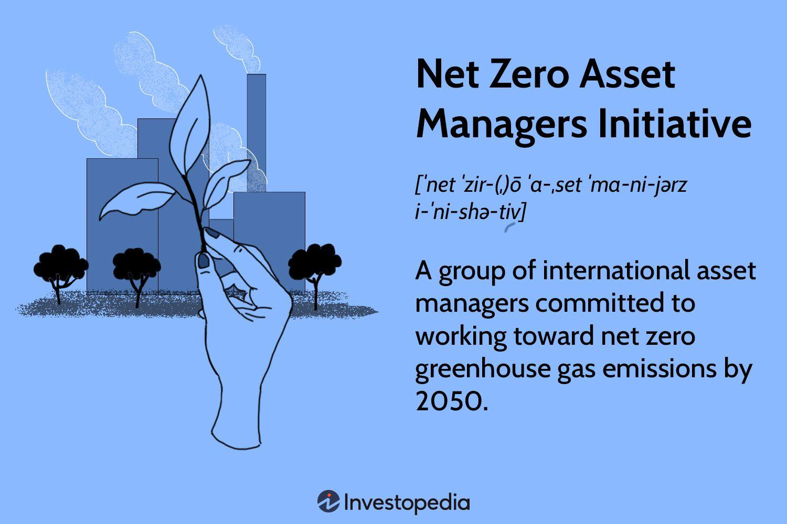

Climate change poses a significant threat to the planet, prompting a proactive response from asset managers who are increasingly seeking sustainable investment pathways. As part of their response, the Net Zero Asset Managers Initiative has emerged as a global consortium committed to achieving net-zero greenhouse gas emissions by 2050. This initiative has become a central figure in aligning financial investment strategies with urgent climate goals.

Algorithmic trading has become a pivotal tool in the quest for sustainability within financial markets. By utilizing sophisticated computational techniques, algo trading optimizes investment strategies to meet sustainability criteria. It facilitates the integration of environmental, social, and governance (ESG) factors into investment processes, enhancing the ability to forecast market trends based on sustainability metrics.



Understanding the convergence of climate initiatives, net-zero asset management, and algo trading is becoming increasingly important as the number of signatories to these initiatives grows. The financial ecosystem must evolve to integrate these elements, requiring investors and financial professionals to gain insight into how these strategies can impact investment portfolios and broader market dynamics. 

This article explores the significance of this intersection for investors and the financial sector at large, highlighting how asset managers can leverage tools like algo trading to support global climate action. By doing so, the financial industry is poised to make a transformative impact in addressing climate change through innovative, strategic investments.

## Table of Contents

## Understanding the Net Zero Asset Managers Initiative

The Net Zero Asset Managers Initiative was launched in December 2020 to catalyze substantial changes in how asset managers pursue investment strategies. It has rapidly attracted over 235 signatories who collectively manage approximately $57.5 trillion in assets globally. This initiative is an amalgamation of efforts from esteemed founding partners, including the Asia Investor Group on Climate Change, Ceres, and others, fostering an environment where financial stewardship is aligned with a long-term vision for sustainability.

A primary objective of the initiative is for asset managers to align their investment portfolios with the global target of net-zero greenhouse gas emissions by 2050. This alignment includes not only supporting investments that directly contribute to reducing carbon emissions but also investing in companies that are committed to transitioning towards more sustainable practices.

Signatories of this initiative undertake a series of key actions to achieve these objectives. These actions include active engagement with clients and corporations to collaboratively develop and implement strategies that focus on reducing carbon footprints. Furthermore, they advocate for substantial policy changes that facilitate the transition to a more sustainable global economy. This approach recognizes the importance of systemic change and foresees a crucial role for regulatory frameworks in setting conducive conditions for sustainable investments.

While many perceive net-zero efforts as primarily focused on divesting from carbon-intensive assets, the initiative advocates for a more nuanced approach. It emphasizes a balance between divestment and proactive engagement with companies transitioning towards sustainable practices. This strategy ensures that the shift towards sustainability does not undermine short-term financial stability and continues to provide growth opportunities in emerging sectors.

Ultimately, the Net Zero Asset Managers Initiative signifies a pivotal shift in the investment management industry, urging asset managers to play an integral role in combatting climate change through strategic alignment with net-zero objectives.

## Role of Algo Trading in Climate Initiatives

Algorithmic trading employs sophisticated technologies to effectively manage investment portfolios, playing a critical role in advancing climate initiatives. By utilizing powerful computational algorithms, it is possible to enhance decision-making processes through the analysis of extensive datasets, allowing for the forecasting of market trends with greater precision. This capability is crucial for aligning investment strategies with sustainability objectives.

One of the primary contributions of [algorithmic trading](/wiki/algorithmic-trading) to climate initiatives is the optimization of portfolios for low-carbon footprints. Algorithms can be designed to scrutinize carbon emissions associated with different assets, promoting the selection of securities that exhibit minimal environmental impact. This not only supports the reduction of carbon exposure in investment portfolios but also aligns with broader commitments to achieving net-zero emissions.

Moreover, algorithmic trading strategies increasingly incorporate Environmental, Social, and Governance ([ESG](/wiki/esg-investing)) metrics. By integrating these metrics into trading algorithms, investors can make informed decisions that prioritize sustainable and responsible investment practices. ESG integration requires a multifaceted approach, evaluating aspects such as carbon intensity, water usage, and governance structures. Advanced algorithms can process and prioritize these metrics, ensuring that investment choices contribute to environmental sustainability.

The deployment of algorithmic trading acknowledges the significance of technology in meeting net-zero commitments. With the rapid progression of data analytics and [machine learning](/wiki/machine-learning) capabilities, algorithmic trading stands out as a tool for driving innovations in sustainable finance. By harnessing these technologies, it is possible to create a more sustainable financial landscape that supports the transition to a low-carbon economy. 

Overall, algorithmic trading is an integral component in formulating strategies that aim for a sustainable future, ensuring that financial systems are aligned with environmental goals and supporting the global endeavor of achieving net-zero emissions by the year 2050.

## Significant Achievements and Challenges

Many asset managers are making significant progress toward setting interim emissions reduction targets for 2030 as part of their commitment to achieving net-zero greenhouse gas emissions by 2050. This progress marks a crucial step in aligning investment portfolios with sustainable paths and demonstrates a proactive approach to combating climate change within the financial sector.

However, achieving these interim targets requires more than just setting goals; it necessitates effectively bridging the gap between the aspiration and realization of these objectives. This involves concrete action plans, diligent monitoring, and continuous engagement with stakeholders to ensure alignment with sustainability targets.

The pursuit of these goals is not without its challenges. Regulatory changes pose a significant hurdle as governments worldwide continually update and revise policies concerning carbon emissions and climate change mitigation. Asset managers must remain agile, adapting to these regulatory shifts while maintaining compliance and capitalizing on new incentives for sustainable investment.

Market pressures also play a substantial role in this landscape. As societal expectations around corporate responsibility and sustainability increase, asset managers are under pressure to deliver financial returns while simultaneously reducing their climate footprint. Balancing these dual objectives requires innovative strategies and levering tools like algorithmic trading, which can optimize portfolios for both profit and sustainability.

Technological dependencies present another layer of complexity. As asset managers strive to incorporate Environmental, Social, and Governance (ESG) metrics into their investment strategies, the integration and analysis of vast datasets become essential. Reliance on technology for data processing and analysis requires robust systems, advanced algorithms, and skilled professionals capable of managing these tools effectively. However, technological advancements also provide an opportunity by offering more precise insights and facilitating better decision-making.

Engagement efficacy remains a crucial component in influencing corporate behavior towards sustainability. Asset managers must effectively communicate and collaborate with the companies they invest in to drive meaningful change. This involves using their influence to encourage companies to adopt sustainable practices, reporting transparently on progress, and holding them accountable for their environmental impact.

In summary, while the journey towards net-zero emissions by 2030 presents significant achievements, it also faces multifaceted challenges. Successful asset managers will be those who can navigate the regulatory landscape, withstand market pressures, leverage technological advancements, and engage effectively with corporate entities to instigate sustainable change.

## Impact on Asset Management Strategies

Asset managers focusing on net-zero pathways must integrate sustainability into their investment strategies, aligning portfolios to meet ambitious climate targets. This alignment requires the adoption of varied methodologies to set tailored targets reflecting the unique objectives and constraints of each asset management firm. Signatories of the Net Zero Asset Managers Initiative typically employ a mix of sector-specific emissions targets and carbon footprinting to ensure that their portfolios contribute meaningfully to global decarbonization efforts.

Strategic investments play a crucial role in accelerating climate solutions. Asset managers are increasingly channeling capital into sectors and technologies that offer robust climate benefits, such as renewable energy, energy efficiency improvements, and sustainable agriculture. These investments not only support the transition to a low-carbon economy but also position asset managers to capture growth opportunities in emerging markets driven by technological advancement and policy shifts.

Both traditional finance and emerging climate tech sectors are paramount in facilitating this transition. Traditional finance provides the necessary capital flow and risk assessment frameworks that enable large-scale investments in sustainable projects. Concurrently, climate tech innovations are essential for identifying new opportunities and optimizing portfolio management through data analytics, machine learning, and real-time carbon accounting.

For instance, adopting a data-driven approach to assess environmental, social, and governance (ESG) metrics can guide investment decisions. This might involve leveraging algorithmic models to predict the potential impact of climate policies on investment returns. Python has become a powerful tool in this area, allowing the development of algorithms that can analyze ESG data sets to identify sustainable investment opportunities. A simple Python snippet to run such an analysis might look like this:

```python
import pandas as pd

# Sample data loading
esg_data = pd.read_csv('esg_data.csv')

# Simple function to calculate ESG score impact on return
def calculate_impact(esg_score, financials):
    return financials['return'] * esg_score

# Run calculation
esg_data['impact_score'] = esg_data.apply(lambda x: calculate_impact(x['esg_score'], x), axis=1)

# Analyze high impact investments
high_impact_investments = esg_data[esg_data['impact_score'] > threshold]
```

This code snippet demonstrates leveraging ESG scores to anticipate the financial impact, aiding in identifying high-impact investments. By integrating such analytical techniques, asset managers can enhance their capacity to meet net-zero targets while maximizing financial performance. The collaborative synergy between traditional finance structures and cutting-edge climate technologies holds promise for achieving a global transition to net-zero emissions by 2050.

## Future Prospects and Conclusion

The Net Zero Asset Managers Initiative is driving significant transformations within the financial sector, marking a substantial paradigm shift towards sustainability. This initiative reflects a rising commitment among asset managers to embed net-zero strategies into their operations, thus influencing portfolio management and investment approaches.

Algorithmic trading is an essential component of this transition, facilitating the optimization of investment strategies with a focus on sustainability. By leveraging advanced data analytics and machine learning, algo trading systems can efficiently process vast datasets to predict market trends while incorporating environmental, social, and governance (ESG) metrics. This integration enables asset managers to make informed decisions that align with climate goals, ultimately reducing carbon footprints across investment portfolios.

The participating signatories, by pledging to these commitments, set a compelling precedent for the wider adoption of sustainable finance practices. These firms exemplify how the integration of sustainability can be synergized with financial performance goals, offering a replicable model for the industry.

Achieving the ambitious target of net-zero emissions by 2050 is challenging yet feasible through concerted efforts in collaboration and technological innovation. Collaboration across sectors, along with regulatory support and corporate engagement, will be indispensable in attaining these goals. Technological advancements will further aid the transition by continuously enhancing the accuracy and efficiency of sustainable investment practices.

In conclusion, asset managers are well-positioned to enact transformative changes on a global scale. By adopting innovative strategies and committing to sustainability, they have the potential to substantially influence corporate behavior and investment landscapes. This aligns financial market operations with broader environmental objectives, thereby contributing meaningfully to global climate action.

## References & Further Reading

[1]: "Net Zero Asset Managers Initiative" (2020). [Net Zero Asset Managers Initiative Press Release](https://www.netzeroassetmanagers.org/2020/12/) 

[2]: Mouatassim, E., & Bousselhami, A. (2019). ["Environmental, Social, and Governance Indicators and Their Implications for Smart Portfolios."](https://www.sciencedirect.com/science/article/abs/pii/S0753005308000635) Research in International Business and Finance, 27(2), 153-171.

[3]: Busch, T., & Hoffmann, V. H. (2011). ["How Hot is Your Bottom Line? Linking Carbon and Financial Performance."](https://journals.sagepub.com/doi/10.1177/0007650311398780) Business Strategy and the Environment, 20(10), 360-375.

[4]: Grossman, S. J., & Stiglitz, J. E. (1980). ["On the Impossibility of Informationally Efficient Markets."](https://www.jstor.org/stable/1805228) The Quarterly Journal of Economics, 94(3), 567-585.

[5]: "The Future of Algorithmic Trading Models and Methods for Predicting the Market." [CFA Institute Research Foundation PDF](https://en.wikipedia.org/wiki/Boston_University)