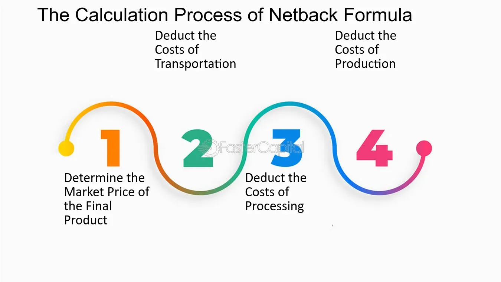

The oil and gas industry remains a pivotal pillar in global energy supply, characterized by its substantial data handling and intricate computational needs. Over the years, pricing strategies within this sector have seen considerable evolution, driven largely by technological advancements. These developments have significantly influenced the integration of netback calculations and algorithmic trading into the industry's pricing strategies.

Netback calculation serves as a crucial financial metric for oil and gas companies, helping to measure profitability by accounting for costs such as royalties, production, and transportation. This calculation not only aids in determining gross profit per barrel but also highlights operational efficiency and unit profitability. As pricing strategies continue to evolve, netback has become essential in optimizing pricing and ensuring competitive advantage.

Alongside netback, algorithmic trading has revolutionized how trades are executed in the oil and gas markets. By automating trading processes, algorithmic trading enhances decision-making, offering increased trading speeds, reduced error potential, and improved market insights. These algorithms enable traders to leverage vast datasets, thereby making informed, data-driven decisions that can significantly boost profitability and manage risks more effectively.

This article aims to explore the intricacies of netback calculations and their influence on pricing within the oil and gas industry. It will also examine the transformative role of algorithmic trading in optimizing trading decisions, underscoring how these strategies contribute to the financial efficiencies and competitive strengths of companies operating within this critical sector.

## Table of Contents

## Understanding Netback in Oil and Gas Pricing

Netback is a vital financial metric for oil and gas companies, providing a measure of profitability per unit of production. It is defined as the gross profit per barrel, calculated by taking into account several key costs: royalties, production, and transportation. Understanding netback is crucial for evaluating the operational efficiency and profitability of oil and gas operations.

At its core, the netback price metric offers a comprehensive view of how much profit a producer retains after subtracting the various costs associated with bringing oil or gas to market. The formula for calculating netback is typically expressed as:

$$
\text{Netback} = \text{Selling Price} - (\text{Royalties} + \text{Production Costs} + \text{Transportation Costs})
$$

Each component in the formula plays a significant role in determining the overall net profit from production. Royalties, which are payments to resource owners, vary depending on jurisdiction and the terms of extraction agreements. These royalties are often impacted by government policies and negotiated contracts.

Production costs encompass all expenses incurred during the extraction and refinement processes, including labor, materials, and facility maintenance. Efficient production techniques and technological innovations can reduce these costs, contributing to an improved netback.

Transportation costs include expenses associated with moving oil and gas from production sites to markets. The choice of transportation mode—pipeline, tanker, or truck—can significantly influence these costs, as can the distance and geographical challenges involved in the transport process.

By calculating netback, oil and gas companies can gain insights into their profitability on a per-barrel basis, allowing them to identify areas of operational efficiency and potential cost savings. This profitability measure also assists companies in making informed decisions regarding investment strategies, production adjustments, and market expansion.

Overall, netback serves as a comprehensive framework for assessing the economic viability of oil and gas operations, highlighting the importance of cost management and revenue optimization in achieving sustained profitability in the energy sector.

## Calculating the Netback Price

The netback price calculation is a critical aspect of financial analysis in the oil and gas industry, focusing on determining the profitability per unit of oil or gas after accounting for various associated costs. The netback formula is expressed as:

$$
\text{Netback Price} = \text{Selling Price} - (\text{Royalties} + \text{Production Costs} + \text{Transportation Costs} + \text{Marketing Costs})
$$

Each component plays a fundamental role in influencing the final netback value.

**1. Selling Price**

The selling price represents the revenue generated per barrel of oil or per unit of gas. This price can be influenced by market demand, geopolitical factors, and contractual agreements. Oil and gas prices are often subject to [volatility](/wiki/volatility-trading-strategies), dictated by global supply and demand dynamics and influenced by organizations such as OPEC.

**2. Royalties**

Royalties are payments made to landowners or governments for the right to extract natural resources. These are typically calculated as a percentage of the revenue generated from the sale of oil or gas. Variability in royalty rates can occur based on the location of extraction and prevailing legal agreements. Adjustments in royalty agreements directly impact the netback calculation.

**3. Production Costs**

Production costs encompass all expenses related to the extraction and processing of oil and gas. These include wages, equipment maintenance, and facility operational costs. Factors affecting production costs include technological advancements, workforce efficiency, and the geological characteristics of the oil or gas field. Efficient production techniques can lower costs, thereby improving netback.

**4. Transportation Costs**

The cost of transporting oil and gas from the point of extraction to the marketplace is a significant component of the netback calculation. These costs can vary based on distance, mode of transport (pipeline, shipping, or trucking), and geopolitical factors affecting transportation routes. Transport efficiency improvements or infrastructure developments can lead to reductions in these costs.

**5. Marketing Costs**

Marketing costs involve expenses associated with promoting and selling the product. In oil and gas, this can include costs related to securing buyers, advertising, and negotiations. Strategic marketing efforts can optimize these costs, enhancing the overall netback.

**Example Calculation**

Consider a scenario where the selling price is $70 per barrel. The detailed costs are as follows: royalties are $5 per barrel, production costs are $15 per barrel, transportation costs amount to $7 per barrel, and marketing costs are $3 per barrel. The netback price can be calculated using the provided formula:

$$
\text{Netback Price} = 70 - (5 + 15 + 7 + 3) = 70 - 30 = 40 \text{ USD per barrel}
$$

In this example, the netback price is $40 per barrel, indicating the profit margin available to the company after covering all relevant costs.

**Impact on Pricing Strategy**

Accurate calculation of netback prices is crucial for strategic decision-making in pricing and investment. A higher netback indicates better profitability per unit, guiding companies in refining operational efficiencies and negotiating better selling prices. It aids in identifying cost-saving opportunities and better cash flow management, thereby influencing broader financial strategies within the industry.

## Challenges in Calculating Accurate Netback Prices

Calculating accurate netback prices in the oil and gas industry involves navigating numerous challenges that can significantly impact the precision of these financial metrics. A fundamental issue is the variability in transportation costs, as these expenses can fluctuate due to changes in fuel prices, infrastructure availability, and geopolitical factors. Transportation costs are a critical component of netback calculations, directly affecting the profitability of each barrel of oil or cubic meter of gas produced.

Quality adjustments present another significant challenge. Oil and gas products have varying quality levels based on factors such as sulfur content, API gravity, and other chemical characteristics. These quality differences necessitate adjustments to the netback price, as higher-quality products typically fetch better prices in the market. Accounting for these variations requires detailed technical knowledge and precise measurement data, which can be difficult to obtain consistently.

Tax implications also complicate the netback calculus. Different jurisdictions impose varying tax regimes on oil and gas production, including royalties, severance taxes, and corporate income taxes. These taxes can change frequently due to legislative amendments or policy shifts, adding layers of complexity to financial planning and forecasting for energy companies. Accurate netback calculations must account for these tax implications, requiring continuous updates and adjustments to reflect the current tax landscape.

Market fluctuations further add to the complexity, as global oil and gas prices are subject to rapid changes influenced by supply and demand dynamics, geopolitical events, and economic indicators. These fluctuations can alter the market value of oil and gas products, impacting the revenue side of the netback calculation and necessitating constant monitoring and adjustment by industry analysts.

To manage these complexities and enhance precision in netback calculations, many companies employ advanced Energy Trading and Risk Management (ETRM) solutions. These systems integrate data from various sources, including market trends, transportation logistics, and tax regulations, to provide a comprehensive view for strategic decision-making. ETRM solutions employ sophisticated algorithms to simulate different market scenarios, optimize trading positions, and manage risks associated with volatile prices and regulatory changes.

In conclusion, the accurate calculation of netback prices necessitates a multifaceted approach that addresses transportation costs, quality adjustments, and tax implications amid a backdrop of fluctuating markets and evolving regulations. Leveraging advanced ETRM systems can help oil and gas companies refine their netback calculations, thereby improving financial performance and decision-making.

## The Role of Algorithmic Trading in Oil and Gas Markets

Algorithmic trading has significantly transformed the execution of trades within the oil and gas sector. This innovative approach utilizes complex algorithms to automate and optimize trading decisions, capitalizing on the vast amounts of available market data.

One of the primary benefits of [algorithmic trading](/wiki/algorithmic-trading) is the increased speed of trade execution. Algorithms can process and analyze large volumes of data far quicker than human capabilities, enabling traders to execute orders in microseconds. This speed advantage is crucial in the highly volatile oil and gas markets, where prices can change rapidly due to geopolitical events or shifts in supply and demand. By reacting instantly to market changes, firms can secure more favorable prices and optimize their profit margins.

Another critical advantage is the reduction of human error. Traditional trading methods are susceptible to mistakes owing to manual input and decision-making processes. Algorithmic trading, in contrast, relies on predefined criteria and systematic execution, which minimizes the risk of errors. This reliability enhances the overall efficiency of trading operations and ensures more consistent outcomes.

Algorithmic trading also provides deeper market insights through advanced data analysis. Algorithms can identify complex patterns and trends by analyzing historical data and real-time information, offering traders valuable insights into market behavior. This analytical capability allows traders to develop more sophisticated strategies, tailor their positions to current market conditions, and predict future price movements with greater accuracy.

The data-driven decision-making process inherent in algorithmic trading not only improves profitability but also reduces risks. Traders can back-test algorithms using historical data to assess their effectiveness and make adjustments accordingly. This risk management strategy helps mitigate potential losses and increases the likelihood of sustained financial success.

In the context of the oil and gas markets, algorithmic trading systems might be programmed to [factor](/wiki/factor-investing) in specific variables, such as inventory reports, weather conditions affecting supply routes, or regulatory changes that impact market dynamics. These factors can be integrated into algorithms to ensure that trading strategies are robust and adaptive to real-world conditions.

In summary, algorithmic trading revolutionizes how trades are conducted in the oil and gas industry by offering numerous advantages, including enhanced speed, precision, and market insight. Through the strategic use of algorithms, traders can effectively navigate the complex and dynamic landscapes of global markets, thus achieving higher levels of profitability and market efficiency.

## Comparison of Netback Formula with Other Pricing Methods

The netback formula is a widely utilized pricing method in the oil and gas industry, yet it functions alongside several other pricing strategies such as grossback, spot pricing, and forward pricing. Understanding the differences among these methods is imperative for making informed trading and investment decisions.

**Netback Formula**: The netback formula provides a comprehensive assessment of profitability per unit of production by accounting for various costs incurred, including royalties, production, transportation, and marketing. It is expressed as follows:

$$
\text{Netback} = \text{Selling Price} - (\text{Royalties} + \text{Production Costs} + \text{Transportation Costs} + \text{Marketing Costs})
$$

This formula helps oil and gas companies gauge operational efficiency, enabling them to identify profitable avenues and optimize resource allocation.

**Grossback Pricing**: Grossback is similar to netback but does not account for all the deductions made in netback. It considers only some costs like transportation and processing, leaving out others such as royalties. Grossback is useful in scenarios where only certain cost inputs are available, but it might provide an inflated view of profitability compared to netback.

**Spot Pricing**: Spot pricing pertains to the immediate settlement of contracts or commodities at the current market price. It provides a real-time reflection of market demand and supply dynamics. While spot pricing offers flexibility and quick response to market changes, it exposes traders to volatility risks, making it less predictable for long-term planning compared to the netback method.

**Forward Pricing**: Forward pricing involves setting prices for future delivery of oil and gas, thereby mitigating the risks associated with price volatility in the spot market. This method facilitates better budgetary control and strategic planning. Yet, it might not capture the full market potential if prices rise significantly, thereby limiting profit margins compared to netback, which adjusts more fluidly to current market and operational conditions.

**Comparative Advantages of Netback**: The netback formula's superior advantage lies in its comprehensive cost analysis, offering a clear picture of actual profits after all incurred expenses. It is particularly beneficial for companies focused on long-term planning and financial analysis. In contrast, spot pricing’s reflection of the current market may misrepresent ongoing trends due to short-term volatility. Forward pricing, while protective against volatility, can miss opportunities presented by market shifts.

In summary, while each of these pricing methods has its specific strengths and limitations, the netback formula is advantageous for its holistic approach to cost assessment and profitability analysis, making it a cornerstone for strategic financial decision-making in the oil and gas industry.

## Real-world Applications and Case Studies

Several case studies underscore the practical application of netback calculations and algorithmic trading in the oil and gas industry. Notably, companies such as Cenovus Energy and Suncor Energy provide insightful examples of how these strategies are employed to enhance financial and operational efficiencies.

Cenovus Energy, a major player in the Canadian oil sands industry, employs the netback formula to drive strategic decisions. By utilizing the formula—Selling Price - (Royalties + Production Costs + Transportation Costs + Marketing Costs)—Cenovus assesses the profitability of its operations. The company integrates transportation and logistical considerations into its netback calculations to optimize supply chain efficiencies. For instance, by accurately determining transportation cost implications, Cenovus has managed to streamline its operations, ultimately reflecting in improved netbacks. This strategic use of netback calculations aids the company in allocating resources efficiently and deciding on future investments in production capabilities.

Suncor Energy, another Canadian oil sands giant, effectively utilizes netback pricing as a fundamental component of its pricing strategy. The company incorporates various cost factors into its netback calculations, factoring in fluctuating market conditions and transportation costs to evaluate the real profitability of its product. Furthermore, Suncor leverages algorithmic trading to enhance its market position. By employing sophisticated trading algorithms, Suncor captures data-driven insights, enabling rapid responses to market fluctuations. This integration of technology allows Suncor to execute trades with increased speed and accuracy, reducing the risk of human error. As a result, the company achieves greater profitability and a more robust competitive edge in volatile markets.

These real-world examples highlight the potential of netback calculations and algorithmic trading in guiding effective investment and operational strategies. Companies that harness these tools can experience improved financial outcomes and operational efficiencies, which are crucial in the highly competitive oil and gas industry. As companies continue to face market volatilities and increasing production costs, the role of precise netback calculations and advanced trading technologies will likely grow, further informing strategic decision-making and investment strategies.

## Conclusion

Netback and algorithmic trading play a crucial role in shaping pricing and trading strategies within the oil and gas sector. These methodologies provide a significant edge by offering more precise financial assessments and predictive capabilities. Mastering the complexities of netback—where the selling price of oil or gas is adjusted for royalties, production, transportation, and marketing costs—enables companies to gain clear insights into their profitability and operational efficiency. This precise understanding allows firms to adjust strategies rapidly in response to changing market conditions, thus safeguarding profit margins.

Algorithmic trading, with its capacity to analyze large datasets and execute trades at high speed, empowers traders to minimize errors and capitalize on real-time market opportunities. By leveraging advanced algorithms, companies can enhance decision-making processes, optimize trading strategies, and mitigate risks. As a result, algorithmic trading increases the assurance of achieving desired financial outcomes within the volatile energy markets.

Continuous technological and analytical advancements are expected to further enhance the precision and effectiveness of these tools. Enhanced data analytics, [machine learning](/wiki/machine-learning) algorithms, and the integration of IoT in oilfield operations are driving improvements in forecasting, operational efficiencies, and strategic planning. These developments promise to offer even greater insights and competitive advantages, ensuring that companies remain agile and competitive in a continually evolving market landscape. As these strategies evolve, they will likely redefine industry standards, helping firms to not only achieve but maintain long-term financial success in the oil and gas industry.

## References & Further Reading

[1]: Kaldor, M. (2019). ["Oil and gas companies and the governance of energy transition."](https://www.researchgate.net/publication/334496081_Oil_and_gas_company_strategies_regarding_the_energy_transition) Journal of Sustainable Finance & Investment.

[2]: Lo, A. W., & MacKinlay, A. C. (1997). ["The Econometrics of Financial Markets"](https://press.princeton.edu/books/hardcover/9780691043012/the-econometrics-of-financial-markets) Princeton University Press.

[3]: Recknagel, B., "Fossil Fuel: Report on Energy Sources," Springer Science & Business Media, 2013.

[4]: Dadashova, B. (2014). ["Energy Trading and Risk Management: A Practical Approach to Hedging, Trading and Portfolio Diversification."](https://www.wiley.com/en-us/Energy+Trading+and+Risk+Management%3A+A+Practical+Approach+to+Hedging%2C+Trading+and+Portfolio+Diversification-p-9781118339336) Wiley Finance.

[5]: Silver, N. (2012). ["The Signal and the Noise: Why So Many Predictions Fail--but Some Don't."](https://www.amazon.com/Signal-Noise-Many-Predictions-Fail-but/dp/0143125087) Penguin Books.