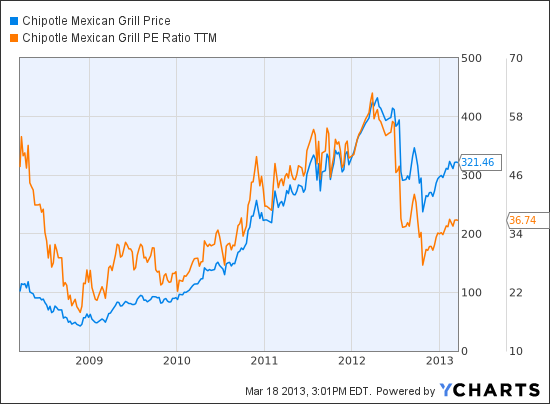

In recent years, Netflix has solidified its position as a dominant force within the streaming industry, captivating a global audience with its vast and diverse content library. The company's rapid growth and innovation have not only attracted millions of subscribers but have also drawn significant interest from investors aiming to evaluate Netflix's stock performance. Central to this evaluation is the price-to-earnings (P/E) ratio, a critical valuation metric utilized by investors to determine the stock's value relative to its earnings.

The P/E ratio, calculated by dividing the current share price by the earnings per share (EPS), offers insights into how much investors are willing to pay for each dollar of earnings. This metric is particularly important in assessing companies with significant growth potential, such as Netflix, where market sentiment can drastically affect valuation. Understanding Netflix's P/E ratio, along with its historical and forward-looking trends, can provide investors with a glimpse into the company's future prospects and market standing.



In addition to the P/E ratio, other performance metrics like earnings per share (EPS) play an essential role in offering a comprehensive view of Netflix's financial health. EPS, representing the portion of a company's profit allocated to each outstanding share, is a fundamental indicator of profitability and efficiency. Together, these metrics form the backbone of stock analysis, helping investors make informed decisions.

Moreover, with the advent of technology-driven finance, algorithmic trading has become prevalent, allowing traders to use computation to execute strategies based on specific financial ratios. The P/E ratio serves as a crucial component in these algorithms, aiding traders in making data-driven decisions. By analyzing deviations from historical norms or crossing predefined thresholds, automated trading systems can optimize the buying and selling of Netflix stock.

By examining these aspects, investors can better understand Netflix's valuation dynamics and leverage these insights in their investment strategies. This understanding is vital for navigating the highly competitive and rapidly evolving landscape of the streaming industry.

## Table of Contents

## Understanding the P/E Ratio

The price-to-earnings (P/E) ratio is a fundamental metric in equity valuation, providing an indication of how much investors are prepared to invest for each dollar of a company's earnings. It is defined mathematically as:

$$
\text{P/E Ratio} = \frac{\text{Current Share Price}}{\text{Earnings per Share (EPS)}}
$$

**Trailing Twelve-Month (TTM) P/E and Forward P/E**

There are two primary types of P/E ratios that investors consider: the trailing twelve-month (TTM) P/E and the forward P/E. The TTM P/E ratio is based on the earnings of the past 12 months, offering a retrospective view of the company’s earnings performance. This metric is particularly useful in assessing the previous operational efficiency and profitability, giving investors a snapshot of how the market values a company's historical earnings.

On the other hand, the forward P/E ratio calculates the price-to-earnings based on projected earnings for the next fiscal year. This forward-looking measure provides insights into market expectations about a company's future growth and profitability. Analysts often favor the forward P/E when they want to incorporate expected growth rates or impending product launches that are likely to impact future earnings.

**Comparison with Competitors**

The P/E ratio also serves as a valuable comparative tool, enabling investors to compare companies within the same industry. In the context of Netflix, it's insightful to compare its P/E ratio with those of key competitors like Amazon and Disney. A higher P/E might suggest that investors expect higher growth rates or that Netflix has superior competitive advantages. Conversely, a lower P/E could indicate potential undervaluation or concerns about the company's future performance.

Through these comparisons, investors can ascertain whether Netflix is overvalued or undervalued relative to its industry peers, offering a nuanced understanding of its market position. The P/E ratio, whether trailing or forward, thus remains indispensable for investors to benchmark Netflix against its rivals and capture market sentiment regarding its earnings potential.

## Netflix's P/E Ratio Analysis

Analyzing Netflix's price-to-earnings (P/E) ratio offers significant insights into its market position and growth prospects. The P/E ratio, calculated by dividing the current market price per share by the earnings per share (EPS), is a key indicator of investor expectations regarding future earnings growth. By considering both trailing twelve-month (TTM) P/E and forward P/E ratios, a comprehensive understanding of Netflix's valuation can be attained.

### Historical Data and Trends

Historically, Netflix's TTM P/E ratio has experienced variability due to shifts in market sentiment and changes in the company's financial performance. For example, during periods of aggressive subscriber growth and expansion into new markets, the P/E ratio has tended to rise, reflecting optimism about long-term profitability. Conversely, when facing challenges such as increased competition or heightened production costs, the ratio has often contracted, suggesting investor caution.

A review of Netflix's P/E ratio trajectory over recent years reveals a consistent pattern of high valuation relative to its earnings, indicative of investor confidence in its growth potential. In 2020, during the COVID-19 pandemic, Netflix's P/E ratio soared, driven by a surge in subscribers as people sought home entertainment options. However, as the market stabilized post-pandemic, the ratio adjusted to more sustainable levels.

### Comparative Analysis

When compared to industry averages and primary competitors like Amazon and Disney, Netflix's P/E ratio has often been higher. This premium valuation reflects its perceived leadership in the streaming sector and expectations for continued subscriber growth and content innovation. Companies such as Amazon, which operates a diverse portfolio beyond streaming, and Disney, with its strong brand and varied media offerings, present different valuation dynamics. 

For instance, Amazon's P/E ratio is influenced by its e-commerce and cloud computing earnings, while Disney's valuation is impacted by its theme parks and media networks. Therefore, a direct P/E comparison must account for these diversified revenue streams. Despite this, Netflix maintains a competitive edge in P/E ratio terms, underscoring its standalone strength in the entertainment sphere.

### Fluctuations and Influencing Factors

Netflix's P/E ratio is subject to fluctuation due to internal and external factors. Internally, shifts in content production costs, marketing expenses, and international expansion efforts can influence earnings and, subsequently, the P/E ratio. Externally, changes in consumer preferences, technological advancements, and competitive pressures are pivotal. 

For example, emerging competitors offering low-cost or ad-supported streaming services could impact Netflix's market share and investor sentiment, thereby affecting its P/E ratio. Moreover, regulatory challenges in new markets and variances in foreign exchange rates also play roles in shaping these valuation metrics.

In summary, Netflix's P/E ratio remains a critical metric for assessing its market standing and future growth potential. By analyzing historical trends and comparatives with industry counterparts, investors can gauge Netflix's valuation dynamics within the broader media and entertainment landscape.

## P/E Ratio in Algorithmic Trading

Algorithmic trading relies heavily on computational power to automate the execution of trades based on predefined criteria, with financial ratios like the price-to-earnings (P/E) ratio being integral components. In the context of trading Netflix stock, the P/E ratio serves as a valuable metric for determining market sentiment and potential mispricing.

Algorithms typically incorporate the P/E ratio to make data-driven trading decisions by evaluating how Netflix's P/E deviates from its historical average or breaches specific thresholds. For instance, an algorithm might be programmed to initiate a buy order if the P/E ratio falls significantly below its historical average, suggesting undervaluation, or to sell if it exceeds a threshold indicating potential overvaluation.

The implementation of [algorithmic trading](/wiki/algorithmic-trading) using the P/E ratio can be illustrated with a simple Python example:

```python
def execute_trade(pe_ratio, historical_average, lower_threshold, upper_threshold):
    if pe_ratio < historical_average * lower_threshold:
        return "Buy"
    elif pe_ratio > historical_average * upper_threshold:
        return "Sell"
    else:
        return "Hold"

# Example usage
netflix_pe = 35.0  # Current P/E ratio
historical_avg_pe = 50.0  # Historical average P/E ratio
lower_threshold = 0.7
upper_threshold = 1.3

decision = execute_trade(netflix_pe, historical_avg_pe, lower_threshold, upper_threshold)
print(f"Trade decision: {decision}")
```

In this example, the algorithm checks if Netflix's current P/E ratio is 30% below or above its historical average, triggering buy or sell orders accordingly.

The use of automated trading systems presents several advantages over manual trading, particularly with volatile assets like Netflix stock. These systems can process vast datasets far quicker than human capability, identify patterns or anomalies in real-time, and execute trades at optimal moments without emotional influence or fatigue. This efficiency reduces the latency inherent in manual trades, potentially leading to more profitable opportunities.

Furthermore, algorithmic trading allows for [backtesting](/wiki/backtesting) strategies against historical data, refining models before deployment in live markets, thus increasing confidence in decision-making. These advantages make algorithmic trading a preferred choice for many investors and traders seeking precision and operational efficiency in the ever-fluctuating market of streaming services like Netflix.

## Other Key Metrics for Netflix Stock Analysis

Netflix Inc., a major player in the streaming industry, is not only evaluated based on its price-to-earnings (P/E) ratio. Investors and analysts also consider a range of other financial metrics that provide a comprehensive view of the company's financial health and market positioning.

### Earnings Per Share (EPS)

Earnings per share (EPS) is a critical measure that indicates the profitability of Netflix by dividing its net income by the number of outstanding shares. A consistent growth in EPS over time generally signals a strong financial performance, reflecting the company's ability to generate profit on a per-share basis. For instance, if Netflix's net income in a fiscal year is $5 billion and it has 500 million outstanding shares, the EPS would be calculated as follows:

$$
\text{EPS} = \frac{\text{Net Income}}{\text{Outstanding Shares}} = \frac{5,000,000,000}{500,000,000} = 10 \text{ USD}
$$

Such metrics are essential for investors aiming to gauge Netflix's profitability trajectory.

### Revenue Growth and Margins

Revenue growth is a vital indicator of the company's ability to increase its sales over time and expand its market share. For Netflix, subscriber growth, content investment, and geographic expansion are key drivers of revenue. Analyzing quarterly and annual growth rates can provide insights into how well Netflix is performing against market expectations.

Margins, such as gross margin and operating margin, are equally important. They measure the company's efficiency in converting revenue into profit. Gross margin is calculated as:

$$
\text{Gross Margin} = \frac{\text{Revenue} - \text{Cost of Goods Sold (COGS)}}{\text{Revenue}} \times 100\%
$$

A high gross margin indicates effective control over production costs relative to sales. Likewise, operating margin considers operating expenses, providing insights into overall operational efficiency.

### Debt Levels and Free Cash Flow

Netflix's business model requires substantial investment in content, which often leads to significant debt levels. Analyzing debt-to-equity ratio and interest coverage ratio is crucial for assessing financial leverage and stability. High debt levels might pose a risk if the company faces challenges in generating sufficient future cash flows to service its debt.

Free cash flow (FCF) is another key indicator, representing the cash Netflix generates after accounting for capital expenditures. Positive FCF suggests the company has sufficient [liquidity](/wiki/liquidity-risk-premium) to cover its operational needs, invest in growth opportunities, and return value to shareholders. It can be calculated as:

$$
\text{Free Cash Flow} = \text{Operating Cash Flow} - \text{Capital Expenditures}
$$

### Comparative Analysis with Industry Peers

Comparing Netflix's financial metrics with industry peers like Amazon and Disney provides critical context for understanding its market position. For example, Disney's diversified revenue streams and Amazon's massive infrastructure can offer different financial profiles. Such comparative analysis helps investors identify Netflix's competitive advantages and potential vulnerabilities in the streaming industry.

By evaluating these key metrics alongside the P/E ratio, investors can make well-rounded decisions regarding Netflix's stock, considering aspects like profitability, efficiency, financial stability, and competitive standing within the surging global streaming landscape.

## Conclusion

The price-to-earnings (P/E) ratio remains an essential metric for evaluating Netflix's stock, providing insights into how the market perceives the company's potential growth and profitability. As a fundamental valuation tool, the P/E ratio helps investors determine whether the stock is overvalued, undervalued, or fairly priced in relation to its earnings potential. This makes it an indispensable component for both manual and algorithmic traders conducting comprehensive stock assessments.

When assessing Netflix’s stock performance using P/E ratios, it is important for investors to consider additional factors beyond just the raw numbers. This includes market trends, such as the increasing competition in the streaming industry and shifts in consumer preferences that could impact Netflix's subscriber base and revenue growth. Investors should also be aware of broader economic conditions, such as changes in interest rates and inflation, which could influence market sentiment and valuations across the sector.

A well-rounded analysis combining the P/E ratio with other financial metrics like earnings per share (EPS), revenue growth, and margins can provide a more complete picture of Netflix's financial health and growth trajectory. Additionally, understanding the competitive landscape, including the strategies and financial performance of rivals like Amazon and Disney, can offer critical context for interpreting Netflix's market standing.

By considering these dynamics, investors can make more informed investment decisions, navigating the evolving challenges and opportunities within the streaming industry. The P/E ratio, when used judiciously alongside a broader set of evaluation tools, can help investors achieve a nuanced understanding of Netflix's stock, aiding in the formulation of robust trading strategies and investment decisions.

## Additional Resources

For readers interested in expanding their knowledge of [fundamental analysis](/wiki/fundamental-analysis) and trading strategies, a variety of resources are available. Websites like Investopedia offer comprehensive articles and tutorials that cover the basics of fundamental analysis, including the calculation and application of key financial metrics such as the price-to-earnings (P/E) ratio. For those particularly interested in the practical aspects of trading strategies, resources on algorithmic trading, such as QuantStart, provide insightful guides on how to integrate financial models into trading platforms.

For a deeper understanding of the P/E ratio's role across different industries, academic papers such as "The Cross-Section of Expected Stock Returns" by Fama and French provide empirical analyses that explore how this metric varies among sectors. Websites dedicated to financial news and analysis like Seeking Alpha and The Motley Fool also regularly publish articles that discuss the nuances of the P/E ratio in relation to different market conditions and sectors.

Furthermore, platforms like GitHub host a multitude of open-source projects and code repositories that can be instrumental for those looking to develop or refine algorithmic trading strategies. Python scripting, for instance, can be employed to analyze historical stock data and implement P/E ratio-based trading algorithms. Here is a basic example of how Python might be used in such a context:

```python
import pandas as pd

# Load historical price and earnings data
df = pd.read_csv('netflix_stock_data.csv')

# Calculate the P/E ratio
df['PE_ratio'] = df['Price'] / df['Earnings']

# Implement a simple strategy: Buy when P/E is below a threshold, sell otherwise
def trading_strategy(row, threshold=20):
    if row['PE_ratio'] < threshold:
        return 'Buy'
    else:
        return 'Sell'

df['Trade_Signal'] = df.apply(trading_strategy, axis=1)

# Output trade signals
print(df[['Date', 'Price', 'Earnings', 'PE_ratio', 'Trade_Signal']])
```

For those interested in more sophisticated models, [books](/wiki/algo-trading-books) such as "Algorithmic Trading: Winning Strategies and Their Rationale" by Ernest Chan provide in-depth strategies and examples. Lastly, online forums like Stack Exchange and Quantitative Finance provide communities where traders and analysts can discuss strategies and troubleshoot challenges related to financial modeling and algorithmic trading.

## References & Further Reading

[1]: Fama, E. F., & French, K. R. (1992). ["The Cross-Section of Expected Stock Returns"](https://onlinelibrary.wiley.com/doi/full/10.1111/j.1540-6261.1992.tb04398.x). The Journal of Finance, 47(2), 427-465.

[2]: Chan, E. P. (2009). ["Quantitative Trading: How to Build Your Own Algorithmic Trading Business"](https://github.com/ftvision/quant_trading_echan_book). John Wiley & Sons.

[3]: Lopez de Prado, M. (2018). ["Advances in Financial Machine Learning"](https://www.amazon.com/Advances-Financial-Machine-Learning-Marcos/dp/1119482089). Wiley.

[4]: Aronson, D. R. (2006). ["Evidence-Based Technical Analysis: Applying the Scientific Method and Statistical Inference to Trading Signals"](https://www.amazon.com/Evidence-Based-Technical-Analysis-Scientific-Statistical/dp/0470008741). Wiley.

[5]: Jansen, S. (2020). ["Machine Learning for Algorithmic Trading"](https://github.com/stefan-jansen/machine-learning-for-trading). Packt Publishing.